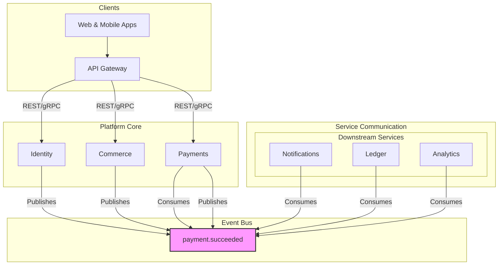

# 🎓 Suuupra EdTech Super-Platform

**🎯 Next-Generation EdTech + Media Super-Platform**: Complete in-house system integrating ALL major digital services — Payment Gateway (UPI Clone), Live Video Streaming (Zoom + Hotstar scale), AI Tutoring (ChatGPT-like), Netflix-style VOD, YouTube Creator Economy, Real-time Analytics, and Google-like Search.

**Target Scale**: Billions of users with enterprise-grade reliability, 99.99% payment success, <300ms API latency, 1M+ concurrent streams.

---

## 🧭 System Architecture Overview

**🎯 Mission**: Build a next-generation EdTech + Media super-platform that integrates ALL major digital services in-house with a learning-focused approach to advanced distributed systems, AI integration, and billion-user scale engineering.

### 🔧 Integrated Super-Platform Capabilities

- 💳 **Payment Gateway**: UPI Clone + Juspay-like flows with fraud detection
- 🎥 **Live Video**: Zoom-like classes + Hotstar-scale mass streaming (1M+ viewers)
- 🤖 **LLM Tutor**: OpenAI ChatGPT-like with RAG and personalized learning
- 🎬 **Media Platform**: Netflix-style VOD + YouTube creator monetization
- 📊 **Real-time Analytics**: Learning insights + business intelligence dashboards
- 📍 **Live Tracking**: Uber-like GPS tracking + route optimization
- 🔍 **Search Engine**: Google-like content discovery and web crawling
- 🧠 **Recommendations**: Graph ML with collaborative filtering
- 🎯 **Scale Target**: Billion-user architecture with sub-second responses

---

## 🧱 Service Architecture Matrix

| Domain          | Service         | Status      | Priority |
|-----------------|-----------------|-------------|----------|
| Gateway & Core  | api-gateway     | Production  | High     |
| Gateway & Core  | identity        | Production  | High     |
| Gateway & Core  | content         | Production  | Medium   |
| Payments        | commerce        | Production  | High     |
| Payments        | payments        | Production  | High     |
| Payments        | ledger          | Production  | High     |
| Payments        | upi-core        | Production  | High     |
| Payments        | bank-simulator  | Production  | High     |
| Media           | live-classes    | Planned     | Medium   |
| Media           | vod             | Planned     | Medium   |
| Media           | mass-live       | Planned     | Low      |
| Media           | creator-studio  | Planned     | Medium   |
| Intelligence    | search-crawler  | Planned     | Medium   |
| Intelligence    | recommendations | Planned     | Medium   |
| Intelligence    | llm-tutor       | Planned     | High     |
| Intelligence    | analytics       | Planned     | Low      |
| Operations      | counters        | Planned     | Low      |
| Operations      | live-tracking   | Planned     | Low      |
| Operations      | notifications   | Planned     | Medium   |
| Operations      | admin           | Planned     | High     |

> Full service code lives in `/services/<service-name>`

---

## 📦 Project Layout

```text
suuupra-edtech-platform/
├── services/              # All microservices
│   ├── admin/             # Admin panel for platform operations
│   ├── analytics/         # Real-time data analytics and business intelligence
│   ├── api-gateway/       # Main API Gateway for client requests
│   ├── commerce/          # Order management, CQRS, and event sourcing
│   ├── content/           # Content management, search, and metadata
│   ├── counters/          # High-performance counters for stats
│   ├── creator-studio/    # Tools for content creators
│   ├── gateway/           # (Legacy/Secondary Gateway)
│   ├── identity/          # User authentication, RBAC, and profiles
│   ├── ledger/            # Double-entry accounting ledger service
│   ├── live-classes/      # Interactive live classes with WebRTC
│   ├── live-tracking/     # Real-time GPS tracking and route optimization
│   ├── llm-tutor/         # AI-powered tutoring with RAG
│   ├── mass-live/         # Mass-scale live streaming (Hotstar-like)
│   ├── notifications/     # Multi-channel notification delivery
│   ├── payments/          # Payment gateway for UPI, cards, etc.
│   ├── recommendations/   # ML-powered recommendation engine
│   ├── search-crawler/    # Web crawler and search indexing
│   └── vod/               # Video-on-demand processing and streaming
├── infrastructure/        # Terraform, K8s configs, observability
│   ├── kubernetes/        # Kubernetes manifests and configurations
│   ├── monitoring/        # Grafana, Jaeger, Prometheus setup
│   ├── scripts/           # Infrastructure automation scripts
│   └── terraform/         # Terraform code for IaC
├── shared/                # Proto files, shared libs, event schemas
│   ├── events/            # Shared event schemas (e.g., Avro, Protobuf)
│   ├── libs/              # Shared libraries for cross-service use
│   └── proto/             # gRPC protobuf definitions
├── tools/                 # Scripts, testing, generators
│   ├── generators/        # Service/code generation tools
│   ├── scripts/           # General utility and automation scripts
│   └── testing/           # Load testing (k6), E2E tests
├── docs/                  # Architecture, API specs, runbooks
│   ├── architecture/      # High-level design documents
│   ├── apis/              # OpenAPI/Swagger specifications
│   └── runbooks/          # Operational guides and procedures
├── docker-compose.yml     # Local orchestration for development
└── README.md              # 📘 You're here
```

---

## 🚀 Getting Started

### ✳️ Requirements

- **Docker & Docker Compose** for local development
- **Node.js 22.18.0** (managed via nvm)
- **Python 3.13.5** (managed via pyenv)
- **Go Latest** (managed via gvm)
- **Java 17+**, **Rust Latest** (for Live Tracking)
- **FFmpeg** for media processing
- **kubectl, terraform, ArgoCD CLI** for infrastructure

### ⏯️ Local Setup

```bash
git clone https://github.com/<your-org>/suuupra-edtech-platform.git
cd suuupra-edtech-platform
docker-compose up -d
./tools/scripts/initialize-project.sh

# 🚀 Quick Start: Identity Service (Production Ready)
./deploy-prod.sh                                    # One-command production deployment
# OR for local development:
docker-compose up -d api-gateway identity-service  # Local development

# Test Identity Service
curl -s http://localhost:8081/.well-known/openid-configuration | jq
curl -s http://localhost:8081/actuator/health | jq

# Per-Service Operations (standardized scripts):

# In any service directory (e.g., services/api-gateway/)
./build.sh      # Build the service
./test.sh       # Run all tests
./deploy.sh     # Deploy to environments
./migrate.sh    # Run database migrations
```

---

## 🛠 Development Workflow

### Create a New Service

```bash
./tools/scripts/generate-service.sh my-service java
```

- Supported stacks: `go`, `java`, `node`, `python`
- Template includes: API Scaffold, Infra, Tests, CI Config

---

## 📡 Communication Patterns

| Type      | Protocols                            | Use Case                                                              |
|-----------|--------------------------------------|-----------------------------------------------------------------------|
| **Asynchronous** | **Kafka** (Primary)             | Cross-domain business events, service decoupling (e.g., `user.registered`) |
| **Synchronous**  | **gRPC** (Internal)              | High-performance, low-latency internal service-to-service requests      |
| **Synchronous**  | **REST / OpenAPI** (External)    | External client-facing APIs, third-party integrations                 |
| **Real-time**    | **WebSocket, WebRTC, SSE**       | Live updates, interactive sessions, streaming                         |

### 🏛️ Event-Driven Architecture Diagram



### 🗂️ Shared Schemas and Contracts

The `shared/` directory is the **single source of truth** for all cross-service contracts, ensuring consistency and type safety across the platform.

- **`shared/proto`**: Contains all gRPC service definitions (`.proto` files). Services use these to generate client and server stubs.
- **`shared/events`**: Contains all asynchronous event schemas (e.g., Avro, Protobuf). This ensures that event producers and consumers agree on the event structure.

---

## 📈 Observability & Performance

**Monitoring Stack:**
- 🟢 **Prometheus**: Metrics + Service availability
- 📉 **Grafana**: Custom dashboards in `/infrastructure/monitoring/grafana`
- 📍 **Jaeger**: Distributed tracing via OpenTelemetry
- 🔔 **Alerting**: Prometheus AlertManager + K8s probes

**Service Level Objectives (SLOs):**
| Service | Latency (p99) | Throughput | Availability | Error Rate |
|---------|---------------|------------|-------------|------------|
| API Gateway | 150ms | 50k RPS | 99.9% | < 0.1% |
| Payment Gateway | 500ms | 10k TPS | 99.99% | < 0.01% |
| Live Streaming | 100ms RTT | 1M viewers | 99.9% | < 0.5% |
| Search Service | 300ms | 15k QPS | 99.5% | < 1% |
| Recommendation | 400ms | 25k RPS | 99% | < 2% |

---

## 🧪 Testing + CI/CD

| Layer        | Tools             |
|--------------|------------------|
| Unit         | JUnit, Jest, Pytest, Go test |
| Integration  | Testcontainers, Postgres/Mongo mock |
| Contracts    | Pact (consumer-driven)        |
| Load Testing | k6 (`/tools/testing/k6`)       |

```bash
make test
# or per-service:

./services/payments/scripts/test.sh
```

GitHub Actions handle CI/CD, scans, tests, and deploy on commit.

---

## 🔐 Multi-Layer Security Architecture

**Authentication & Authorization:** ✅ **Production Ready**
- OAuth2/OIDC with JWT tokens (ES256) and refresh rotation
- Multi-factor authentication (TOTP with encrypted secrets, backup codes)
- Role-based access control (RBAC) with tenant scoping and fine-grained permissions
- WebAuthn/Passkeys support with step-up authentication
- API rate limiting with distributed token buckets and lockout policies

**Data Protection:** ✅ **Vault Integration Complete**
- End-to-end encryption for sensitive data (AES-256 with KEK management)
- TLS 1.3 for all communication channels with HTTPS enforcement
- Secrets management with HashiCorp Vault (automated setup scripts)
- PII anonymization and GDPR compliance

**Payment Security:**
- PCI DSS Level 1 compliance
- Card tokenization and secure vault storage
- HSM integration for cryptographic operations
- Real-time fraud detection with ML models

**Content Security:**
- DRM integration for premium content protection
- Watermarking for content piracy prevention
- Content moderation with AI and human review
- DMCA compliance and takedown procedures

---

## 🚦 Implementation Phases & Status

We will follow a phased approach to building the Suuupra platform. Each phase delivers a meaningful set of features. Refer to the **Services Matrix** for the current status of each service.

### 🔒 Production Readiness (Cross‑Cutting)
- Content service: Models and APIs for content, courses, lessons, media assets; strict TypeScript build passes; JWT via JWKS; deployable via Docker Compose/Helm. Background ES sync worker is lazy-loaded and can be enabled via feature flag.
- Global CI/CD: Enforce lint, typecheck, unit/integration tests, security scans, and image signing.
- Security: Vault-backed secrets, least-privilege IAM, rate limiting, and S2S auth.
- Observability: OTEL tracing, Prometheus metrics, RED dashboards, and probes.

### **Phase 1: Foundation & Core Services**
**Goal**: To lay the foundation for the entire platform by building the core infrastructure and services. See the `Foundation` phase in the Services Matrix for current status.

### **Phase 2: Payments & Commerce**
**Goal**: To build the e-commerce and payment processing capabilities of the platform. See the `Payments` phase in the Services Matrix for current status.

### **Phase 3: Streaming & Media Systems**
**Goal**: To build the live streaming and video-on-demand capabilities of the platform. See the `Media` phase in the Services Matrix for current status.

### **Phase 4: AI, Search & Intelligence**
**Goal**: To build the AI-powered features of the platform. See the `Intelligence` phase in the Services Matrix for current status.

### **Phase 5: Supporting Services**
**Goal**: To build the supporting services that are used by all other services. See the `Supporting` phase in the Services Matrix for current status.

---

## ⚙️ Ops & Deployment

- GitOps with ArgoCD
- Blue-green & canary deployments via Helm
- Multi-environment support (dev/stage/prod)
- Feature toggling + fault injection hooks

---

## 🧑‍💻 Contributor Guide

1. Fork & Clone this repo
2. Launch local services via Docker Compose
3. Add services with `generate-service.sh`
4. Follow `/shared/` integration patterns
5. Submit PR with:
    - Tests ✅
    - Readable commit history 🌿
    - API spec changes 📑
    - CI checks passing ✅

---

## 📚 Documentation Index

| Resource        | Path                       |
|------------------|----------------------------|
| Architecture     | `/docs/architecture/`      |
| API Specs        | `/docs/apis/`              |
| Runbooks         | `/docs/runbooks/`          |
| Per-Service Docs | `/services/<name>/docs/`   |

---

## 📊 Business Impact & Success Metrics

**Key Performance Indicators (KPIs):**

| Category | Metric | Goal | Business Impact |
|----------|--------|------|----------------|
| **User Engagement** | Monthly Active Users (MAU) | Growth rate >20% | Platform adoption |
| | Average session duration | >30 minutes | Content stickiness |
| | Course completion rate | >75% | Learning outcomes |
| | Day-30 Retention | ≥ 70% | User satisfaction |
| **Revenue Metrics** | Payment success rate | ≥ 99.99% | Revenue assurance |
| | Gross Merchandise Value | $10M+ monthly | Business growth |
| | Revenue per user | $50+ monthly | Monetization |
| | Creator commission | 15% platform fee | Ecosystem growth |
| **Technical Performance** | API Latency (p99) | ≤ 300ms | User experience |
| | System uptime | 99.9%+ | Service reliability |
| | Stream concurrency | 1M+ viewers | Scale capability |
| | Search response time | <200ms | Content discovery |
| **Learning Outcomes** | Skill improvement | >80% post-course | Educational value |
| | Job placement rate | >60% for pro courses | Career impact |
| | Student satisfaction (NPS) | >50 | Quality assurance |

---

## 👤 Contact & Maintainers

- **Lead Engineer**: Abhishek Jha
- Dev Chat: `#edtech-platform-dev`
- Bugs / Feature Requests: Use GitHub Issues

---

## ⚠️ Licensing

> 💡 This is a **Source-Visible Project** — Not Open Source Software.

While contribution is welcomed:
- 📖 Source code is viewable and forkable
- ❌ Commercial use, redistribution, or modification is not permitted without written permission
- ⚖ All rights reserved © 2025 Suuupra EdTech Inc.

For details, see [`LICENSE`](./LICENSE)

---

*Made with 🚀 by educators & engineers from Suuupra EdTech.*
