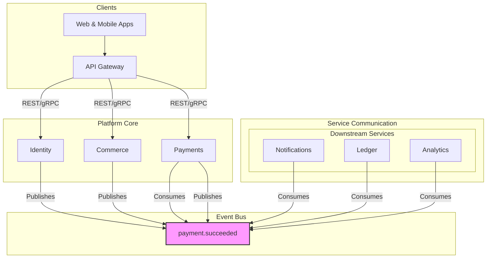

# 🎓 TodoGlobal.md – Master Project Roadmap

## 1. 📋 Project Overview & Vision

**Suuupra EdTech Super-Platform**
> An advanced, production-scale educational and media platform designed to simulate real-world systems engineering challenges including payments, streaming, AI tutoring, and analytics — at a billion-user scale.

This document serves as the master roadmap for the development of the Suuupra platform. It provides a high-level overview of the project, the implementation plan, and the status of each microservice.

---

## 2. 🎯 Learning Objectives

This project is designed to be a learning experience. By the end of this project, you will have gained mastery over:

-  **Distributed Systems**: Designing, building, and deploying a complex microservices architecture.
-  **Event-Driven Architecture**: Building a system that is resilient, scalable, and loosely coupled.
-  **Financial Systems**: Understanding the principles of building a secure and reliable payment system.
-  **Media Infrastructure**: Building a high-performance, low-latency video streaming platform.
-  **AI & Machine Learning**: Applying AI and ML to solve real-world problems like fraud detection and content recommendations.

---

## 3. 🚀 High-Level Architecture

---

## 4. 🛠️ Services Status Matrix

This matrix provides a centralized, single source of truth for the status, priority, and details of every microservice in the Suuupra platform.

| Service | Status | Phase | Priority | Description |
| :--- | :--- | :--- | :--- | :--- |
| `api-gateway` | In Progress | Foundation | High | The single entry point for all client requests, handling routing, authentication, and rate limiting. |
| `identity` | Production | Foundation | High | Manages user authentication and authorization using OAuth2/OIDC, RBAC, and MFA. |
| `content` | Planned | Foundation | Medium | Manages all educational content, including courses, videos, and articles. |
| `commerce` | In Progress | Payments | High | Handles product catalog, shopping cart, and order management. |
| `payments` | Production | Payments | High | Orchestrates payment processing, integrating with UPI and other payment methods. |
| `ledger` | In Progress | Payments | High | A double-entry accounting system for all financial transactions. |
| `upi-core` | Production | Payments | High | A simulator for the UPI switch, handling UPI payment requests. |
| `bank-simulator`| Production | Payments | High | A simulator for a core banking system, responding to payment requests. |
| `live-classes` | Planned | Media | Medium | Manages real-time, interactive online classes. |
| `vod` | Planned | Media | Medium | Handles video-on-demand streaming, encoding, and storage. |
| `mass-live` | Planned | Media | Low | A service for streaming to massive audiences, like a webinar. |
| `creator-studio`| Planned | Media | Medium | Tools for creators to upload and manage their content. |
| `search-crawler`| Planned | Intelligence | Medium | Provides full-text search capabilities across the platform. |
| `recommendations`| Planned | Intelligence | Medium | A service for providing personalized content recommendations. |
| `llm-tutor` | Planned | Intelligence | High | An AI-powered tutor that provides personalized learning assistance. |
| `analytics` | Planned | Intelligence | Low | A service for collecting and analyzing user behavior and platform data. |
| `counters` | Planned | Supporting | Low | A distributed counter service for tracking metrics like views and likes. |
| `live-tracking` | Planned | Supporting | Low | A service for tracking real-time user activity. |
| `notifications` | Planned | Supporting | Medium | Manages and sends notifications to users via email, push, and SMS. |
| `admin` | Planned | Supporting | High | An administration dashboard for managing the platform. |

---

## 5. 📝 Master TODO List

This section provides a detailed, actionable checklist of tasks for each service, organized by implementation phase.

### **Phase 1: Foundation**
- [-] `Global`: Create unified docker-compose.yml for entire platform.
- [-] `Global`: Implement .env file for centralized configuration.
- [ ] `Global`: Develop master build-all.sh script.
- [-] `Docs`: Update architecture diagrams to show event-driven flows.
- [ ] `api-gateway`: Implement dynamic routing based on service discovery.
- [ ] `api-gateway`: Integrate authentication and authorization middleware with the `identity` service.
- [ ] `api-gateway`: Add comprehensive rate limiting and abuse prevention.
- [x] `identity`: Implement OAuth2/OIDC provider with MFA and RBAC.
- [x] `identity`: Harden security and integrate with HashiCorp Vault for secrets management.
- [ ] `identity`: Refactor to publish `user.created` event to Kafka.
- [ ] `content`: Design and implement the data model for courses, lessons, and media assets.
- [ ] `content`: Develop APIs for content creation, retrieval, and management.

### **Phase 2: Payments & Commerce**
- [-] `commerce`: Develop the product catalog service, including product variants and pricing.
- [-] `commerce`: Implement shopping cart and checkout orchestration logic.
- [ ] `commerce`: Integrate with the `payments` service to process orders.
- [ ] `commerce`: Refactor to publish `order.created` event to Kafka.
- [x] `payments`: Implement event-sourced architecture for payment orchestration.
- [x] `payments`: Integrate with `upi-core` and `bank-simulator` for end-to-end payment processing.
- [ ] `payments`: Refactor to consume `order.created` event and publish `payment.succeeded` event.
- [-] `ledger`: Implement core double-entry accounting logic and transaction processing.
- [ ] `ledger`: Add support for currency conversion and multi-currency transactions.
- [ ] `ledger`: Develop robust audit trail and reporting features, including hash-chaining for data integrity.
- [ ] `ledger`: Refactor to consume `payment.succeeded` event.
- [x] `upi-core`: Simulate the UPI switch for handling payment requests.
- [x] `bank-simulator`: Simulate a core banking system to respond to payment authorization requests.

### **Phase 3: Media**
- [ ] `live-classes`: Implement real-time signaling and WebRTC integration for interactive classes.
- [ ] `live-classes`: Develop features for class scheduling, recording, and chat.
- [ ] `vod`: Build a video processing pipeline for encoding, transcoding, and adaptive bitrate streaming.
- [ ] `vod`: Integrate with a CDN for efficient global delivery of video content.
- [ ] `mass-live`: Design architecture for large-scale, low-latency streaming (e.g., using HLS/DASH).
- [ ] `creator-studio`: Develop a user interface for content creators to upload, manage, and track their media.

### **Phase 4: Intelligence**
- [ ] `search-crawler`: Implement a crawler to index platform content (courses, articles, etc.).
- [ ] `search-crawler`: Integrate with a search engine like Elasticsearch to provide full-text search APIs.
- [ ] `recommendations`: Develop collaborative filtering and content-based recommendation models.
- [ ] `recommendations`: Build APIs to serve personalized content recommendations to users.
- [ ] `llm-tutor`: Integrate with a large language model (LLM) to provide interactive tutoring.
- [ ] `llm-tutor`: Develop a system for managing conversational state and user progress.
- [ ] `analytics`: Implement a data pipeline to collect and process user interaction events.
- [ ] `analytics`: Build dashboards to visualize key platform metrics.

### **Phase 5: Supporting Services**
- [ ] `counters`: Design and implement a scalable, distributed counter service.
- [ ] `live-tracking`: Implement real-time user activity tracking using WebSockets or similar technology.
- [ ] `notifications`: Integrate with providers for email, SMS, and push notifications.
- [ ] `notifications`: Develop a templating and preference management system for notifications.
- [ ] `admin`: Design and build a comprehensive dashboard for platform administration and user support.

---

## 6. 📅 Product Timeline & Implementation Phases

We will follow a phased approach to building the Suuupra platform. Each phase delivers a meaningful set of features. Refer to the **Services Status Matrix** and **Master TODO List** for the current status and detailed tasks for each service.

- **Phase 1: Foundation & Core Services**: Lay the foundation for the entire platform.
- **Phase 2: Payments & Commerce**: Build the e-commerce and payment processing capabilities.
- **Phase 3: Streaming & Media Systems**: Build live streaming and video-on-demand capabilities.
- **Phase 4: AI, Search & Intelligence**: Build the AI-powered features of the platform.
- **Phase 5: Supporting Services**: Build the services that support the entire platform.

---

## 7. 🎉 Major Milestones

### **Identity Service Production Ready**
The **Identity Service** is production-ready with comprehensive security hardening and enterprise-grade features, including OAuth2/OIDC, MFA, RBAC, and Vault integration.

### **Payment Infrastructure Complete**
The core payment infrastructure, including the **Payments**, **UPI Core**, and **Bank Simulator** services, is production-ready, with a complete, event-sourced architecture.

---

## 8. 🧭 Getting Started

1.  **Clone the repository**: `git clone <repository-url>`
2.  **Run the setup script**: `./tools/scripts/initialize-project.sh`
3.  **Deploy Production-Ready Services**:
    - **Payment Infrastructure**: `docker-compose -f docker-compose.integration.yml up -d`
    - **Identity Service**: `docker-compose -f docker-compose.prod.yml up -d`
4.  **Explore the operational services**:
    - **UPI Core Health**: `http://localhost:8081/health`
    - **Bank Simulator Health**: `http://localhost:3000/health`
    - **Identity OIDC Discovery**: `http://localhost:8081/.well-known/openid-configuration`
5.  **Pick a service to develop**: Choose from the **Services Status Matrix** and start working on the tasks in the **Master TODO List**.
