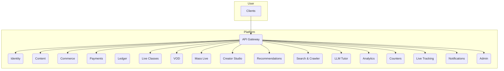

# 🎓 TodoGlobal.md – Master Project Roadmap

## 1. 📋 Project Overview & Vision

**Suuupra EdTech Super-Platform**
> An advanced, production-scale educational and media platform designed to simulate real-world systems engineering challenges including payments, streaming, AI tutoring, and analytics — at a billion-user scale.

This document serves as the master roadmap for the development of the Suuupra platform. It provides a high-level overview of the project, the implementation plan, and the status of each microservice.

---

## 2. 🎯 Learning Objectives

This project is designed to be a learning experience. By the end of this project, you will have gained mastery over:

-  **Distributed Systems**: Designing, building, and deploying a complex microservices architecture.
-  **Event-Driven Architecture**: Building a system that is resilient, scalable, and loosely coupled.
-  **Financial Systems**: Understanding the principles of building a secure and reliable payment system.
-  **Media Infrastructure**: Building a high-performance, low-latency video streaming platform.
-  **AI & Machine Learning**: Applying AI and ML to solve real-world problems like fraud detection and content recommendations.

---

## 3. 🚀 High-Level Architecture



---

## 4. 🛠️ Services Matrix

This matrix provides a centralized, single source of truth for the status, priority, and details of every microservice in the Suuupra platform.

```yaml
services:
  - service: api-gateway
    repository: ./services/api-gateway
    status: In Progress
    phase: Foundation
    priority: High
    description: "The single entry point for all client requests, handling routing, authentication, and rate limiting."
  - service: identity
    repository: ./services/identity
    status: Production
    phase: Foundation
    priority: High
    description: "Manages user authentication and authorization using OAuth2/OIDC, RBAC, and MFA."
  - service: content
    repository: ./services/content
    status: Planned
    phase: Foundation
    priority: Medium
    description: "Manages all educational content, including courses, videos, and articles."
  - service: commerce
    repository: ./services/commerce
    status: In Progress
    phase: Payments
    priority: High
    description: "Handles product catalog, shopping cart, and order management."
  - service: payments
    repository: ./services/payments
    status: Production
    phase: Payments
    priority: High
    description: "Orchestrates payment processing, integrating with UPI and other payment methods."
  - service: ledger
    repository: ./services/ledger
    status: In Progress
    phase: Payments
    priority: High
    description: "A double-entry accounting system for all financial transactions."
  - service: upi-core
    repository: ./services/upi-core
    status: Production
    phase: Payments
    priority: High
    description: "A simulator for the UPI switch, handling UPI payment requests."
  - service: bank-simulator
    repository: ./services/bank-simulator
    status: Production
    phase: Payments
    priority: High
    description: "A simulator for a core banking system, responding to payment requests."
  - service: live-classes
    repository: ./services/live-classes
    status: Planned
    phase: Media
    priority: Medium
    description: "Manages real-time, interactive online classes."
  - service: vod
    repository: ./services/vod
    status: Planned
    phase: Media
    priority: Medium
    description: "Handles video-on-demand streaming, encoding, and storage."
  - service: mass-live
    repository: ./services/mass-live
    status: Planned
    phase: Media
    priority: Low
    description: "A service for streaming to massive audiences, like a webinar."
  - service: creator-studio
    repository: ./services/creator-studio
    status: Planned
    phase: Media
    priority: Medium
    description: "Tools for creators to upload and manage their content."
  - service: search-crawler
    repository: ./services/search-crawler
    status: Planned
    phase: Intelligence
    priority: Medium
    description: "Provides full-text search capabilities across the platform."
  - service: recommendations
    repository: ./services/recommendations
    status: Planned
    phase: Intelligence
    priority: Medium
    description: "A service for providing personalized content recommendations."
  - service: llm-tutor
    repository: ./services/llm-tutor
    status: Planned
    phase: Intelligence
    priority: High
    description: "An AI-powered tutor that provides personalized learning assistance."
  - service: analytics
    repository: ./services/analytics
    status: Planned
    phase: Intelligence
    priority: Low
    description: "A service for collecting and analyzing user behavior and platform data."
  - service: counters
    repository: ./services/counters
    status: Planned
    phase: Supporting
    priority: Low
    description: "A distributed counter service for tracking metrics like views and likes."
  - service: live-tracking
    repository: ./services/live-tracking
    status: Planned
    phase: Supporting
    priority: Low
    description: "A service for tracking real-time user activity."
  - service: notifications
    repository: ./services/notifications
    status: Planned
    phase: Supporting
    priority: Medium
    description: "Manages and sends notifications to users via email, push, and SMS."
  - service: admin
    repository: ./services/admin
    status: Planned
    phase: Supporting
    priority: High
    description: "An administration dashboard for managing the platform."
```

---

## 5. 📅 Product Timeline & Implementation Phases

We will follow a phased approach to building the Suuupra platform. Each phase delivers a meaningful set of features. Refer to the **Services Matrix** for the current status of each service.

### **Phase 1: Foundation & Core Services**
**Goal**: To lay the foundation for the entire platform by building the core infrastructure and services. See the `Foundation` phase in the Services Matrix for current status.

### **Phase 2: Payments & Commerce**
**Goal**: To build the e-commerce and payment processing capabilities of the platform. See the `Payments` phase in the Services Matrix for current status.

### **Phase 3: Streaming & Media Systems**
**Goal**: To build the live streaming and video-on-demand capabilities of the platform. See the `Media` phase in the Services Matrix for current status.

### **Phase 4: AI, Search & Intelligence**
**Goal**: To build the AI-powered features of the platform. See the `Intelligence` phase in the Services Matrix for current status.

### **Phase 5: Supporting Services**
**Goal**: To build the supporting services that are used by all other services. See the `Supporting` phase in the Services Matrix for current status.

---

## 6. 🎉 Major Milestones

### **Identity Service Production Ready**
The **Identity Service** is production-ready with comprehensive security hardening and enterprise-grade features, including OAuth2/OIDC, MFA, RBAC, and Vault integration.

### **Payment Infrastructure Complete**
The core payment infrastructure, including the **Payments**, **UPI Core**, and **Bank Simulator** services, is production-ready, with a complete, event-sourced architecture.

---

## 7. 🧭 Getting Started

1.  **Clone the repository**: `git clone <repository-url>`
2.  **Run the setup script**: `./tools/scripts/initialize-project.sh`
3.  **Deploy Production-Ready Services**:
    - **Payment Infrastructure**: `docker-compose -f docker-compose.integration.yml up -d`
    - **Identity Service**: `docker-compose -f docker-compose.prod.yml up -d`
4.  **Explore the operational services**:
    - **UPI Core Health**: `http://localhost:8081/health`
    - **Bank Simulator Health**: `http://localhost:3000/health`
    - **Identity OIDC Discovery**: `http://localhost:8081/.well-known/openid-configuration`
5.  **Pick a service to develop**: Choose from the **Services Matrix** and start working on the tasks in its `TODO.md` file.
