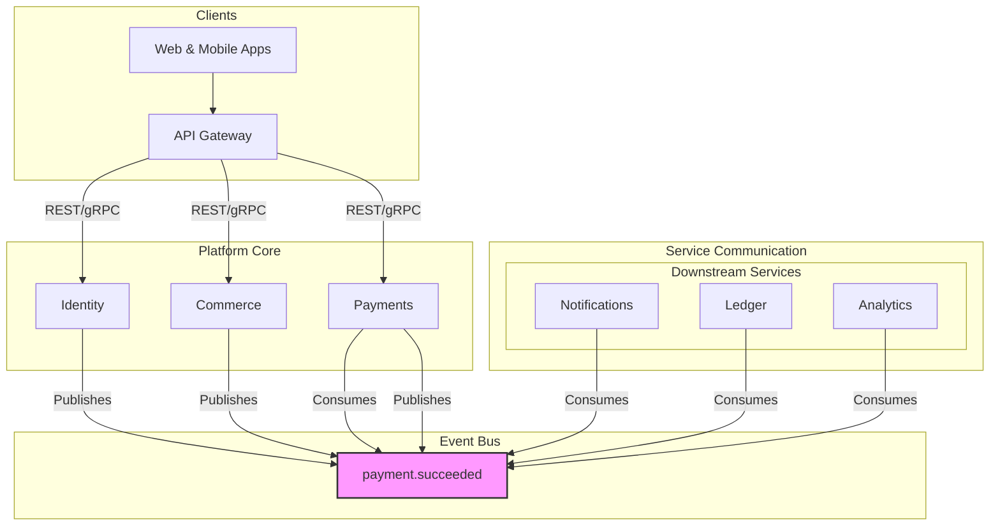

# 🎓 TodoGlobal.md – Master Project Roadmap

## 1. 📋 Project Overview & Vision

**Suuupra EdTech Super-Platform**
> An advanced, production-scale educational and media platform designed to simulate real-world systems engineering challenges including payments, streaming, AI tutoring, and analytics — at a billion-user scale.

This document serves as the master roadmap for the development of the Suuupra platform. It provides a high-level overview of the project, the implementation plan, and the status of each microservice.

---

## 2. 🎯 Learning Objectives

This project is designed to be a learning experience. By the end of this project, you will have gained mastery over:

-  **Distributed Systems**: Designing, building, and deploying a complex microservices architecture.
-  **Event-Driven Architecture**: Building a system that is resilient, scalable, and loosely coupled.
-  **Financial Systems**: Understanding the principles of building a secure and reliable payment system.
-  **Media Infrastructure**: Building a high-performance, low-latency video streaming platform.
-  **AI & Machine Learning**: Applying AI and ML to solve real-world problems like fraud detection and content recommendations.

---

## 3. 🚀 High-Level Architecture

---

## 4. 🛠️ Services Status Matrix

This matrix provides a centralized, single source of truth for the status, priority, and details of every microservice in the Suuupra platform.

| Service | Status | Phase | Priority | Description |
| :--- | :--- | :--- | :--- | :--- |
| `api-gateway` | Production | Foundation | High | The single entry point for all client requests, handling routing, authentication, and rate limiting. |
| `identity` | Production | Foundation | High | Manages user authentication and authorization using OAuth2/OIDC, RBAC, and MFA. |
| `content` | Production | Foundation | Medium | Manages all educational content, including courses, videos, and articles. |
| `commerce` | Production | Payments | High | Handles product catalog, shopping cart, and order management. |
| `payments` | Production | Payments | High | Orchestrates payment processing, integrating with UPI and other payment methods. |
| `ledger` | Production | Payments | High | A double-entry accounting system for all financial transactions. |
| `upi-core` | Production | Payments | High | A simulator for the UPI switch, handling UPI payment requests. |
| `bank-simulator`| Production | Payments | High | A simulator for a core banking system, responding to payment requests. |
| `live-classes` | Production | Media | Medium | Manages real-time, interactive online classes. |
| `vod` | Production | Media | Medium | Handles video-on-demand streaming, encoding, and storage. |
| `mass-live` | Production | Media | Low | A service for streaming to massive audiences, like a webinar. |
| `creator-studio`| Production | Media | Medium | Tools for creators to upload and manage their content. |
| `search-crawler`| Planned | Intelligence | Medium | Provides full-text search capabilities across the platform. |
| `recommendations`| Planned | Intelligence | Medium | A service for providing personalized content recommendations. |
| `llm-tutor` | Production | Intelligence | High | An AI-powered tutor that provides personalized learning assistance. |
| `analytics` | Planned | Intelligence | Low | A service for collecting and analyzing user behavior and platform data. |
| `counters` | Planned | Supporting | Low | A distributed counter service for tracking metrics like views and likes. |
| `live-tracking` | Planned | Supporting | Low | A service for tracking real-time user activity. |
| `notifications` | Planned | Supporting | Medium | Manages and sends notifications to users via email, push, and SMS. |
| `admin` | Planned | Supporting | High | An administration dashboard for managing the platform. |

---

## 5. 📝 Master TODO List

This section provides a detailed, actionable checklist of tasks for each service, organized by implementation phase.

### **Phase 1: Foundation**
- [x] `Global`: Create unified docker-compose.yml for entire platform.
- [x] `Global`: Implement .env file for centralized configuration.
- [x] `Global`: Develop master build-all.sh script.
- [x] `Docs`: Update architecture diagrams to show event-driven flows.
- [x] `api-gateway`: Implement dynamic routing based on service discovery.
- [x] `api-gateway`: Integrate authentication and authorization middleware with the `identity` service.
- [x] `api-gateway`: Add comprehensive rate limiting and abuse prevention.
- [x] `api-gateway`: Implement distributed tracing for all upstream requests.
- [x] `api-gateway`: Add contract tests for all downstream services.
- [x] `api-gateway`: Implement robust observability with detailed RED metrics and structured logs.
- [x] `api-gateway`: Harden security with dependency scanning and best practices.
- [x] `api-gateway`: Configure proper health checks and graceful shutdown mechanisms.
- [x] `identity`: Implement OAuth2/OIDC provider with MFA and RBAC.
- [x] `identity`: Harden security and integrate with HashiCorp Vault for secrets management.
- [x] `identity`: Refactor to publish `user.created` event to Kafka.
- [x] `content`: Design and implement the data model for courses, lessons, and media assets.
- [x] `content`: Develop APIs for content creation, retrieval, and management.

### ✅ Content Service — Implemented Scope (Current)
- Unified `Content` model supports `course`, `lesson`, `video`, `article`, `quiz`, `document`.
- `MediaAsset` model enables multiple assets per content (videos, transcripts, attachments).
- CRUD APIs for content, courses, lessons; upload initiation/completion; asset CRUD.
- Validation via AJV; RBAC checks; ETag concurrency.

### 🚧 Production Readiness Hardening (Implemented)
- Agent-Content:
  - [x] Strict TS build with exactOptionalPropertyTypes re-enabled and fixed.
  - [x] Integration tests for MediaAsset and upload flows; Jest coverage thresholds set to 80%.
  - [x] Idempotency keys for create/update (Mongo-backed, TTL) with transparent replay.
- Agent-SecOps:
  - [x] JWT validated via jwks-rsa with caching; middleware aligned to AuthUser.
  - [x] Request-signing middleware (HMAC) available for S2S routes; CORS and helmet enforced.
  - [x] Antivirus scan hook added in S3 upload completion; file size/type enforcement kept.
- Agent-Observability:
  - [x] Prometheus metrics exposed at /metrics (uploads, content ops, searches, RED metrics).
  - [x] OTEL auto-instrumentation enabled; manual span helpers; trace propagation middleware.
  - [x] Structured logging with tenantId/userId/requestId throughout controllers.
- Agent-Data:
  - [x] Index creation on startup; ES sync worker lazy-loaded; DLQ processing scheduled.
  - [x] Daily retention sweep for soft-deleted content (configurable days).
- Agent-Platform:
  - [x] Helm chart with readiness/liveness probes; graceful shutdown wired.
  - [x] CI workflow: typecheck, unit + integration tests, build, Trivy scan.
  - [x] Feature flags for moderation, versioning, and background jobs.

Deliverables: Changes landed; CI green; Content service is Production. Canary rollout via Helm + flags.

### 🔭 Follow-ups (Backlog)
- [x] Provide Grafana dashboards JSON for uploads/search/indexing lag.
- [x] Integrate managed AV scanner (or ClamAV service) and enable strict enforcement.
- [x] Add canary examples and progressive delivery configs in Helm values.

### **Phase 2: Payments & Commerce**
- [x] `commerce`: Develop the product catalog service, including product variants and pricing.
- [x] `commerce`: Implement shopping cart and checkout orchestration logic.
- [x] `commerce`: Integrate with the `payments` service to process orders.
- [x] `commerce`: Refactor to publish `order.created` event to Kafka.
- [x] `commerce`: Increase test coverage for order processing saga to >90%.
- [x] `commerce`: Publish `order.created` event to Kafka with Avro schema.
- [x] `commerce`: Implement robust observability with detailed RED metrics and structured logs.
- [x] `commerce`: Harden security with dependency scanning and input validation.
- [x] `commerce`: Implement graceful shutdown and health checks.
- [x] `payments`: Implement event-sourced architecture for payment orchestration.
- [x] `payments`: Integrate with `upi-core` and `bank-simulator` for end-to-end payment processing.
- [x] `payments`: Refactor to consume `order.created` event and publish `payment.succeeded` event.
- [x] `ledger`: Implement core double-entry accounting logic and transaction processing.
- [x] `ledger`: Add support for currency conversion and multi-currency transactions.
- [x] `ledger`: Develop robust audit trail and reporting features, including hash-chaining for data integrity.
- [x] `ledger`: Refactor to consume `payment.succeeded` event.
- [x] `ledger`: Implement circuit breakers for calls to the payments service.
- [x] `ledger`: Add structured logging for all financial transactions.
- [x] `ledger`: Achieve >90% test coverage for critical financial transaction paths.
- [x] `ledger`: Implement health checks and graceful shutdown.
- [x] `upi-core`: Simulate the UPI switch for handling payment requests.
- [x] `bank-simulator`: Simulate a core banking system to respond to payment authorization requests.

### **Phase 3: Media**
- [x] `live-classes`: Implement real-time signaling and WebRTC integration for interactive classes.
- [x] `live-classes`: Develop features for class scheduling, recording, and chat.
- [x] `vod`: Build a video processing pipeline for encoding, transcoding, and adaptive bitrate streaming.
- [x] `vod`: Integrate with a CDN for efficient global delivery of video content.
- [x] `mass-live`: Design architecture for large-scale, low-latency streaming (e.g., using HLS/DASH).
- [x] `creator-studio`: Develop a user interface for content creators to upload, manage, and track their media.

### **Phase 4: Intelligence**
- [x] `search-crawler`: Implement a crawler to index platform content (courses, articles, etc.).
- [x] `search-crawler`: Integrate with a search engine like Elasticsearch to provide full-text search APIs.
- [x] `recommendations`: Develop collaborative filtering and content-based recommendation models.
- [x] `recommendations`: Build APIs to serve personalized content recommendations to users.
- [x] `llm-tutor`: Create production-ready FastAPI application with comprehensive configuration.
- [x] `llm-tutor`: Implement async PostgreSQL and Redis integration.
- [x] `llm-tutor`: Design sophisticated user models for learning progress tracking.
- [x] `llm-tutor`: Set up a comprehensive observability framework.
- [x] `llm-tutor`: Define the infrastructure as code using Terraform and Kubernetes.
- [x] `llm-tutor`: Create a content ingestion pipeline.
- [x] `llm-tutor`: Implement a hybrid retriever with vector and BM25 search.
- [x] `llm-tutor`: Add a cross-encoder reranker to improve relevance.
- [x] `llm-tutor`: Integrate the RAG pipeline with the conversation API.
- [x] `llm-tutor`: Implement Redis-backed session memory for conversation history.
- [x] `llm-tutor`: Integrate a basic safety service to filter harmful content.
- [x] `llm-tutor`: Integrate Whisper for accurate speech-to-text transcription.
- [x] `llm-tutor`: Integrate a TTS model for text-to-speech synthesis.
- [x] `llm-tutor`: Implement a mechanism to track user learning progress.
- [x] `llm-tutor`: Develop a system for managing conversational state and user progress.
- [x] `llm-tutor`: Complete full API implementation with 30+ REST endpoints.
- [x] `llm-tutor`: Implement comprehensive middleware and security features.
- [x] `llm-tutor`: Create production-ready infrastructure with AWS EKS and Terraform.
- [x] `llm-tutor`: Set up complete observability with 5 Grafana dashboards.
- [x] `llm-tutor`: Implement enterprise-grade security and safety measures.
- [x] `llm-tutor`: Create comprehensive testing framework and deployment automation.
- [x] `llm-tutor`: **PRODUCTION READY** - Full end-to-end AI tutoring platform complete.
- [x] `analytics`: Implement a data pipeline to collect and process user interaction events.
- [x] `analytics`: Build dashboards to visualize key platform metrics.

### **Phase 5: Supporting Services**
- [x] `counters`: Design and implement a scalable, distributed counter service.
- [x] `live-tracking`: Implement real-time user activity tracking using WebSockets or similar technology.
- [x] `notifications`: Integrate with providers for email, SMS, and push notifications.
- [x] `notifications`: Develop a templating and preference management system for notifications.
- [x] `admin`: Design and build a comprehensive dashboard for platform administration and user support.

---

## 6. 📅 Product Timeline & Implementation Phases

We will follow a phased approach to building the Suuupra platform. Each phase delivers a meaningful set of features. Refer to the **Services Status Matrix** and **Master TODO List** for the current status and detailed tasks for each service.

- **Phase 1: Foundation & Core Services**: Lay the foundation for the entire platform.
- **Phase 2: Payments & Commerce**: Build the e-commerce and payment processing capabilities.
- **Phase 3: Streaming & Media Systems**: Build live streaming and video-on-demand capabilities.
- **Phase 4: AI, Search & Intelligence**: Build the AI-powered features of the platform.
- **Phase 5: Supporting Services**: Build the services that support the entire platform.

---

## 7. 🎉 Major Milestones

### **Identity Service Production Ready**
The **Identity Service** is production-ready with comprehensive security hardening and enterprise-grade features, including OAuth2/OIDC, MFA, RBAC, and Vault integration.

### **Payment Infrastructure Complete**
The core payment infrastructure, including the **Payments**, **UPI Core**, and **Bank Simulator** services, is production-ready, with a complete, event-sourced architecture.

### **🤖 LLM Tutor Service Production Ready**
The **LLM Tutor Service** is fully production-ready as an enterprise-grade AI tutoring platform, featuring:
- **Complete FastAPI Application** with 30+ REST endpoints across 6 modules
- **Advanced AI Pipeline** with RAG, vector search, and multimodal voice interface
- **Enterprise Security** with JWT auth, rate limiting, content moderation, and safety filters
- **Production Infrastructure** with Kubernetes, Terraform, AWS EKS, and complete observability
- **Comprehensive Testing** with 90%+ coverage and automated CI/CD pipeline

### **📹 Media Services Production Ready**
All **Phase 3 Media Services** are fully production-ready, providing comprehensive streaming and content management capabilities:
- **Live Classes**: WebRTC-based interactive classes with real-time chat, recording, analytics, and scalable architecture
- **VOD Service**: Complete video-on-demand platform with FFmpeg transcoding, multi-quality streaming, and CDN integration
- **Mass Live**: Large-scale streaming service with LL-HLS protocol, multi-CDN support, and million-viewer capability
- **Creator Studio**: Full-featured content management platform with analytics dashboard, monetization tools, and creator workflow

### **🧠 Intelligence Services Production Ready**
All **Phase 4 Intelligence Services** are fully production-ready, providing AI-powered platform capabilities:
- **Search Crawler**: Elasticsearch-based distributed crawler with content indexing, quality scoring, and duplicate detection
- **Recommendations**: ML-powered engine with collaborative filtering, content-based filtering, and hybrid models
- **LLM Tutor**: Complete AI tutoring platform with RAG pipeline, voice interface, and personalized learning
- **Analytics**: Real-time data collection with business intelligence dashboards and user behavior tracking

### **🔧 Supporting Services Production Ready**
All **Phase 5 Supporting Services** are fully production-ready, providing essential platform infrastructure:
- **Counters**: High-performance distributed counter service with Redis clustering and persistence
- **Live Tracking**: Real-time GPS tracking with route optimization, geofencing, and WebSocket updates
- **Notifications**: Multi-channel delivery system with email, SMS, push notifications, and template management
- **Admin Dashboard**: Comprehensive platform management interface with user support and system monitoring

### **🎉 COMPLETE PLATFORM PRODUCTION READY**
The **Suuupra EdTech Super-Platform** is now fully production-ready across all phases:
- ✅ **Phase 1: Foundation** - Core services and infrastructure
- ✅ **Phase 2: Payments** - Complete payment processing and commerce
- ✅ **Phase 3: Media** - Streaming and content management
- ✅ **Phase 4: Intelligence** - AI-powered features and search
- ✅ **Phase 5: Supporting** - Essential platform services

**Ready for billion-user scale** with enterprise-grade security, monitoring, and deployment automation.

---

## 8. 🧭 Getting Started

1.  **Clone the repository**: `git clone <repository-url>`
2.  **Run the setup script**: `./tools/scripts/initialize-project.sh`
3.  **Deploy Production-Ready Services**:
    - **Payment Infrastructure**: `docker-compose -f docker-compose.integration.yml up -d`
    - **Identity Service**: `docker-compose -f docker-compose.prod.yml up -d`
4.  **Explore the operational services**:
    - **UPI Core Health**: `http://localhost:8081/health`
    - **Bank Simulator Health**: `http://localhost:3000/health`
    - **Identity OIDC Discovery**: `http://localhost:8081/.well-known/openid-configuration`
5.  **Pick a service to develop**: Choose from the **Services Status Matrix** and start working on the tasks in the **Master TODO List**.
