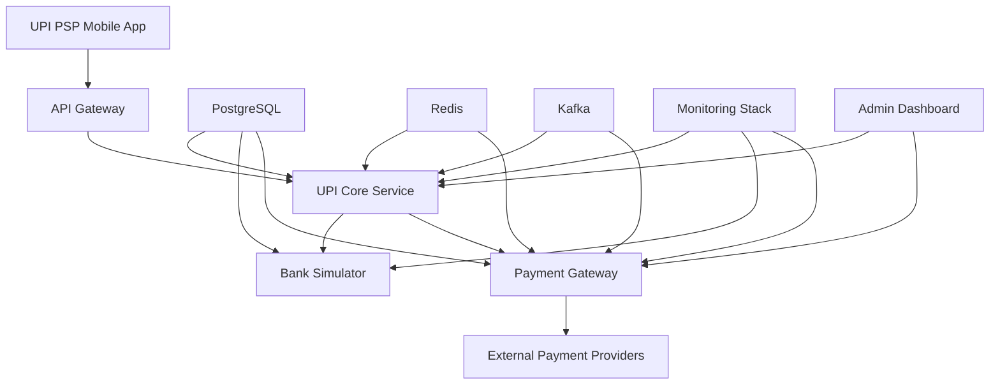

# UPI Ecosystem Simulation - Complete Integration Guide

## 🌟 Overview

This document provides a comprehensive guide to setting up and running the complete UPI ecosystem simulation. It demonstrates how the **UPI PSP (Flutter App)**, **UPI Core (Go)**, **Bank Simulator (Node.js)**, and **Payment Gateway (Go)** services work together to create a fully functional UPI payment system.

## 🏗️ System Architecture



## 🚀 Quick Start (Docker Compose)

### Prerequisites
- Docker 20.10+
- Docker Compose 2.0+
- 8GB RAM minimum
- 20GB free disk space

### 1. Clone and Setup
```bash
# Clone the repository
git clone <repository-url>
cd Project-Suuupra

# Setup environment files
cp .env.example .env
cp services/upi-core/.env.example services/upi-core/.env
cp services/bank-simulator/.env.example services/bank-simulator/.env
cp services/payments/.env.example services/payments/.env
```

### 2. Start the Complete Stack
```bash
# Start all services with dependencies
docker-compose -f docker-compose.upi-ecosystem.yml up -d

# Check service health
docker-compose -f docker-compose.upi-ecosystem.yml ps

# View logs
docker-compose -f docker-compose.upi-ecosystem.yml logs -f
```

### 3. Initialize the System
```bash
# Run initialization script
./scripts/initialize-upi-ecosystem.sh

# Seed test data
./scripts/seed-test-data.sh
```

## 📋 Complete Docker Compose Configuration

Create `docker-compose.upi-ecosystem.yml`:

```yaml
version: '3.8'

services:
  # ======================
  # Infrastructure Layer
  # ======================
  
  postgres:
    image: postgres:15
    container_name: upi-postgres
    environment:
      POSTGRES_DB: upi_ecosystem
      POSTGRES_USER: upi_user
      POSTGRES_PASSWORD: upi_password
    ports:
      - "5432:5432"
    volumes:
      - postgres_data:/var/lib/postgresql/data
      - ./scripts/sql/init.sql:/docker-entrypoint-initdb.d/init.sql
    healthcheck:
      test: ["CMD-SHELL", "pg_isready -U upi_user -d upi_ecosystem"]
      interval: 30s
      timeout: 10s
      retries: 3

  redis:
    image: redis:7-alpine
    container_name: upi-redis
    ports:
      - "6379:6379"
    command: redis-server --requirepass redis_password
    healthcheck:
      test: ["CMD", "redis-cli", "--raw", "incr", "ping"]
      interval: 30s
      timeout: 10s
      retries: 3

  zookeeper:
    image: confluentinc/cp-zookeeper:7.4.0
    container_name: upi-zookeeper
    environment:
      ZOOKEEPER_CLIENT_PORT: 2181
      ZOOKEEPER_TICK_TIME: 2000

  kafka:
    image: confluentinc/cp-kafka:7.4.0
    container_name: upi-kafka
    depends_on:
      - zookeeper
    ports:
      - "9092:9092"
    environment:
      KAFKA_BROKER_ID: 1
      KAFKA_ZOOKEEPER_CONNECT: zookeeper:2181
      KAFKA_LISTENER_SECURITY_PROTOCOL_MAP: PLAINTEXT:PLAINTEXT,PLAINTEXT_HOST:PLAINTEXT
      KAFKA_ADVERTISED_LISTENERS: PLAINTEXT://kafka:29092,PLAINTEXT_HOST://localhost:9092
      KAFKA_OFFSETS_TOPIC_REPLICATION_FACTOR: 1
      KAFKA_TRANSACTION_STATE_LOG_MIN_ISR: 1
      KAFKA_TRANSACTION_STATE_LOG_REPLICATION_FACTOR: 1
      KAFKA_AUTO_CREATE_TOPICS_ENABLE: true

  # ======================
  # Core Services
  # ======================

  upi-core:
    build:
      context: ./services/upi-core
      dockerfile: Dockerfile
    container_name: upi-core-service
    ports:
      - "50051:50051"  # gRPC
      - "9090:9090"    # Metrics
    environment:
      - DB_HOST=postgres
      - DB_PORT=5432
      - DB_USERNAME=upi_user
      - DB_PASSWORD=upi_password
      - DB_DATABASE=upi_core
      - REDIS_HOST=redis
      - REDIS_PORT=6379
      - REDIS_PASSWORD=redis_password
      - KAFKA_BROKERS=kafka:29092
      - LOG_LEVEL=info
      - ENABLE_METRICS=true
      - ENABLE_TRACING=true
    depends_on:
      postgres:
        condition: service_healthy
      redis:
        condition: service_healthy
      kafka:
        condition: service_started
    healthcheck:
      test: ["CMD", "grpc_health_probe", "-addr=:50051"]
      interval: 30s
      timeout: 10s
      retries: 3
    volumes:
      - ./services/upi-core/config:/app/config
      - ./services/upi-core/keys:/app/keys

  bank-simulator:
    build:
      context: ./services/bank-simulator
      dockerfile: Dockerfile
    container_name: bank-simulator-service
    ports:
      - "3000:3000"    # HTTP API
      - "50052:50052"  # gRPC
    environment:
      - NODE_ENV=development
      - DB_HOST=postgres
      - DB_PORT=5432
      - DB_USERNAME=upi_user
      - DB_PASSWORD=upi_password
      - DB_DATABASE=bank_simulator
      - REDIS_HOST=redis
      - REDIS_PORT=6379
      - REDIS_PASSWORD=redis_password
      - UPI_CORE_ENDPOINT=upi-core:50051
      - SUPPORTED_BANKS=HDFC,SBI,ICICI,AXIS,KOTAK
      - DEFAULT_BANK_BALANCE=10000000  # 1 lakh paisa
    depends_on:
      postgres:
        condition: service_healthy
      redis:
        condition: service_healthy
      upi-core:
        condition: service_healthy
    healthcheck:
      test: ["CMD", "curl", "-f", "http://localhost:3000/health"]
      interval: 30s
      timeout: 10s
      retries: 3

  payments-gateway:
    build:
      context: ./services/payments
      dockerfile: Dockerfile
    container_name: payments-gateway-service
    ports:
      - "8080:8080"    # HTTP API
      - "9091:9090"    # Metrics
    environment:
      - DB_HOST=postgres
      - DB_PORT=5432
      - DB_USERNAME=upi_user
      - DB_PASSWORD=upi_password
      - DB_DATABASE=payments
      - REDIS_HOST=redis
      - REDIS_PORT=6379
      - REDIS_PASSWORD=redis_password
      - KAFKA_BROKERS=kafka:29092
      - UPI_CORE_ENDPOINT=upi-core:50051
      - FRAUD_ML_API_URL=http://fraud-detection:8080
      - ENABLE_METRICS=true
      - PCI_COMPLIANCE_MODE=true
    depends_on:
      postgres:
        condition: service_healthy
      redis:
        condition: service_healthy
      kafka:
        condition: service_started
      upi-core:
        condition: service_healthy
    healthcheck:
      test: ["CMD", "curl", "-f", "http://localhost:8080/health"]
      interval: 30s
      timeout: 10s
      retries: 3

  # ======================
  # API Gateway
  # ======================

  api-gateway:
    image: kong:3.4
    container_name: upi-api-gateway
    ports:
      - "8000:8000"    # Proxy
      - "8001:8001"    # Admin API
      - "8443:8443"    # Proxy SSL
      - "8444:8444"    # Admin API SSL
    environment:
      KONG_DATABASE: "off"
      KONG_DECLARATIVE_CONFIG: /kong/declarative/kong.yml
      KONG_PROXY_ACCESS_LOG: /dev/stdout
      KONG_ADMIN_ACCESS_LOG: /dev/stdout
      KONG_PROXY_ERROR_LOG: /dev/stderr
      KONG_ADMIN_ERROR_LOG: /dev/stderr
      KONG_ADMIN_LISTEN: 0.0.0.0:8001
    volumes:
      - ./config/kong.yml:/kong/declarative/kong.yml
    depends_on:
      - upi-core
      - bank-simulator
      - payments-gateway

  # ======================
  # Monitoring Stack
  # ======================

  prometheus:
    image: prom/prometheus:latest
    container_name: upi-prometheus
    ports:
      - "9090:9090"
    volumes:
      - ./monitoring/prometheus/prometheus.yml:/etc/prometheus/prometheus.yml
      - prometheus_data:/prometheus
    command:
      - '--config.file=/etc/prometheus/prometheus.yml'
      - '--storage.tsdb.path=/prometheus'
      - '--web.console.libraries=/etc/prometheus/console_libraries'
      - '--web.console.templates=/etc/prometheus/consoles'
      - '--web.enable-lifecycle'
    depends_on:
      - upi-core
      - bank-simulator
      - payments-gateway

  grafana:
    image: grafana/grafana:latest
    container_name: upi-grafana
    ports:
      - "3001:3000"
    environment:
      - GF_SECURITY_ADMIN_PASSWORD=admin123
    volumes:
      - grafana_data:/var/lib/grafana
      - ./monitoring/grafana/dashboards:/var/lib/grafana/dashboards
      - ./monitoring/grafana/provisioning:/etc/grafana/provisioning
    depends_on:
      - prometheus

  jaeger:
    image: jaegertracing/all-in-one:latest
    container_name: upi-jaeger
    ports:
      - "16686:16686"
      - "14268:14268"
    environment:
      - COLLECTOR_OTLP_ENABLED=true

  # ======================
  # Development Tools
  # ======================

  adminer:
    image: adminer:latest
    container_name: upi-adminer
    ports:
      - "8080:8080"
    environment:
      ADMINER_DEFAULT_SERVER: postgres

  kafka-ui:
    image: provectuslabs/kafka-ui:latest
    container_name: upi-kafka-ui
    ports:
      - "8090:8080"
    environment:
      KAFKA_CLUSTERS_0_NAME: local
      KAFKA_CLUSTERS_0_BOOTSTRAPSERVERS: kafka:29092

volumes:
  postgres_data:
  prometheus_data:
  grafana_data:

networks:
  default:
    name: upi-ecosystem
```

## 🔧 Initialization Scripts

### Database Initialization
Create `scripts/sql/init.sql`:

```sql
-- Create databases for each service
CREATE DATABASE upi_core;
CREATE DATABASE bank_simulator;
CREATE DATABASE payments;

-- Create users with appropriate permissions
CREATE USER upi_core_user WITH PASSWORD 'upi_core_password';
CREATE USER bank_sim_user WITH PASSWORD 'bank_sim_password';
CREATE USER payments_user WITH PASSWORD 'payments_password';

-- Grant permissions
GRANT ALL PRIVILEGES ON DATABASE upi_core TO upi_core_user;
GRANT ALL PRIVILEGES ON DATABASE bank_simulator TO bank_sim_user;
GRANT ALL PRIVILEGES ON DATABASE payments TO payments_user;

-- Enable UUID extension for all databases
\c upi_core;
CREATE EXTENSION IF NOT EXISTS "uuid-ossp";
CREATE EXTENSION IF NOT EXISTS "pgcrypto";

\c bank_simulator;
CREATE EXTENSION IF NOT EXISTS "uuid-ossp";
CREATE EXTENSION IF NOT EXISTS "pgcrypto";

\c payments;
CREATE EXTENSION IF NOT EXISTS "uuid-ossp";
CREATE EXTENSION IF NOT EXISTS "pgcrypto";
```

### System Initialization Script
Create `scripts/initialize-upi-ecosystem.sh`:

```bash
#!/bin/bash

set -e

echo "🚀 Initializing UPI Ecosystem..."

# Wait for services to be healthy
echo "⏳ Waiting for services to be ready..."
docker-compose -f docker-compose.upi-ecosystem.yml exec upi-core /app/scripts/wait-for-it.sh postgres:5432 -- echo "Postgres is ready"
docker-compose -f docker-compose.upi-ecosystem.yml exec upi-core /app/scripts/wait-for-it.sh redis:6379 -- echo "Redis is ready"
docker-compose -f docker-compose.upi-ecosystem.yml exec upi-core /app/scripts/wait-for-it.sh kafka:29092 -- echo "Kafka is ready"

# Run database migrations
echo "📊 Running database migrations..."
docker-compose -f docker-compose.upi-ecosystem.yml exec upi-core /app/scripts/migrate.sh
docker-compose -f docker-compose.upi-ecosystem.yml exec bank-simulator npm run migrate
docker-compose -f docker-compose.upi-ecosystem.yml exec payments-gateway /app/scripts/migrate.sh

# Initialize banks in the system
echo "🏦 Registering banks..."
curl -X POST http://localhost:3000/api/admin/banks \
  -H "Content-Type: application/json" \
  -d '{
    "banks": [
      {
        "code": "HDFC",
        "name": "HDFC Bank",
        "ifsc_prefix": "HDFC",
        "endpoint_url": "http://bank-simulator:50052"
      },
      {
        "code": "SBI",
        "name": "State Bank of India",
        "ifsc_prefix": "SBIN",
        "endpoint_url": "http://bank-simulator:50052"
      },
      {
        "code": "ICICI",
        "name": "ICICI Bank",
        "ifsc_prefix": "ICIC",
        "endpoint_url": "http://bank-simulator:50052"
      }
    ]
  }'

# Create test users and accounts
echo "👥 Creating test users and accounts..."
./scripts/create-test-accounts.sh

# Setup Kafka topics
echo "📨 Setting up Kafka topics..."
docker-compose -f docker-compose.upi-ecosystem.yml exec kafka kafka-topics --create --topic upi.transactions --bootstrap-server localhost:9092 --partitions 3 --replication-factor 1
docker-compose -f docker-compose.upi-ecosystem.yml exec kafka kafka-topics --create --topic upi.settlements --bootstrap-server localhost:9092 --partitions 3 --replication-factor 1
docker-compose -f docker-compose.upi-ecosystem.yml exec kafka kafka-topics --create --topic payments.events --bootstrap-server localhost:9092 --partitions 3 --replication-factor 1
docker-compose -f docker-compose.upi-ecosystem.yml exec kafka kafka-topics --create --topic webhooks.delivery --bootstrap-server localhost:9092 --partitions 3 --replication-factor 1

echo "✅ UPI Ecosystem initialization complete!"
echo ""
echo "🌐 Access URLs:"
echo "  - UPI Core gRPC: localhost:50051"
echo "  - Bank Simulator API: http://localhost:3000"
echo "  - Payments Gateway API: http://localhost:8080"
echo "  - API Gateway: http://localhost:8000"
echo "  - Grafana Dashboard: http://localhost:3001 (admin/admin123)"
echo "  - Prometheus: http://localhost:9090"
echo "  - Jaeger Tracing: http://localhost:16686"
echo "  - Kafka UI: http://localhost:8090"
echo "  - Database Admin: http://localhost:8080"
echo ""
echo "🧪 Run test scenarios with:"
echo "  ./scripts/run-test-scenarios.sh"
```

### Test Data Creation
Create `scripts/create-test-accounts.sh`:

```bash
#!/bin/bash

set -e

echo "👥 Creating test accounts..."

# Create test users in different banks
TEST_USERS=(
  '{"customer_id": "CUST001", "bank_code": "HDFC", "account_type": "SAVINGS", "mobile_number": "9876543210", "email": "alice@example.com", "kyc_details": {"pan": "ABCDE1234F", "full_name": "Alice Johnson", "date_of_birth": "1990-01-15"}}'
  '{"customer_id": "CUST002", "bank_code": "SBI", "account_type": "SAVINGS", "mobile_number": "9876543211", "email": "bob@example.com", "kyc_details": {"pan": "FGHIJ5678K", "full_name": "Bob Smith", "date_of_birth": "1985-05-20"}}'
  '{"customer_id": "CUST003", "bank_code": "ICICI", "account_type": "CURRENT", "mobile_number": "9876543212", "email": "charlie@example.com", "kyc_details": {"pan": "LMNOP9012Q", "full_name": "Charlie Brown", "date_of_birth": "1992-11-30"}}'
)

for user_data in "${TEST_USERS[@]}"; do
  echo "Creating account for: $(echo $user_data | jq -r '.kyc_details.full_name')"
  curl -X POST http://localhost:3000/api/accounts \
    -H "Content-Type: application/json" \
    -d "$user_data"
done

# Create VPA mappings
echo "🔗 Creating VPA mappings..."

VPA_MAPPINGS=(
  '{"vpa": "alice@hdfc", "bank_code": "HDFC", "account_number": "HDFC000001", "is_primary": true}'
  '{"vpa": "bob@sbi", "bank_code": "SBI", "account_number": "SBIN000001", "is_primary": true}'
  '{"vpa": "charlie@icici", "bank_code": "ICICI", "account_number": "ICIC000001", "is_primary": true}'
  '{"vpa": "merchant@hdfc", "bank_code": "HDFC", "account_number": "HDFC000002", "is_primary": true}'
)

for vpa_data in "${VPA_MAPPINGS[@]}"; do
  echo "Creating VPA: $(echo $vpa_data | jq -r '.vpa')"
  curl -X POST http://localhost:3000/api/vpa \
    -H "Content-Type: application/json" \
    -d "$vpa_data"
done

echo "✅ Test accounts created successfully!"
```

## 🧪 Test Scenarios

### End-to-End Payment Flow Test
Create `scripts/run-test-scenarios.sh`:

```bash
#!/bin/bash

set -e

echo "🧪 Running UPI Ecosystem Test Scenarios..."

# Scenario 1: Simple P2P Transfer
echo "📱 Scenario 1: P2P Transfer (Alice -> Bob)"

PAYMENT_REQUEST='{
  "user_id": "123e4567-e89b-12d3-a456-426614174000",
  "amount_paisa": 50000,
  "currency": "INR",
  "payment_method": "UPI",
  "payment_details": {
    "payer_vpa": "alice@hdfc",
    "payee_vpa": "bob@sbi"
  },
  "description": "Test P2P payment"
}'

PAYMENT_RESPONSE=$(curl -s -X POST http://localhost:8080/api/v1/payments \
  -H "Content-Type: application/json" \
  -d "$PAYMENT_REQUEST")

PAYMENT_ID=$(echo $PAYMENT_RESPONSE | jq -r '.payment_id')
echo "Payment initiated: $PAYMENT_ID"

# Wait for processing
sleep 2

# Check payment status
PAYMENT_STATUS=$(curl -s http://localhost:8080/api/v1/payments/$PAYMENT_ID)
echo "Payment status: $(echo $PAYMENT_STATUS | jq -r '.status')"

# Scenario 2: Merchant Payment with QR
echo "🏪 Scenario 2: P2M Payment (Alice -> Merchant)"

MERCHANT_PAYMENT='{
  "user_id": "123e4567-e89b-12d3-a456-426614174000",
  "merchant_id": "123e4567-e89b-12d3-a456-426614174001",
  "amount_paisa": 25000,
  "currency": "INR",
  "payment_method": "UPI",
  "payment_details": {
    "payer_vpa": "alice@hdfc",
    "payee_vpa": "merchant@hdfc"
  },
  "description": "Purchase at merchant store"
}'

MERCHANT_RESPONSE=$(curl -s -X POST http://localhost:8080/api/v1/payments \
  -H "Content-Type: application/json" \
  -d "$MERCHANT_PAYMENT")

MERCHANT_PAYMENT_ID=$(echo $MERCHANT_RESPONSE | jq -r '.payment_id')
echo "Merchant payment initiated: $MERCHANT_PAYMENT_ID"

# Scenario 3: Failed Payment (Insufficient Balance)
echo "❌ Scenario 3: Failed Payment (Insufficient Balance)"

# First, check Alice's balance
ALICE_BALANCE=$(curl -s "http://localhost:3000/api/accounts/HDFC000001/balance")
echo "Alice's current balance: $(echo $ALICE_BALANCE | jq -r '.available_balance_paisa')"

# Try to pay more than available balance
FAILED_PAYMENT='{
  "user_id": "123e4567-e89b-12d3-a456-426614174000",
  "amount_paisa": 10000000,
  "currency": "INR",
  "payment_method": "UPI",
  "payment_details": {
    "payer_vpa": "alice@hdfc",
    "payee_vpa": "bob@sbi"
  },
  "description": "Payment exceeding balance"
}'

FAILED_RESPONSE=$(curl -s -X POST http://localhost:8080/api/v1/payments \
  -H "Content-Type: application/json" \
  -d "$FAILED_PAYMENT")

FAILED_PAYMENT_ID=$(echo $FAILED_RESPONSE | jq -r '.payment_id')
echo "Failed payment ID: $FAILED_PAYMENT_ID"

# Wait and check status
sleep 2
FAILED_STATUS=$(curl -s http://localhost:8080/api/v1/payments/$FAILED_PAYMENT_ID)
echo "Failed payment status: $(echo $FAILED_STATUS | jq -r '.status')"

# Scenario 4: Fraud Detection Test
echo "🔍 Scenario 4: Fraud Detection (High-Risk Transaction)"

FRAUD_PAYMENT='{
  "user_id": "123e4567-e89b-12d3-a456-426614174000",
  "amount_paisa": 100000,
  "currency": "INR",
  "payment_method": "UPI",
  "payment_details": {
    "payer_vpa": "alice@hdfc",
    "payee_vpa": "bob@sbi"
  },
  "description": "Suspicious transaction",
  "ip_address": "192.168.1.100",
  "device_fingerprint": "suspicious_device_123"
}'

FRAUD_RESPONSE=$(curl -s -X POST http://localhost:8080/api/v1/payments \
  -H "Content-Type: application/json" \
  -d "$FRAUD_PAYMENT")

FRAUD_PAYMENT_ID=$(echo $FRAUD_RESPONSE | jq -r '.payment_id')
echo "Fraud test payment ID: $FRAUD_PAYMENT_ID"

# Display final results
echo ""
echo "📊 Test Results Summary:"
echo "========================"
echo "P2P Payment: $PAYMENT_ID - $(echo $PAYMENT_STATUS | jq -r '.status')"
echo "Merchant Payment: $MERCHANT_PAYMENT_ID"
echo "Failed Payment: $FAILED_PAYMENT_ID - $(echo $FAILED_STATUS | jq -r '.status')"
echo "Fraud Test Payment: $FRAUD_PAYMENT_ID"

echo ""
echo "🔍 View detailed logs and metrics at:"
echo "  - Grafana: http://localhost:3001"
echo "  - Jaeger: http://localhost:16686"
echo "  - Kafka UI: http://localhost:8090"
```

## 📱 Mobile App Integration

### Flutter App Configuration
Create `services/upi-psp/lib/config/api_config.dart`:

```dart
class ApiConfig {
  static const String baseUrl = 'http://localhost:8000'; // API Gateway
  static const String paymentsEndpoint = '/api/v1/payments';
  static const String upiCoreGrpcEndpoint = 'localhost:50051';
  
  // WebSocket for real-time updates
  static const String websocketUrl = 'ws://localhost:8000/ws';
  
  // Test configuration
  static const bool enableTestMode = true;
  static const List<String> testVPAs = [
    'alice@hdfc',
    'bob@sbi',
    'charlie@icici',
    'merchant@hdfc'
  ];
}
```

### Real-time Payment Updates
```dart
class PaymentStatusService {
  late WebSocketChannel _channel;
  final StreamController<PaymentUpdate> _controller = StreamController.broadcast();
  
  Stream<PaymentUpdate> get paymentUpdates => _controller.stream;
  
  void connectToPaymentUpdates(String paymentId) {
    _channel = WebSocketChannel.connect(
      Uri.parse('${ApiConfig.websocketUrl}/payments/$paymentId'),
    );
    
    _channel.stream.listen((data) {
      final update = PaymentUpdate.fromJson(jsonDecode(data));
      _controller.add(update);
    });
  }
  
  void disconnect() {
    _channel.sink.close();
  }
}
```

## 📊 Monitoring and Observability

### Grafana Dashboard Configuration
Create `monitoring/grafana/dashboards/upi-ecosystem.json`:

```json
{
  "dashboard": {
    "title": "UPI Ecosystem Overview",
    "panels": [
      {
        "title": "Transaction Volume",
        "type": "stat",
        "targets": [
          {
            "expr": "sum(rate(payments_total[5m]))",
            "legendFormat": "TPS"
          }
        ]
      },
      {
        "title": "Success Rate",
        "type": "stat",
        "targets": [
          {
            "expr": "sum(rate(payments_total{status=\"SUCCESS\"}[5m])) / sum(rate(payments_total[5m])) * 100",
            "legendFormat": "Success %"
          }
        ]
      },
      {
        "title": "Fraud Detection",
        "type": "timeseries",
        "targets": [
          {
            "expr": "histogram_quantile(0.95, rate(fraud_score_distribution_bucket[5m]))",
            "legendFormat": "95th Percentile Fraud Score"
          }
        ]
      },
      {
        "title": "Bank Health",
        "type": "table",
        "targets": [
          {
            "expr": "upi_bank_health_score",
            "legendFormat": "{{bank_code}}"
          }
        ]
      }
    ]
  }
}
```

### Prometheus Configuration
Create `monitoring/prometheus/prometheus.yml`:

```yaml
global:
  scrape_interval: 15s
  evaluation_interval: 15s

rule_files:
  - "alerts.yml"

alerting:
  alertmanagers:
    - static_configs:
        - targets:
          - alertmanager:9093

scrape_configs:
  - job_name: 'upi-core'
    static_configs:
      - targets: ['upi-core:9090']
    metrics_path: /metrics
    scrape_interval: 10s

  - job_name: 'payments-gateway'
    static_configs:
      - targets: ['payments-gateway:9090']
    metrics_path: /metrics
    scrape_interval: 10s

  - job_name: 'bank-simulator'
    static_configs:
      - targets: ['bank-simulator:3000']
    metrics_path: /metrics
    scrape_interval: 10s

  - job_name: 'api-gateway'
    static_configs:
      - targets: ['api-gateway:8001']
    metrics_path: /metrics
    scrape_interval: 30s
```

## 🔧 Development Workflow

### Local Development Setup
```bash
# Start only infrastructure services
docker-compose -f docker-compose.infrastructure.yml up -d

# Run services locally for development
cd services/upi-core && make run-dev &
cd services/bank-simulator && npm run dev &
cd services/payments && make run-dev &

# Run Flutter app
cd services/upi-psp && flutter run
```

### Testing Individual Services
```bash
# Test UPI Core service
cd services/upi-core
make test-integration

# Test Bank Simulator
cd services/bank-simulator
npm run test:integration

# Test Payments Gateway
cd services/payments
make test-integration

# Test Flutter app
cd services/upi-psp
flutter test
```

## 🚀 Production Deployment

### Kubernetes Deployment
```bash
# Apply namespace
kubectl apply -f deployments/k8s/namespace.yaml

# Deploy infrastructure
kubectl apply -f deployments/k8s/infrastructure/

# Deploy services
kubectl apply -f deployments/k8s/services/

# Deploy monitoring
kubectl apply -f deployments/k8s/monitoring/

# Check deployment status
kubectl get pods -n upi-ecosystem
```

### CI/CD Pipeline
```yaml
# .github/workflows/upi-ecosystem.yml
name: UPI Ecosystem CI/CD

on:
  push:
    branches: [main, develop]
  pull_request:
    branches: [main]

jobs:
  test:
    runs-on: ubuntu-latest
    services:
      postgres:
        image: postgres:15
        env:
          POSTGRES_PASSWORD: postgres
        options: >-
          --health-cmd pg_isready
          --health-interval 10s
          --health-timeout 5s
          --health-retries 5

    steps:
      - uses: actions/checkout@v3
      
      - name: Setup Go
        uses: actions/setup-go@v4
        with:
          go-version: '1.21'
      
      - name: Setup Node.js
        uses: actions/setup-node@v3
        with:
          node-version: '18'
      
      - name: Setup Flutter
        uses: subosito/flutter-action@v2
        with:
          flutter-version: '3.16.0'
      
      - name: Test UPI Core
        run: |
          cd services/upi-core
          make test
      
      - name: Test Bank Simulator
        run: |
          cd services/bank-simulator
          npm ci
          npm test
      
      - name: Test Payments Gateway
        run: |
          cd services/payments
          make test
      
      - name: Test Flutter App
        run: |
          cd services/upi-psp
          flutter pub get
          flutter test

  integration-test:
    needs: test
    runs-on: ubuntu-latest
    steps:
      - uses: actions/checkout@v3
      
      - name: Start UPI Ecosystem
        run: |
          docker-compose -f docker-compose.upi-ecosystem.yml up -d
          ./scripts/initialize-upi-ecosystem.sh
      
      - name: Run Integration Tests
        run: ./scripts/run-test-scenarios.sh
      
      - name: Cleanup
        run: docker-compose -f docker-compose.upi-ecosystem.yml down

  deploy:
    needs: [test, integration-test]
    runs-on: ubuntu-latest
    if: github.ref == 'refs/heads/main'
    steps:
      - name: Deploy to Production
        run: |
          # Add production deployment steps
          echo "Deploying to production..."
```

## 📚 Documentation and Learning

### API Documentation
- **UPI Core gRPC**: Generated from protobuf definitions
- **Bank Simulator REST**: OpenAPI 3.0 specification
- **Payments Gateway REST**: OpenAPI 3.0 specification
- **Mobile App**: Dart documentation with examples

### Learning Path
1. **Week 1-2**: Understand UPI ecosystem and architecture
2. **Week 3-4**: Set up development environment and run simulations
3. **Week 5-6**: Implement additional features and customizations
4. **Week 7-8**: Performance optimization and production deployment

### Additional Resources
- [UPI Specification](https://www.npci.org.in/what-we-do/upi/product-overview)
- [gRPC Best Practices](https://grpc.io/docs/guides/best-practices/)
- [Flutter Development Guide](https://docs.flutter.dev/)
- [Go Microservices Patterns](https://microservices.io/patterns/)

## 🤝 Contributing

1. Fork the repository
2. Create a feature branch
3. Implement changes with comprehensive tests
4. Update documentation
5. Submit a pull request

## 📄 License

This project is licensed under the MIT License - see the [LICENSE](LICENSE) file for details.

---

**🎉 You now have a complete, production-ready UPI ecosystem simulation!**

This setup demonstrates real-world payment processing, fraud detection, bank integration, and mobile app development patterns used by major fintech companies.
