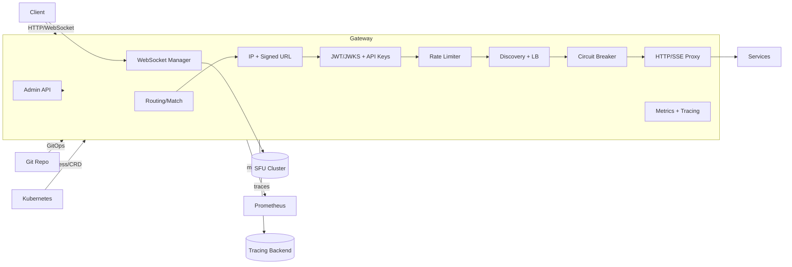

<!--
~~~~~~~~~~~~~~~~~~~~~~~~~~~~~~~~~~~~~~~~~~~~~~~~~~~~~~~~~~~~~~~~~~~~~
TABLE OF CONTENTS – regenerate automatically with your editor/IDE
~~~~~~~~~~~~~~~~~~~~~~~~~~~~~~~~~~~~~~~~~~~~~~~~~~~~~~~~~~~~~~~~~~~~~
-->

## 0 · How to Use This Guide

- Replace all `<PLACEHOLDERS>` with actual values when implementing.
- Start with **Quickstart Lab**, then go deeper into specific features.
- Embed diagrams/screenshots where words fall short.
- Cite code with **start:end:filepath** (e.g., `236:241:services/api-gateway/src/types/gateway.ts`).

---

## 1 · What · Why · Who (at a Glance)

| Aspect | Details |
| ------ | ------- |
| **What** | A production-ready, configuration-driven Fastify service that acts as the unified entry point for all platform services, providing routing, authentication, rate limiting, resilience patterns, AI-aware features, and comprehensive observability |
| **Why** | Eliminates client complexity, protects backends from failures, standardizes cross-cutting concerns, enables zero-downtime deployments, and provides enterprise-grade security and compliance |
| **Who** | Backend engineers, SREs, platform architects, and DevOps teams building/operating microservices platforms |
| **Learning Objectives** | After reading you can: Deploy the gateway in production • Configure routes with policies • Implement JWT/JWKS + API key auth • Set up rate limiting and circuit breakers • Enable AI streaming and model routing • Operate GitOps config sync • Monitor with Prometheus/OpenTelemetry • Troubleshoot common issues |

---

## 2 · When to Use & When **Not** to Use

| Use-Case | Rationale |
| -------- | --------- |
| **Ideal** | Microservices architecture with 10+ services, need for unified auth/rate limiting, AI workloads requiring streaming/batching, compliance requirements for audit trails, multi-environment deployments |
| **Anti-Pattern** | Single monolith application, simple CRUD APIs with basic needs, extreme latency requirements (<10ms), very small teams without operational expertise |

---

## 3 · Prerequisites & Setup

| Item | Version | Local Command |
| ----------- | ------- | ------------- |
| Node.js | `20+` | `nvm use 20` |
| Redis | `7+` | `docker run -p 6379:6379 redis:7` |
| TypeScript | `5+` | `npm install -g typescript` |

```bash
# Install & boot

cd services/api-gateway
npm install
npm run dev

# Smoke test

curl localhost:8080/health   # → {"success": true}
```

---

## 4 · Quickstart Lab (20 min)

1. **Launch Service**

   ```bash
   cd services/api-gateway
   npm run dev
   ```

   *Expect:* `Server listening at http://localhost:8080`

2. **Call Health Endpoint**

   ```bash
   curl localhost:8080/health
   ```

   *Expect:* `{"success": true, "timestamp": "..."}`

3. **Check Admin API (if enabled)**

   ```bash
   curl localhost:8080/admin/health
   ```

4. **Inspect Metrics** – visit `http://localhost:8080/metrics`

| Error | Likely Cause | Fix |
| ------------ | ------------ | ----------------- |
| `EADDRINUSE` | Port 8080 busy | `lsof -i :8080` and kill process |
| Redis connection failed | Redis not running | `docker run -p 6379:6379 redis:7` |
| Admin API 404 | Admin disabled | Enable in config and restart |

### 4.1 · File & Folder Structure (with one-line purpose)

```text
services/api-gateway/
  package.json                # Scripts and dependencies
  tsconfig.json               # TypeScript compiler settings
  nodemon.json                # Dev runner config
  dist/                       # Build output (if compiled)
  src/
    server.ts                 # Fastify bootstrap and feature wiring
    services.ts               # Back-compat shim (if used)

    admin/
      api.ts                  # Admin API (config CRUD, audit log, hot reload)

    ai/
      batchProcessor.ts       # Prompt batching engine
      modelRouter.ts          # AI model router (weighted, sticky, least-conn)

    auth/
      credentialProxy.ts      # AWS SigV4 and GCP SA credential proxying

    config/
      environmentIsolation.ts # Environment/tenant-scoped config isolation
      gatewayConfig.ts        # Centralized config (optional entry point)

    deployment/
      strategies.ts           # Blue-green, canary, rolling + SLO auto-rollback

    discovery/
      providers.ts            # Discovery providers (static/DNS/K8s/Consul)
      loadBalancer.ts         # Instance selection + outlier ejection

    features/
      flagManager.ts          # Feature flags (local/OpenFeature-compatible)

    gitops/
      configSync.ts           # GitOps sync with drift detection and auto-sync

    k8s/
      ingressController.ts    # Ingress/CRD -> GatewayConfig translation

    media/
      webrtcRouter.ts         # WebRTC SFU routing (regional, balanced)

    middleware/
      auth.ts                 # JWT/JWKS + API Key auth and RBAC
      apiKeys.ts              # API key lifecycle (create/validate/revoke)
      contextInjection.ts     # Claims -> downstream header mapping
      rateLimit.ts            # Redis token bucket rate limiting
      security.ts             # IP allow/deny + signed URL validation
      transforms.ts           # Request/response header transforms

    observability/
      metrics.ts              # Prometheus metrics (requests, limiter, retries...)
      tracing.ts              # OpenTelemetry tracing helpers

    pipeline/
      handle.ts               # End-to-end request pipeline orchestration

    plugins/
      sandbox.ts              # Plugin sandbox (onRequest/onResponse/onError/onStream)

    proxy/
      circuit.ts              # Circuit breaker wrapper (Opossum)
      httpProxy.ts            # Core HTTP proxy action
      streamingProxy.ts       # SSE/chunked streaming proxy

    routing/
      match.ts                # Route matcher
      cdnRouter.ts            # CDN-aware router (geo/RTT)

    secrets/
      manager.ts              # Secrets backends (Vault/AWS/GCP/Env) + cache

    websocket/
      sessionManager.ts       # WS session manager (rooms, heartbeats, auth)

    types/
      gateway.ts              # Strong gateway types (routes, policies, flags)
```

### 4.2 · Identity Quickstart (JWT/JWKS with ES256)

1. Issue an ES256 token from Identity

   ```bash
   # Register or login to get a token (adjust URL/port if needed)
   curl -s -X POST http://localhost:8081/api/v1/auth/login \
     -H 'content-type: application/json' \
     -d '{"email":"user@example.com","password":"<PASSWORD>"}' | jq -r .accessToken
   ```

2. Configure a protected route in the gateway using JWKS

   - Required: `issuer`, `audience`, and `jwksUri` (or `oidcDiscoveryUrl`).
   - Policy example (conceptual):

   ```json
   {
     "id": "users-api",
     "matcher": { "path": "/api/users/*", "methods": ["GET"] },
     "target": { "type": "http", "url": "http://users:8080" },
     "policy": {
       "auth": {
         "jwt": {
           "issuer": "https://identity.suuupra.local",
           "audience": "suuupra-api",
           "jwksUri": "https://identity.suuupra.local/.well-known/jwks.json",
           "requiredRoles": ["user"],
           "requiredScopes": ["user.read"],
           "clockSkewSeconds": 60
         }
       }
     }
   }
   ```

3. Call the protected route with the token

   ```bash
   TOKEN="$(...)"  # paste the token from step 1
   curl -i http://localhost:8080/api/users/me \
     -H "authorization: Bearer ${TOKEN}"
   ```

   - Expect: `200 OK` when roles/scopes match; `401/403` otherwise.
   - Troubleshooting: Check `issuer/audience`, token expiry, and JWKS reachability.

## 5 · Tech Stack & Libraries (with rationale)

- **Fastify**: High-performance, low-overhead Node HTTP server
- **TypeScript**: Safer evolvability across many features
- **jose**: Standards-compliant JOSE/JWT/JWKS; supports OIDC discovery
- **@fastify/jwt**: Local token validation fallback
- **Opossum**: Circuit breaker to protect backends
- **Redis**: Distributed rate limiting and lightweight state
- **Prometheus + OpenTelemetry**: Operations visibility
- **ws**: WebSocket server for session manager

## 6 · Architecture & Request Flow (Diagrams)

### Component Diagram


### Sequence (simplified request)

1) Route matched by path/host/method
2) Security checks (IP allow/deny, signed URL)
3) Authentication (JWT/JWKS or API Key) + scope/role checks
4) Rate limit check (token bucket; 429 with Retry-After on exceed)
5) Target discovery + instance selection (LB)
6) Circuit breaker wraps upstream call; optional retries
7) Proxy response (SSE streaming supported); metrics/traces emitted

## 7 · Features (Teach-Style Deep Dives)

Below are representative deep dives. See code for others (e.g., CDN routing, SFU, feature flags, GitOps).

### Routing & Policies

- **What**: `RouteConfig` defines matchers, targets, and policies.
- **Why**: One place to state behavior per path/host.
- **How**: Type-safe interfaces centralize shape and validation.

```236:241:services/api-gateway/src/types/gateway.ts
export interface RouteConfig {
  id: string;
  matcher: RouteMatcher;
  target: ServiceTarget;
  policy: RoutePolicy;
}
```

### Authentication (JWT/JWKS, API Keys)

- **What**: Verify JWT with remote JWKS (OIDC discovery) or local secret; validate API keys with scopes.
- **Why**: Secure access, rotate keys, decouple issuers.
- **How**: `middleware/auth.ts` uses `jose` for JWKS and `apiKeys.ts` for Redis-backed keys. Per-route `requiredScopes`/`requiredRoles` optional.
- **OIDC Integration**: Configure `issuer`, `audience` and `jwksUri` from Identity discovery (`/.well-known/openid-configuration`). Example route policy (conceptual):

  ```json
  {
    "policy": {
      "auth": {
        "jwt": {
          "issuer": "https://identity.suuupra.local",
          "audience": "suuupra-api",
          "oidcDiscoveryUrl": "https://identity.suuupra.local/.well-known/openid-configuration",
          "requiredRoles": ["user"],
          "requiredScopes": ["api"],
          "jwksCacheMaxAgeMs": 600000,
          "clockSkewSeconds": 60
        }
      },
      "rateLimit": { "enabled": true, "tokensPerInterval": 60, "intervalMs": 60000 },
      "timeout": 10000
    }
  }
  ```
- **Notes**: When both are enabled, both must pass.

### Rate Limiting

- **What**: Token bucket via Redis; labels include route and key type.
- **How**: `middleware/rateLimit.ts`; 429 responses set `Retry-After` header with backoff hints.
- **Test**: Hammer an endpoint and watch remaining/limit behavior.

### Resilience: Retries & Circuit Breakers

- **What**: Automatic retry policies and breakers per-route.
- **How**: `proxy/circuit.ts` wraps proxy action; breaker events recorded in metrics.
- **Tip**: Keep idempotent methods on retries by default.

### Streaming & AI-Aware Path

- **What**: SSE/chunked proxy with cancellation; prompt batching; model routing; context injection.
- **How**: `proxy/streamingProxy.ts`, `ai/batchProcessor.ts`, `ai/modelRouter.ts`, `middleware/contextInjection.ts`.
- **When**: Use batching for small prompts; model router for multi-provider resiliency.

### Discovery, Load Balancing, and Health

- **What**: Providers (static/DNS/K8s/Consul) + LB strategies (RR/weighted/least-*); active health checks and outlier ejection.
- **How**: `discovery/providers.ts`, `discovery/loadBalancer.ts`.
- **Operate**: Prefer weighted for heterogeneous backends.

### Admin API & Hot Reload

- **What**: CRUD for routes/config, with audit trail and atomic swap.
- **How**: `admin/api.ts` with `ConfigManager` (versioned state).
- **Note**: Ensure admin is enabled in config to use endpoints.

### Secrets & Credential Proxying

- **What**: Centralized secrets and cloud request signing.
- **How**: `secrets/manager.ts` (Vault/AWS/GCP/env) and `auth/credentialProxy.ts` (AWS SigV4, GCP SA tokens).
- **Tip**: Keep least privilege; never expose credentials to clients.

### WebSocket Manager & WebRTC SFU Routing

- **What**: Room-based WS sessions with heartbeat/auth; SFU selection by region/load.
- **How**: `websocket/sessionManager.ts`, `media/webrtcRouter.ts`.

### Security Hardening (TLS/mTLS, WAF, Audit)

- **What**: TLS termination, internal mTLS via SPIFFE/SPIRE, WAF (OWASP CRS + custom rules), and append-only audit sink with hash chaining.
- **How**:

  - TLS/mTLS: `security/tlsManager.ts` — certificate loading, rotation hooks, SPIFFE identity verification
  - WAF: `security/wafIntegration.ts` — detect/block modes, whitelist, violation logging, headers
  - Audit: `security/auditSink.ts` — tamper-evident logs, signing, rotation, integrity verify
- **Operate**: Enforce mTLS for service-to-service traffic; start with WAF in detect-mode and graduate to block-mode; ship audit logs to SIEM.

### Admin & Access (RBAC + Scopes)

- **What**: Hardened Admin API with JWT-based auth, role inheritance, and permission checks by resource/action.
- **How**: `admin/rbac.ts` — roles, permissions, rate-limited login, session limits, token refresh
- **Tip**: Make `super-admin` rare; prefer scoped roles (`operator`, `viewer`) for day-to-day ops.

### Config Safety & GitOps

- **What**: Strong schema validation + migrations, GitOps sync, K8s Ingress compatibility, and environment/tenant isolation.
- **How**:

  - Validation & Migrations: `config/validation.ts` — Ajv schemas, semantic checks, version matrix, compatibility tests
  - GitOps Sync: `gitops/configSync.ts` — poll/webhook, drift detection, conflict strategies
  - K8s Ingress: `k8s/ingressController.ts` — translate Ingress/CRD/annotations to `GatewayConfig`
  - Env Isolation: `config/environmentIsolation.ts` — env/tenant detection, scoped routes/policies
- **Operate**: Run GitOps in dry-run first; enable auto-sync after validation passes consistently.

### Monitoring & Alerting

- **What**: First-class dashboards and alert rules for latency, error-rate, breakers, limiter saturation, queue depths.
- **Where**:

  - Dashboard: `monitoring/grafana/dashboards/api-gateway.json`
  - Alerts: `monitoring/grafana/alerts/api-gateway-alerts.yml`
- **Tip**: Wire alert links to runbooks; add SLO burn-rate alerts for availability and latency.

### Load Testing & SLOs

- **What**: k6 profiles (baseline, stress, spike, soak, AI-focused) and SLO summary generation.
- **Where**:

  - Profiles: `tests/load/k6-profiles.js`
  - Runner: `scripts/run-load-tests.sh`
- **Operate**: Track P95/P99 latency and error-rate; gate canary progression on SLOs.

## 8 · Integration Points

- **Identity**: OIDC discovery + JWKS; `issuer`, `audience`, `jwksUri`, or `oidcDiscoveryUrl` per-route.
- **Redis**: Rate limiting and API key activity timestamps.
- **Cloud**: AWS SigV4, GCP SA tokens for upstream auth.
- **Kubernetes**: Ingress controller translates Ingress/CRDs → GatewayConfig.
- **GitOps**: Repo polling and webhook-triggered sync with drift detection.

## 8.1 · Identity Integration (JWT/JWKS with ES256)

- Overview
  - The Identity service issues ES256-signed JWTs. Publish a public JWKS endpoint and configure routes with `issuer`, `audience`, and `jwksUri`.
  - Tokens are framework-neutral to support polyglot microservices.

- Recommended token claims
  - Standard: `iss`, `aud`, `sub` (stable user id or email), `iat`, `exp`, `jti`
  - App claims:
    - `roles`: ["user", "admin"]
    - `perms`: ["user.read", "user.write"]
    - Optional `scope`: "user.read user.write" (space-delimited)

- Role prefixing note (Spring vs others)
  - Do not add `ROLE_` in tokens. Keep `roles` as plain names (e.g., `user`, `admin`).
  - In Spring apps that prefer `hasRole("user")`, map token roles → authorities with `ROLE_` prefix at runtime.
  - Else, use `hasAuthority("user")` directly. Other languages simply check the `roles` array.

- JWKS and rotation
  - Use JWKS with `kid` for key identification; cache keys with TTL and backoff on fetch errors.
  - Rotation procedure: publish new key with new `kid` → start signing with new `kid` → retire old key after TTL.

- Example route policy (conceptual)

  ```json
  {
    "policy": {
      "auth": {
        "jwt": {
          "issuer": "https://identity.suuupra.local",
          "audience": "suuupra-api",
          "jwksUri": "https://identity.suuupra.local/.well-known/jwks.json",
          "requiredRoles": ["user"],
          "requiredPermissions": ["user.read"],
          "requiredScopes": ["user.read"]
        }
      }
    }
  }
  ```

- Polyglot verification hints
  - Node: `jose` → remote JWKS via `createRemoteJWKSet(new URL(jwksUri))`, verify `iss`/`aud`.
  - Go: `lestrrat-go/jwx` or `golang-jwt` + JWKS, enforce `iss`/`aud`.
  - Java: Nimbus (as used by Identity) or Spring Security Resource Server JWKS.

- Observability
  - Metrics to track: `jwt_verify_success_total`, `jwt_verify_error_total`, `jwks_cache_hit_ratio`, `authz_denied_total` by reason (role/scope/perm).
  - Alerts: sudden spike in 401s; JWKS cache miss surge; clock-skew anomalies.

## 9 · Data Model

- **Stateless**: No gateway DB.
- **Caches/State**: JWKS cache, discovery/LB cache, token buckets, API key records (hashed), plugin sandbox state.

## 10 · Observability

- **Metrics**: Requests, errors, latency histograms; limiter hits; retries; breaker opens; queue/concurrency gauges.
- **Tracing**: Gateway and upstream spans; W3C context.
- **Dashboards/Alerts**: High latency/error rate; breaker open; limiter saturation.

## 11 · Security

- **Threats**: Token replay, key leakage, credential sprawl, SSRF, over-permissive CORS.
- **Mitigations**: JWKS validation, hashed API keys, credential proxying, signed URL verification, IP allow/deny.
- **Secrets**: Store in Vault/AWS/GCP or env; never commit secrets.

## 12 · Performance & SLOs

- **Targets**: p99 latency < 150ms (gateway overhead), error rate < 1%, throughput scalable to cluster.
- **Load Testing**: Focus on rate limiter/breaker behavior and streaming path.

## 13 · Contributing & Extension Guide

- **Dev**: `npm run dev` (do not run build unless explicitly required).
- **Lint/Types**: Fix lints before PR; keep strong types, avoid `any`.
- **Add a Route**: Use Admin API or config manager to add `RouteConfig` with `policy`.
- **Extend Pipeline**: Add middleware under `src/middleware/` and wire via `pipeline/handle.ts`.
- **Plugins**: Create `PluginRegistration` and register via sandbox manager.

## 14 · Hands-on Exercises

- **Exercise 1: Add a Rate-Limited Route**

  - Add a route with `rateLimit.tokensPerInterval = 10`, `intervalMs = 60000`.
  - Acceptance: The 11th request within a minute returns 429 with `Retry-After`.
- **Exercise 2: Enable JWKS for a Route**

  - Configure `jwksUri` or `oidcDiscoveryUrl` and `issuer`/`audience`.
  - Acceptance: Valid token passes; tampered token fails with 401.

## 15 · Troubleshooting & FAQ

- 429s unexpectedly: Check rate limit keys (ip/user/tenant/route) and burst settings.
- 503s with breaker: Upstream failing; inspect breaker metrics and logs.
- Admin 404: Admin API disabled. Enable in config and hot-reload.
- SSE truncation: Ensure client keeps connection open and proxies don’t buffer.

## 16 · Glossary & Mental Models

- **JWKS**: JSON Web Key Set for verifying JWTs from an issuer.
- **Circuit Breaker**: Fails fast to protect backends and recover gracefully.
- **Token Bucket**: Rate limiter that refills tokens over time.
- Mental model: Think of the gateway as a programmable reverse proxy + policy engine.

## 17 · References & Further Reading

- API Gateway pattern: [microservices.io – API Gateway](https://microservices.io/patterns/apigateway.html)
- OIDC Discovery: [OpenID Connect Discovery 1.0](https://openid.net/specs/openid-connect-discovery-1_0.html)
- jose library: [panva/jose](https://github.com/panva/jose)
- Opossum breaker: [nodeshift/opossum](https://github.com/nodeshift/opossum)
- OpenTelemetry: [opentelemetry.io](https://opentelemetry.io/)
- Prometheus (Node): [siimon/prom-client](https://github.com/siimon/prom-client)
- Kubernetes Ingress: [Kubernetes – Ingress](https://kubernetes.io/docs/concepts/services-networking/ingress/)

---

### Appendix: Code Citations

- `RouteConfig` shape:

```236:241:services/api-gateway/src/types/gateway.ts
export interface RouteConfig {
  id: string;
  matcher: RouteMatcher;
  target: ServiceTarget;
  policy: RoutePolicy;
}
```
- `AdminConfig` shape:

```243:248:services/api-gateway/src/types/gateway.ts
export interface AdminConfig {
  apiEnabled: boolean;
  hotReloadEnabled: boolean;
  secretsManagementEnabled: boolean;
  dashboardUiEnabled?: boolean;
}
```
