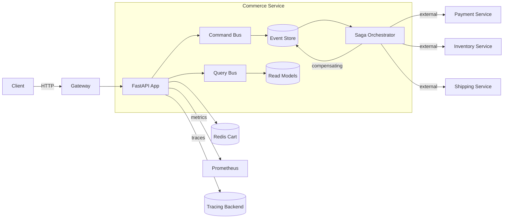

<!--
~~~~~~~~~~~~~~~~~~~~~~~~~~~~~~~~~~~~~~~~~~~~~~~~~~~~~~~~~~~~~~~~~~~~~
TABLE OF CONTENTS – regenerate automatically with your editor/IDE
~~~~~~~~~~~~~~~~~~~~~~~~~~~~~~~~~~~~~~~~~~~~~~~~~~~~~~~~~~~~~~~~~~~~~
-->

## 0 · How to Use This Guide

- Start with Quickstart Lab, then go deeper into specific features.
- Use code refs and folder map to locate implementations quickly.
- This document is teach-style for depth and clarity, per team preference.
- Focus on CQRS, Event Sourcing, Saga patterns, and distributed transactions.

---

## 1 · What · Why · Who (at a Glance)

| Aspect | Details |
| ------ | ------- |
| **What** | Production-grade Commerce microservice implementing CQRS, Event Sourcing, Saga orchestration for order management, shopping cart, and inventory |
| **Why** | Enable scalable e-commerce backbone for Suuupra platform with 100% data consistency across distributed transactions and 1000 orders/sec capacity |
| **Who** | Backend engineers, SREs, platform architects building/operating distributed commerce systems |
| **Learning Objectives** | Run the service locally • Create orders with saga orchestration • Manage shopping cart state • Handle inventory with optimistic locking • Implement compensating transactions • Monitor saga execution and business KPIs |

---

## 2 · When to Use & When **Not** to Use

| Use-Case | Rationale |
| -------- | --------- |
| **Ideal** | Complex multi-service order fulfillment, high-volume e-commerce, distributed transactions requiring consistency, event-driven architectures |
| **Anti-Pattern** | Simple CRUD commerce with single database, low transaction volume, monolithic architecture preferences |

---

## 3 · Prerequisites & Setup

| Item | Version | Local Command |
| ----------- | ------- | ------------- |
| Python | 3.11+ | `python --version` |
| FastAPI | 0.104+ | `pip install fastapi[all]` |
| PostgreSQL | 15+ | `docker run -p 5432:5432 -e POSTGRES_PASSWORD=commerce -e POSTGRES_DB=commerce postgres:15` |
| Redis | 7+ | `docker run -p 6379:6379 redis:7` |
| Docker | 24+ | `docker --version` |

```bash
# Install & boot (local, from repo root)
cd services/commerce
python -m venv venv
source venv/bin/activate  # or `venv\Scripts\activate` on Windows
pip install -r requirements.txt

# Start development stack (PostgreSQL, Redis, Prometheus, Grafana)
make dev

# Smoke test (expect 200 OK)
curl -s http://localhost:8084/health | jq
```

Notes
- Event store requires PostgreSQL for ACID transactions
- Redis handles shopping cart persistence and saga coordination
- Environment variables: copy `.env.example` → `.env` and adjust as needed

---

## 4 · Quickstart Lab (30 min)

1) Launch Service

```bash
cd services/commerce
make dev
```

Expect: `Commerce service listening on port 8084`

2) Create Shopping Cart

```bash
TOKEN="<bearer-token>" # From Identity service
curl -s -X POST http://localhost:8084/api/v1/cart \
  -H "content-type: application/json" \
  -H "authorization: Bearer $TOKEN" \
  -d '{
    "items": [
      {
        "productId": "prod-123",
        "quantity": 2,
        "price": 29.99
      }
    ]
  }' | jq
```

3) Create Order (Triggers Saga)

```bash
CART_ID="<from step 2>"
curl -s -X POST http://localhost:8084/api/v1/orders \
  -H "content-type: application/json" \
  -H "authorization: Bearer $TOKEN" \
  -d '{
    "cartId": "'$CART_ID'",
    "paymentMethod": "credit_card",
    "shippingAddress": {
      "street": "123 Main St",
      "city": "San Francisco",
      "state": "CA",
      "zipCode": "94105"
    },
    "idempotencyKey": "order-12345-uuid"
  }' | jq
```

4) Check Order Status & Saga Progress

```bash
ORDER_ID="<from step 3>"
curl -s http://localhost:8084/api/v1/orders/$ORDER_ID \
  -H "authorization: Bearer $TOKEN" | jq

# Check saga execution
curl -s http://localhost:8084/api/v1/admin/sagas?correlationId=$ORDER_ID \
  -H "authorization: Bearer $TOKEN" | jq
```

5) Query Order History (CQRS Read Model)

```bash
curl -s "http://localhost:8084/api/v1/orders?status=completed&limit=10" \
  -H "authorization: Bearer $TOKEN" | jq
```

Troubleshooting
- 401/403: Check token `issuer/audience` and roles/permissions
- Saga failures: Check compensating transactions in event store
- Inventory conflicts: Monitor optimistic locking retries

---

## 5 · Project Layout

```text
services/commerce/
  requirements.txt            # Python dependencies
  pyproject.toml              # Python project config
  docker-compose.yml          # Prod-like compose
  docker-compose.dev.yml      # Dev compose (bind-mounts, debug)
  Makefile                    # Dev workflows
  src/
    main.py                   # FastAPI bootstrap, dependency injection
    config/                   # Settings, database, Redis connections
    domain/                   # DDD aggregates, entities, value objects
      aggregates/             # Order, Inventory aggregates
      events/                 # Domain events
      repositories/           # Repository interfaces
    infrastructure/           # External concerns
      persistence/            # Event store, read models, Redis
      messaging/              # Event bus, saga orchestrator
      external/               # Payment, shipping service clients
    application/              # Use cases, command/query handlers
      commands/               # Order creation, cart management
      queries/                # Order history, inventory status
      sagas/                  # Order fulfillment saga
    api/                      # FastAPI routes and models
      v1/                     # API version 1
        routes/               # Order, cart, admin endpoints
        schemas/              # Pydantic request/response models
    utils/                    # Logging, metrics, tracing
  tests/                      # Unit/integration/load tests
    unit/                     # Domain logic tests
    integration/              # Full saga tests
    load/                     # k6 performance tests
  monitoring/                 # Grafana dashboards, Prometheus alerts
```

---

## 6 · Tech Stack & Libraries (+Why)

| Layer | Tech | Rationale | Trade-offs |
| ----- | ---- | --------- | ---------- |
| API | FastAPI 0.104 | High-performance async, auto OpenAPI | Python ecosystem learning curve |
| Database | PostgreSQL 15 | ACID transactions for event store | Complex queries vs NoSQL flexibility |
| Cache/State | Redis 7 | Shopping cart persistence, saga coordination | Memory usage, persistence config |
| Event Store | Custom on PostgreSQL | Audit trail, event replay, temporal queries | Storage growth, query complexity |
| Messaging | Redis Streams | Event bus, saga choreography | Not as feature-rich as Kafka |
| Validation | Pydantic | Type safety, automatic serialization | Runtime overhead vs compile-time |
| Testing | pytest + Testcontainers | Realistic integration tests | Docker dependency |

---

## 7 · Architecture & Request Flow

### 7.1 High-Level Diagram



### 7.2 CQRS + Event Sourcing Flow

1) Command → Aggregate → Events → Event Store
2) Event Store → Read Model Projections
3) Query → Read Models (not Event Store directly)
4) Saga → Orchestrates external services → Compensating transactions on failure

### 7.3 Order Fulfillment Saga Steps

1) **Reserve Inventory** → Inventory Service
2) **Process Payment** → Payment Service  
3) **Create Shipment** → Shipping Service
4) **Confirm Order** → Update order status
5) **Compensating Transactions** on any failure (release inventory, refund payment, etc.)

---

## 8 · Feature Deep Dives

### 8.1 CQRS & Event Sourcing Foundation

**What**: Command Query Responsibility Segregation separates write (commands) from read (queries) models.

**Why**: Optimizes each side independently; enables event replay and audit trails.

**How**: 
- Commands modify aggregates → generate events → persist to event store
- Events project to read models for queries
- No direct database writes from commands

Code:
```python
# Domain Aggregate Example
class OrderAggregate:
    def create_order(self, command: CreateOrderCommand) -> List[DomainEvent]:
        # Business logic validation
        if not self._has_inventory(command.items):
            raise InsufficientInventoryError()
        
        # Generate events
        events = [
            OrderCreatedEvent(order_id=command.order_id, items=command.items),
            InventoryReservedEvent(items=command.items)
        ]
        return events
```

### 8.2 Saga Pattern & Distributed Transactions

**What**: Orchestrates long-running, distributed transactions across multiple services.

**Why**: Maintains consistency without distributed locks; handles partial failures gracefully.

**How**: State machine tracks saga progress; compensating transactions undo completed steps on failure.

Code:
```python
class OrderFulfillmentSaga:
    def __init__(self):
        self.steps = [
            ReserveInventoryStep(),
            ProcessPaymentStep(),
            CreateShipmentStep(),
            ConfirmOrderStep()
        ]
    
    async def execute(self, saga_data: SagaData):
        for step in self.steps:
            try:
                await step.execute(saga_data)
                await self.save_progress(saga_data)
            except Exception as e:
                await self.compensate(saga_data, step)
                raise SagaExecutionError(f"Failed at step {step.name}")
```

### 8.3 Shopping Cart Persistence

**What**: Redis-based shopping cart with TTL and atomic operations.

**Why**: Fast access, automatic expiration, handles concurrent updates.

**How**: Hash structure per user; atomic increment/decrement for quantities.

Code:
```python
class RedisCartRepository:
    async def add_item(self, user_id: str, item: CartItem):
        cart_key = f"cart:{user_id}"
        async with self.redis.pipeline() as pipe:
            await pipe.hset(cart_key, item.product_id, item.to_json())
            await pipe.expire(cart_key, self.ttl_seconds)
            await pipe.execute()
```

### 8.4 Inventory Management with Optimistic Locking

**What**: Prevents overselling through version-based optimistic concurrency control.

**Why**: Better performance than pessimistic locking; handles concurrent purchases.

**How**: Version field in inventory records; compare-and-swap operations.

Code:
```python
class InventoryAggregate:
    def reserve_items(self, items: List[CartItem]) -> List[DomainEvent]:
        for item in items:
            current_stock = self.get_stock(item.product_id)
            if current_stock.quantity < item.quantity:
                raise InsufficientStockError(item.product_id)
            
            # Optimistic locking check
            if current_stock.version != item.expected_version:
                raise ConcurrencyConflictError(item.product_id)
        
        return [InventoryReservedEvent(items=items)]
```

### 8.5 Event Store Implementation

**What**: Append-only log of domain events with aggregate versioning.

**Why**: Complete audit trail, time-travel queries, event replay capabilities.

**How**: PostgreSQL table with aggregate_id, version, event_data; unique constraint prevents concurrent writes.

Schema:
```sql
CREATE TABLE events (
    id UUID PRIMARY KEY DEFAULT gen_random_uuid(),
    aggregate_id UUID NOT NULL,
    aggregate_type VARCHAR(100) NOT NULL,
    event_type VARCHAR(100) NOT NULL,
    event_data JSONB NOT NULL,
    version INTEGER NOT NULL,
    created_at TIMESTAMPTZ DEFAULT NOW(),
    UNIQUE(aggregate_id, version)
);
```

---

## 9 · Security

- **AuthN**: JWT via JWKS (OIDC-ready); required claims: `iss`, `aud`, `sub`, `roles`
- **AuthZ**: Role-based access with admin endpoints protected
- **Input Validation**: Pydantic schemas with custom validators
- **Idempotency**: Keys prevent duplicate order creation
- **PCI Compliance**: Payment data never stored; tokenized via Payment Service
- **Audit Trail**: All events immutable in event store with timestamps

Code:
```python
@router.post("/orders", dependencies=[Depends(require_auth)])
async def create_order(
    command: CreateOrderCommand,
    current_user: User = Depends(get_current_user)
):
    # Idempotency check
    if await order_service.exists(command.idempotency_key):
        return await order_service.get_by_idempotency_key(command.idempotency_key)
    
    # Authorization
    if not current_user.can_create_orders():
        raise HTTPException(403, "Insufficient permissions")
    
    return await order_service.create_order(command)
```

---

## 10 · Observability

### 10.1 Technical KPIs
- **Order Processing Time**: p95 < 2 seconds (including saga execution)
- **Saga Execution Time**: p95 < 5 seconds for full order fulfillment
- **Inventory Update Latency**: p95 < 100ms
- **Event Store Write Latency**: p95 < 50ms

### 10.2 Business KPIs  
- **Orders per Hour**: Real-time order volume
- **Conversion Rate**: Cart-to-order conversion
- **Cart Abandonment Rate**: Percentage of abandoned carts
- **Saga Success Rate**: Percentage of successful order fulfillments

### 10.3 Alerts
- **HighOrderFailureRate**: Trigger when >1% of orders fail
- **SagaFailure**: Saga fails and requires manual intervention
- **InventoryMismatch**: Discrepancy between cached and actual inventory
- **EventStoreLatency**: Event store writes exceed SLA

Code:
```python
# Prometheus metrics
from prometheus_client import Counter, Histogram, Gauge

order_total = Counter('commerce_orders_total', 'Total orders created', ['status'])
saga_duration = Histogram('commerce_saga_duration_seconds', 'Saga execution time')
inventory_conflicts = Counter('commerce_inventory_conflicts_total', 'Optimistic locking conflicts')
```

---

## 11 · Operations & SRE

### 11.1 Runbooks
- **Saga Recovery**: Identify failed sagas, trigger compensating transactions
- **Event Store Maintenance**: Archive old events, rebuild read models
- **Inventory Reconciliation**: Compare actual vs reserved inventory
- **Cart Cleanup**: Remove expired carts, analyze abandonment patterns

### 11.2 Backup & Recovery
- **Event Store**: PostgreSQL continuous archiving + point-in-time recovery
- **Read Models**: Can be rebuilt from event store
- **Redis Cart Data**: Backup for analytics, not critical for recovery

### 11.3 Deployment Strategies
- **Blue-Green**: Full environment swap with saga state migration
- **Canary**: Gradual rollout with saga execution monitoring
- **Event Versioning**: Backward-compatible event schema evolution

---

## 12 · API Reference

Base: `http://localhost:8084/api/v1`

### 12.1 Shopping Cart

| Method | Path | Purpose |
| ------ | ---- | ------- |
| POST | `/cart` | Create shopping cart |
| GET | `/cart/:id` | Get cart contents |
| PUT | `/cart/:id/items` | Add/update cart items |
| DELETE | `/cart/:id/items/:productId` | Remove cart item |
| POST | `/cart/:id/checkout` | Initiate checkout process |

### 12.2 Order Management

| Method | Path | Purpose |
| ------ | ---- | ------- |
| POST | `/orders` | Create order (triggers saga) |
| GET | `/orders/:id` | Get order details |
| GET | `/orders` | List orders (CQRS read model) |
| POST | `/orders/:id/cancel` | Cancel order (compensating transaction) |
| GET | `/orders/:id/events` | Get order event history |

### 12.3 Inventory

| Method | Path | Purpose |
| ------ | ---- | ------- |
| GET | `/inventory/:productId` | Get inventory status |
| POST | `/inventory/:productId/reserve` | Reserve inventory |
| POST | `/inventory/:productId/release` | Release reserved inventory |

### 12.4 Admin Operations

| Method | Path | Purpose |
| ------ | ---- | ------- |
| GET | `/admin/sagas` | List saga instances |
| POST | `/admin/sagas/:id/retry` | Retry failed saga |
| POST | `/admin/sagas/:id/compensate` | Trigger compensating transactions |
| GET | `/admin/events` | Query event store |
| POST | `/admin/projections/rebuild` | Rebuild read models |

Full OpenAPI spec: `services/commerce/src/api/openapi.yaml`

---

## 13 · Load Testing & SLOs

### 13.1 Performance Targets
- **Throughput**: 1000 orders/sec sustained
- **Availability**: 99.99% uptime
- **Data Consistency**: 100% across all services

### 13.2 Load Test Scenarios
```bash
# Baseline load
k6 run tests/load/baseline-load.js

# Stress test (2x normal load)
k6 run tests/load/stress-test.js

# Spike test (10x load for 5 minutes)
k6 run tests/load/spike-test.js

# Saga failure scenarios
k6 run tests/load/saga-failure-test.js
```

---

## 14 · Troubleshooting & FAQ

### 14.1 Common Issues

**Saga Stuck in Progress**
```bash
# Check saga status
curl http://localhost:8084/api/v1/admin/sagas/{saga_id}

# Retry failed step
curl -X POST http://localhost:8084/api/v1/admin/sagas/{saga_id}/retry
```

**Inventory Conflicts**
- Monitor `commerce_inventory_conflicts_total` metric
- Check for high concurrent access to same products
- Consider increasing retry attempts with exponential backoff

**Event Store Growth**
- Archive events older than retention period
- Monitor disk usage and query performance
- Consider event store sharding for high volume

**Cart Abandonment Analysis**
```bash
# Query abandoned carts
curl "http://localhost:8084/api/v1/admin/analytics/abandoned-carts?hours=24"
```

---

## 15 · Glossary & Mental Models

| Term | Definition |
| ---- | ---------- |
| **CQRS** | Command Query Responsibility Segregation - separate read/write models |
| **Event Sourcing** | Store state changes as sequence of events rather than current state |
| **Saga Pattern** | Manage distributed transactions through choreography or orchestration |
| **Aggregate** | Domain-driven design concept - consistency boundary for business logic |
| **Compensating Transaction** | Undo operation to maintain consistency in distributed systems |
| **Optimistic Locking** | Concurrency control using version numbers instead of locks |

### Mental Model: Think of Commerce as...
- **Event Store**: Bank transaction log - every change is recorded, nothing is deleted
- **Saga**: Recipe with rollback steps - if any ingredient fails, undo previous steps  
- **CQRS**: Kitchen metaphor - separate prep area (commands) from serving area (queries)
- **Aggregate**: Shopping cart boundary - all items in cart change together or not at all

---

## 16 · References & Further Reading

- **CQRS Journey** by Microsoft Patterns & Practices
- **Event Sourcing** by Martin Fowler
- **Saga Pattern** implementation guides
- **Domain-Driven Design** by Eric Evans
- **Building Event-Driven Microservices** by Adam Bellemare
- **PostgreSQL Event Store** design patterns
- **FastAPI** documentation and async patterns

---

### Appendix: Code Citations

- Order Aggregate
```start:end:services/commerce/src/domain/aggregates/order.py
```

- Saga Orchestrator  
```start:end:services/commerce/src/application/sagas/order_fulfillment.py
```

- Event Store Repository
```start:end:services/commerce/src/infrastructure/persistence/event_store.py
```

- API Routes
```start:end:services/commerce/src/api/v1/routes/orders.py
```
