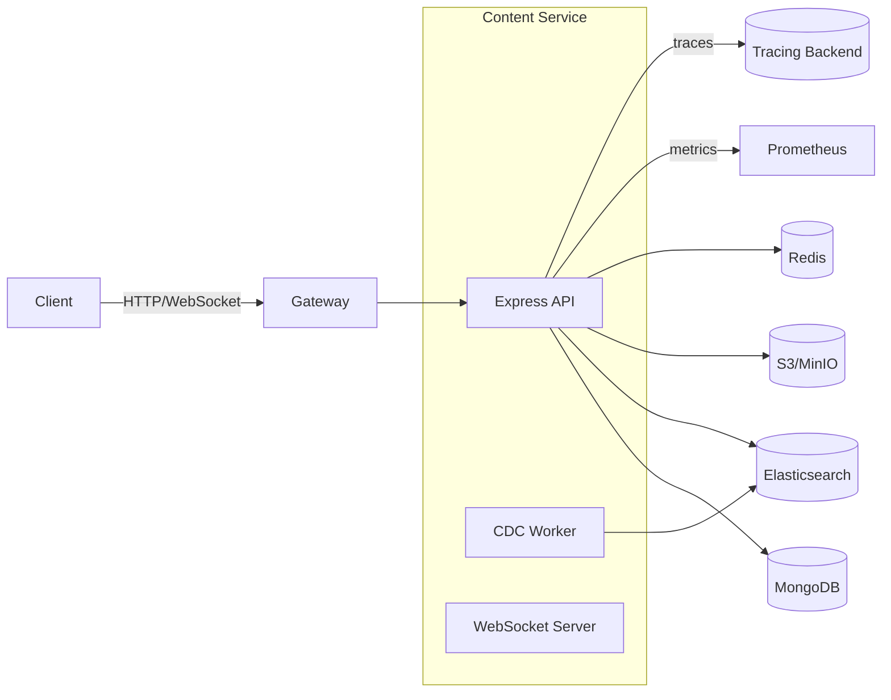

<!--
~~~~~~~~~~~~~~~~~~~~~~~~~~~~~~~~~~~~~~~~~~~~~~~~~~~~~~~~~~~~~~~~~~~~~
TABLE OF CONTENTS – regenerate automatically with your editor/IDE
~~~~~~~~~~~~~~~~~~~~~~~~~~~~~~~~~~~~~~~~~~~~~~~~~~~~~~~~~~~~~~~~~~~~~
-->

## 0 · How to Use This Guide

- Start with Quickstart Lab, then go deeper into specific features.
- Use code refs and folder map to locate implementations quickly.
- This document is teach-style for depth and clarity, per team preference.

---

## 1 · What · Why · Who (at a Glance)

| Aspect | Details |
| ------ | ------- |
| **What** | Production-grade Content Management microservice for CRUD, uploads, search, versioning/approval, and real-time status |
| **Why** | Power creators and learners with robust content workflows, large-file handling, and sub-200ms search |
| **Who** | Backend engineers, SREs, platform architects operating/building CMS for Suuupra |
| **Learning Objectives** | Run the service locally • Create content • Upload large media via multipart • Search with filters • Approve/publish workflows • Observe metrics/logs/traces |

---

## 2 · When to Use & When **Not** to Use

| Use-Case | Rationale |
| -------- | --------- |
| **Ideal** | Multi-tenant educational/media content, large files, Elasticsearch search, S3+CDN delivery |
| **Anti-Pattern** | Tiny app with few static pages; a static site or a database-only CRUD may suffice |

---

## 3 · Prerequisites & Setup

| Item | Version | Local Command |
| ----------- | ------- | ------------- |
| Node.js | 18 LTS | `nvm use 18` |
| Docker | 24+ | `docker --version` |
| Docker Compose | v2 | `docker compose version` |

```bash
# Install & boot (local, from repo root)
cd services/content
npm install

# Start development stack (Mongo, ES, Redis, MinIO, Prometheus, Grafana)
make dev

# Smoke test (expect 200 OK)
curl -s http://localhost:8082/health | jq
```

Notes
- Do not run production builds locally unless needed. Prefer dev stack.
- Environment variables: copy `.env.example` → `.env` and adjust as needed.

---

## 4 · Quickstart Lab (20 min)

1) Launch Service

```bash
cd services/content
make dev
```

Expect: `Content service listening on port 8082`

2) Create Content

```bash
TOKEN="<bearer-token>" # From Identity service
curl -s -X POST http://localhost:8082/api/v1/content \
  -H "content-type: application/json" \
  -H "authorization: Bearer $TOKEN" \
  -d '{
    "title":"Hello World",
    "description":"First lesson",
    "contentType":"article",
    "idempotencyKey":"f8c8c7fe-9e62-4f3f-9b0e-2a8d0a7e9f01"
  }' | jq
```

3) Initiate Multipart Upload

```bash
CONTENT_ID="<from step 2>"
curl -s -X POST http://localhost:8082/api/v1/content/$CONTENT_ID/upload \
  -H "content-type: application/json" \
  -H "authorization: Bearer $TOKEN" \
  -d '{
    "filename":"video.mp4",
    "contentType":"video/mp4",
    "fileSize": 10485760,
    "checksumSha256":"aaaaaaaaaaaaaaaaaaaaaaaaaaaaaaaaaaaaaaaaaaaaaaaaaaaaaaaaaaaaaaaa"
  }' | jq
```

4) Search

```bash
curl -s "http://localhost:8082/api/v1/search?q=hello&limit=10" \
  -H "authorization: Bearer $TOKEN" | jq
```

5) Approve → Publish

```bash
curl -s -X POST http://localhost:8082/api/v1/admin/content/$CONTENT_ID/approve \
  -H "authorization: Bearer $TOKEN" | jq

curl -s -X POST http://localhost:8082/api/v1/admin/content/$CONTENT_ID/publish \
  -H "content-type: application/json" \
  -H "authorization: Bearer $TOKEN" \
  -d '{"versionBump":"minor"}' | jq
```

Troubleshooting
- 401/403: Check token `issuer/audience` and JWKS reachability; confirm roles/permissions.
- 5xx during search: ensure ES is healthy (`/_cluster/health` yellow/green) and index template applied.

---

## 5 · Project Layout

```text
services/content/
  package.json                # Scripts and dependencies
  tsconfig.json               # TypeScript config
  docker-compose.yml          # Prod-like compose
  docker-compose.dev.yml      # Dev compose (bind-mounts, debug)
  Makefile                    # Dev workflows
  src/
    server.ts                 # Express bootstrap, wiring
    config/                   # Central config loader
    controllers/              # Content/search/upload/workflow handlers
    middleware/               # JWT, RBAC, validation
    models/                   # Mongoose schemas: Content, Category, UploadSession
    routes/                   # Route wiring
    services/                 # S3, ES client, WebSocket, Workflow
    utils/                    # Logger, metrics, tracing, validation
    workers/                  # ES CDC sync worker
  tests/                      # Unit/integration/load tests
  monitoring/                 # Grafana dashboards, Prometheus alerts
```

---

## 6 · Tech Stack & Libraries (+Why)

| Layer | Tech | Rationale | Trade-offs |
| ----- | ---- | --------- | ---------- |
| API | Express 4 + TS | Ubiquitous, stable | Some manual middleware wiring |
| DB | MongoDB 6 (Mongoose 7) | Flexible schema, change streams | Transaction semantics differ from SQL |
| Search | Elasticsearch 8 | Full text + filters, scalable | Requires cluster care |
| Object Storage | AWS S3 (MinIO local) | Durable, multipart uploads | Eventual consistency on reads |
| Realtime | Socket.IO | Simple rooms/events for progress | Server resource usage at scale |
| Queue/Cache | Redis 7 | Token bucket, DLQs, state | External dependency |
| Metrics/Tracing | Prometheus + OTEL | Operations visibility | Extra infra |

---

## 7 · Architecture & Request Flow

### 7.1 High-Level Diagram



### 7.2 Request Path Tenets
- 12-factor, stateless API; no dual-writes. Request path writes only to Mongo; ES is updated via CDC outbox.
- Strict JSON validation (AJV); RBAC/ABAC middleware; ETag for optimistic concurrency.
- UTC timestamps, ISO-8601; pagination/sorting/filtering standard.

---

## 8 · Feature Deep Dives

### 8.1 Content CRUD
- Create/read/update/delete with soft-delete and restore.
- ETag/If-Match for optimistic concurrency; idempotency key on create.
- Indexes for common filters; tenant scoping.

Code:
```start:end:services/content/src/controllers/content.ts
// See createContent, getContentById, updateContent, softDeleteContent, restoreContent
```

### 8.2 Large File Uploads (Multipart)
- Initiate → signed URLs per part → complete/abort; resumable with `UploadSession`.
- WebSocket progress to room `upload:<uploadId>`; checksum validation.
- MinIO locally with path-style; S3 in prod with CDN URL.

Code:
```start:end:services/content/src/services/s3-upload.ts
// S3UploadService: init, sign part, complete, abort, progress
```

### 8.3 Search & Discovery (ES 8)
- Index template with analyzers; category enrichment; strict mappings.
- Query builder supports `q`, filters, sort, pagination; returns aggregations scaffold.

Code:
```start:end:services/content/src/controllers/search.ts
// searchContent handler
```

### 8.4 Workflow: Approval & Versioning
- State machine: draft → pending_approval → approved → published → archived.
- Transitions protected by roles/permissions; reason on reject; semantic version bumps.

Code:
```start:end:services/content/src/services/workflow.ts
// ContentWorkflowService with transitions and notifications
```

### 8.5 Consistency: Mongo ↔ ES (CDC)
- Mongo Change Streams drive ES updates; DLQ in Redis; resume tokens for fault-tolerance.
- Reindex job for drift; delete handling implemented.

Code:
```start:end:services/content/src/workers/elasticsearch-sync.ts
// ElasticsearchSyncWorker
```

---

## 9 · Security

- AuthN: JWT via JWKS (OIDC-ready). Required claims: `iss`, `aud`, `sub`; app claims: `roles`, `perms`.
- AuthZ: RBAC with optional ABAC hooks; route-level `authorize()` checks.
- Input validation: AJV schemas; HTML sanitization; MIME sniffing; optional ClamAV hook.
- Secrets: env/Vault; never commit secrets; rotate keys.
- OWASP ASVS mapping: authentication, input validation, error handling, logging/audit.

Code:
```start:end:services/content/src/middleware/auth.ts
// JWT authenticate + attachAuthUser + authorize
```

---

## 10 · Observability

- Metrics: HTTP totals + duration, upload counts, search latency, ES sync lag; Prometheus scrape on `/metrics`.
- Logs: Structured JSON via Winston; request/response correlation (`requestId`).
- Tracing: OpenTelemetry auto-instrumentation for HTTP, Mongo, Redis; custom spans for S3/search/workflow.

Dashboards/Alerts
- Grafana: `monitoring/grafana/dashboards/content-service-dashboard.json`
- Prometheus alerts: `monitoring/prometheus/alerts.yml` (p99 latency, error rate, upload failures, ES lag)

---

## 11 · Operations & SRE

Runbooks
- Reindex: trigger ES reindex from Mongo source; monitor lag gauge.
- Stuck uploads: abort inactive sessions past TTL; resume eligible sessions.
- Webhook storms: enable backpressure, DLQ, and exponential backoff.

Backups
- MongoDB snapshots + PITR; S3 versioning; ES snapshot lifecycle.

Deployments
- Blue/green or canary with gateway; ensure CDC worker health and lag < 5m.

Capacity
- Plan shards/indices for 1M+ items; target search p99 < 200ms; autoscale WS.

---

## 12 · API Reference (Selected)

Base: `http://localhost:8082/api/v1`

| Method | Path | Purpose |
| ------ | ---- | ------- |
| POST | `/content` | Create content (idempotent via key) |
| GET | `/content/:id` | Get content by id (ETag/If-None-Match) |
| PUT | `/content/:id` | Update content (If-Match) |
| DELETE | `/content/:id` | Soft delete |
| POST | `/content/:id/restore` | Restore soft-deleted |
| POST | `/content/:id/upload` | Initiate multipart upload |
| POST | `/content/:id/upload/:uploadId/complete` | Complete multipart upload |
| GET | `/upload/:uploadId/progress` | Upload progress |
| POST | `/upload/:uploadId/resume` | Resume upload |
| DELETE | `/upload/:uploadId` | Abort upload |
| GET | `/search` | Search content (q, filters, sort) |
| POST | `/admin/content/:id/approve` | Approve content |
| POST | `/admin/content/:id/reject` | Reject content (reason) |
| POST | `/admin/content/:id/publish` | Publish content |

Full OpenAPI spec: `services/content/src/api/openapi.yaml`

---

## 13 · Load Testing & SLOs

- k6 scripts under `tests/load/content-load-test.js` with baseline, stress, spike, soak.
- SLOs: p95 < 200ms for search; availability via S3+CDN patterns.

Run:
```bash
npm run test:load
```

---

## 14 · Troubleshooting & FAQ

- 429 Too Many Requests: Rate limit exceeded – check `Retry-After`.
- 412 Precondition Failed: ETag mismatch – fetch latest and retry.
- Upload hangs: verify MinIO/S3 health; check `UploadSession` TTL.
- ES index drift: run reindex job; inspect DLQ (`es-sync:dlq`).

---

## 15 · Glossary & Mental Models

| Term | Definition |
| ---- | ---------- |
| Outbox/CDC | Write once to DB; replicate to ES asynchronously via change stream |
| Multipart Upload | S3 feature allowing large files in parts with resume |
| ETag | Opaque version identifier for optimistic concurrency |

---

## 16 · References & Further Reading

- Elasticsearch: relevance, mappings, analyzers
- AWS S3 multipart best practices
- OpenTelemetry (tracing) & Prometheus client metrics
- OWASP ASVS; XSS prevention cheat sheet

---

### Appendix: Code Citations

- Content routes
```start:end:services/content/src/routes/index.ts
```

- Models
```start:end:services/content/src/models/Content.ts
```

- ES Sync Worker
```start:end:services/content/src/workers/elasticsearch-sync.ts
```
