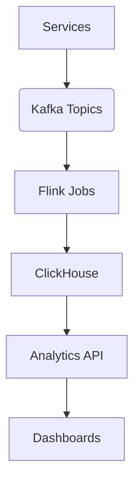

# Low-Level Design: Analytics Service

## 1. 🎯 Overview

This document provides the low-level design for the **Analytics Service**. This service is responsible for ingesting, processing, and analyzing high-volume event streams to generate real-time insights.

### 1.1. Learning Objectives

-   Understand the architecture of a real-time analytics pipeline.
-   Learn how to use Kafka, Flink, and ClickHouse together.
-   Gain experience with stateful stream processing and windowing operations.

---

## 2. 🏗️ Architecture



-   **Kafka**: Acts as the central message bus for all events.
-   **Flink**: Performs real-time stream processing on the event data.
-   **ClickHouse**: Our data warehouse for storing and querying analytical data.
-   **Analytics API**: A FastAPI service that exposes the analytical data to our dashboards.

---

## 3. 🗄️ Database Schema (ClickHouse)

```sql
-- Raw events table
CREATE TABLE events (
    user_id UUID,
    event_type String,
    timestamp DateTime,
    properties String
) ENGINE = MergeTree()
PARTITION BY toYYYYMM(timestamp)
ORDER BY (user_id, event_type, timestamp);

-- Aggregated metrics table
CREATE TABLE hourly_metrics (
    timestamp DateTime,
    metric_name String,
    metric_value Float64,
    dimensions Map(String, String)
) ENGINE = SummingMergeTree()
ORDER BY (metric_name, timestamp, dimensions);
```

---

## 4. 🚀 Flink Jobs

We will have several Flink jobs for different analytical tasks:

-   **Real-time User Activity**: Calculates the number of active users and other engagement metrics in real-time.
-   **Content Engagement**: Tracks how users are interacting with our content.
-   **Revenue Analytics**: Processes commerce events to calculate revenue.
