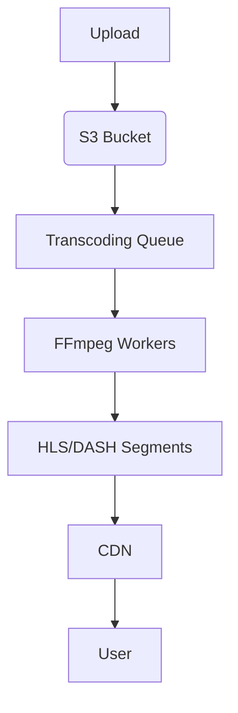

# Low-Level Design: VOD Service

## 1. 🎯 Overview

This document provides the low-level design for the **VOD (Video-on-Demand) Service**. This service is responsible for processing and streaming video content.

### 1.1. Learning Objectives

-   Build a video processing pipeline with FFmpeg.
-   Implement adaptive bitrate streaming with HLS and DASH.
-   Integrate with a CDN for global content delivery.

---

## 2. 🏗️ Architecture

-   **S3 Bucket**: The source of truth for our original video files.
-   **Transcoding Queue**: A message queue (BullMQ) for managing transcoding jobs.
-   **FFmpeg Workers**: A pool of workers that transcode videos into multiple bitrates.
-   **HLS/DASH Segments**: The transcoded video segments are stored in S3.
-   **CDN**: We use a CDN to deliver the video segments to users with low latency.

---

## 3. 🚀 Transcoding Pipeline

Our transcoding pipeline is built with **FFmpeg**.

**Key Steps**:
1.  **Validation**: We validate the uploaded video to ensure it meets our specifications.
2.  **Transcoding**: We transcode the video into multiple bitrates (e.g., 360p, 720p, 1080p).
3.  **Segmentation**: We segment the video into small chunks (e.g., 2 seconds) for HLS and DASH streaming.
4.  **Manifest Generation**: We generate HLS and DASH manifests.

---

## 4. 🔒 DRM

We use **DRM (Digital Rights Management)** to protect our content from piracy. We support both **Widevine** (for Chrome, Firefox, Android) and **FairPlay** (for Safari, iOS).
