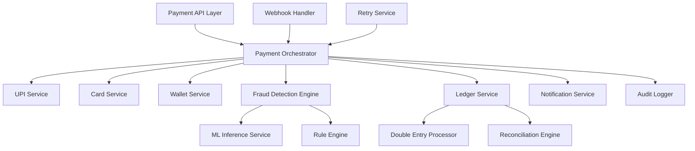

# Low-Level Design: Payment Gateway System

## 1. 🎯 System Overview

This document provides a detailed low-level design for the **Payment Gateway service**. This service is a critical component of the Suuupra platform, responsible for handling all payment-related operations with the highest standards of reliability, security, and performance.

### 1.1. Key Requirements & Goals

-   **Transaction Volume**: Support over 1 million transactions per second (TPS) at peak load.
-   **Availability**: Achieve 99.99% uptime, which translates to less than 5 minutes of downtime per month.
-   **Latency**: Process 99% of transactions in under 500ms.
-   **Compliance**: Adhere to PCI DSS Level 1 and relevant RBI guidelines.
-   **Fraud Detection**: Maintain a false positive rate of less than 0.1%.

### 1.2. Learning Objectives

-   **Financial Systems**: Understand the principles of building a reliable and secure payment system.
-   **Distributed Systems**: Learn how to design a system that is both highly available and strongly consistent.
-   **Go & Concurrency**: Master Go's concurrency patterns for building high-performance services.
-   **Machine Learning**: Apply machine learning for real-time fraud detection.

---

## 2. 🏗️ Component Architecture

### 2.1. Service Components

The Payment Gateway is composed of several internal components, each with a specific responsibility:



-   **Payment Orchestrator**: The central component that coordinates the payment workflow.
-   **UPI/Card/Wallet Services**: Handle the specifics of each payment method.
-   **Fraud Detection Engine**: Assesses the risk of each transaction.
-   **Ledger Service**: Interacts with the double-entry accounting system.

### 2.2. Data Flow Architecture

We use a workflow engine to manage the payment processing pipeline. This allows us to define the steps of the workflow declaratively and to handle failures and retries gracefully.

```go
// A simplified representation of the payment workflow engine.
type PaymentWorkflowEngine struct {
    steps []WorkflowStepHandler
    // ...
}

func (e *PaymentWorkflowEngine) Execute(ctx context.Context, payment *Payment) error {
    // ...
    for _, stepHandler := range e.steps {
        // ...
        err := e.executeStepWithRetry(stepCtx, stepHandler, workflow, &step)
        // ...
    }
    // ...
}
```

---

## 3. 💳 UPI Payment Processing

### 3.1. UPI Integration Architecture

Our UPI integration is designed for high throughput and reliability.

**Key Components**:
-   **NPCI Gateway**: A client for interacting with the NPCI (National Payments Corporation of India) UPI interface.
-   **VPA Validation**: A service for validating Virtual Payment Addresses (VPAs).
-   **Digital Signatures**: We use RSA-SHA256 to sign all requests to the NPCI for security.

### 3.2. UPI Status Reconciliation

To handle cases where we don't receive a callback from the NPCI, we have a reconciliation service that periodically polls the status of pending transactions.

---

## 4. 🔒 Fraud Detection Engine

Our fraud detection engine uses a hybrid approach, combining a machine learning model with a rule-based engine.

### 4.1. ML-Based Fraud Detection

-   **Model**: We use an XGBoost model, which is well-suited for this type of classification task.
-   **Features**: We use a combination of real-time and historical features, such as transaction amount, user location, device fingerprint, and user's transaction history.
-   **Feature Store**: We use Redis as a real-time feature store for low-latency feature retrieval.

### 4.2. Rule Engine

We use a rule engine to catch common fraud patterns that may not be captured by the ML model.

**Example Rules**:
-   **Velocity Rule**: Limits the number of transactions a user can make in a given time window.
-   **Amount Rule**: Flags transactions that are unusually large for a given user.
-   **Geo-Anomaly Rule**: Flags transactions that are made from a location that is far from the user's usual location.

---

## 5. 📊 Double-Entry Ledger System

We use a double-entry ledger system to ensure that all financial transactions are accurately recorded and that our books are always balanced.

### 5.1. Ledger Implementation

-   **ACID Transactions**: All ledger entries are created within a serializable database transaction to ensure atomicity and consistency.
-   **Cryptographic Hashes**: We use SHA-256 to hash each transaction and chain them together, creating a tamper-evident audit trail.

### 5.2. Settlement and Reconciliation

-   **Settlement**: We have a daily batch job that settles funds with our merchants.
-   **Reconciliation**: We have a reconciliation engine that matches our internal transaction records with bank statements to ensure that all transactions have been correctly processed.