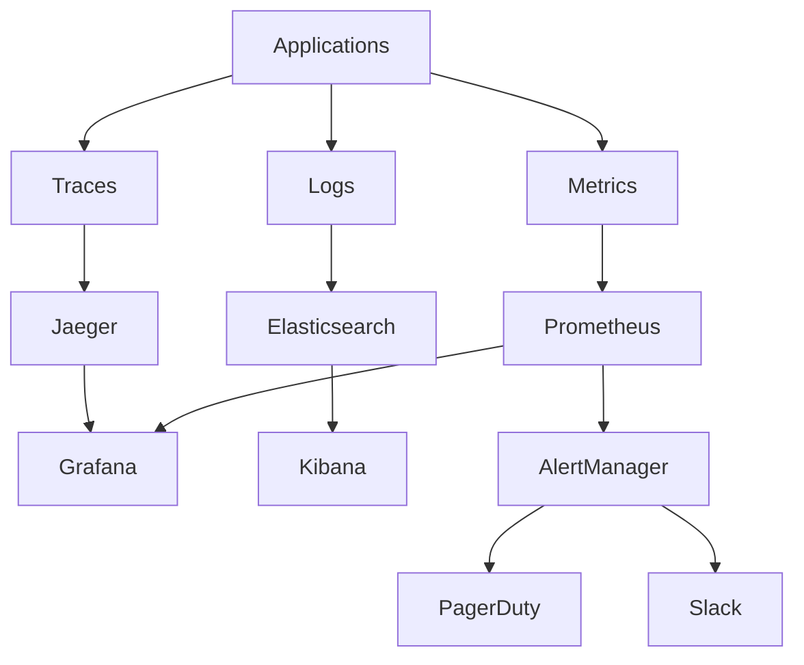

# Monitoring & Observability

## Overview

Comprehensive monitoring and observability stack based on the three pillars: metrics, logs, and traces. Provides deep visibility into system health, performance, and business metrics.

## Architecture



## Metrics (Prometheus + Grafana)

### Prometheus Configuration
```yaml
# prometheus.yml
global:
  scrape_interval: 15s
  evaluation_interval: 15s

rule_files:
  - "alerts/*.yml"

alerting:
  alertmanagers:
    - static_configs:
        - targets:
          - alertmanager:9093

scrape_configs:
  # Kubernetes API Server
  - job_name: 'kubernetes-apiservers'
    kubernetes_sd_configs:
    - role: endpoints
    scheme: https
    tls_config:
      ca_file: /var/run/secrets/kubernetes.io/serviceaccount/ca.crt
    bearer_token_file: /var/run/secrets/kubernetes.io/serviceaccount/token

  # Kubernetes Nodes
  - job_name: 'kubernetes-nodes'
    kubernetes_sd_configs:
    - role: node
    scheme: https
    tls_config:
      ca_file: /var/run/secrets/kubernetes.io/serviceaccount/ca.crt
    bearer_token_file: /var/run/secrets/kubernetes.io/serviceaccount/token

  # Application Pods
  - job_name: 'kubernetes-pods'
    kubernetes_sd_configs:
    - role: pod
    relabel_configs:
    - source_labels: [__meta_kubernetes_pod_annotation_prometheus_io_scrape]
      action: keep
      regex: true
    - source_labels: [__meta_kubernetes_pod_annotation_prometheus_io_path]
      action: replace
      target_label: __metrics_path__
      regex: (.+)
```

### Service Monitor Examples
```yaml
# API Gateway Service Monitor
apiVersion: monitoring.coreos.com/v1
kind: ServiceMonitor
metadata:
  name: api-gateway
  labels:
    app: api-gateway
spec:
  selector:
    matchLabels:
      app: api-gateway
  endpoints:
  - port: metrics
    path: /metrics
    interval: 30s

---
# Identity Service Monitor  
apiVersion: monitoring.coreos.com/v1
kind: ServiceMonitor
metadata:
  name: identity-service
spec:
  selector:
    matchLabels:
      app: identity-service
  endpoints:
  - port: actuator
    path: /actuator/prometheus
    interval: 30s
```

### Key Metrics by Service

#### API Gateway
```yaml
metrics:
  - gateway_requests_total{method, status, route}
  - gateway_request_duration_seconds{method, route}
  - gateway_rate_limit_hits_total{key_type}
  - gateway_circuit_breaker_state{service}
  - gateway_active_connections
```

#### Identity Service
```yaml
metrics:
  - identity_login_attempts_total{status}
  - identity_login_duration_seconds
  - identity_mfa_verifications_total{method, status}
  - identity_token_validations_total{status}
  - identity_sessions_active
```

#### Payment Service
```yaml
metrics:
  - payments_processed_total{status, method}
  - payment_processing_duration_seconds{method}
  - fraud_detections_total{decision}
  - settlement_amount_total{currency}
  - payment_routes_health{route}
```

### Grafana Dashboards

#### System Overview Dashboard
```json
{
  "dashboard": {
    "title": "Suuupra Platform Overview",
    "panels": [
      {
        "title": "Request Rate",
        "type": "graph",
        "targets": [
          {
            "expr": "sum(rate(gateway_requests_total[5m])) by (service)",
            "legendFormat": "{{service}}"
          }
        ]
      },
      {
        "title": "Error Rate",
        "type": "stat",
        "targets": [
          {
            "expr": "sum(rate(gateway_requests_total{status=~\"5..\"}[5m])) / sum(rate(gateway_requests_total[5m])) * 100"
          }
        ],
        "thresholds": [
          {"color": "green", "value": 0},
          {"color": "yellow", "value": 1},
          {"color": "red", "value": 5}
        ]
      },
      {
        "title": "Response Time (P99)",
        "type": "graph",
        "targets": [
          {
            "expr": "histogram_quantile(0.99, sum(rate(gateway_request_duration_seconds_bucket[5m])) by (le, service))",
            "legendFormat": "{{service}} p99"
          }
        ]
      }
    ]
  }
}
```

#### Business Metrics Dashboard
```json
{
  "dashboard": {
    "title": "Business KPIs",
    "panels": [
      {
        "title": "User Registrations",
        "type": "stat",
        "targets": [
          {
            "expr": "increase(identity_registrations_total[1d])"
          }
        ]
      },
      {
        "title": "Payment Volume",
        "type": "graph",
        "targets": [
          {
            "expr": "sum(rate(payments_processed_total{status=\"success\"}[1h])) * 3600"
          }
        ]
      },
      {
        "title": "Content Views",
        "type": "graph",
        "targets": [
          {
            "expr": "sum(rate(content_views_total[5m])) by (content_type)"
          }
        ]
      }
    ]
  }
}
```

## Alerting (AlertManager)

### AlertManager Configuration
```yaml
# alertmanager.yml
global:
  smtp_smarthost: 'smtp.gmail.com:587'
  smtp_from: 'alerts@suuupra.com'

route:
  group_by: ['alertname', 'cluster', 'service']
  group_wait: 10s
  group_interval: 10s
  repeat_interval: 1h
  receiver: 'web.hook'
  routes:
  - match:
      severity: critical
    receiver: pagerduty
  - match:
      severity: warning
    receiver: slack

receivers:
- name: 'web.hook'
  webhook_configs:
  - url: 'http://127.0.0.1:5001/'

- name: 'pagerduty'
  pagerduty_configs:
  - service_key: '<pagerduty-service-key>'
    description: 'Critical alert: {{ .GroupLabels.alertname }}'

- name: 'slack'
  slack_configs:
  - api_url: '<slack-webhook-url>'
    channel: '#alerts'
    title: 'Alert: {{ .GroupLabels.alertname }}'
    text: '{{ range .Alerts }}{{ .Annotations.summary }}{{ end }}'
```

### Alert Rules
```yaml
# alerts/api-gateway.yml
groups:
- name: api-gateway
  rules:
  - alert: HighErrorRate
    expr: sum(rate(gateway_requests_total{status=~"5.."}[5m])) / sum(rate(gateway_requests_total[5m])) > 0.05
    for: 2m
    labels:
      severity: critical
      service: api-gateway
    annotations:
      summary: "High error rate on API Gateway"
      description: "Error rate is {{ $value | humanizePercentage }} for the last 5 minutes"

  - alert: HighLatency
    expr: histogram_quantile(0.95, sum(rate(gateway_request_duration_seconds_bucket[5m])) by (le)) > 0.5
    for: 5m
    labels:
      severity: warning
      service: api-gateway
    annotations:
      summary: "High latency on API Gateway"
      description: "95th percentile latency is {{ $value }}s"

  - alert: CircuitBreakerOpen
    expr: gateway_circuit_breaker_state == 1
    for: 1m
    labels:
      severity: warning
      service: api-gateway
    annotations:
      summary: "Circuit breaker open for {{ $labels.service }}"
      description: "Circuit breaker has been open for {{ $labels.service }}"

# alerts/payments.yml
groups:
- name: payments
  rules:
  - alert: PaymentFailureSpike
    expr: rate(payments_processed_total{status="failed"}[5m]) > 10
    for: 2m
    labels:
      severity: critical
      service: payments
    annotations:
      summary: "Payment failure spike detected"
      description: "Payment failures are {{ $value }} per second"

  - alert: FraudDetectionSpike
    expr: rate(fraud_detections_total{decision="block"}[5m]) > 5
    for: 1m
    labels:
      severity: warning
      service: payments
    annotations:
      summary: "Fraud detection spike"
      description: "Fraud blocks are {{ $value }} per second"
```

## Logging (ELK Stack)

### Elasticsearch Configuration
```yaml
# elasticsearch.yml
cluster.name: suuupra-logs
node.name: es-node-1
network.host: 0.0.0.0
discovery.seed_hosts: ["es-node-2", "es-node-3"]
cluster.initial_master_nodes: ["es-node-1", "es-node-2", "es-node-3"]

# Index templates
index_templates:
  application_logs:
    index_patterns: ["app-logs-*"]
    settings:
      number_of_shards: 3
      number_of_replicas: 1
      index.lifecycle.name: "app-logs-policy"
    mappings:
      properties:
        "@timestamp":
          type: date
        level:
          type: keyword
        service:
          type: keyword
        message:
          type: text
        request_id:
          type: keyword
        user_id:
          type: keyword
        duration_ms:
          type: integer
```

### Logstash Configuration
```yaml
# logstash.conf
input {
  beats {
    port => 5044
  }
}

filter {
  # Parse JSON logs
  if [message] =~ /^\{.*\}$/ {
    json {
      source => "message"
    }
  }
  
  # Add correlation ID if missing
  if ![request_id] {
    uuid {
      target => "request_id"
    }
  }
  
  # Parse duration
  if [duration] {
    mutate {
      convert => { "duration" => "integer" }
    }
  }
  
  # Geoip for client IPs
  if [client_ip] {
    geoip {
      source => "client_ip"
      target => "geoip"
    }
  }
}

output {
  elasticsearch {
    hosts => ["elasticsearch:9200"]
    index => "app-logs-%{+YYYY.MM.dd}"
  }
}
```

### Filebeat Configuration
```yaml
# filebeat.yml
filebeat.inputs:
- type: container
  paths:
    - /var/log/containers/*-api-gateway-*.log
    - /var/log/containers/*-identity-service-*.log
    - /var/log/containers/*-payment-service-*.log
  processors:
  - add_kubernetes_metadata:
      host: ${NODE_NAME}
      matchers:
      - logs_path:
          logs_path: "/var/log/containers/"

output.logstash:
  hosts: ["logstash:5044"]

processors:
- add_host_metadata:
    when.not.contains.tags: forwarded
```

### Kibana Dashboards
```json
{
  "dashboard": {
    "title": "Application Logs",
    "panels": [
      {
        "title": "Log Levels Over Time",
        "type": "histogram",
        "query": {
          "match_all": {}
        },
        "aggs": {
          "log_levels": {
            "terms": {
              "field": "level"
            }
          }
        }
      },
      {
        "title": "Error Logs",
        "type": "data_table",
        "query": {
          "term": {
            "level": "ERROR"
          }
        }
      }
    ]
  }
}
```

## Distributed Tracing (Jaeger)

### Jaeger Configuration
```yaml
# jaeger-collector.yml
apiVersion: apps/v1
kind: Deployment
metadata:
  name: jaeger-collector
spec:
  template:
    spec:
      containers:
      - name: jaeger-collector
        image: jaegertracing/jaeger-collector:1.42
        env:
        - name: SPAN_STORAGE_TYPE
          value: elasticsearch
        - name: ES_SERVER_URLS
          value: http://elasticsearch:9200
        - name: COLLECTOR_ZIPKIN_HOST_PORT
          value: ":9411"
        ports:
        - containerPort: 14269
        - containerPort: 14268
        - containerPort: 9411
```

### OpenTelemetry Configuration
```yaml
# otel-collector.yml
receivers:
  otlp:
    protocols:
      grpc:
        endpoint: 0.0.0.0:4317
      http:
        endpoint: 0.0.0.0:4318

processors:
  batch:
    timeout: 1s
    send_batch_size: 1024
  memory_limiter:
    limit_mib: 512

exporters:
  jaeger:
    endpoint: jaeger-collector:14250
    tls:
      insecure: true
  prometheus:
    endpoint: "0.0.0.0:8889"

service:
  pipelines:
    traces:
      receivers: [otlp]
      processors: [memory_limiter, batch]
      exporters: [jaeger]
    metrics:
      receivers: [otlp]
      processors: [memory_limiter, batch]
      exporters: [prometheus]
```

### Application Instrumentation
```javascript
// Node.js OpenTelemetry setup
const { NodeSDK } = require('@opentelemetry/sdk-node');
const { getNodeAutoInstrumentations } = require('@opentelemetry/auto-instrumentations-node');
const { JaegerExporter } = require('@opentelemetry/exporter-jaeger');

const sdk = new NodeSDK({
  traceExporter: new JaegerExporter({
    endpoint: 'http://jaeger-collector:14268/api/traces',
  }),
  instrumentations: [getNodeAutoInstrumentations()],
  serviceName: 'api-gateway',
  serviceVersion: '1.0.0',
});

sdk.start();
```

```java
// Java OpenTelemetry setup
@Configuration
public class TracingConfiguration {
    
    @Bean
    public OpenTelemetry openTelemetry() {
        return OpenTelemetrySdk.builder()
            .setTracerProvider(
                SdkTracerProvider.builder()
                    .addSpanProcessor(BatchSpanProcessor.builder(
                        JaegerGrpcSpanExporter.builder()
                            .setEndpoint("http://jaeger-collector:14250")
                            .build())
                        .build())
                    .setResource(Resource.getDefault()
                        .merge(Resource.builder()
                            .put(ResourceAttributes.SERVICE_NAME, "identity-service")
                            .put(ResourceAttributes.SERVICE_VERSION, "1.0.0")
                            .build()))
                    .build())
            .build();
    }
}
```

## SLI/SLO Monitoring

### Service Level Indicators (SLIs)
```yaml
slis:
  api_gateway:
    availability:
      query: "sum(rate(gateway_requests_total{status!~'5..'}[5m])) / sum(rate(gateway_requests_total[5m]))"
      threshold: 0.999
    
    latency:
      query: "histogram_quantile(0.95, sum(rate(gateway_request_duration_seconds_bucket[5m])) by (le))"
      threshold: 0.150
    
    error_rate:
      query: "sum(rate(gateway_requests_total{status=~'5..'}[5m])) / sum(rate(gateway_requests_total[5m]))"
      threshold: 0.001

  payments:
    availability:
      query: "sum(rate(payments_processed_total{status='success'}[5m])) / sum(rate(payments_processed_total[5m]))"
      threshold: 0.9995
    
    latency:
      query: "histogram_quantile(0.99, sum(rate(payment_processing_duration_seconds_bucket[5m])) by (le))"
      threshold: 0.500
```

### SLO Alerting
```yaml
# SLO burn rate alerts
groups:
- name: slo-burn-rate
  rules:
  - alert: APIGatewayHighBurnRate
    expr: |
      (
        sum(rate(gateway_requests_total{status=~"5.."}[1m])) / sum(rate(gateway_requests_total[1m])) > 0.02
        and
        sum(rate(gateway_requests_total{status=~"5.."}[5m])) / sum(rate(gateway_requests_total[5m])) > 0.02
      )
    for: 2m
    labels:
      severity: critical
      slo: availability
    annotations:
      summary: "API Gateway SLO burn rate is too high"
      description: "Error budget will be exhausted in {{ $value | humanizeDuration }}"
```

## Cost Monitoring

### Resource Usage Tracking
```yaml
# Kubecost configuration
apiVersion: v1
kind: ConfigMap
metadata:
  name: kubecost-cost-model
data:
  kubecost-cost-model.yaml: |
    prometheus:
      enabled: true
    costModel:
      enabled: true
      pricing:
        provider: "aws"
        region: "us-east-1"
        discount: 0.1  # 10% reserved instance discount
        
    # Custom pricing for special instances
    customPricing:
      enabled: true
      costPerCPUHour: 0.031611
      costPerRAMGBHour: 0.004237
      costPerGPUHour: 0.95
```

### Cost Alerts
```yaml
groups:
- name: cost-alerts
  rules:
  - alert: HighMonthlyCost
    expr: kubecost_cluster_monthly_cost > 10000
    for: 1h
    labels:
      severity: warning
    annotations:
      summary: "Monthly cluster cost exceeds budget"
      description: "Current monthly cost projection: ${{ $value }}"
      
  - alert: UnusedResources
    expr: avg_over_time(kubecost_pod_cpu_utilization[24h]) < 0.1
    for: 6h
    labels:
      severity: info
    annotations:
      summary: "Pod {{ $labels.pod }} has low CPU utilization"
      description: "Average CPU utilization: {{ $value | humanizePercentage }}"
```

## Operations

### Monitoring Health Checks
```bash
# Check Prometheus targets
curl http://prometheus:9090/api/v1/targets

# Check AlertManager status
curl http://alertmanager:9093/api/v1/status

# Check Elasticsearch cluster health
curl http://elasticsearch:9200/_cluster/health

# Check Jaeger health
curl http://jaeger-query:16687/api/health
```

### Troubleshooting Commands
```bash
# Check metric ingestion
promtool query instant 'up'

# Validate alert rules
promtool check rules /etc/prometheus/alerts/*.yml

# Check log ingestion
curl -X GET "elasticsearch:9200/_cat/indices?v"

# Query traces
curl "http://jaeger-query:16686/api/traces?service=api-gateway&limit=10"
```

## Best Practices

### Metric Design
- Use consistent naming conventions (service_operation_unit)
- Include relevant labels but avoid high cardinality
- Set appropriate scrape intervals (15s-1m)
- Use histograms for latency measurements

### Log Structuring
- Use structured JSON logging
- Include correlation IDs for request tracing
- Avoid logging sensitive information
- Set appropriate log levels and sampling

### Alert Design
- Alert on symptoms, not causes
- Use multiple severity levels
- Include runbook links in annotations
- Test alert conditions regularly
