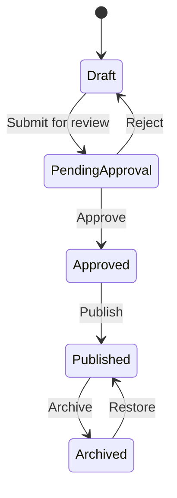

# Content Service

## Overview

Production-grade Content Management Service for CRUD operations, large file uploads, search, versioning, and approval workflows.

## Quick Start

```bash
cd services/content
npm install
make dev

# Health check
curl localhost:8082/health
```

## Core Features

### Content Management
- Create, read, update, delete content
- Soft delete with restore capability
- Content versioning and approval workflow
- Metadata management with flexible schema

### File Upload
- Multipart upload for large files
- Resumable uploads with progress tracking
- Checksum validation
- S3/MinIO integration with CDN

### Search & Discovery
- Elasticsearch full-text search
- Advanced filtering and aggregations
- Real-time indexing via Change Data Capture
- Search result ranking and relevance

### Workflow Management
- Content approval pipeline
- State machine: draft → pending → approved → published
- Version control with semantic versioning
- Audit trail for all changes

## API Endpoints

### Content CRUD
| Method | Path | Purpose |
|--------|------|---------|
| POST | `/api/v1/content` | Create content |
| GET | `/api/v1/content/{id}` | Get content |
| PUT | `/api/v1/content/{id}` | Update content |
| DELETE | `/api/v1/content/{id}` | Soft delete content |
| POST | `/api/v1/content/{id}/restore` | Restore deleted content |

### File Upload
| Method | Path | Purpose |
|--------|------|---------|
| POST | `/api/v1/content/{id}/upload` | Initiate multipart upload |
| POST | `/api/v1/content/{id}/upload/{uploadId}/complete` | Complete upload |
| DELETE | `/api/v1/upload/{uploadId}` | Abort upload |
| GET | `/api/v1/upload/{uploadId}/progress` | Get upload progress |

### Search
| Method | Path | Purpose |
|--------|------|---------|
| GET | `/api/v1/search` | Search content |
| GET | `/api/v1/search/suggest` | Search suggestions |
| GET | `/api/v1/search/filters` | Available filters |

### Workflow
| Method | Path | Purpose |
|--------|------|---------|
| POST | `/api/v1/admin/content/{id}/approve` | Approve content |
| POST | `/api/v1/admin/content/{id}/reject` | Reject content |
| POST | `/api/v1/admin/content/{id}/publish` | Publish content |

## Data Models

### Content Document
```typescript
interface Content {
  id: string;
  title: string;
  description: string;
  contentType: 'article' | 'video' | 'audio' | 'document';
  status: 'draft' | 'pending' | 'approved' | 'published' | 'archived';
  metadata: Record<string, any>;
  files: ContentFile[];
  version: string;
  createdBy: string;
  createdAt: Date;
  updatedAt: Date;
  publishedAt?: Date;
  tags: string[];
  categories: string[];
}
```

### Upload Session
```typescript
interface UploadSession {
  id: string;
  contentId: string;
  filename: string;
  fileSize: number;
  contentType: string;
  checksum: string;
  parts: UploadPart[];
  status: 'initiated' | 'uploading' | 'completed' | 'aborted';
  expiresAt: Date;
}
```

## Configuration

### MongoDB Connection
```yaml
mongodb:
  uri: mongodb://localhost:27017/content
  options:
    maxPoolSize: 10
    serverSelectionTimeoutMS: 5000
```

### Elasticsearch Setup
```yaml
elasticsearch:
  node: http://localhost:9200
  index: content
  settings:
    number_of_shards: 3
    number_of_replicas: 1
```

### S3/MinIO Configuration
```yaml
s3:
  endpoint: http://localhost:9000
  bucket: content-files
  region: us-east-1
  access_key: minioadmin
  secret_key: minioadmin
```

## Search Configuration

### Index Mapping
```json
{
  "mappings": {
    "properties": {
      "title": {
        "type": "text",
        "analyzer": "standard",
        "fields": {
          "keyword": { "type": "keyword" }
        }
      },
      "description": {
        "type": "text",
        "analyzer": "standard"
      },
      "contentType": { "type": "keyword" },
      "status": { "type": "keyword" },
      "tags": { "type": "keyword" },
      "categories": { "type": "keyword" },
      "createdAt": { "type": "date" },
      "publishedAt": { "type": "date" }
    }
  }
}
```

### Search Query Example
```bash
curl "localhost:8082/api/v1/search?q=javascript&contentType=video&status=published&limit=10&sort=relevance"
```

## File Upload Flow

### Initiate Upload
```bash
curl -X POST localhost:8082/api/v1/content/123/upload \
  -H "Content-Type: application/json" \
  -d '{
    "filename": "video.mp4",
    "contentType": "video/mp4",
    "fileSize": 104857600,
    "checksumSha256": "abc123..."
  }'
```

### Upload Parts (Generated signed URLs)
```bash
# Upload each part using signed URLs
curl -X PUT "{signedUrl}" \
  -H "Content-Type: video/mp4" \
  --data-binary @part1.bin
```

### Complete Upload
```bash
curl -X POST localhost:8082/api/v1/content/123/upload/upload-123/complete \
  -H "Content-Type: application/json" \
  -d '{
    "parts": [
      {"partNumber": 1, "etag": "etag1"},
      {"partNumber": 2, "etag": "etag2"}
    ]
  }'
```

## Workflow States



## Monitoring

### Key Metrics
- `content_requests_total` - API request counter
- `content_upload_duration_seconds` - Upload latency
- `content_search_duration_seconds` - Search latency
- `content_elasticsearch_sync_lag_seconds` - CDC sync lag

### Health Endpoints
- `/health` - Service health
- `/metrics` - Prometheus metrics
- `/admin/health` - Admin health with dependencies

## CDC (Change Data Capture)

### MongoDB Change Streams
```javascript
const changeStream = db.collection('content').watch([
  { $match: { operationType: { $in: ['insert', 'update', 'delete'] } } }
]);

changeStream.on('change', async (change) => {
  await elasticsearchSync.processChange(change);
});
```

### Elasticsearch Sync
- Real-time indexing via MongoDB change streams
- Dead letter queue for failed syncs
- Bulk indexing for performance
- Reindex capability for drift recovery

## Security

### Authentication
- JWT token validation
- Role-based access control
- Tenant isolation

### File Security
- Signed URLs for uploads/downloads
- Virus scanning integration
- Content-Type validation
- File size limits

### Input Validation
- JSON schema validation
- HTML sanitization
- XSS prevention
- CSRF protection

## Troubleshooting

| Error | Cause | Solution |
|-------|-------|----------|
| 412 Precondition Failed | ETag mismatch | Fetch latest version |
| 413 Payload Too Large | File size exceeded | Check file size limits |
| 429 Too Many Requests | Rate limit exceeded | Implement backoff |
| 502 Bad Gateway | Elasticsearch down | Check ES cluster health |

## Development

### Local Setup
```bash
# Prerequisites
node >= 18
mongodb >= 6
elasticsearch >= 8
minio

# Start dependencies
make dev-deps

# Install and run
npm install
npm run dev
```

### Testing
```bash
npm test                  # Unit tests
npm run test:integration  # Integration tests
npm run test:load         # Load tests with k6
```

### Database Seeding
```bash
npm run seed              # Seed test data
npm run seed:large        # Seed large dataset for testing
```
