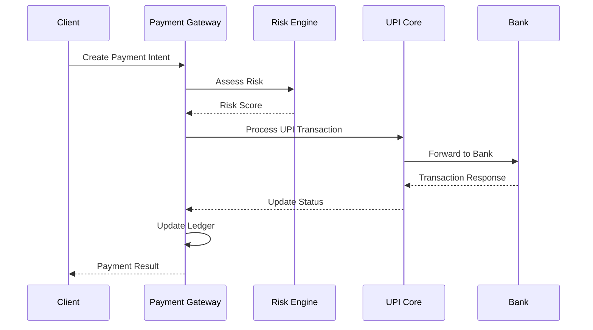

# Payment Gateway Service

## Overview

Production-grade payment orchestration platform providing comprehensive payment processing with UPI transactions, card payments, fraud detection, and financial reconciliation at billion-user scale.

## Quick Start

```bash
cd services/payments
go mod tidy
go run main.go

# Health check
curl localhost:8080/health
```

## Core Features

### Payment Processing
- UPI transactions (P2P, P2M, M2P)
- Card payments with tokenization
- Multi-rail routing for redundancy
- Real-time fraud detection

### Financial Operations
- Event-sourced ledger with double-entry accounting
- Settlement processing and reconciliation
- Refunds and reversals
- Escrow and hold management

### Advanced Features
- Device linking and trust scoring
- Tokenized payment handles
- Multi-user types (UPI MAX, UPI MINI)
- Delegated payment authorization

## API Endpoints

### Payment Intents
| Method | Path | Purpose |
|--------|------|---------|
| POST | `/api/v1/intents` | Create payment intent |
| GET | `/api/v1/intents/{id}` | Get payment intent |
| POST | `/api/v1/intents/{id}/confirm` | Confirm payment intent |
| POST | `/api/v1/intents/{id}/cancel` | Cancel payment intent |

### Payment Processing
| Method | Path | Purpose |
|--------|------|---------|
| POST | `/api/v1/payments` | Process payment |
| GET | `/api/v1/payments/{id}` | Get payment status |
| POST | `/api/v1/payments/{id}/capture` | Capture authorized payment |
| POST | `/api/v1/payments/{id}/cancel` | Cancel payment |

### Refunds & Reversals
| Method | Path | Purpose |
|--------|------|---------|
| POST | `/api/v1/refunds` | Create refund |
| GET | `/api/v1/refunds/{id}` | Get refund status |
| POST | `/api/v1/payments/{id}/reverse` | Reverse payment |

### Risk Assessment
| Method | Path | Purpose |
|--------|------|---------|
| POST | `/api/v1/risk/assess` | Assess transaction risk |
| POST | `/api/v1/devices/link` | Link trusted device |
| GET | `/api/v1/devices/{id}` | Get device info |

### Settlement
| Method | Path | Purpose |
|--------|------|---------|
| GET | `/api/v1/settlements/schedule` | Get settlement schedule |
| POST | `/api/v1/statements/generate` | Generate statement |
| GET | `/api/v1/settlements/{id}` | Get settlement details |

## Data Models

### Payment Intent
```go
type PaymentIntent struct {
    ID              string            `json:"id"`
    Amount          int64            `json:"amount"`
    Currency        string           `json:"currency"`
    PaymentMethods  []string         `json:"payment_methods"`
    Customer        Customer         `json:"customer"`
    Merchant        Merchant         `json:"merchant"`
    Status          PaymentStatus    `json:"status"`
    ClientSecret    string           `json:"client_secret"`
    CreatedAt       time.Time        `json:"created_at"`
    ExpiresAt       time.Time        `json:"expires_at"`
}
```

### Payment Event
```go
type PaymentEvent struct {
    ID           string                 `json:"id"`
    AggregateID  string                 `json:"aggregate_id"`
    EventType    string                 `json:"event_type"`
    Version      int64                  `json:"version"`
    Timestamp    time.Time              `json:"timestamp"`
    Data         map[string]interface{} `json:"data"`
    Metadata     EventMetadata          `json:"metadata"`
}
```

### Risk Assessment
```go
type RiskAssessment struct {
    TransactionID  string      `json:"transaction_id"`
    RiskScore      int         `json:"risk_score"`
    RiskLevel      string      `json:"risk_level"`
    Decision       string      `json:"decision"`
    Factors        []RiskFactor `json:"factors"`
    DeviceTrust    DeviceTrust `json:"device_trust"`
}
```

## Event-Sourced Ledger

### Event Store Schema
```sql
CREATE TABLE payment_events (
    id UUID PRIMARY KEY DEFAULT gen_random_uuid(),
    aggregate_id UUID NOT NULL,
    event_type VARCHAR(100) NOT NULL,
    version BIGINT NOT NULL,
    timestamp TIMESTAMPTZ DEFAULT NOW(),
    data JSONB NOT NULL,
    metadata JSONB,
    UNIQUE(aggregate_id, version)
);

CREATE TABLE ledger_entries (
    id UUID PRIMARY KEY DEFAULT gen_random_uuid(),
    transaction_id UUID NOT NULL,
    account_id UUID NOT NULL,
    amount_cents BIGINT NOT NULL,
    currency VARCHAR(3) NOT NULL,
    entry_type VARCHAR(10) NOT NULL, -- DEBIT, CREDIT
    balance_after BIGINT NOT NULL,
    created_at TIMESTAMPTZ DEFAULT NOW()
);
```

### Double-Entry Accounting
```go
type LedgerEntry struct {
    ID            string    `json:"id"`
    TransactionID string    `json:"transaction_id"`
    AccountID     string    `json:"account_id"`
    Amount        int64     `json:"amount"`
    EntryType     string    `json:"entry_type"` // DEBIT, CREDIT
    BalanceAfter  int64     `json:"balance_after"`
    CreatedAt     time.Time `json:"created_at"`
}

func (l *Ledger) RecordTransaction(txn Transaction) error {
    // Double-entry: every transaction has equal debits and credits
    debitEntry := LedgerEntry{
        TransactionID: txn.ID,
        AccountID:     txn.FromAccount,
        Amount:        -txn.Amount, // Negative for debit
        EntryType:     "DEBIT",
    }
    
    creditEntry := LedgerEntry{
        TransactionID: txn.ID,
        AccountID:     txn.ToAccount,
        Amount:        txn.Amount, // Positive for credit
        EntryType:     "CREDIT",
    }
    
    return l.atomicWrite([]LedgerEntry{debitEntry, creditEntry})
}
```

## Payment Processing Flow

### UPI Payment Flow


### Fraud Detection
```go
type FraudDetector struct {
    rules []FraudRule
    ml    MLModel
}

func (fd *FraudDetector) Assess(payment Payment) RiskAssessment {
    score := 0
    factors := []RiskFactor{}
    
    // Rule-based checks
    for _, rule := range fd.rules {
        if rule.Matches(payment) {
            score += rule.Score
            factors = append(factors, rule.Factor)
        }
    }
    
    // ML-based scoring
    mlScore := fd.ml.Predict(payment.Features())
    score += int(mlScore * 100)
    
    return RiskAssessment{
        RiskScore: score,
        RiskLevel: fd.scoreToLevel(score),
        Decision:  fd.scoreToDecision(score),
        Factors:   factors,
    }
}
```

## Multi-Rail Routing

### Route Selection
```go
type RouteSelector struct {
    routes []PaymentRoute
}

func (rs *RouteSelector) SelectRoute(payment Payment) PaymentRoute {
    availableRoutes := rs.filterByHealth(rs.routes)
    
    switch payment.Priority {
    case "cost":
        return rs.selectLowestCost(availableRoutes)
    case "speed":
        return rs.selectFastest(availableRoutes)
    case "reliability":
        return rs.selectMostReliable(availableRoutes)
    default:
        return rs.selectBalanced(availableRoutes)
    }
}
```

### Circuit Breaker
```go
type CircuitBreaker struct {
    state         State
    failures      int
    threshold     int
    timeout       time.Duration
    lastFailure   time.Time
}

func (cb *CircuitBreaker) Call(fn func() error) error {
    if cb.state == Open {
        if time.Since(cb.lastFailure) > cb.timeout {
            cb.state = HalfOpen
        } else {
            return ErrCircuitOpen
        }
    }
    
    err := fn()
    if err != nil {
        cb.failures++
        cb.lastFailure = time.Now()
        
        if cb.failures >= cb.threshold {
            cb.state = Open
        }
        return err
    }
    
    cb.failures = 0
    cb.state = Closed
    return nil
}
```

## Configuration

### Service Configuration
```yaml
server:
  port: 8080
  timeout: 30s

database:
  postgres:
    host: localhost
    port: 5432
    database: payments
    max_connections: 20

redis:
  host: localhost
  port: 6379
  pool_size: 10

fraud_detection:
  enabled: true
  ml_model_path: "/models/fraud_detection.pkl"
  risk_threshold: 75
  
payment_routes:
  - name: "upi_hdfc"
    provider: "hdfc_bank"
    priority: 1
    max_amount: 200000
    fee_percent: 0.5
  - name: "upi_icici"
    provider: "icici_bank"
    priority: 2
    max_amount: 100000
    fee_percent: 0.6
```

### Rate Limiting
```yaml
rate_limits:
  global:
    requests_per_second: 1000
    burst: 2000
  
  per_merchant:
    requests_per_minute: 100
    burst: 200
    
  per_user:
    transactions_per_day: 50
    amount_per_day: 100000
```

## Security

### PCI DSS Compliance
- Level 1 PCI DSS certification
- Card data tokenization (no raw PAN storage)
- HSM integration for key management
- Network segmentation and monitoring

### Encryption
```go
// Field-level encryption for sensitive data
type EncryptedField struct {
    Value     string `json:"value"`
    KeyID     string `json:"key_id"`
    Algorithm string `json:"algorithm"`
}

func (e *Encryptor) EncryptPAN(pan string) EncryptedField {
    key := e.keyManager.GetKey("card_encryption")
    encrypted := e.aesGCM.Encrypt([]byte(pan), key)
    
    return EncryptedField{
        Value:     base64.StdEncoding.EncodeToString(encrypted),
        KeyID:     key.ID,
        Algorithm: "AES-256-GCM",
    }
}
```

### API Security
- JWT authentication with short-lived tokens
- Request signing with HMAC-SHA256
- IP whitelisting for merchant endpoints
- Rate limiting and DDoS protection

## Monitoring

### Key Metrics
- `payments_processed_total` - Payment counter by status/method
- `payment_processing_duration_seconds` - Payment latency
- `fraud_detections_total` - Fraud detection counter
- `settlement_amount_total` - Settlement amounts
- `circuit_breaker_state` - Circuit breaker status

### SLA Targets
- **Availability**: 99.99% uptime
- **Success Rate**: ≥99.9% p50, ≥99.5% p95
- **Latency**: p50 ≤300ms, p95 ≤800ms
- **Throughput**: 10,000+ TPS

### Alerting Rules
```yaml
groups:
- name: payments
  rules:
  - alert: HighPaymentFailureRate
    expr: rate(payments_processed_total{status="failed"}[5m]) / rate(payments_processed_total[5m]) > 0.01
    for: 2m
    
  - alert: PaymentLatencyHigh
    expr: histogram_quantile(0.95, rate(payment_processing_duration_seconds_bucket[5m])) > 0.8
    for: 5m
    
  - alert: FraudDetectionSpike
    expr: rate(fraud_detections_total[5m]) > 10
    for: 1m
```

## Operations

### Settlement Process
```bash
# Daily settlement
curl -X POST localhost:8080/api/v1/settlements \
  -H "Content-Type: application/json" \
  -d '{
    "date": "2025-01-15",
    "type": "daily",
    "merchants": ["all"]
  }'

# Generate statements
curl -X POST localhost:8080/api/v1/statements/generate \
  -H "Content-Type: application/json" \
  -d '{
    "merchant_id": "merchant_123",
    "start_date": "2025-01-01",
    "end_date": "2025-01-15",
    "format": "pdf"
  }'
```

### Reconciliation
```go
func (r *Reconciler) DailyReconciliation(date time.Time) error {
    // Get internal transaction records
    internal := r.getInternalTransactions(date)
    
    // Get bank settlement files
    external := r.getBankSettlements(date)
    
    // Compare and identify discrepancies
    discrepancies := r.compare(internal, external)
    
    if len(discrepancies) > 0 {
        return r.handleDiscrepancies(discrepancies)
    }
    
    return nil
}
```

## Troubleshooting

| Error | Cause | Solution |
|-------|-------|----------|
| Payment timeout | Slow upstream response | Check bank/UPI service health |
| Fraud blocked | High risk score | Review transaction details and risk factors |
| Insufficient funds | Account balance low | Verify account status with bank |
| Route unavailable | All circuits open | Check payment route health |
| Settlement mismatch | Data inconsistency | Run reconciliation process |

## Development

### Local Setup
```bash
# Prerequisites
go >= 1.21
postgresql >= 15
redis >= 7

# Clone and setup
git clone <repo>
cd services/payments

# Dependencies
go mod tidy

# Database migration
make db-migrate

# Start service
make dev
```

### Testing
```bash
go test ./...                    # Unit tests
make test-integration           # Integration tests
make test-load                  # Load tests with k6
make test-security              # Security tests
```

### Mock Services
```bash
# Start mock bank services
make mock-banks

# Start fraud detection simulator
make mock-fraud-engine

# Run end-to-end tests
make test-e2e
```
