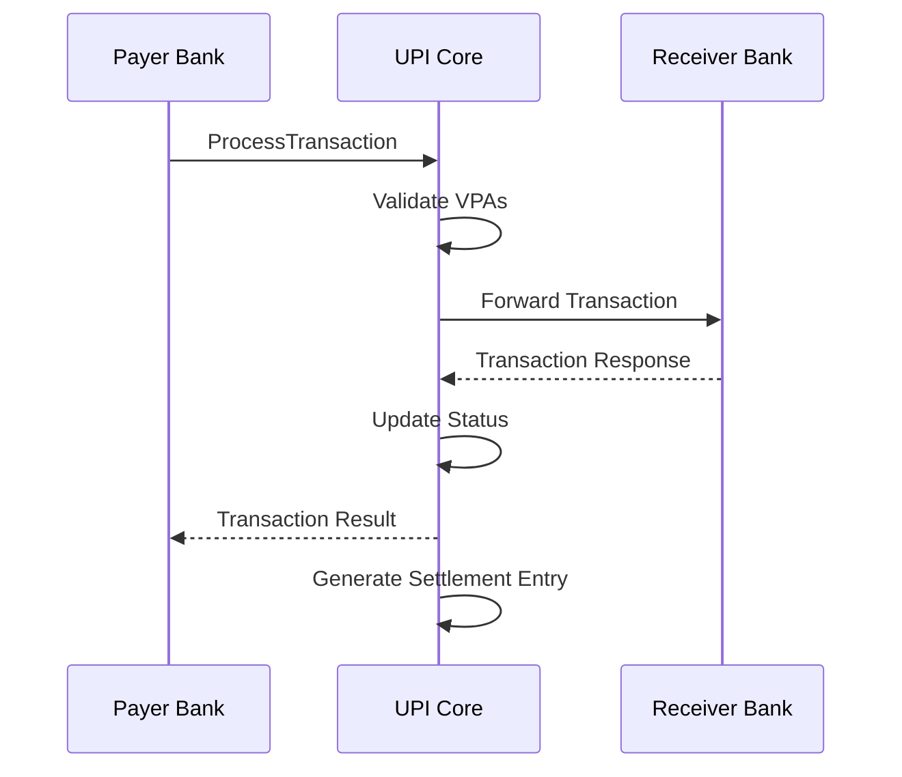

# UPI Core Service

## Overview

Production-ready Go-based UPI switch handling transaction routing, VPA management, bank operations, and settlement processing with both gRPC and REST APIs.

## Quick Start

```bash
cd services/upi-core
go mod tidy
go run main.go

# Health check
curl localhost:8081/health
```

## Core Features

### Transaction Processing
- P2P, P2M, M2P, and refund transactions
- Real-time transaction routing
- Bank-to-bank communication
- Transaction status tracking and history

### VPA Management
- VPA registration and resolution
- Account mapping and validation
- Multi-bank VPA support
- VPA lifecycle management

### Bank Operations
- Bank registration and configuration
- Health monitoring and status tracking
- Feature support management
- Performance metrics collection

### Settlement Processing
- Batch settlement initiation
- Multi-bank settlement coordination
- Settlement status tracking
- Reconciliation support

## gRPC Service Interface

### Transaction APIs
```protobuf
service UpiCore {
  rpc ProcessTransaction(TransactionRequest) returns (TransactionResponse);
  rpc GetTransactionStatus(TransactionStatusRequest) returns (TransactionStatusResponse);
  rpc CancelTransaction(CancelTransactionRequest) returns (CancelTransactionResponse);
  rpc ReverseTransaction(ReverseTransactionRequest) returns (ReverseTransactionResponse);
}
```

### VPA Management APIs
```protobuf
service UpiCore {
  rpc ResolveVPA(ResolveVPARequest) returns (ResolveVPAResponse);
  rpc RegisterVPA(RegisterVPARequest) returns (RegisterVPAResponse);
  rpc UpdateVPA(UpdateVPARequest) returns (UpdateVPAResponse);
  rpc DeactivateVPA(DeactivateVPARequest) returns (DeactivateVPAResponse);
}
```

### Bank Operations APIs
```protobuf
service UpiCore {
  rpc RegisterBank(RegisterBankRequest) returns (RegisterBankResponse);
  rpc GetBankStatus(BankStatusRequest) returns (BankStatusResponse);
  rpc ListBanks(ListBanksRequest) returns (ListBanksResponse);
  rpc UpdateBankConfig(UpdateBankConfigRequest) returns (UpdateBankConfigResponse);
}
```

## REST API Endpoints

### Transaction Processing
| Method | Path | Purpose |
|--------|------|---------|
| POST | `/upi/transactions` | Process UPI transaction |
| GET | `/upi/transactions/{id}` | Get transaction status |
| POST | `/upi/transactions/{id}/cancel` | Cancel transaction |
| POST | `/upi/transactions/{id}/reverse` | Reverse transaction |

### VPA Operations
| Method | Path | Purpose |
|--------|------|---------|
| POST | `/upi/vpa/resolve` | Resolve VPA to account |
| POST | `/upi/vpa/register` | Register new VPA |
| PUT | `/upi/vpa/{vpa}` | Update VPA details |
| DELETE | `/upi/vpa/{vpa}` | Deactivate VPA |

### Bank Management
| Method | Path | Purpose |
|--------|------|---------|
| GET | `/upi/banks` | List all banks |
| GET | `/upi/banks/{code}` | Get bank details |
| GET | `/upi/banks/{code}/health` | Get bank health |
| POST | `/upi/banks/{code}/config` | Update bank config |

### Settlement
| Method | Path | Purpose |
|--------|------|---------|
| POST | `/upi/settlements` | Initiate settlement |
| GET | `/upi/settlements/{id}` | Get settlement status |
| GET | `/upi/settlements/{id}/report` | Get settlement report |

## Data Models

### Transaction
```go
type Transaction struct {
    ID              string            `json:"id"`
    PayerVPA        string           `json:"payer_vpa"`
    PayeeVPA        string           `json:"payee_vpa"`
    Amount          int64            `json:"amount"`
    Currency        string           `json:"currency"`
    Type            TransactionType  `json:"type"`
    Status          TransactionStatus `json:"status"`
    Reference       string           `json:"reference"`
    PayerBankCode   string           `json:"payer_bank_code"`
    PayeeBankCode   string           `json:"payee_bank_code"`
    RRN             string           `json:"rrn"`
    CreatedAt       time.Time        `json:"created_at"`
    ProcessedAt     *time.Time       `json:"processed_at"`
}
```

### VPA Mapping
```go
type VPAMapping struct {
    VPA             string    `json:"vpa"`
    BankCode        string    `json:"bank_code"`
    AccountNumber   string    `json:"account_number"`
    AccountHolder   string    `json:"account_holder"`
    MobileNumber    string    `json:"mobile_number"`
    IsActive        bool      `json:"is_active"`
    IsPrimary       bool      `json:"is_primary"`
    CreatedAt       time.Time `json:"created_at"`
    UpdatedAt       time.Time `json:"updated_at"`
}
```

### Bank Configuration
```go
type BankConfig struct {
    BankCode         string            `json:"bank_code"`
    BankName         string            `json:"bank_name"`
    IFSCPrefix       string            `json:"ifsc_prefix"`
    EndpointURL      string            `json:"endpoint_url"`
    PublicKey        string            `json:"public_key"`
    SupportedFeatures []string         `json:"supported_features"`
    Status           BankStatus        `json:"status"`
    Configuration    map[string]string `json:"configuration"`
    CreatedAt        time.Time         `json:"created_at"`
    UpdatedAt        time.Time         `json:"updated_at"`
}
```

## Database Schema

```sql
-- Transactions
CREATE TABLE transactions (
    id UUID PRIMARY KEY DEFAULT gen_random_uuid(),
    transaction_id VARCHAR(50) UNIQUE NOT NULL,
    payer_vpa VARCHAR(255) NOT NULL,
    payee_vpa VARCHAR(255) NOT NULL,
    amount_paisa BIGINT NOT NULL,
    currency VARCHAR(3) DEFAULT 'INR',
    type VARCHAR(20) NOT NULL,
    status VARCHAR(20) DEFAULT 'PENDING',
    reference VARCHAR(255),
    payer_bank_code VARCHAR(10) NOT NULL,
    payee_bank_code VARCHAR(10) NOT NULL,
    rrn VARCHAR(20) UNIQUE,
    digital_signature TEXT,
    created_at TIMESTAMPTZ DEFAULT NOW(),
    processed_at TIMESTAMPTZ,
    INDEX idx_transaction_id (transaction_id),
    INDEX idx_payer_vpa (payer_vpa),
    INDEX idx_payee_vpa (payee_vpa),
    INDEX idx_status (status),
    INDEX idx_created_at (created_at)
);

-- VPA Mappings
CREATE TABLE vpa_mappings (
    id UUID PRIMARY KEY DEFAULT gen_random_uuid(),
    vpa VARCHAR(255) UNIQUE NOT NULL,
    bank_code VARCHAR(10) NOT NULL,
    account_number VARCHAR(50) NOT NULL,
    account_holder_name VARCHAR(255) NOT NULL,
    mobile_number VARCHAR(15),
    is_active BOOLEAN DEFAULT TRUE,
    is_primary BOOLEAN DEFAULT FALSE,
    created_at TIMESTAMPTZ DEFAULT NOW(),
    updated_at TIMESTAMPTZ DEFAULT NOW(),
    INDEX idx_vpa (vpa),
    INDEX idx_bank_code (bank_code),
    INDEX idx_account_number (account_number)
);

-- Banks
CREATE TABLE banks (
    id UUID PRIMARY KEY DEFAULT gen_random_uuid(),
    bank_code VARCHAR(10) UNIQUE NOT NULL,
    bank_name VARCHAR(255) NOT NULL,
    ifsc_prefix VARCHAR(4) NOT NULL,
    endpoint_url VARCHAR(500) NOT NULL,
    public_key TEXT NOT NULL,
    supported_features JSON,
    status VARCHAR(20) DEFAULT 'ACTIVE',
    configuration JSON,
    created_at TIMESTAMPTZ DEFAULT NOW(),
    updated_at TIMESTAMPTZ DEFAULT NOW()
);

-- Settlements
CREATE TABLE settlements (
    id UUID PRIMARY KEY DEFAULT gen_random_uuid(),
    settlement_id VARCHAR(50) UNIQUE NOT NULL,
    batch_id VARCHAR(50) NOT NULL,
    bank_codes JSON NOT NULL,
    settlement_date DATE NOT NULL,
    type VARCHAR(20) NOT NULL,
    status VARCHAR(20) DEFAULT 'PENDING',
    total_amount_paisa BIGINT DEFAULT 0,
    transaction_count INTEGER DEFAULT 0,
    initiated_at TIMESTAMPTZ DEFAULT NOW(),
    completed_at TIMESTAMPTZ,
    INDEX idx_settlement_id (settlement_id),
    INDEX idx_batch_id (batch_id),
    INDEX idx_settlement_date (settlement_date)
);
```

## Transaction Processing Flow

### UPI Transaction Flow


### Transaction State Machine
```go
type TransactionStateMachine struct {
    currentState TransactionStatus
}

func (tsm *TransactionStateMachine) Transition(event TransactionEvent) error {
    switch tsm.currentState {
    case StatusPending:
        switch event {
        case EventValidated:
            tsm.currentState = StatusProcessing
        case EventRejected:
            tsm.currentState = StatusFailed
        }
    case StatusProcessing:
        switch event {
        case EventCompleted:
            tsm.currentState = StatusSuccess
        case EventFailed:
            tsm.currentState = StatusFailed
        case EventTimeout:
            tsm.currentState = StatusTimeout
        }
    }
    return nil
}
```

## VPA Resolution

### VPA Validation
```go
func (v *VPAService) ResolveVPA(vpa string) (*VPAMapping, error) {
    // Validate VPA format
    if !v.isValidVPAFormat(vpa) {
        return nil, ErrInvalidVPAFormat
    }
    
    // Check cache first
    if cached := v.cache.Get(vpa); cached != nil {
        return cached.(*VPAMapping), nil
    }
    
    // Query database
    mapping, err := v.repo.GetVPAMapping(vpa)
    if err != nil {
        return nil, err
    }
    
    if !mapping.IsActive {
        return nil, ErrVPAInactive
    }
    
    // Cache the result
    v.cache.Set(vpa, mapping, 5*time.Minute)
    
    return mapping, nil
}
```

### VPA Registration
```go
func (v *VPAService) RegisterVPA(req RegisterVPARequest) error {
    // Validate request
    if err := v.validateVPARequest(req); err != nil {
        return err
    }
    
    // Check if VPA already exists
    if exists := v.vpaExists(req.VPA); exists {
        return ErrVPAAlreadyExists
    }
    
    // Verify account with bank
    if err := v.verifyAccountWithBank(req); err != nil {
        return err
    }
    
    // Create mapping
    mapping := &VPAMapping{
        VPA:             req.VPA,
        BankCode:        req.BankCode,
        AccountNumber:   req.AccountNumber,
        AccountHolder:   req.AccountHolder,
        MobileNumber:    req.MobileNumber,
        IsActive:        true,
        IsPrimary:       req.IsPrimary,
    }
    
    return v.repo.CreateVPAMapping(mapping)
}
```

## Bank Integration

### Bank Health Monitoring
```go
type BankHealthMonitor struct {
    banks   map[string]*BankConfig
    metrics map[string]*BankMetrics
    client  HTTPClient
}

func (bhm *BankHealthMonitor) CheckBankHealth(bankCode string) BankHealthStatus {
    bank := bhm.banks[bankCode]
    
    start := time.Now()
    resp, err := bhm.client.Get(bank.EndpointURL + "/health")
    latency := time.Since(start)
    
    metrics := bhm.metrics[bankCode]
    metrics.UpdateLatency(latency)
    
    if err != nil || resp.StatusCode != 200 {
        metrics.RecordFailure()
        return BankHealthStatus{
            Status:        "unhealthy",
            LastError:     err.Error(),
            ResponseTime:  latency,
        }
    }
    
    metrics.RecordSuccess()
    return BankHealthStatus{
        Status:       "healthy",
        ResponseTime: latency,
        SuccessRate:  metrics.SuccessRate(),
    }
}
```

### Circuit Breaker Implementation
```go
type BankCircuitBreaker struct {
    state       CircuitState
    failures    int
    threshold   int
    timeout     time.Duration
    lastFailure time.Time
}

func (cb *BankCircuitBreaker) Call(bankCode string, fn func() error) error {
    if cb.state == StateOpen {
        if time.Since(cb.lastFailure) > cb.timeout {
            cb.state = StateHalfOpen
        } else {
            return ErrCircuitOpen
        }
    }
    
    err := fn()
    if err != nil {
        cb.recordFailure()
        return err
    }
    
    cb.recordSuccess()
    return nil
}
```

## Settlement Processing

### Daily Settlement
```go
func (s *SettlementService) InitiateDailySettlement(date time.Time) error {
    // Get all transactions for the date
    transactions, err := s.getTransactionsForDate(date)
    if err != nil {
        return err
    }
    
    // Group by bank pairs
    bankPairs := s.groupByBankPairs(transactions)
    
    // Create settlement batches
    for pair, txns := range bankPairs {
        batch := s.createSettlementBatch(pair, txns, date)
        if err := s.processSettlementBatch(batch); err != nil {
            log.Errorf("Failed to process settlement batch: %v", err)
            continue
        }
    }
    
    return nil
}
```

### Net Settlement Calculation
```go
func (s *SettlementService) calculateNetSettlement(transactions []Transaction) NetSettlement {
    bankBalances := make(map[string]int64)
    
    for _, txn := range transactions {
        // Debit from payer bank
        bankBalances[txn.PayerBankCode] -= txn.Amount
        // Credit to payee bank
        bankBalances[txn.PayeeBankCode] += txn.Amount
    }
    
    return NetSettlement{
        BankBalances: bankBalances,
        TotalAmount:  s.calculateTotalAmount(bankBalances),
        TxnCount:     len(transactions),
    }
}
```

## Configuration

### Service Configuration
```yaml
server:
  grpc_port: 50051
  http_port: 8081
  timeout: 30s

database:
  postgres:
    host: localhost
    port: 5432
    database: upi_core
    max_connections: 50

redis:
  host: localhost
  port: 6379
  db: 0
  pool_size: 20

banks:
  health_check_interval: 30s
  circuit_breaker:
    failure_threshold: 5
    timeout: 60s
    
settlement:
  batch_size: 1000
  processing_window: "18:00-06:00"
  retry_attempts: 3
```

### Bank Configuration
```yaml
supported_banks:
  - code: "HDFC"
    name: "HDFC Bank"
    ifsc_prefix: "HDFC"
    endpoint: "https://api.hdfcbank.com/upi"
    features: ["UPI", "IMPS", "NEFT", "RTGS"]
    
  - code: "SBI"
    name: "State Bank of India"
    ifsc_prefix: "SBIN"
    endpoint: "https://api.sbi.co.in/upi"
    features: ["UPI", "IMPS", "NEFT", "RTGS"]
```

## Monitoring

### Key Metrics
- `upi_transactions_total` - Transaction counter by status/type
- `upi_transaction_duration_seconds` - Processing latency
- `upi_vpa_resolutions_total` - VPA resolution attempts
- `upi_bank_health_score` - Bank health status
- `upi_settlement_amount_total` - Settlement amounts

### Performance Targets
- **Availability**: 99.99% uptime
- **Latency**: p50 ≤150ms, p95 ≤300ms, p99 ≤500ms
- **Throughput**: 10,000 TPS sustained
- **Success Rate**: ≥99.95%

### Health Checks
```go
func (h *HealthChecker) CheckHealth() HealthStatus {
    status := HealthStatus{
        Status:    "UP",
        Timestamp: time.Now(),
        Checks:    make(map[string]interface{}),
    }
    
    // Database connectivity
    if err := h.db.Ping(); err != nil {
        status.Status = "DOWN"
        status.Checks["database"] = map[string]interface{}{
            "status": "DOWN",
            "error":  err.Error(),
        }
    } else {
        status.Checks["database"] = map[string]interface{}{
            "status": "UP",
        }
    }
    
    // Redis connectivity
    if err := h.redis.Ping(); err != nil {
        status.Status = "DOWN"
        status.Checks["redis"] = map[string]interface{}{
            "status": "DOWN",
            "error":  err.Error(),
        }
    } else {
        status.Checks["redis"] = map[string]interface{}{
            "status": "UP",
        }
    }
    
    return status
}
```

## Security

### Authentication & Authorization
- mTLS for gRPC communication
- JWT tokens for REST API access
- Digital signature verification for transactions
- Role-based access control

### Data Protection
- Field-level encryption for sensitive data
- PII masking in logs and responses
- Audit logging with integrity checks
- Secure key management

## Development

### Local Setup
```bash
# Prerequisites
go >= 1.21
postgresql >= 15
redis >= 7

# Setup
git clone <repo>
cd services/upi-core
go mod tidy

# Database
make db-setup
make db-migrate

# Start service
make dev
```

### Testing
```bash
make test                    # Unit tests
make test-integration        # Integration tests
make test-load              # Load tests
make test-banks             # Bank integration tests
```

### Mock Services
```bash
# Start mock banks
make mock-banks

# Run end-to-end tests
make test-e2e
```

## Troubleshooting

| Error | Cause | Solution |
|-------|-------|----------|
| VPA resolution failed | Invalid VPA or bank down | Check VPA format and bank status |
| Transaction timeout | Slow bank response | Check bank health and circuit breaker |
| Settlement mismatch | Data inconsistency | Run reconciliation process |
| High latency | Database performance | Check connection pool and queries |
