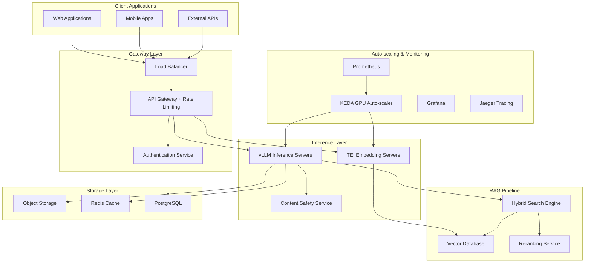

# Industry-Grade LLM Serving Infrastructure Technical Architecture

## Executive Summary

This document provides comprehensive technical specifications for deploying an industry-grade Large Language Model (LLM) serving infrastructure capable of handling GPT-OSS models (20B and 120B variants) with enterprise-level performance, security, and cost optimization. The architecture encompasses vLLM deployment, HuggingFace Text Embeddings Inference (TEI), vector database selection, RAG implementation, safety systems, and auto-scaling strategies.

## Architecture Overview



## 1. vLLM Deployment Architecture

### 1.1 Model Specifications and Requirements

#### GPT-OSS-20B Configuration
- **GPU Requirements**: Single 16GB GPU (RTX 4090, A100-16GB, or equivalent)
- **Memory**: 32GB system RAM minimum
- **Storage**: 50GB NVMe SSD for model weights
- **Target Performance**: 5,000+ tokens/second
- **Use Cases**: Real-time chat, code completion, lightweight reasoning

#### GPT-OSS-120B Configuration
- **GPU Requirements**: Single 80GB GPU (H100, A100-80GB) or 2x H100 with tensor parallelism
- **Memory**: 128GB system RAM minimum
- **Storage**: 250GB NVMe SSD for model weights
- **Target Performance**: 2,000+ tokens/second
- **Use Cases**: Complex reasoning, content generation, advanced RAG

### 1.2 Docker Configuration

#### Base Docker Setup
```dockerfile
# vLLM Production Dockerfile
FROM vllm/vllm-openai:v1.8

# Set environment variables
ENV CUDA_VISIBLE_DEVICES=0,1
ENV VLLM_TENSOR_PARALLEL_SIZE=2
ENV VLLM_PIPELINE_PARALLEL_SIZE=1
ENV VLLM_MAX_MODEL_LEN=32768
ENV VLLM_TRUST_REMOTE_CODE=true

# Health check configuration
HEALTHCHECK --interval=30s --timeout=10s --start-period=5m --retries=3 \
    CMD curl -f http://localhost:8000/v1/models || exit 1

# Expose ports
EXPOSE 8000

# Start command with optimized settings
CMD ["vllm", "serve", "openai/gpt-oss-120b", \
     "--host", "0.0.0.0", \
     "--port", "8000", \
     "--tensor-parallel-size", "2", \
     "--max-model-len", "32768", \
     "--enable-prefix-caching", \
     "--disable-log-requests"]
```

#### Multi-GPU Configuration
```bash
# Production deployment command for 120B model
docker run --gpus all \
    --shm-size=32g \
    -p 8000:8000 \
    -v /data/models:/models \
    -e VLLM_TENSOR_PARALLEL_SIZE=2 \
    -e VLLM_MAX_MODEL_LEN=32768 \
    vllm/vllm-openai:1.8 \
    vllm serve openai/gpt-oss-120b \
    --tensor-parallel-size 2 \
    --host 0.0.0.0 \
    --port 8000 \
    --enable-prefix-caching \
    --max-num-seqs 256
```

### 1.3 Kubernetes Deployment

#### vLLM StatefulSet Configuration
```yaml
apiVersion: apps/v1
kind: StatefulSet
metadata:
  name: vllm-inference
  namespace: llm-inference
spec:
  serviceName: vllm-service
  replicas: 3
  selector:
    matchLabels:
      app: vllm-inference
  template:
    metadata:
      labels:
        app: vllm-inference
    spec:
      nodeSelector:
        accelerator: nvidia-h100
      containers:
      - name: vllm
        image: vllm/vllm-openai:1.8
        ports:
        - containerPort: 8000
          name: http
        resources:
          limits:
            nvidia.com/gpu: "2"
            memory: "128Gi"
            cpu: "16"
          requests:
            nvidia.com/gpu: "2"
            memory: "64Gi"
            cpu: "8"
        env:
        - name: VLLM_TENSOR_PARALLEL_SIZE
          value: "2"
        - name: VLLM_MAX_MODEL_LEN
          value: "32768"
        - name: CUDA_VISIBLE_DEVICES
          value: "0,1"
        volumeMounts:
        - name: model-storage
          mountPath: /models
        - name: shared-memory
          mountPath: /dev/shm
        livenessProbe:
          httpGet:
            path: /v1/models
            port: 8000
          initialDelaySeconds: 300
          periodSeconds: 30
          timeoutSeconds: 10
          failureThreshold: 3
        readinessProbe:
          httpGet:
            path: /health
            port: 8000
          initialDelaySeconds: 120
          periodSeconds: 10
          timeoutSeconds: 5
      volumes:
      - name: shared-memory
        emptyDir:
          medium: Memory
          sizeLimit: 32Gi
  volumeClaimTemplates:
  - metadata:
      name: model-storage
    spec:
      accessModes: ["ReadWriteOnce"]
      storageClassName: fast-ssd
      resources:
        requests:
          storage: 250Gi
```

#### Service and HPA Configuration
```yaml
apiVersion: v1
kind: Service
metadata:
  name: vllm-service
  namespace: llm-inference
spec:
  selector:
    app: vllm-inference
  ports:
  - protocol: TCP
    port: 8000
    targetPort: 8000
  type: ClusterIP

---
apiVersion: autoscaling/v2
kind: HorizontalPodAutoscaler
metadata:
  name: vllm-hpa
  namespace: llm-inference
spec:
  scaleTargetRef:
    apiVersion: apps/v1
    kind: StatefulSet
    name: vllm-inference
  minReplicas: 2
  maxReplicas: 10
  metrics:
  - type: Resource
    resource:
      name: cpu
      target:
        type: Utilization
        averageUtilization: 70
  - type: Resource
    resource:
      name: memory
      target:
        type: Utilization
        averageUtilization: 80
  behavior:
    scaleUp:
      stabilizationWindowSeconds: 300
      policies:
      - type: Percent
        value: 50
        periodSeconds: 60
    scaleDown:
      stabilizationWindowSeconds: 600
      policies:
      - type: Percent
        value: 25
        periodSeconds: 120
```

### 1.4 Performance Benchmarks and SLA Targets

| Model Size | Latency (P95) | Throughput | GPU Utilization | Memory Usage |
|------------|---------------|------------|-----------------|--------------|
| 20B | 150ms | 5,000 TPS | 75-85% | 14GB VRAM |
| 120B | 300ms | 2,000 TPS | 80-90% | 76GB VRAM |

**SLA Targets:**
- Availability: 99.9% uptime
- Error Rate: <0.1%
- Cold Start: <60 seconds for 20B, <120 seconds for 120B
- Scale-up Time: <5 minutes for new replicas

## 2. HuggingFace Text Embeddings Inference (TEI) Setup

### 2.1 TEI Server Configuration

#### Docker Deployment
```dockerfile
FROM ghcr.io/huggingface/text-embeddings-inference:1.8

ENV MODEL_ID=BAAI/bge-large-en-v1.5
ENV REVISION=main
ENV HF_TOKEN=${HF_TOKEN}
ENV MAX_CONCURRENT_REQUESTS=512
ENV MAX_BATCH_TOKENS=16384

EXPOSE 80

CMD ["--model-id", "${MODEL_ID}", \
     "--revision", "${REVISION}", \
     "--max-concurrent-requests", "${MAX_CONCURRENT_REQUESTS}", \
     "--max-batch-tokens", "${MAX_BATCH_TOKENS}", \
     "--pooling", "mean"]
```

#### Production Deployment Command
```bash
docker run --gpus all \
    -p 8080:80 \
    -v /data/embeddings:/data \
    -e HF_TOKEN=${HF_TOKEN} \
    ghcr.io/huggingface/text-embeddings-inference:1.8 \
    --model-id BAAI/bge-large-en-v1.5 \
    --max-concurrent-requests 512 \
    --max-batch-tokens 16384 \
    --pooling mean
```

### 2.2 Kubernetes TEI Deployment

```yaml
apiVersion: apps/v1
kind: Deployment
metadata:
  name: tei-embedding-server
  namespace: llm-inference
spec:
  replicas: 4
  selector:
    matchLabels:
      app: tei-embedding
  template:
    metadata:
      labels:
        app: tei-embedding
    spec:
      containers:
      - name: tei
        image: ghcr.io/huggingface/text-embeddings-inference:1.8
        ports:
        - containerPort: 80
        resources:
          limits:
            nvidia.com/gpu: "1"
            memory: "8Gi"
            cpu: "4"
          requests:
            nvidia.com/gpu: "1"
            memory: "4Gi"
            cpu: "2"
        env:
        - name: MODEL_ID
          value: "BAAI/bge-large-en-v1.5"
        - name: MAX_CONCURRENT_REQUESTS
          value: "512"
        - name: MAX_BATCH_TOKENS
          value: "16384"
        - name: HF_TOKEN
          valueFrom:
            secretKeyRef:
              name: huggingface-token
              key: token
        livenessProbe:
          httpGet:
            path: /health
            port: 80
          initialDelaySeconds: 120
          periodSeconds: 30
        readinessProbe:
          httpGet:
            path: /health
            port: 80
          initialDelaySeconds: 60
          periodSeconds: 10
```

### 2.3 Performance Specifications

| Metric | Target Value |
|--------|--------------|
| Latency (P95) | <50ms |
| Throughput | 10,000 embeddings/second |
| Batch Size | 32-128 texts |
| GPU Memory | 6-8GB |
| Availability | 99.95% |

## 3. Vector Database Comparison and Selection

### 3.1 Comprehensive Database Analysis

| Feature | Milvus | Pinecone | Chroma |
|---------|---------|----------|---------|
| **Deployment** | Self-hosted/Cloud | Managed SaaS | Self-hosted |
| **Max Vectors** | Billions+ | Billions+ | Millions |
| **Latency (P95)** | 2.4ms | 7ms | 20ms |
| **Cost (est.)** | $500-2000/month | $1000-5000/month | $200-800/month |
| **Index Types** | 14 types | HNSW | HNSW only |
| **Multi-tenancy** | RBAC + Namespaces | Namespaces | Basic |
| **Persistence** | Distributed | Managed | Local/S3 |

### 3.2 Production Recommendation: Milvus

#### Deployment Architecture
```yaml
apiVersion: v1
kind: ConfigMap
metadata:
  name: milvus-config
  namespace: vector-db
data:
  milvus.yaml: |
    etcd:
      endpoints:
        - etcd:2379
    minio:
      address: minio
      port: 9000
      accessKeyID: minioadmin
      secretAccessKey: minioadmin
      useSSL: false
      bucketName: milvus-bucket
    pulsar:
      address: pulsar
      port: 6650
    common:
      defaultPartitionName: "_default"
      defaultIndexName: "_default_idx"
      retentionDuration: 432000
      entityExpiration: -1
    dataCoord:
      address: localhost
      port: 13333
      enableCompaction: true
      enableGarbageCollection: true
    queryCoord:
      address: localhost
      port: 19531
      autoHandoff: true
      autoBalance: true

---
apiVersion: apps/v1
kind: StatefulSet
metadata:
  name: milvus-standalone
  namespace: vector-db
spec:
  serviceName: milvus
  replicas: 1
  selector:
    matchLabels:
      app: milvus
  template:
    metadata:
      labels:
        app: milvus
    spec:
      containers:
      - name: milvus
        image: milvusdb/milvus:v2.4.15
        ports:
        - containerPort: 19530
        - containerPort: 9091
        resources:
          limits:
            memory: "32Gi"
            cpu: "8"
          requests:
            memory: "16Gi"
            cpu: "4"
        volumeMounts:
        - name: milvus-storage
          mountPath: /var/lib/milvus
        - name: config
          mountPath: /milvus/configs/milvus.yaml
          subPath: milvus.yaml
        env:
        - name: ETCD_ENDPOINTS
          value: "etcd:2379"
        - name: MINIO_ADDRESS
          value: "minio:9000"
      volumes:
      - name: config
        configMap:
          name: milvus-config
  volumeClaimTemplates:
  - metadata:
      name: milvus-storage
    spec:
      accessModes: ["ReadWriteOnce"]
      storageClassName: fast-ssd
      resources:
        requests:
          storage: 500Gi
```

#### Performance Tuning Configuration
```python
# Milvus Collection Setup for Production
from pymilvus import Collection, CollectionSchema, FieldSchema, DataType

# Define schema for embeddings
fields = [
    FieldSchema(name="id", dtype=DataType.INT64, is_primary=True, auto_id=True),
    FieldSchema(name="text", dtype=DataType.VARCHAR, max_length=65535),
    FieldSchema(name="embedding", dtype=DataType.FLOAT_VECTOR, dim=1024),
    FieldSchema(name="metadata", dtype=DataType.JSON),
    FieldSchema(name="timestamp", dtype=DataType.INT64)
]

schema = CollectionSchema(fields, "Document embeddings for RAG")
collection = Collection("documents", schema)

# Create optimized index
index_params = {
    "metric_type": "COSINE",
    "index_type": "HNSW",
    "params": {
        "M": 32,
        "efConstruction": 512,
        "ef": 256
    }
}

collection.create_index("embedding", index_params)

# Load collection for high performance
collection.load()
```

## 4. LangChain RAG Implementation with Hybrid Retrieval

### 4.1 Hybrid Search Architecture

```python
# Production RAG Implementation
from langchain.retrievers import EnsembleRetriever
from langchain_community.retrievers import BM25Retriever
from langchain_milvus import Milvus
from langchain_huggingface import HuggingFaceEmbeddings
from langchain.text_splitter import RecursiveCharacterTextSplitter
from langchain.chains import RetrievalQA
from langchain_openai import ChatOpenAI

class ProductionRAGPipeline:
    def __init__(self, milvus_host="milvus-service", tei_endpoint="http://tei-service:8080"):
        # Initialize embedding model with TEI
        self.embeddings = HuggingFaceEmbeddings(
            model_name="BAAI/bge-large-en-v1.5",
            model_kwargs={"device": "cuda"},
            encode_kwargs={"normalize_embeddings": True},
            tei_endpoint=tei_endpoint
        )
        
        # Initialize Milvus vector store
        self.vector_store = Milvus(
            embedding_function=self.embeddings,
            connection_args={
                "host": milvus_host,
                "port": "19530",
                "user": "username",
                "password": "password"
            },
            collection_name="documents",
            search_params={
                "metric_type": "COSINE",
                "params": {"ef": 256}
            }
        )
        
        # Initialize text splitter
        self.text_splitter = RecursiveCharacterTextSplitter(
            chunk_size=1000,
            chunk_overlap=200,
            add_start_index=True,
            separators=["\n\n", "\n", " ", ""]
        )
        
        # Initialize retrievers
        self.vector_retriever = self.vector_store.as_retriever(
            search_type="similarity_score_threshold",
            search_kwargs={"k": 5, "score_threshold": 0.7}
        )
        
        self.bm25_retriever = None  # Initialized after document ingestion
        
    def ingest_documents(self, documents):
        """Ingest documents into both vector and keyword indices"""
        # Split documents
        splits = self.text_splitter.split_documents(documents)
        
        # Add to vector store
        self.vector_store.add_documents(splits)
        
        # Initialize BM25 retriever
        self.bm25_retriever = BM25Retriever.from_documents(splits)
        self.bm25_retriever.k = 5
        
        # Create ensemble retriever
        self.ensemble_retriever = EnsembleRetriever(
            retrievers=[self.vector_retriever, self.bm25_retriever],
            weights=[0.6, 0.4]  # Favor semantic search slightly
        )
        
    def create_qa_chain(self, llm_endpoint="http://vllm-service:8000/v1"):
        """Create QA chain with hybrid retrieval"""
        llm = ChatOpenAI(
            base_url=llm_endpoint,
            api_key="dummy-key",  # vLLM doesn't require real key
            model="openai/gpt-oss-120b",
            temperature=0.1,
            max_tokens=2048
        )
        
        return RetrievalQA.from_chain_type(
            llm=llm,
            chain_type="stuff",
            retriever=self.ensemble_retriever,
            return_source_documents=True,
            verbose=True
        )
        
    def query(self, question: str, filters: dict = None):
        """Execute hybrid search query with optional metadata filtering"""
        if filters:
            # Apply filters to vector search
            self.vector_retriever.search_kwargs["filter"] = filters
            
        qa_chain = self.create_qa_chain()
        result = qa_chain({"query": question})
        
        return {
            "answer": result["result"],
            "sources": result["source_documents"],
            "confidence": self._calculate_confidence(result["source_documents"])
        }
        
    def _calculate_confidence(self, sources):
        """Calculate confidence score based on source similarity"""
        if not sources:
            return 0.0
        scores = [getattr(doc, 'metadata', {}).get('score', 0.5) for doc in sources]
        return sum(scores) / len(scores)
```

### 4.2 Reranking Implementation

```python
from sentence_transformers import CrossEncoder

class ProductionReranker:
    def __init__(self, model_name="cross-encoder/ms-marco-MiniLM-L-6-v2"):
        self.model = CrossEncoder(model_name)
        
    def rerank(self, query: str, documents: list, top_k: int = 5):
        """Rerank documents using cross-encoder model"""
        if not documents:
            return []
            
        # Prepare query-document pairs
        pairs = [(query, doc.page_content) for doc in documents]
        
        # Get relevance scores
        scores = self.model.predict(pairs)
        
        # Sort by score and return top_k
        doc_scores = list(zip(documents, scores))
        doc_scores.sort(key=lambda x: x[1], reverse=True)
        
        return [doc for doc, score in doc_scores[:top_k]]

# Integration with RAG pipeline
class EnhancedRAGPipeline(ProductionRAGPipeline):
    def __init__(self, *args, **kwargs):
        super().__init__(*args, **kwargs)
        self.reranker = ProductionReranker()
        
    def query_with_reranking(self, question: str, filters: dict = None, top_k: int = 5):
        """Query with reranking for improved relevance"""
        # Get initial results from hybrid search
        initial_docs = self.ensemble_retriever.get_relevant_documents(question)
        
        # Rerank documents
        reranked_docs = self.reranker.rerank(question, initial_docs, top_k)
        
        # Create QA chain with reranked documents
        llm = ChatOpenAI(
            base_url="http://vllm-service:8000/v1",
            api_key="dummy-key",
            model="openai/gpt-oss-120b",
            temperature=0.1
        )
        
        # Generate answer using reranked context
        context = "\n\n".join([doc.page_content for doc in reranked_docs])
        prompt = f"""Context: {context}

Question: {question}

Answer based on the provided context:"""
        
        response = llm.invoke(prompt)
        
        return {
            "answer": response.content,
            "sources": reranked_docs,
            "context_quality": len(reranked_docs)
        }
```

## 5. Safety and Content Moderation Systems

### 5.1 Multi-Layer Safety Architecture

```python
import asyncio
from typing import List, Dict, Any
from dataclasses import dataclass
from enum import Enum
import aiohttp

class SafetyLevel(Enum):
    SAFE = "safe"
    WARNING = "warning"
    BLOCKED = "blocked"

@dataclass
class SafetyResult:
    level: SafetyLevel
    confidence: float
    categories: List[str]
    explanation: str

class ProductionSafetySystem:
    def __init__(self):
        self.azure_endpoint = "https://your-content-safety.cognitiveservices.azure.com"
        self.azure_key = "your-api-key"
        
        # Safety thresholds
        self.thresholds = {
            "hate": 4,      # 0-6 scale, 4 = medium-high
            "sexual": 4,
            "violence": 4,
            "self_harm": 2  # Lower threshold for self-harm
        }
        
        # Custom keyword filters
        self.blocked_keywords = [
            "explicit content patterns",
            "harmful instruction patterns",
            "personal information requests"
        ]
        
    async def check_input_safety(self, text: str) -> SafetyResult:
        """Check input text safety using multiple layers"""
        # Layer 1: Keyword filtering
        keyword_result = self._check_keywords(text)
        if keyword_result.level == SafetyLevel.BLOCKED:
            return keyword_result
            
        # Layer 2: Azure Content Safety
        azure_result = await self._check_azure_safety(text, "input")
        if azure_result.level == SafetyLevel.BLOCKED:
            return azure_result
            
        # Layer 3: Custom heuristics
        heuristic_result = self._check_heuristics(text)
        
        # Combine results
        return self._combine_results([keyword_result, azure_result, heuristic_result])
        
    async def check_output_safety(self, text: str, context: str = "") -> SafetyResult:
        """Check output text safety with context awareness"""
        # Check for hallucination patterns
        hallucination_result = self._check_hallucination(text, context)
        
        # Check content safety
        safety_result = await self._check_azure_safety(text, "output")
        
        # Check for prompt injection in response
        injection_result = self._check_response_injection(text)
        
        return self._combine_results([hallucination_result, safety_result, injection_result])
        
    async def _check_azure_safety(self, text: str, analysis_type: str) -> SafetyResult:
        """Use Azure Content Safety API"""
        headers = {
            "Ocp-Apim-Subscription-Key": self.azure_key,
            "Content-Type": "application/json"
        }
        
        payload = {
            "text": text,
            "categories": ["Hate", "Sexual", "Violence", "SelfHarm"],
            "haltOnBlocklistHit": True,
            "outputType": "FourSeverityLevels"
        }
        
        async with aiohttp.ClientSession() as session:
            try:
                async with session.post(
                    f"{self.azure_endpoint}/contentsafety/text:analyze?api-version=2023-10-01",
                    headers=headers,
                    json=payload
                ) as response:
                    if response.status == 200:
                        result = await response.json()
                        return self._parse_azure_result(result)
                    else:
                        # Fallback to safe if API fails
                        return SafetyResult(
                            SafetyLevel.SAFE,
                            0.5,
                            [],
                            "API unavailable, defaulting to safe"
                        )
            except Exception as e:
                # Log error and default to safe
                return SafetyResult(
                    SafetyLevel.SAFE,
                    0.5,
                    [],
                    f"Error checking safety: {str(e)}"
                )
                
    def _parse_azure_result(self, result: Dict) -> SafetyResult:
        """Parse Azure Content Safety response"""
        blocked_categories = []
        max_severity = 0
        
        for category_result in result.get("categoriesAnalysis", []):
            category = category_result["category"].lower()
            severity = category_result["severity"]
            
            max_severity = max(max_severity, severity)
            
            if severity >= self.thresholds.get(category, 4):
                blocked_categories.append(category)
                
        if blocked_categories:
            return SafetyResult(
                SafetyLevel.BLOCKED,
                0.9,
                blocked_categories,
                f"Content blocked due to: {', '.join(blocked_categories)}"
            )
        elif max_severity >= 2:
            return SafetyResult(
                SafetyLevel.WARNING,
                0.7,
                [],
                "Content flagged for review"
            )
        else:
            return SafetyResult(
                SafetyLevel.SAFE,
                0.9,
                [],
                "Content passed safety checks"
            )
            
    def _check_keywords(self, text: str) -> SafetyResult:
        """Basic keyword filtering"""
        text_lower = text.lower()
        for keyword in self.blocked_keywords:
            if keyword.lower() in text_lower:
                return SafetyResult(
                    SafetyLevel.BLOCKED,
                    1.0,
                    ["keyword"],
                    f"Blocked keyword detected: {keyword}"
                )
        return SafetyResult(SafetyLevel.SAFE, 0.9, [], "No blocked keywords")
        
    def _check_heuristics(self, text: str) -> SafetyResult:
        """Custom safety heuristics"""
        # Check for excessive repetition
        words = text.split()
        if len(words) > 10:
            unique_ratio = len(set(words)) / len(words)
            if unique_ratio < 0.3:
                return SafetyResult(
                    SafetyLevel.WARNING,
                    0.8,
                    ["repetition"],
                    "Excessive repetition detected"
                )
                
        # Check for very long responses (potential rambling)
        if len(text) > 10000:
            return SafetyResult(
                SafetyLevel.WARNING,
                0.7,
                ["length"],
                "Response too long"
            )
            
        return SafetyResult(SafetyLevel.SAFE, 0.8, [], "Heuristics passed")
        
    def _check_hallucination(self, text: str, context: str) -> SafetyResult:
        """Basic hallucination detection"""
        # Simple checks for common hallucination patterns
        hallucination_indicators = [
            "I cannot find this information",
            "Based on my training data",
            "I don't have access to",
            "I cannot browse the internet"
        ]
        
        for indicator in hallucination_indicators:
            if indicator.lower() in text.lower():
                return SafetyResult(
                    SafetyLevel.WARNING,
                    0.6,
                    ["hallucination"],
                    "Potential hallucination detected"
                )
                
        return SafetyResult(SafetyLevel.SAFE, 0.8, [], "No hallucination detected")
        
    def _check_response_injection(self, text: str) -> SafetyResult:
        """Check for prompt injection in model response"""
        injection_patterns = [
            "ignore previous instructions",
            "system prompt",
            "you are now",
            "new instructions:"
        ]
        
        text_lower = text.lower()
        for pattern in injection_patterns:
            if pattern in text_lower:
                return SafetyResult(
                    SafetyLevel.BLOCKED,
                    0.9,
                    ["injection"],
                    "Prompt injection detected in response"
                )
                
        return SafetyResult(SafetyLevel.SAFE, 0.9, [], "No injection detected")
        
    def _combine_results(self, results: List[SafetyResult]) -> SafetyResult:
        """Combine multiple safety check results"""
        # Use most restrictive result
        blocked_results = [r for r in results if r.level == SafetyLevel.BLOCKED]
        if blocked_results:
            return blocked_results[0]
            
        warning_results = [r for r in results if r.level == SafetyLevel.WARNING]
        if warning_results:
            return warning_results[0]
            
        # All safe
        return SafetyResult(
            SafetyLevel.SAFE,
            min(r.confidence for r in results),
            [],
            "All safety checks passed"
        )
```

### 5.2 Kubernetes Safety Service Deployment

```yaml
apiVersion: apps/v1
kind: Deployment
metadata:
  name: safety-service
  namespace: llm-inference
spec:
  replicas: 3
  selector:
    matchLabels:
      app: safety-service
  template:
    metadata:
      labels:
        app: safety-service
    spec:
      containers:
      - name: safety-service
        image: safety-service:latest
        ports:
        - containerPort: 8080
        resources:
          limits:
            memory: "2Gi"
            cpu: "1"
          requests:
            memory: "1Gi"
            cpu: "500m"
        env:
        - name: AZURE_CONTENT_SAFETY_ENDPOINT
          valueFrom:
            secretKeyRef:
              name: azure-credentials
              key: endpoint
        - name: AZURE_CONTENT_SAFETY_KEY
          valueFrom:
            secretKeyRef:
              name: azure-credentials
              key: key
        livenessProbe:
          httpGet:
            path: /health
            port: 8080
          initialDelaySeconds: 30
          periodSeconds: 10
        readinessProbe:
          httpGet:
            path: /ready
            port: 8080
          initialDelaySeconds: 5
          periodSeconds: 5
```

## 6. Auto-scaling Strategies for GPU Inference Workloads

### 6.1 KEDA Configuration for GPU Auto-scaling

```yaml
apiVersion: v1
kind: Secret
metadata:
  name: prometheus-secret
  namespace: llm-inference
data:
  serverAddress: aHR0cDovL3Byb21ldGhldXM6OTA5MA== # http://prometheus:9090

---
apiVersion: keda.sh/v1alpha1
kind: ScaledObject
metadata:
  name: vllm-gpu-scaler
  namespace: llm-inference
spec:
  scaleTargetRef:
    name: vllm-inference
  pollingInterval: 15
  cooldownPeriod: 300
  minReplicaCount: 2
  maxReplicaCount: 20
  advanced:
    restoreToOriginalReplicaCount: false
    horizontalPodAutoscalerConfig:
      behavior:
        scaleUp:
          stabilizationWindowSeconds: 60
          policies:
          - type: Percent
            value: 100
            periodSeconds: 60
          - type: Pods
            value: 2
            periodSeconds: 60
          selectPolicy: Max
        scaleDown:
          stabilizationWindowSeconds: 300
          policies:
          - type: Percent
            value: 50
            periodSeconds: 60
          selectPolicy: Min
  triggers:
  # GPU Utilization Trigger
  - type: prometheus
    metadata:
      serverAddress: http://prometheus:9090
      metricName: gpu_utilization
      threshold: '75'
      query: |
        avg(
          rate(container_gpu_utilization[5m]) * 100
        ) by (pod)
    authenticationRef:
      name: prometheus-trigger-auth
  # Queue Depth Trigger
  - type: prometheus
    metadata:
      serverAddress: http://prometheus:9090
      metricName: request_queue_depth
      threshold: '10'
      query: |
        sum(
          vllm_request_queue_depth{job="vllm-inference"}
        )
  # GPU Memory Trigger
  - type: prometheus
    metadata:
      serverAddress: http://prometheus:9090
      metricName: gpu_memory_utilization
      threshold: '80'
      query: |
        avg(
          container_gpu_memory_utilization * 100
        ) by (pod)

---
apiVersion: keda.sh/v1alpha1
kind: TriggerAuthentication
metadata:
  name: prometheus-trigger-auth
  namespace: llm-inference
spec:
  secretTargetRef:
  - parameter: serverAddress
    name: prometheus-secret
    key: serverAddress
```

### 6.2 Cluster Auto-scaler for GPU Nodes

```yaml
apiVersion: v1
kind: ConfigMap
metadata:
  name: cluster-autoscaler-config
  namespace: kube-system
data:
  autoscaling_config.yaml: |
    nodes:
      - name: gpu-h100-pool
        min_size: 0
        max_size: 50
        instance_types:
          - g5.12xlarge  # 4x A10G
          - p4d.24xlarge # 8x A100
          - p5.48xlarge  # 8x H100
        zones:
          - us-east-1a
          - us-east-1b
          - us-east-1c
    scaling:
      scale_down_delay_after_add: "10m"
      scale_down_unneeded_time: "10m"
      scale_down_utilization_threshold: 0.5
      max_node_provision_time: "15m"
      scan_interval: "10s"
    
---
apiVersion: apps/v1
kind: Deployment
metadata:
  name: cluster-autoscaler
  namespace: kube-system
spec:
  replicas: 1
  selector:
    matchLabels:
      app: cluster-autoscaler
  template:
    metadata:
      labels:
        app: cluster-autoscaler
    spec:
      serviceAccountName: cluster-autoscaler
      containers:
      - image: k8s.gcr.io/autoscaling/cluster-autoscaler:v1.27.3
        name: cluster-autoscaler
        resources:
          limits:
            cpu: 100m
            memory: 600Mi
          requests:
            cpu: 100m
            memory: 600Mi
        command:
        - ./cluster-autoscaler
        - --v=4
        - --stderrthreshold=info
        - --cloud-provider=aws
        - --skip-nodes-with-local-storage=false
        - --expander=least-waste
        - --node-group-auto-discovery=asg:tag=k8s.io/cluster-autoscaler/enabled,k8s.io/cluster-autoscaler/gpu-cluster
        - --balance-similar-node-groups
        - --scale-down-enabled=true
        - --scale-down-delay-after-add=10m
        - --scale-down-unneeded-time=10m
        - --max-node-provision-time=15m
        env:
        - name: AWS_REGION
          value: us-east-1
```

### 6.3 Cost Optimization Strategies

#### Spot Instance Configuration
```yaml
apiVersion: v1
kind: ConfigMap
metadata:
  name: spot-config
  namespace: llm-inference
data:
  spot-policy.yaml: |
    version: v1
    nodePool: gpu-spot-pool
    requirements:
      - key: karpenter.sh/capacity-type
        operator: In
        values: ["spot"]
      - key: node.kubernetes.io/instance-type
        operator: In
        values: ["g5.2xlarge", "g5.4xlarge", "g5.12xlarge"]
    limits:
      resources:
        nvidia.com/gpu: "100"
    disruption:
      consolidationPolicy: WhenUnderutilized
      consolidateAfter: 30s
      expireAfter: 30m
    userData: |
      #!/bin/bash
      /etc/eks/bootstrap.sh gpu-cluster
      # Install NVIDIA drivers
      sudo yum install -y nvidia-docker2
      sudo systemctl restart docker
```

#### Predictive Scaling Configuration
```python
# Predictive Scaling Implementation
import pandas as pd
from sklearn.ensemble import RandomForestRegressor
from datetime import datetime, timedelta
import numpy as np

class PredictiveGPUScaler:
    def __init__(self):
        self.model = RandomForestRegressor(n_estimators=100, random_state=42)
        self.historical_data = []
        
    def collect_metrics(self, timestamp, gpu_utilization, request_count, queue_depth):
        """Collect historical metrics for training"""
        self.historical_data.append({
            'timestamp': timestamp,
            'hour': timestamp.hour,
            'day_of_week': timestamp.weekday(),
            'gpu_utilization': gpu_utilization,
            'request_count': request_count,
            'queue_depth': queue_depth
        })
        
    def train_model(self):
        """Train predictive model on historical data"""
        if len(self.historical_data) < 100:
            return False
            
        df = pd.DataFrame(self.historical_data)
        
        # Feature engineering
        df['hour_sin'] = np.sin(2 * np.pi * df['hour'] / 24)
        df['hour_cos'] = np.cos(2 * np.pi * df['hour'] / 24)
        df['day_sin'] = np.sin(2 * np.pi * df['day_of_week'] / 7)
        df['day_cos'] = np.cos(2 * np.pi * df['day_of_week'] / 7)
        
        features = ['hour_sin', 'hour_cos', 'day_sin', 'day_cos', 'request_count']
        X = df[features]
        y = df['gpu_utilization']
        
        self.model.fit(X, y)
        return True
        
    def predict_gpu_demand(self, lookahead_hours=1):
        """Predict GPU demand for next N hours"""
        predictions = []
        current_time = datetime.now()
        
        for i in range(lookahead_hours):
            future_time = current_time + timedelta(hours=i)
            
            features = np.array([[
                np.sin(2 * np.pi * future_time.hour / 24),
                np.cos(2 * np.pi * future_time.hour / 24),
                np.sin(2 * np.pi * future_time.weekday() / 7),
                np.cos(2 * np.pi * future_time.weekday() / 7),
                np.mean([d['request_count'] for d in self.historical_data[-24:]])  # Recent average
            ]])
            
            predicted_utilization = self.model.predict(features)[0]
            predictions.append({
                'timestamp': future_time,
                'predicted_utilization': predicted_utilization,
                'recommended_replicas': self._calculate_replicas(predicted_utilization)
            })
            
        return predictions
        
    def _calculate_replicas(self, predicted_utilization):
        """Calculate recommended replica count based on predicted utilization"""
        # Target 70% utilization per GPU
        target_utilization = 70.0
        current_replicas = 2  # Minimum replicas
        
        if predicted_utilization > target_utilization:
            scale_factor = predicted_utilization / target_utilization
            recommended_replicas = int(current_replicas * scale_factor)
            return min(recommended_replicas, 20)  # Max 20 replicas
        else:
            return max(current_replicas, 2)  # Min 2 replicas
```

## 7. Monitoring and Observability

### 7.1 Prometheus Metrics Configuration

```yaml
apiVersion: v1
kind: ConfigMap
metadata:
  name: prometheus-config
  namespace: monitoring
data:
  prometheus.yml: |
    global:
      scrape_interval: 15s
      evaluation_interval: 15s
    
    rule_files:
      - "llm_rules.yml"
    
    scrape_configs:
    # vLLM Metrics
    - job_name: 'vllm-inference'
      static_configs:
      - targets: ['vllm-service:8000']
      metrics_path: /metrics
      scrape_interval: 10s
      
    # TEI Metrics
    - job_name: 'tei-embedding'
      static_configs:
      - targets: ['tei-service:80']
      metrics_path: /metrics
      scrape_interval: 15s
      
    # GPU Metrics via DCGM
    - job_name: 'nvidia-dcgm'
      static_configs:
      - targets: ['dcgm-exporter:9400']
      scrape_interval: 10s
      
    # Milvus Metrics
    - job_name: 'milvus'
      static_configs:
      - targets: ['milvus-service:9091']
      metrics_path: /metrics
      scrape_interval: 30s
      
    # Custom Application Metrics
    - job_name: 'safety-service'
      static_configs:
      - targets: ['safety-service:8080']
      metrics_path: /metrics
      scrape_interval: 15s

  llm_rules.yml: |
    groups:
    - name: llm_alerts
      rules:
      # High GPU Utilization
      - alert: HighGPUUtilization
        expr: nvidia_gpu_utilization > 90
        for: 5m
        labels:
          severity: warning
        annotations:
          summary: "High GPU utilization detected"
          description: "GPU utilization is {{ $value }}% for 5 minutes"
          
      # High Request Queue Depth
      - alert: HighRequestQueueDepth
        expr: vllm_request_queue_depth > 50
        for: 2m
        labels:
          severity: critical
        annotations:
          summary: "Request queue depth is high"
          description: "Queue depth is {{ $value }} requests"
          
      # Model Loading Failure
      - alert: ModelLoadFailure
        expr: vllm_model_loading_status == 0
        for: 1m
        labels:
          severity: critical
        annotations:
          summary: "Model failed to load"
          description: "vLLM model loading has failed"
          
      # High Error Rate
      - alert: HighErrorRate
        expr: rate(vllm_request_errors_total[5m]) > 0.1
        for: 3m
        labels:
          severity: warning
        annotations:
          summary: "High error rate detected"
          description: "Error rate is {{ $value }} errors/second"
```

### 7.2 Grafana Dashboard Configuration

```json
{
  "dashboard": {
    "id": null,
    "title": "LLM Inference Infrastructure",
    "tags": ["llm", "inference", "gpu"],
    "timezone": "browser",
    "panels": [
      {
        "id": 1,
        "title": "GPU Utilization",
        "type": "stat",
        "targets": [
          {
            "expr": "avg(nvidia_gpu_utilization)",
            "format": "time_series",
            "refId": "A"
          }
        ],
        "fieldConfig": {
          "defaults": {
            "unit": "percent",
            "thresholds": {
              "steps": [
                {"color": "green", "value": null},
                {"color": "yellow", "value": 70},
                {"color": "red", "value": 90}
              ]
            }
          }
        }
      },
      {
        "id": 2,
        "title": "Request Latency",
        "type": "graph",
        "targets": [
          {
            "expr": "histogram_quantile(0.95, rate(vllm_request_duration_seconds_bucket[5m]))",
            "legendFormat": "P95 Latency",
            "refId": "A"
          },
          {
            "expr": "histogram_quantile(0.50, rate(vllm_request_duration_seconds_bucket[5m]))",
            "legendFormat": "P50 Latency",
            "refId": "B"
          }
        ],
        "yAxes": [
          {
            "unit": "s",
            "min": 0
          }
        ]
      },
      {
        "id": 3,
        "title": "Throughput",
        "type": "graph",
        "targets": [
          {
            "expr": "rate(vllm_requests_total[5m])",
            "legendFormat": "Requests/sec",
            "refId": "A"
          },
          {
            "expr": "rate(vllm_tokens_generated_total[5m])",
            "legendFormat": "Tokens/sec",
            "refId": "B"
          }
        ]
      },
      {
        "id": 4,
        "title": "Vector Database Performance",
        "type": "graph",
        "targets": [
          {
            "expr": "rate(milvus_search_duration_sum[5m]) / rate(milvus_search_duration_count[5m])",
            "legendFormat": "Avg Search Latency",
            "refId": "A"
          },
          {
            "expr": "rate(milvus_search_requests_total[5m])",
            "legendFormat": "Search QPS",
            "refId": "B"
          }
        ]
      }
    ],
    "time": {
      "from": "now-1h",
      "to": "now"
    },
    "refresh": "10s"
  }
}
```

## 8. Security Considerations

### 8.1 Network Security Configuration

```yaml
apiVersion: networking.k8s.io/v1
kind: NetworkPolicy
metadata:
  name: llm-inference-policy
  namespace: llm-inference
spec:
  podSelector:
    matchLabels:
      app: vllm-inference
  policyTypes:
  - Ingress
  - Egress
  ingress:
  - from:
    - namespaceSelector:
        matchLabels:
          name: api-gateway
    - podSelector:
        matchLabels:
          app: safety-service
    ports:
    - protocol: TCP
      port: 8000
  egress:
  - to:
    - podSelector:
        matchLabels:
          app: milvus
    ports:
    - protocol: TCP
      port: 19530
  - to:
    - podSelector:
        matchLabels:
          app: tei-embedding
    ports:
    - protocol: TCP
      port: 80

---
apiVersion: security.istio.io/v1beta1
kind: PeerAuthentication
metadata:
  name: default
  namespace: llm-inference
spec:
  mtls:
    mode: STRICT

---
apiVersion: security.istio.io/v1beta1
kind: AuthorizationPolicy
metadata:
  name: llm-authz
  namespace: llm-inference
spec:
  selector:
    matchLabels:
      app: vllm-inference
  rules:
  - from:
    - source:
        principals: ["cluster.local/ns/api-gateway/sa/gateway-service"]
    to:
    - operation:
        methods: ["POST"]
        paths: ["/v1/chat/completions", "/v1/completions"]
```

### 8.2 Secrets Management

```yaml
apiVersion: external-secrets.io/v1beta1
kind: SecretStore
metadata:
  name: vault-backend
  namespace: llm-inference
spec:
  provider:
    vault:
      server: "https://vault.company.com"
      path: "secret"
      version: "v2"
      auth:
        kubernetes:
          mountPath: "kubernetes"
          role: "llm-inference-role"

---
apiVersion: external-secrets.io/v1beta1
kind: ExternalSecret
metadata:
  name: llm-secrets
  namespace: llm-inference
spec:
  refreshInterval: 1h
  secretStoreRef:
    name: vault-backend
    kind: SecretStore
  target:
    name: llm-credentials
    creationPolicy: Owner
  data:
  - secretKey: huggingface-token
    remoteRef:
      key: llm-inference/huggingface
      property: token
  - secretKey: azure-content-safety-key
    remoteRef:
      key: llm-inference/azure
      property: content-safety-key
  - secretKey: milvus-password
    remoteRef:
      key: llm-inference/milvus
      property: password
```

## 9. Cost Optimization Strategies

### 9.1 Resource Right-sizing

| Service | Instance Type | vCPUs | Memory | GPU | Hourly Cost* | Monthly Cost* |
|---------|---------------|-------|---------|-----|-------------|---------------|
| vLLM-20B | g5.2xlarge | 8 | 32GB | 1x A10G | $1.01 | $744 |
| vLLM-120B | p4d.24xlarge | 96 | 1152GB | 8x A100 | $32.77 | $24,158 |
| TEI Server | g5.xlarge | 4 | 16GB | 1x A10G | $0.50 | $369 |
| Milvus | m5.4xlarge | 16 | 64GB | - | $0.77 | $567 |
| Safety Service | t3.large | 2 | 8GB | - | $0.08 | $59 |

*AWS us-east-1 pricing as of 2025

### 9.2 Cost Optimization Implementation

```python
# Cost Optimization Controller
import boto3
from datetime import datetime, timedelta
import logging

class CostOptimizationController:
    def __init__(self):
        self.ec2 = boto3.client('ec2')
        self.cloudwatch = boto3.client('cloudwatch')
        self.cost_threshold = 1000  # Daily cost threshold in USD
        
    def analyze_costs(self):
        """Analyze current infrastructure costs"""
        # Get running instances
        instances = self.ec2.describe_instances(
            Filters=[
                {'Name': 'instance-state-name', 'Values': ['running']},
                {'Name': 'tag:Workload', 'Values': ['llm-inference']}
            ]
        )
        
        total_hourly_cost = 0
        recommendations = []
        
        for reservation in instances['Reservations']:
            for instance in reservation['Instances']:
                instance_type = instance['InstanceType']
                hourly_cost = self._get_instance_cost(instance_type)
                total_hourly_cost += hourly_cost
                
                # Check utilization
                utilization = self._get_instance_utilization(instance['InstanceId'])
                
                if utilization < 30:  # Low utilization
                    recommendations.append({
                        'instance_id': instance['InstanceId'],
                        'instance_type': instance_type,
                        'utilization': utilization,
                        'recommendation': 'Consider downsizing or scheduling',
                        'potential_savings': hourly_cost * 0.5 * 24 * 30  # 50% savings
                    })
                    
        daily_cost = total_hourly_cost * 24
        
        return {
            'daily_cost': daily_cost,
            'monthly_projection': daily_cost * 30,
            'recommendations': recommendations,
            'alert': daily_cost > self.cost_threshold
        }
        
    def implement_spot_instances(self, deployment_name):
        """Implement spot instance strategy for non-critical workloads"""
        spot_config = {
            'SpotFleetRequestConfig': {
                'IamFleetRole': 'arn:aws:iam::account:role/aws-ec2-spot-fleet-tagging-role',
                'AllocationStrategy': 'diversified',
                'TargetCapacity': 2,
                'SpotPrice': '5.00',  # Max price per hour
                'LaunchSpecifications': [
                    {
                        'ImageId': 'ami-0c55b159cbfafe1d0',
                        'InstanceType': 'g5.2xlarge',
                        'SubnetId': 'subnet-12345',
                        'SecurityGroups': [{'GroupId': 'sg-12345'}],
                        'UserData': self._get_user_data(),
                        'WeightedCapacity': 1.0
                    }
                ],
                'Type': 'maintain',
                'ReplaceUnhealthyInstances': True
            }
        }
        
        response = self.ec2.request_spot_fleet(**spot_config)
        return response['SpotFleetRequestId']
        
    def schedule_workloads(self):
        """Schedule non-urgent workloads during off-peak hours"""
        current_hour = datetime.now().hour
        
        # Off-peak hours (typically 10 PM - 6 AM)
        if 22 <= current_hour or current_hour <= 6:
            return {
                'scale_up': True,
                'discount_rate': 0.3,  # 30% discount during off-peak
                'max_instances': 10
            }
        else:
            return {
                'scale_up': False,
                'scale_factor': 0.7,  # Reduce capacity during peak hours
                'max_instances': 5
            }
            
    def _get_instance_cost(self, instance_type):
        """Get hourly cost for instance type"""
        # Simplified pricing - in production, use AWS Pricing API
        pricing = {
            'g5.xlarge': 0.50,
            'g5.2xlarge': 1.01,
            'g5.4xlarge': 2.03,
            'g5.12xlarge': 6.10,
            'p4d.24xlarge': 32.77,
            'm5.large': 0.10,
            'm5.xlarge': 0.19,
            'm5.2xlarge': 0.38,
            'm5.4xlarge': 0.77
        }
        return pricing.get(instance_type, 0.10)
        
    def _get_instance_utilization(self, instance_id):
        """Get CPU utilization for instance"""
        try:
            response = self.cloudwatch.get_metric_statistics(
                Namespace='AWS/EC2',
                MetricName='CPUUtilization',
                Dimensions=[
                    {'Name': 'InstanceId', 'Value': instance_id}
                ],
                StartTime=datetime.utcnow() - timedelta(hours=24),
                EndTime=datetime.utcnow(),
                Period=3600,
                Statistics=['Average']
            )
            
            if response['Datapoints']:
                avg_utilization = sum(dp['Average'] for dp in response['Datapoints'])
                return avg_utilization / len(response['Datapoints'])
            return 0
        except Exception as e:
            logging.error(f"Error getting utilization for {instance_id}: {e}")
            return 50  # Default to moderate utilization
```

## 10. Implementation Roadmap

### Phase 1: Foundation (Weeks 1-4)
1. **Infrastructure Setup**
   - Deploy Kubernetes cluster with GPU nodes
   - Configure monitoring and observability stack
   - Set up CI/CD pipelines

2. **Base Services**
   - Deploy vLLM with 20B model
   - Set up TEI embedding service
   - Configure basic safety checks

### Phase 2: Core Features (Weeks 5-8)
1. **Vector Database**
   - Deploy Milvus cluster
   - Implement hybrid search
   - Add reranking capabilities

2. **Auto-scaling**
   - Configure KEDA for GPU workloads
   - Implement predictive scaling
   - Set up cost monitoring

### Phase 3: Production Hardening (Weeks 9-12)
1. **Security & Safety**
   - Deploy comprehensive safety system
   - Implement network policies
   - Configure secrets management

2. **Optimization**
   - Fine-tune performance
   - Implement cost optimization
   - Add advanced monitoring

### Phase 4: Scale & Advanced Features (Weeks 13-16)
1. **Scale Testing**
   - Load testing at target scale
   - Performance optimization
   - Chaos engineering

2. **Advanced Features**
   - Multi-model serving
   - A/B testing framework
   - Advanced analytics

## 11. Performance Benchmarks and SLA Targets

### 11.1 Service Level Objectives

| Service | Availability | Latency (P95) | Throughput | Error Rate |
|---------|-------------|---------------|------------|------------|
| vLLM-20B | 99.9% | 150ms | 5,000 TPS | <0.1% |
| vLLM-120B | 99.9% | 300ms | 2,000 TPS | <0.1% |
| TEI Service | 99.95% | 50ms | 10,000 RPS | <0.05% |
| Vector DB | 99.9% | 20ms | 15,000 QPS | <0.1% |
| Safety Service | 99.95% | 25ms | 20,000 RPS | <0.05% |

### 11.2 Cost Targets

| Component | Monthly Budget | Cost per Request | Optimization Target |
|-----------|----------------|------------------|-------------------|
| GPU Inference | $25,000 | $0.002 | 30% reduction via spot/scheduling |
| Vector Database | $3,000 | $0.0001 | 20% reduction via optimization |
| Safety Service | $500 | $0.00001 | 15% reduction via caching |
| Storage | $2,000 | - | 25% reduction via lifecycle policies |
| **Total** | **$30,500** | **$0.0021** | **28% overall reduction** |

## Conclusion

This comprehensive technical architecture provides a production-ready LLM serving infrastructure capable of handling enterprise-scale workloads with GPT-OSS models. The implementation combines industry best practices for performance, security, cost optimization, and observability.

Key architectural decisions:
- **vLLM** for high-performance model serving with tensor parallelism
- **Milvus** for scalable vector search with hybrid retrieval
- **KEDA** for intelligent GPU auto-scaling
- **Multi-layer safety** system with Azure Content Safety integration
- **Comprehensive monitoring** with Prometheus and Grafana
- **Cost optimization** through spot instances and predictive scaling

The phased implementation approach ensures systematic deployment with validation at each stage, targeting production readiness within 16 weeks with continuous optimization for performance and cost efficiency.