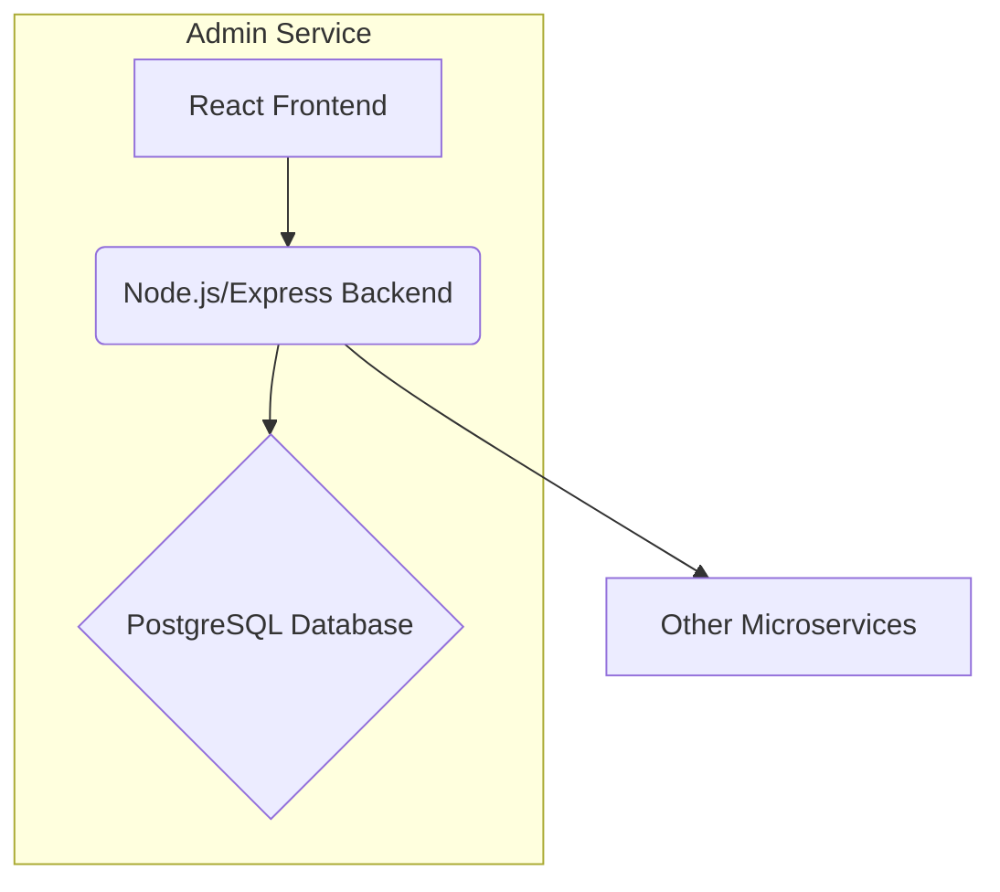

# **Service PRD: Admin Service**

## 1. 🎯 The Challenge: Problem Statement & Mission

### **Problem Statement**
> As the Suuupra platform scales, managing users, moderating content, and monitoring system health becomes a complex and high-stakes operation. A simple CRUD interface is insufficient and prone to error. The challenge is to build a secure, internal-facing mission-control center that provides administrators with the tools to manage the ecosystem efficiently and safely, with verifiable audit trails for all actions.

### **Mission**
> To build a secure and comprehensive Admin Service that acts as the central nervous system for platform operations, enabling administrators to manage the platform with confidence and precision.

---

## 2. 🧠 The Gauntlet: Core Requirements & Edge Cases

### **Core Functional Requirements (FRs)**

| FR-ID | Feature | Description |
|---|---|---|
| FR-1  | **User Management** | Admins can list, view, and manage users, including updating their status (e.g., ban, unban). |
| FR-2  | **Content Moderation** | Admins can review, approve, reject, and flag user-generated content. |
| FR-3  | **Platform Dashboard** | Admins can view a high-level overview of the platform's health and key metrics. |
| FR-4  | **RBAC** | The system supports different admin roles with varying levels of permissions. |
| FR-5  | **Audit Trail** | All admin actions are logged in a tamper-evident audit trail. |

### **Non-Functional Requirements (NFRs)**

| NFR-ID | Requirement | Target | Justification & Key Challenges |
|---|---|---|---|
| NFR-1 | **Security** | 2FA for all admins | Ensures secure access to the admin panel. Challenge: Implementing a secure 2FA flow. |
| NFR-2 | **Data Integrity** | Verifiable audit logs | Guarantees the integrity of the audit trail. Challenge: Implementing a Merkle Tree-based audit log. |
| NFR-3 | **Availability** | 99.9% | The admin panel must be available for platform operations. Challenge: Ensuring the service is resilient to failures. |

### **Edge Cases & Failure Scenarios**

*   **Concurrent Admin Actions:** How do we handle cases where two admins try to moderate the same piece of content simultaneously? (e.g., implement optimistic locking).
*   **Invalid Audit Log:** What happens if the audit log chain is broken? (e.g., trigger an alert and require manual intervention).
*   **Downstream Service Failure:** How does the admin panel handle failures in the services it monitors? (e.g., display a clear error message and attempt to reconnect).

---

## 3. 🗺️ The Blueprint: Architecture & Design

### **3.1. System Architecture Diagram**



### **3.2. Tech Stack Deep Dive**

| Component | Technology | Version | Justification & Key Considerations |
|---|---|---|---|
| **Language/Framework** | `Node.js`, `Express` | `18.x`, `4.x` | Strong ecosystem and performance for I/O-bound operations. |
| **Frontend** | `React` | `18.x` | Modern, component-based architecture for building a complex UI. |
| **Database** | `PostgreSQL` | `15` | Relational nature and JSONB support for structured data and audit logs. |

### **3.3. Database Schema**

```sql
-- Admins and their roles
CREATE TABLE admins (
    id UUID PRIMARY KEY,
    user_id UUID UNIQUE NOT NULL REFERENCES users(id) ON DELETE CASCADE,
    role VARCHAR(50) NOT NULL CHECK (role IN ('super_admin', 'moderator', 'analyst')),
    created_at TIMESTAMPTZ DEFAULT NOW()
);

-- Content moderation queue
CREATE TABLE content_moderation_queue (
    id UUID PRIMARY KEY,
    content_id UUID NOT NULL,
    content_type VARCHAR(50) NOT NULL,
    status VARCHAR(50) DEFAULT 'pending' CHECK (status IN ('pending', 'approved', 'rejected', 'escalated')),
    submitted_by UUID REFERENCES users(id),
    assigned_to UUID REFERENCES admins(id),
    created_at TIMESTAMPTZ DEFAULT NOW(),
    updated_at TIMESTAMPTZ DEFAULT NOW()
);

-- Tamper-evident audit log for admin actions
CREATE TABLE admin_audit_log (
    id BIGSERIAL PRIMARY KEY,
    admin_id UUID NOT NULL REFERENCES admins(id),
    action VARCHAR(255) NOT NULL,
    target_entity VARCHAR(100),
    target_id VARCHAR(255),
    details JSONB, -- Details of the action
    created_at TIMESTAMPTZ DEFAULT NOW(),
    log_hash VARCHAR(64) NOT NULL, -- SHA-256 hash of the log entry
    previous_hash VARCHAR(64) -- Hash of the previous log entry, forming a chain
);
```

---

## 4. 🚀 The Quest: Implementation Plan & Milestones

### **Phase 1: Foundation & User Management (Week 1)**

*   **Objective:** Establish the core application structure and build the foundational user management features.
*   **Key Results:**
    *   Admins can manage users through the UI.
    *   RBAC is implemented and enforced.
*   **Tasks:**
    *   [ ] **Project Setup**: Initialize the Node.js/Express backend and the React frontend.
    *   [ ] **Schema Design**: Design the PostgreSQL schema for admins, roles, and permissions.
    *   [ ] **User Management Backend**: Implement RESTful API endpoints for CRUD operations on users.
    *   [ ] **RBAC Implementation**: Design and implement a robust RBAC system.
    *   [ ] **User Management Frontend**: Build the React components for the user management section.

### **Phase 2: Content Moderation & Audit Trail (Week 2)**

*   **Objective:** Build the tools for content moderators and implement the verifiable audit trail.
*   **Key Results:**
    *   Admins can moderate content through the UI.
    *   All admin actions are logged in a verifiable audit trail.
*   **Tasks:**
    *   [ ] **Moderation Schema**: Design the database schema for the content moderation queue.
    *   [ ] **Moderation Backend**: Implement API endpoints for content moderation.
    *   [ ] **DAG for Moderation**: Implement the moderation process as a Directed Acyclic Graph (DAG).
    *   [ ] **Moderation Frontend**: Create the UI for the content moderation queue.
    *   [ ] **Verifiable Audit Trail**: Implement a Merkle Tree-based audit log.

### **Phase 3: Dashboard & Analytics (Week 3)**

*   **Objective:** Provide administrators with a high-level overview of the platform's health.
*   **Key Results:**
    *   Admins can view key platform metrics on a dashboard.
    *   Admins can monitor the health of other microservices.
*   **Tasks:**
    *   [ ] **Analytics Backend**: Create API endpoints to serve aggregated data for key platform metrics.
    *   [ ] **Dashboard Frontend**: Build a dashboard page with charts and graphs.
    *   [ ] **System Health Monitoring**: Add a component to the dashboard to monitor the health of other microservices.

### **Phase 4: Security & Production Hardening (Week 4)**

*   **Objective:** Harden the service and prepare it for production.
*   **Key Results:**
    *   The service is secure and reliable.
    *   The service is ready for deployment.
*   **Tasks:**
    *   [ ] **Security Hardening**: Implement 2FA for all admin accounts.
    *   [ ] **Comprehensive Testing**: Write unit, integration, and end-to-end tests.
    *   [ ] **Optimization**: Profile the application and fix any performance bottlenecks.
    *   [ ] **Deployment**: Create production-ready build scripts and Kubernetes deployment manifests.

---

## 5. 🧪 Testing & Quality Strategy

| Test Type | Tools | Coverage & Scenarios |
|---|---|---|
| **Unit Tests** | `Jest`, `Mocha` | >90% coverage of all business logic, including failure paths. |
| **Integration Tests** | `Supertest` | Test interactions with the database and other services. |
| **E2E Tests** | `Cypress` | Test key user flows, such as user management and content moderation. |
| **Security Tests** | `OWASP ZAP` | Automated scanning for common vulnerabilities. |

---

## 6. 🔭 The Observatory: Monitoring & Alerting

### **Key Performance Indicators (KPIs)**
*   **Technical Metrics:** `Latency (p99, p95, p50)`, `Error Rate (5xx, 4xx)`, `Throughput (RPS)`.
*   **Business Metrics:** `Admin Actions per Hour`, `Content Moderation Queue Length`.

### **Dashboards & Alerts**
*   **Grafana Dashboard:** A real-time overview of all KPIs, with drill-downs per endpoint.
*   **Alerting Rules (Prometheus):**
    *   `HighErrorRate`: Trigger if the 5xx error rate exceeds 1% over a 5-minute period.
    *   `HighLatency`: Trigger if p99 latency exceeds 500ms for more than 10 minutes.
    *   `AuditLogFailure`: Trigger if the audit log chain is broken.

---

## 7. 📚 Learning & Knowledge Base

*   **Key Concepts:** `Full-Stack Development`, `RBAC`, `DAGs`, `Merkle Trees`, `2FA`.
*   **Resources:**
    *   [NIST RBAC Model](https://csrc.nist.gov/projects/role-based-access-control)
    *   [Merkle Tree for Data Integrity](https://en.wikipedia.org/wiki/Merkle_tree)

---