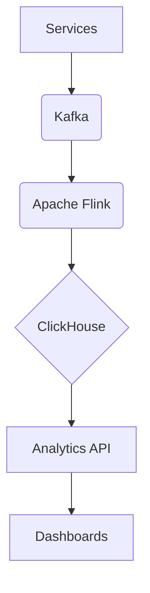

# **Service PRD: Analytics Service**

## 1. 🎯 The Challenge: Problem Statement & Mission

### **Problem Statement**
> The Suuupra platform generates a massive volume of event data from user interactions, content views, and commercial transactions. This data is a goldmine of insights, but it is useless if it cannot be processed and analyzed in real-time. The challenge is to build a scalable and reliable analytics pipeline that can ingest, process, and analyze this data in real-time to provide valuable insights for business intelligence, product development, and personalization.

### **Mission**
> To build a real-time analytics pipeline that empowers the Suuupra platform with data-driven insights, enabling us to make better decisions and build better products.

---

## 2. 🧠 The Gauntlet: Core Requirements & Edge Cases

### **Core Functional Requirements (FRs)**

| FR-ID | Feature | Description |
|---|---|---|
| FR-1  | **Event Ingestion** | The system can ingest high-volume event streams from multiple sources. |
| FR-2  | **Real-time Aggregations** | The system can perform real-time aggregations on the event data. |
| FR-3  | **Content & Commerce Analytics** | The system can provide analytics specific to content engagement and commerce. |
| FR-4  | **Dashboarding & BI** | The system can visualize the analytical data in dashboards. |
| FR-5  | **Advanced Analytics** | The system can support advanced analytical features like A/B testing and user segmentation. |

### **Non-Functional Requirements (NFRs)**

| NFR-ID | Requirement | Target | Justification & Key Challenges |
|---|---|---|---|
| NFR-1 | **Scalability** | Handle 1M+ events/sec | The system must be able to handle the massive volume of events generated by the platform. Challenge: Designing a scalable architecture with Kafka and Flink. |
| NFR-2 | **Reliability** | 99.9% data delivery | The system must not lose any event data. Challenge: Implementing a durable and fault-tolerant data pipeline. |
| NFR-3 | **Latency** | <5s for real-time metrics | The system must provide real-time insights. Challenge: Optimizing the Flink jobs and ClickHouse queries. |

### **Edge Cases & Failure Scenarios**

*   **Data Skew:** How do we handle cases where a small number of users or content items generate a disproportionate amount of data? (e.g., use techniques like salting to distribute the data more evenly).
*   **Late Arriving Data:** How do we handle events that arrive late due to network issues? (e.g., use Flink's windowing and watermarking features to handle late data).
*   **Schema Evolution:** How do we handle changes to the event schema without breaking the pipeline? (e.g., use a schema registry like Avro or Protobuf to manage schema evolution).

---

## 3. 🗺️ The Blueprint: Architecture & Design

### **3.1. System Architecture Diagram**



### **3.2. Tech Stack Deep Dive**

| Component | Technology | Version | Justification & Key Considerations |
|---|---|---|---|
| **Messaging** | `Kafka` | `3.x` | Distributed event streaming platform for high-throughput, real-time data feeds. |
| **Stream Processing** | `Apache Flink` | `1.17` | Powerful stream-processing framework for complex, stateful computations. |
| **Database** | `ClickHouse` | `23.x` | Columnar database for high-performance OLAP queries. |
| **Language/Framework** | `Python`, `FastAPI` | `3.11`, `0.104` | High-performance API layer for exposing analytical data. |

### **3.3. Database Schema**

```sql
-- Raw events table
CREATE TABLE view_events (
    user_id UUID,
    content_id UUID,
    timestamp DateTime,
    watch_time_seconds UInt32
) ENGINE = MergeTree()
PARTITION BY toYYYYMM(timestamp)
ORDER BY (user_id, content_id, timestamp);

-- Aggregated metrics table
CREATE TABLE real_time_metrics (
    timestamp DateTime,
    metric_name String,
    metric_value Float64,
    dimensions Map(String, String)
) ENGINE = SummingMergeTree()
ORDER BY (metric_name, timestamp, dimensions);

-- Materialized View for hourly unique users
CREATE MATERIALIZED VIEW unique_users_hourly_mv
TO unique_users_hourly
AS SELECT
    toStartOfHour(timestamp) AS hour,
    uniqState(user_id) AS unique_users_state
FROM view_events
GROUP BY hour;

CREATE TABLE unique_users_hourly (
    hour DateTime,
    unique_users AggregateFunction(uniq, UUID)
) ENGINE = AggregatingMergeTree()
ORDER BY hour;
```

---

## 4. 🚀 The Quest: Implementation Plan & Milestones

### **Phase 1: Infrastructure & Event Ingestion (Week 1)**

*   **Objective:** Set up the data pipeline infrastructure and start ingesting events.
*   **Key Results:**
    *   Events are successfully ingested into Kafka.
    *   The data pipeline is up and running.
*   **Tasks:**
    *   [ ] **Infrastructure Setup**: Provision Kafka, Flink, and ClickHouse clusters.
    *   [ ] **Event Schema Definition**: Define the event schemas using Avro or Protobuf.
    *   [ ] **Event Ingestion**: Create a Kafka producer to send events to Kafka topics.

### **Phase 2: Real-time Aggregations (Week 2)**

*   **Objective:** Implement Flink jobs to perform real-time aggregations.
*   **Key Results:**
    *   Real-time metrics are calculated and stored in ClickHouse.
*   **Tasks:**
    *   [ ] **Core Metrics Job**: Create a Flink job to calculate real-time metrics.
    *   [ ] **HyperLogLog for Cardinality**: Use HyperLogLog to estimate the number of unique users.
    *   [ ] **ClickHouse Sink**: Create a Flink sink to write the aggregated data to ClickHouse.

### **Phase 3: Content & Commerce Analytics (Week 3)**

*   **Objective:** Build analytics specific to content engagement and commerce.
*   **Key Results:**
    *   Content engagement and commerce metrics are available for analysis.
*   **Tasks:**
    *   [ ] **Engagement Metrics**: Create a Flink job to calculate content engagement scores.
    *   [ ] **Conversion Funnels**: Track user funnels.
    *   [ ] **Revenue Analytics**: Process commerce events to calculate real-time revenue metrics.

### **Phase 4: Dashboarding & BI (Week 4)**

*   **Objective:** Visualize the analytical data.
*   **Key Results:**
    *   Dashboards are created to visualize the analytical data.
*   **Tasks:**
    *   [ ] **ClickHouse Optimization**: Create materialized views in ClickHouse.
    *   [ ] **Analytics API**: Build a FastAPI service to query ClickHouse.
    *   [ ] **Dashboarding**: Use Grafana or a custom frontend to create dashboards.

### **Phase 5: Advanced Analytics (Week 5)**

*   **Objective:** Implement more advanced analytical features.
*   **Key Results:**
    *   A/B testing and user segmentation features are available.
*   **Tasks:**
    *   [ ] **A/B Testing Framework**: Implement a Flink job to analyze A/B test results.
    *   [ ] **User Segmentation**: Create a Flink job to segment users based on their behavior.

### **Phase 6: Optimization & Deployment (Week 6)**

*   **Objective:** Prepare the analytics pipeline for production.
*   **Key Results:**
    *   The pipeline is optimized for performance and deployed to production.
*   **Tasks:**
    *   [ ] **Performance Tuning**: Optimize Flink jobs and ClickHouse queries.
    *   [ ] **Monitoring & Alerting**: Set up monitoring for the entire pipeline.
    *   [ ] **Deployment**: Deploy the pipeline to Kubernetes.

---

## 5. 🧪 Testing & Quality Strategy

| Test Type | Tools | Coverage & Scenarios |
|---|---|---|
| **Unit Tests** | `pytest` | >90% coverage of all Flink jobs and API endpoints. |
| **Integration Tests** | `Testcontainers` | Test the entire pipeline from Kafka to ClickHouse. |
| **Load Tests** | `k6` | Simulate high-volume event streams to test the scalability of the pipeline. |

---

## 6. 🔭 The Observatory: Monitoring & Alerting

### **Key Performance Indicators (KPIs)**
*   **Technical Metrics:** `Kafka Lag`, `Flink Checkpoint Duration`, `ClickHouse Query Latency`.
*   **Business Metrics:** `Real-time Active Users`, `Conversion Rate`, `Revenue`.

### **Dashboards & Alerts**
*   **Grafana Dashboard:** A real-time overview of all KPIs, with drill-downs per Flink job.
*   **Alerting Rules (Prometheus):**
    *   `HighKafkaLag`: Trigger if Kafka lag exceeds a certain threshold.
    *   `FlinkJobFailure`: Trigger if a Flink job fails.
    *   `HighClickHouseLatency`: Trigger if ClickHouse query latency exceeds a certain threshold.

---

## 7. 📚 Learning & Knowledge Base

*   **Key Concepts:** `Real-time Data Pipelines`, `Stateful Stream Processing`, `Big Data Technologies`, `Approximate Algorithms`.
*   **Resources:**
    *   [Apache Flink Documentation](https://nightlies.apache.org/flink/flink-docs-stable/)
    *   [ClickHouse Documentation](https://clickhouse.com/docs/en/)
    *   [Kafka Documentation](https://kafka.apache.org/documentation/)

---