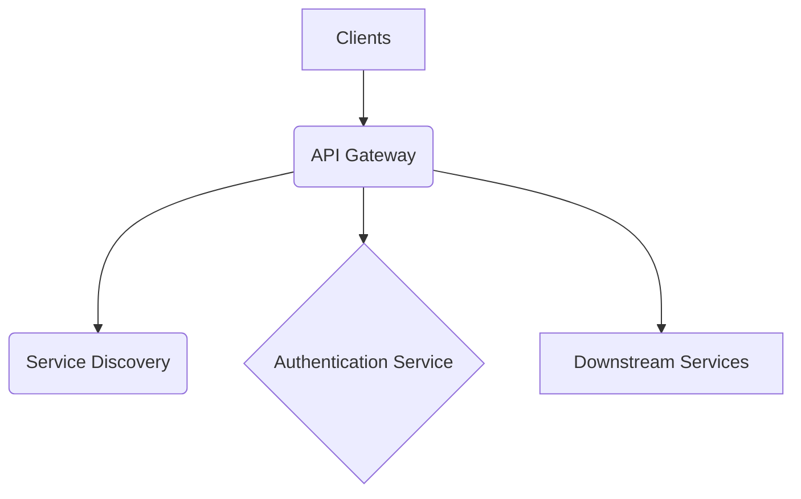

# **Service PRD: API Gateway**

## 1. 🎯 The Challenge: Problem Statement & Mission

### **Problem Statement**
>
> As the number of microservices in the Suuupra platform grows, clients (web, mobile) face increasing complexity in consuming them. Each service has its own endpoint, authentication mechanism, and rate-limiting policy. This creates a tight coupling between clients and services, making the system brittle and difficult to evolve. The challenge is to build a unified entry point that decouples clients from services, providing a consistent and secure API for all consumers, while handling the complexities of a distributed system.

### **Mission**
>
> To provide a robust, secure, and highly performant API Gateway that acts as the single entry point for all client requests, simplifying client-side development and enabling seamless evolution of the microservices architecture.

---

## 2. 🧠 The Gauntlet: Core Requirements & Edge Cases

### **Core Functional Requirements (FRs)**

| FR-ID | Feature | Description |
|---|---|---|
| FR-1  | **Request Routing** | Route incoming requests to the appropriate downstream service based on the request path. |
| FR-2  | **Authentication & Authorization** | Authenticate and authorize all incoming requests using JWT and OAuth2. |
| FR-3  | **Rate Limiting** | Protect downstream services from traffic spikes by implementing distributed rate limiting. |
| FR-4  | **Service Discovery** | Dynamically discover and route to healthy service instances. |
| FR-5  | **WebSocket Proxying** | Support real-time communication by proxying WebSocket connections. |

### **Non-Functional Requirements (NFRs)**

| NFR-ID | Requirement | Target | Justification & Key Challenges |
|---|---|---|---|
| NFR-1 | **Latency** | p99 < 150ms | The gateway should add minimal overhead to the request latency. Challenge: Optimizing the request pipeline and network calls. |
| NFR-2 | **Availability** | 99.99% | The gateway is a critical component and must be highly available. Challenge: Implementing a fault-tolerant and resilient architecture. |
| NFR-3 | **Scalability** | 50,000+ RPS | The gateway must be able to handle the traffic of the entire platform. Challenge: Designing a stateless and horizontally scalable architecture. |

### **Edge Cases & Failure Scenarios**

* **Downstream Service Unavailability:** How does the gateway handle failures in downstream services? (e.g., implement circuit breakers with fallbacks).
* **Authentication Service Unavailability:** What happens if the identity service is down? (e.g., cache authentication decisions for a short period).
* **Configuration Errors:** How do we prevent and handle misconfigurations in the routing rules? (e.g., implement a validation process for configuration changes).

---

## 3. 🗺️ The Blueprint: Architecture & Design

### **3.1. System Architecture Diagram**

### **3.2. Tech Stack Deep Dive**

| Component | Technology | Version | Justification & Key Considerations |
|---|---|---|---|
| **Language/Framework** | `Node.js`, `Fastify` | `20+`, `4.x` | High-performance, low-overhead framework ideal for a gateway. |
| **Authentication** | `jsonwebtoken`, `@fastify/oauth2` | `9.x`, `4.x` | Standard libraries for JWT and OAuth2 implementation. |
| **Rate Limiting** | `Redis` | `7+` | In-memory data store for distributed rate limiting. |
| **Service Discovery** | `Consul` or `Kubernetes` | - | For dynamic service discovery and health checking. |

### **3.3. Database Schema**

The API Gateway is stateless and does not have its own database. It relies on Redis for caching and rate limiting, and on downstream services for data persistence.

---

## 4. 🚀 The Quest: Implementation Plan & Milestones

### **Phase 1: Core Gateway Infrastructure (Weeks 3-4)**

* **Objective:** Establish the core gateway infrastructure with JWT authentication and rate limiting.
* **Key Results:**
  * The gateway can route requests to downstream services.
  * JWT authentication and rate limiting are implemented and enforced.
* **Tasks:**
  * [ ] **Project Foundation & JWT Authentication**: Initialize the project and implement JWT authentication.
  * [ ] **OAuth2 Implementation with PKCE**: Implement OAuth2 with PKCE for mobile/SPA security.
  * [ ] **Advanced Rate Limiting with Redis**: Implement distributed rate limiting with Redis.
  * [x] **Service Discovery & Circuit Breaker**: Implement service discovery and circuit breakers.

### **Phase 2: Advanced Features & Production Readiness (Weeks 4-5)**

* **Objective:** Add advanced features and prepare the gateway for production.
* **Key Results:**
  * The gateway supports WebSocket proxying.
  * The gateway is integrated with the service mesh.
  * The gateway is ready for deployment.
* **Tasks:**
  * [ ] **Request Pipeline & WebSocket Support**: Build the request pipeline and add WebSocket support.
  * [ ] **Service Mesh Integration (Istio)**: Integrate the gateway with Istio for mTLS and advanced traffic management.
  * [ ] **Comprehensive Monitoring & Observability**: Implement comprehensive monitoring and observability.
  * [ ] **Performance Testing & Optimization**: Perform load testing and optimize the gateway for performance.

---

## 5. 🧪 Testing & Quality Strategy

| Test Type | Tools | Coverage & Scenarios |
|---|---|---|
| **Unit Tests** | `Jest` | >95% coverage of all utility functions and middleware. |
| **Integration Tests** | `Supertest` | Test the entire request pipeline, including authentication, rate limiting, and routing. |
| **Load Tests** | `k6` | Simulate high traffic to test the performance and scalability of the gateway. |

---

## 6. 🔭 The Observatory: Monitoring & Alerting

### **Key Performance Indicators (KPIs)**

* **Technical Metrics:** `Latency (p99, p95, p50)`, `Error Rate (5xx, 4xx)`, `Throughput (RPS)`.
* **Business Metrics:** `API Usage per Client`, `Upstream Service Health`.

### **Dashboards & Alerts**

* **Grafana Dashboard:** A real-time overview of all KPIs, with drill-downs per route and service.
* **Alerting Rules (Prometheus):**
  * `HighGatewayLatency`: Trigger if the gateway's p99 latency exceeds 150ms.
  * `HighErrorRate`: Trigger if the 5xx error rate exceeds 1%.
  * `CircuitBreakerOpen`: Trigger if a circuit breaker is open for a downstream service.

---

## 7. 📚 Learning & Knowledge Base

* **Key Concepts:** `API Gateway Pattern`, `JWT`, `OAuth2`, `Rate Limiting`, `Circuit Breaker`, `Service Discovery`.
* **Resources:**
  * [NIST Digital Identity Guidelines](https://pages.nist.gov/800-63-3/)
  * [The API Gateway Pattern](https://microservices.io/patterns/apigateway.html)

---

## 8. ✅ Actionable Feature Backlog (LLD Alignment)

* [ ] Core Routing & Transforms
  * [ ] Header/query/body transforms per-route (req/resp)
  * [ ] CORS policy per-route with preflight cache
  * [ ] Static asset proxy + signed URL fallback

* [ ] Authentication & Authorization
  * [ ] JWT verification via JWKS with caching and key rotation
  * [ ] OAuth2/OIDC integration with Identity service (introspection + discovery)
  * [ ] API keys: hashed storage, scopes, rotation, per-key rate limits
  * [ ] RBAC: role checks from claims; route-level policy rules
  * [ ] Multi-tenant awareness: tenant extraction (host/header/claim), tenant-scoped limits

* [ ] Traffic Management & Resilience
  * [ ] Redis token bucket rate limiter (keys: ip/user/tenant/route)
  * [ ] Throttling/backoff responses for overload
  * [ ] Retry policy: idempotent methods by default, backoff + jitter, respect Retry-After
  * [ ] Per-route timeouts (connect/read/write)
  * [ ] Circuit breaker fallbacks with standard JSON error body
  * [ ] Request queueing for AI routes with concurrency caps

* [ ] AI-Aware Features
  * [ ] SSE/chunked streaming proxy for LLMs with cancellation
  * [ ] Optional request batching for small prompts
  * [ ] Model router (weighted + sticky sessions) via feature flags
  * [ ] Context injection: safe mapping of claims → headers

* [ ] Cloud-Native Integration
  * [ ] K8s/Consul/DNS service discovery provider abstraction
  * [ ] Active health checks + passive outlier detection
  * [ ] CDN-aware routing (geo/RTT) for VOD/MassLive paths
  * [ ] Credential proxying (AWS SigV4, GCP SA tokens) with least privilege
  * [ ] Ingress compatibility (CRD/annotations → internal config)

* [ ] Observability & Debugging
  * [ ] Prometheus metrics: latency histograms, RPS, errors, limiter hits, queue depths
  * [ ] Structured JSON logging with correlation IDs and tenant (no PII)
  * [ ] OpenTelemetry tracing: gateway + upstream spans; W3C trace-context
  * [ ] Real-time debug dashboard (read-only) backed by Admin API + metrics
  * [ ] Traffic replay: sanitized envelopes + sandbox replayer

* [ ] Admin + Dev UX
  * [ ] Admin API: CRUD services/routes/limits/plugins with audit log
  * [ ] Hot-reload config with atomic swap + validation
  * [ ] Secrets management integration (Vault/AWS SM)
  * [ ] Plugin system with sandboxed hooks (request/response/error/stream)

* [ ] Security & Compliance
  * [ ] TLS termination + internal mTLS (SPIFFE/SPIRE)
  * [ ] IP allow/deny per-route and per-tenant
  * [ ] WAF integration (ModSecurity/Coraza) – detect/block modes
  * [ ] Signed URL proxy validation + watermark headers for VOD
  * [ ] Append-only audit sink with hash chaining

* [ ] Media Controls
  * [ ] WebSocket session manager (rooms, heartbeats, auth)
  * [ ] Whiteboard/WebRTC SFU routing with regional selection

* [ ] DevOps & Platform
  * [ ] Blue-green deploy support with health/metric gates
  * [ ] Canary routing (% based) + auto-rollback on SLO breach
  * [ ] Feature flag integration (OpenFeature) for routes/models
  * [ ] GitOps route updates with drift detection
  * [ ] Multi-environment config isolation

## 9. 🧰 Observability Tasks (Cross-Service)

* [ ] Create shared observability library for Node services: `shared/libs/node/observability/`
  * [ ] Metrics (prom-client) + default histograms/counters
  * [ ] Tracing (OpenTelemetry) + Jaeger exporter
  * [ ] Helper to expose `/metrics` route
* [ ] Adopt in API Gateway server (Fastify) and document per-service adoption
* [ ] Provision monitoring stack under `/monitoring` and document usage

---

## 10. 📌 Remaining Tasks (Next to implement, aligned with recent changes)

Context: Recent edits introduced modular config (`src/config/gatewayConfig.ts`), request pipeline (`src/pipeline/handle.ts`), circuit breaking (`src/proxy/circuit.ts`), basic HTTP proxy (`src/proxy/httpProxy.ts`), rate limiting skeleton (`src/middleware/rateLimit.ts`), security checks (`src/middleware/security.ts`), and base Prometheus metrics (`shared/libs/node/observability`). The list below focuses on what to build next.

* [ ] JWT via JWKS per-route with OIDC discovery
  * [ ] Add per-route issuer/audience/JWKS URI in `GatewayConfig` auth policy
  * [ ] Implement JWKS verification with `jose` (cache + rotation)
  * [ ] Support OIDC discovery (`/.well-known/openid-configuration`) for Identity
  * [ ] Fallback to existing `@fastify/jwt` secret if configured

* [ ] API Key store (Redis/DB), hashing, scopes, rotation
  * [ ] Define API key schema (hashed at rest, created_at, last_used_at, scopes)
  * [ ] Validate `x-api-key` in `src/middleware/auth.ts` against store
  * [ ] Rotation and scope management via Admin API

* [ ] Throttling/backoff responses; AI request queueing with concurrency caps
  * [ ] Return 429 with `Retry-After` and backoff hints when overloaded
  * [ ] Per-route queue + max in-flight for AI endpoints
  * [ ] Expose queue depth metrics

* [ ] SSE streaming proxy, optional batching, model router, context injection
  * [ ] Extend proxy to support chunked/SSE streaming with cancellation
  * [ ] Optional prompt batching for small payloads
  * [ ] Model router (weighted + sticky) behind feature flags
  * [ ] Context injection: safe claims → headers mapping per-route

* [ ] Discovery providers (DNS/K8s/Consul), health checks, outlier detection
  * [ ] Implement `DiscoveryConfig` providers and caching
  * [ ] Active health checks + passive outlier detection with ejection
  * [ ] Per-target selection policy (RR/least-RTT)

* [ ] CDN-aware routing; credential proxying (AWS SigV4, GCP SA tokens)
  * [ ] Route selection by geo/RTT for media paths
  * [ ] Sign upstream requests with AWS SigV4 / GCP SA tokens

* [ ] Ingress compatibility controller
  * [ ] Translate K8s Ingress/CRDs/annotations → `GatewayConfig`
  * [ ] Validate + hot-apply config (see Admin API hot reload)

* [ ] Prometheus metrics: add per-route labels; OpenTelemetry tracing spans
  * [ ] Emit metrics with `routeId` (matched config) instead of wildcard path
  * [ ] Add limiter hits, retry counts, breaker opens, queue depth
  * [ ] Add OpenTelemetry spans for gateway and upstream with W3C trace-context

* [ ] Admin API (+ hot reload + secrets + plugin sandbox)
  * [ ] Admin API for CRUD on services/routes/limits/plugins with audit trail
  * [ ] Hot reload config with atomic swap + schema validation
  * [ ] Secrets backend integration (Vault/AWS SM)
  * [ ] Plugin sandbox (onRequest/onResponse/onError/onStream)

* [ ] WebSocket session manager; WebRTC SFU routing
  * [ ] WS session manager (rooms, heartbeats, auth, backpressure)
  * [ ] SFU routing and regional selection

* [ ] DevOps features: blue-green, canary, feature flags, GitOps, env isolation
  * [ ] Deploy strategies with metric/SLO gates + auto-rollback
  * [ ] Feature flags (OpenFeature) for routes/models
  * [ ] GitOps route updates with drift detection
  * [ ] Environment-scoped config isolation
