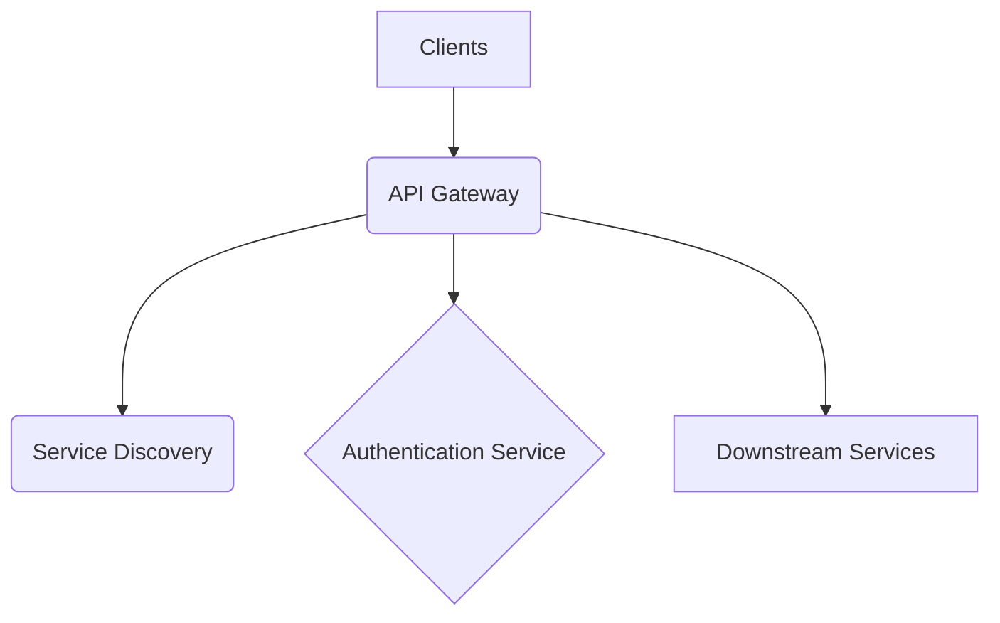

# **Service PRD: API Gateway**

## 1. 🎯 The Challenge: Problem Statement & Mission

### **Problem Statement**
> As the number of microservices in the Suuupra platform grows, clients (web, mobile) face increasing complexity in consuming them. Each service has its own endpoint, authentication mechanism, and rate-limiting policy. This creates a tight coupling between clients and services, making the system brittle and difficult to evolve. The challenge is to build a unified entry point that decouples clients from services, providing a consistent and secure API for all consumers, while handling the complexities of a distributed system.

### **Mission**
> To provide a robust, secure, and highly performant API Gateway that acts as the single entry point for all client requests, simplifying client-side development and enabling seamless evolution of the microservices architecture.

---

## 2. 🧠 The Gauntlet: Core Requirements & Edge Cases

### **Core Functional Requirements (FRs)**

| FR-ID | Feature | Description |
|---|---|---|
| FR-1  | **Request Routing** | Route incoming requests to the appropriate downstream service based on the request path. |
| FR-2  | **Authentication & Authorization** | Authenticate and authorize all incoming requests using JWT and OAuth2. |
| FR-3  | **Rate Limiting** | Protect downstream services from traffic spikes by implementing distributed rate limiting. |
| FR-4  | **Service Discovery** | Dynamically discover and route to healthy service instances. |
| FR-5  | **WebSocket Proxying** | Support real-time communication by proxying WebSocket connections. |

### **Non-Functional Requirements (NFRs)**

| NFR-ID | Requirement | Target | Justification & Key Challenges |
|---|---|---|---|
| NFR-1 | **Latency** | p99 < 150ms | The gateway should add minimal overhead to the request latency. Challenge: Optimizing the request pipeline and network calls. |
| NFR-2 | **Availability** | 99.99% | The gateway is a critical component and must be highly available. Challenge: Implementing a fault-tolerant and resilient architecture. |
| NFR-3 | **Scalability** | 50,000+ RPS | The gateway must be able to handle the traffic of the entire platform. Challenge: Designing a stateless and horizontally scalable architecture. |

### **Edge Cases & Failure Scenarios**

*   **Downstream Service Unavailability:** How does the gateway handle failures in downstream services? (e.g., implement circuit breakers with fallbacks).
*   **Authentication Service Unavailability:** What happens if the identity service is down? (e.g., cache authentication decisions for a short period).
*   **Configuration Errors:** How do we prevent and handle misconfigurations in the routing rules? (e.g., implement a validation process for configuration changes).

---

## 3. 🗺️ The Blueprint: Architecture & Design

### **3.1. System Architecture Diagram**

### **3.2. Tech Stack Deep Dive**

| Component | Technology | Version | Justification & Key Considerations |
|---|---|---|---|
| **Language/Framework** | `Node.js`, `Fastify` | `20+`, `4.x` | High-performance, low-overhead framework ideal for a gateway. |
| **Authentication** | `jsonwebtoken`, `@fastify/oauth2` | `9.x`, `4.x` | Standard libraries for JWT and OAuth2 implementation. |
| **Rate Limiting** | `Redis` | `7+` | In-memory data store for distributed rate limiting. |
| **Service Discovery** | `Consul` or `Kubernetes` | - | For dynamic service discovery and health checking. |

### **3.3. Database Schema**

The API Gateway is stateless and does not have its own database. It relies on Redis for caching and rate limiting, and on downstream services for data persistence.

---

## 4. 🚀 The Quest: Implementation Plan & Milestones

### **Phase 1: Core Gateway Infrastructure (Weeks 3-4)**

*   **Objective:** Establish the core gateway infrastructure with JWT authentication and rate limiting.
*   **Key Results:**
    *   The gateway can route requests to downstream services.
    *   JWT authentication and rate limiting are implemented and enforced.
*   **Tasks:**
    *   [ ] **Project Foundation & JWT Authentication**: Initialize the project and implement JWT authentication.
    *   [ ] **OAuth2 Implementation with PKCE**: Implement OAuth2 with PKCE for mobile/SPA security.
    *   [ ] **Advanced Rate Limiting with Redis**: Implement distributed rate limiting with Redis.
    *   [ ] **Service Discovery & Circuit Breaker**: Implement service discovery and circuit breakers.

### **Phase 2: Advanced Features & Production Readiness (Weeks 4-5)**

*   **Objective:** Add advanced features and prepare the gateway for production.
*   **Key Results:**
    *   The gateway supports WebSocket proxying.
    *   The gateway is integrated with the service mesh.
    *   The gateway is ready for deployment.
*   **Tasks:**
    *   [ ] **Request Pipeline & WebSocket Support**: Build the request pipeline and add WebSocket support.
    *   [ ] **Service Mesh Integration (Istio)**: Integrate the gateway with Istio for mTLS and advanced traffic management.
    *   [ ] **Comprehensive Monitoring & Observability**: Implement comprehensive monitoring and observability.
    *   [ ] **Performance Testing & Optimization**: Perform load testing and optimize the gateway for performance.

---

## 5. 🧪 Testing & Quality Strategy

| Test Type | Tools | Coverage & Scenarios |
|---|---|---|
| **Unit Tests** | `Jest` | >95% coverage of all utility functions and middleware. |
| **Integration Tests** | `Supertest` | Test the entire request pipeline, including authentication, rate limiting, and routing. |
| **Load Tests** | `k6` | Simulate high traffic to test the performance and scalability of the gateway. |

---

## 6. 🔭 The Observatory: Monitoring & Alerting

### **Key Performance Indicators (KPIs)**
*   **Technical Metrics:** `Latency (p99, p95, p50)`, `Error Rate (5xx, 4xx)`, `Throughput (RPS)`.
*   **Business Metrics:** `API Usage per Client`, `Upstream Service Health`.

### **Dashboards & Alerts**
*   **Grafana Dashboard:** A real-time overview of all KPIs, with drill-downs per route and service.
*   **Alerting Rules (Prometheus):**
    *   `HighGatewayLatency`: Trigger if the gateway's p99 latency exceeds 150ms.
    *   `HighErrorRate`: Trigger if the 5xx error rate exceeds 1%.
    *   `CircuitBreakerOpen`: Trigger if a circuit breaker is open for a downstream service.

---

## 7. 📚 Learning & Knowledge Base

*   **Key Concepts:** `API Gateway Pattern`, `JWT`, `OAuth2`, `Rate Limiting`, `Circuit Breaker`, `Service Discovery`.
*   **Resources:**
    *   [NIST Digital Identity Guidelines](https://pages.nist.gov/800-63-3/)
    *   [The API Gateway Pattern](https://microservices.io/patterns/apigateway.html)

---