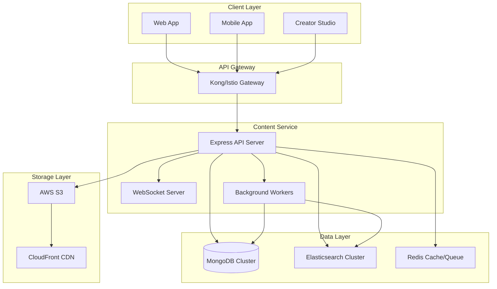

# Content Service

Production-grade content management service built with Node.js, Express, TypeScript, MongoDB, Elasticsearch, and AWS S3.

## 🎯 Overview

The Content Service is a comprehensive content management system that provides:

- **Content CRUD Operations** - Create, read, update, delete content with rich metadata
- **Large File Uploads** - S3 multipart uploads with resumability and progress tracking
- **Search & Discovery** - Elasticsearch-powered search with faceted filtering and suggestions
- **Content Approval Workflow** - Configurable approval process with versioning
- **Real-time Updates** - WebSocket-based progress tracking and notifications
- **Multi-tenant Architecture** - Tenant-isolated content with RBAC

## 🏗️ Architecture



## 🚀 Quick Start

### Prerequisites

- Node.js 18+ and npm 8+
- Docker and Docker Compose
- Make (optional, for convenience commands)

### Development Setup

1. **Clone and Install**
   ```bash
   git clone <repository-url>
   cd services/content
   npm install
   ```

2. **Start Development Environment**
   ```bash
   # Using Make (recommended)
   make quick-start
   
   # Or using Docker Compose directly
   docker-compose -f docker-compose.dev.yml up -d
   ```

3. **Verify Installation**
   ```bash
   # Check service health
   curl http://localhost:8082/health
   
   # View logs
   make dev-logs
   ```

### Available Services

| Service | URL | Description |
|---------|-----|-------------|
| Content API | http://localhost:8082 | Main API endpoints |
| MongoDB Express | http://localhost:8083 | Database management |
| Redis Commander | http://localhost:8081 | Redis management |
| Elasticsearch Head | http://localhost:9100 | Search index management |
| MinIO Console | http://localhost:9003 | S3-compatible storage |

## 📚 API Documentation

### Authentication

All API endpoints require JWT authentication via the `Authorization: Bearer <token>` header.

### Core Endpoints

#### Content Management

```bash
# Create content
POST /api/v1/content
{
  "title": "My Article",
  "description": "Article description",
  "contentType": "article",
  "categoryId": "category-id",
  "tags": ["tutorial", "javascript"],
  "idempotencyKey": "unique-uuid"
}

# List content with pagination
GET /api/v1/content?page=1&limit=20&sort=created_at&order=desc

# Get content by ID
GET /api/v1/content/:id

# Update content
PUT /api/v1/content/:id
{
  "title": "Updated Title",
  "versionBump": "minor"
}

# Delete content (soft delete)
DELETE /api/v1/content/:id
```

#### File Upload

```bash
# Initiate multipart upload
POST /api/v1/content/:id/upload
{
  "filename": "video.mp4",
  "contentType": "video/mp4",
  "fileSize": 157286400,
  "checksumSha256": "abc123..."
}

# Complete upload
POST /api/v1/content/:id/upload/:uploadId/complete
{
  "parts": [
    {"partNumber": 1, "etag": "etag1"},
    {"partNumber": 2, "etag": "etag2"}
  ]
}

# Get upload progress
GET /api/v1/upload/:uploadId/progress

# Resume upload
POST /api/v1/upload/:uploadId/resume

# Abort upload
DELETE /api/v1/upload/:uploadId
```

#### Search & Discovery

```bash
# Search content
GET /api/v1/search?q=javascript&contentType=article&limit=10

# Get search suggestions
GET /api/v1/search/suggestions?q=java

# Get search aggregations
GET /api/v1/search/aggregations?q=*
```

#### Admin Operations

```bash
# Approve content
POST /api/v1/admin/content/:id/approve

# Reject content
POST /api/v1/admin/content/:id/reject
{
  "reason": "Content needs revision"
}

#### Courses and Lessons

Courses and lessons are modeled as content types (`contentType` = `course` | `lesson`) and use the same CRUD APIs as content, plus convenience endpoints:

```bash
# Courses
POST /api/v1/courses
GET  /api/v1/courses
GET  /api/v1/courses/:id
PUT  /api/v1/courses/:id
DEL  /api/v1/courses/:id

# Lessons
POST /api/v1/lessons
GET  /api/v1/lessons
GET  /api/v1/lessons/:id
PUT  /api/v1/lessons/:id
DEL  /api/v1/lessons/:id
```

#### Media Assets

Media assets allow multiple files (video, transcripts, attachments) to be linked to a single content item.

```bash
# Create asset for a content
POST /api/v1/content/:id/assets
{
  "type": "video",
  "title": "1080p MP4",
  "fileInfo": {
    "filename": "lesson-1.mp4",
    "contentType": "video/mp4",
    "fileSize": 104857600,
    "s3Key": "content/<tenant>/<date>/<content>/<file>",
    "cdnUrl": "https://cdn.example.com/content/..."
  },
  "metadata": { "bitrate": 4500 }
}

# List assets for a content
GET /api/v1/content/:id/assets

# Get asset
GET /api/v1/assets/:assetId

# Delete asset
DELETE /api/v1/assets/:assetId
```

Model: `MediaAsset` with fields: `tenantId`, `contentId`, `type`, `fileInfo`, `metadata`, `createdBy`, timestamps.

### Metrics
- Endpoint: `GET /metrics` (Prometheus format).
- Default counters and histograms are registered plus service-specific metrics (uploads, searches, content ops).

### Tracing
- OpenTelemetry Node SDK initialized with HTTP, Express, MongoDB, Redis instrumentations.
- Trace attributes include `tenant.id`, `user.id`, `request.id` via middleware.

## Helm

Basic Helm chart is provided at `infrastructure/helm/content-service/`.

```bash
helm install content services/content/infrastructure/helm/content-service \
  --set image.repository=ghcr.io/your-org/content-service \
  --set image.tag=latest \
  --set env.ENABLE_BACKGROUND_JOBS=false
```

## CI

GitHub Actions workflow at `.github/workflows/content-ci.yml` runs typecheck, unit + integration tests, build, and an optional Trivy scan.

# Publish content
POST /api/v1/admin/content/:id/publish
```

### WebSocket Events

Connect to WebSocket at `ws://localhost:8082` with JWT authentication:

```javascript
// Subscribe to upload progress
socket.emit('subscribe:upload', uploadId);

// Listen for progress updates
socket.on('upload:progress', (data) => {
  console.log(`Upload ${data.percentage}% complete`);
});

// Listen for completion
socket.on('upload:complete', (data) => {
  console.log('Upload completed!', data);
});
```

## 🔧 Configuration

### Environment Variables

Create `.env` file from `.env.example`:

```bash
cp .env.example .env
```

Key configuration options:

| Variable | Description | Default |
|----------|-------------|---------|
| `NODE_ENV` | Environment (development/production) | `development` |
| `PORT` | Service port | `8082` |
| `MONGODB_URI` | MongoDB connection string | `mongodb://localhost:27017/content_dev` |
| `ELASTICSEARCH_NODE` | Elasticsearch URL | `http://localhost:9200` |
| `REDIS_URL` | Redis connection string | `redis://localhost:6379` |
| `AWS_ACCESS_KEY_ID` | AWS access key for S3 | Required |
| `AWS_SECRET_ACCESS_KEY` | AWS secret key for S3 | Required |
| `S3_BUCKET_NAME` | S3 bucket name | Required |
| `JWT_SECRET` | JWT signing secret | Required |
| `JWKS_URI` | JWKS endpoint for token verification | Required |

### Feature Flags

| Flag | Description | Default |
|------|-------------|---------|
| `ENABLE_CONTENT_VERSIONING` | Enable semantic versioning | `true` |
| `ENABLE_APPROVAL_WORKFLOW` | Enable content approval | `true` |
| `ENABLE_WEBHOOK_DELIVERY` | Enable webhook notifications | `true` |
| `ENABLE_CONTENT_MODERATION` | Enable content moderation | `true` |
| `ENABLE_BACKGROUND_JOBS` | Enable async processing | `true` |

## 🧪 Testing

### Unit Tests

```bash
npm test
npm run test:watch
```

### Integration Tests

```bash
npm run test:integration
```

### Load Testing

```bash
# Using k6
npm run test:load

# Or directly
k6 run tests/load/content-load-test.js
```

### Test Coverage

```bash
npm run test:coverage
```

## 📊 Monitoring & Observability

### Health Checks

```bash
# Service health
curl http://localhost:8082/health

# Component health
curl http://localhost:8082/health | jq '.checks'
```

### Metrics

Prometheus metrics available at `/metrics`:

- `content_requests_total` - Total HTTP requests
- `content_request_duration_seconds` - Request duration histogram
- `content_uploads_total` - Total upload operations
- `content_search_queries_total` - Total search queries
- `content_elasticsearch_sync_events_total` - ES sync events

### Logging

Structured JSON logs with configurable levels:

```bash
# View logs
make dev-logs

# Filter logs
docker logs content-service-dev 2>&1 | grep ERROR
```

### Tracing

OpenTelemetry tracing enabled for:
- HTTP requests
- Database operations
- Elasticsearch queries
- S3 operations
- WebSocket events

## 🔒 Security

### Authentication & Authorization

- JWT-based authentication with JWKS verification
- Role-based access control (RBAC)
- Tenant isolation
- API key support for service-to-service communication

### Input Validation

- Comprehensive request validation using AJV
- File type and size restrictions
- Content sanitization for XSS prevention
- SQL injection protection via parameterized queries

### Security Headers

- Helmet.js for security headers
- CORS configuration
- CSP (Content Security Policy)
- Rate limiting

### File Upload Security

- MIME type validation
- Virus scanning integration (optional)
- Checksum verification
- Signed URLs with expiration

## 🏗️ Development

### Project Structure

```
services/content/
├── src/
│   ├── config/           # Configuration management
│   ├── controllers/      # Request handlers
│   ├── middleware/       # Express middleware
│   ├── models/          # Database models
│   ├── routes/          # API routes
│   ├── services/        # Business logic services
│   ├── types/           # TypeScript type definitions
│   ├── utils/           # Utility functions
│   ├── workers/         # Background workers
│   └── server.ts        # Application entry point
├── tests/
│   ├── unit/            # Unit tests
│   ├── integration/     # Integration tests
│   └── load/            # Load tests
├── monitoring/          # Monitoring configuration
├── scripts/             # Utility scripts
├── docker-compose.yml   # Production compose
├── docker-compose.dev.yml # Development compose
└── Makefile            # Development commands
```

### Available Commands

```bash
# Development
make dev              # Start development environment
make dev-logs         # View development logs
make dev-shell        # Access development container
make dev-down         # Stop development environment

# Testing
make test             # Run unit tests
make test-integration # Run integration tests
make test-load        # Run load tests

# Building
make build            # Build application
make docker-build     # Build Docker image

# Utilities
make health           # Check service health
make logs             # View logs
make shell            # Access container shell
make clean            # Clean build artifacts
```

### Code Style

- TypeScript with strict mode
- ESLint + Prettier for formatting
- Conventional commits
- Pre-commit hooks

### Database Migrations

```bash
# Run migrations
npm run migrate

# Seed development data
npm run seed
```

## 🚢 Deployment

### Production Deployment

1. **Build and Push Image**
   ```bash
   make docker-build
   make docker-push
   ```

2. **Deploy with Docker Compose**
   ```bash
   make prod
   ```

3. **Verify Deployment**
   ```bash
   make health
   make status
   ```

### Kubernetes Deployment

Kubernetes manifests available in `infrastructure/k8s/`:

```bash
kubectl apply -f infrastructure/k8s/
```

### Environment-Specific Configuration

- **Development**: Uses local databases and relaxed security
- **Staging**: Production-like setup with test data
- **Production**: Full security, monitoring, and backup

## 🔧 Troubleshooting

### Common Issues

1. **Service Won't Start**
   ```bash
   # Check logs
   make logs
   
   # Check dependencies
   make status
   
   # Restart services
   make restart
   ```

2. **Database Connection Issues**
   ```bash
   # Check MongoDB
   docker exec content-mongo-dev mongo --eval "db.runCommand('ping')"
   
   # Check Elasticsearch
   curl http://localhost:9201/_cluster/health
   ```

3. **Upload Failures**
   ```bash
   # Check S3/MinIO
   curl http://localhost:9002/minio/health/live
   
   # Check upload sessions
   make shell
   # In container: node -e "require('./dist/models').UploadSession.find().then(console.log)"
   ```

### Performance Issues

1. **Slow Search Queries**
   - Check Elasticsearch cluster health
   - Review index mappings and analyzers
   - Monitor query performance in Kibana

2. **High Memory Usage**
   - Review connection pool settings
   - Check for memory leaks in logs
   - Monitor with `docker stats`

### Debugging

```bash
# Enable debug logging
LOG_LEVEL=debug make dev

# Access development container with debugger
NODE_OPTIONS="--inspect=0.0.0.0:9229" make dev

# Run specific tests
npm test -- --grep "upload"
```

## 📈 Performance Tuning

### Database Optimization

- Proper indexing strategy
- Connection pooling
- Query optimization
- Aggregation pipeline tuning

### Elasticsearch Tuning

- Index settings optimization
- Mapping configuration
- Query DSL optimization
- Cluster sizing

### Caching Strategy

- Redis for session storage
- HTTP caching with ETags
- CDN for static assets
- Query result caching

## 🤝 Contributing

1. Fork the repository
2. Create a feature branch: `git checkout -b feature/my-feature`
3. Make changes and add tests
4. Run tests: `make test`
5. Commit changes: `git commit -m "feat: add my feature"`
6. Push to branch: `git push origin feature/my-feature`
7. Submit a pull request

### Development Guidelines

- Follow TypeScript strict mode
- Add tests for new features
- Update documentation
- Use conventional commits
- Ensure all CI checks pass

## 📄 License

This project is licensed under the MIT License - see the [LICENSE](LICENSE) file for details.

## 🆘 Support

- **Documentation**: [Internal Wiki](https://wiki.suuupra.com/content-service)
- **Issues**: [GitHub Issues](https://github.com/suuupra/platform/issues)
- **Slack**: #content-service channel
- **Email**: platform-team@suuupra.com

---

**Built with ❤️ by the Suuupra Platform Team**
