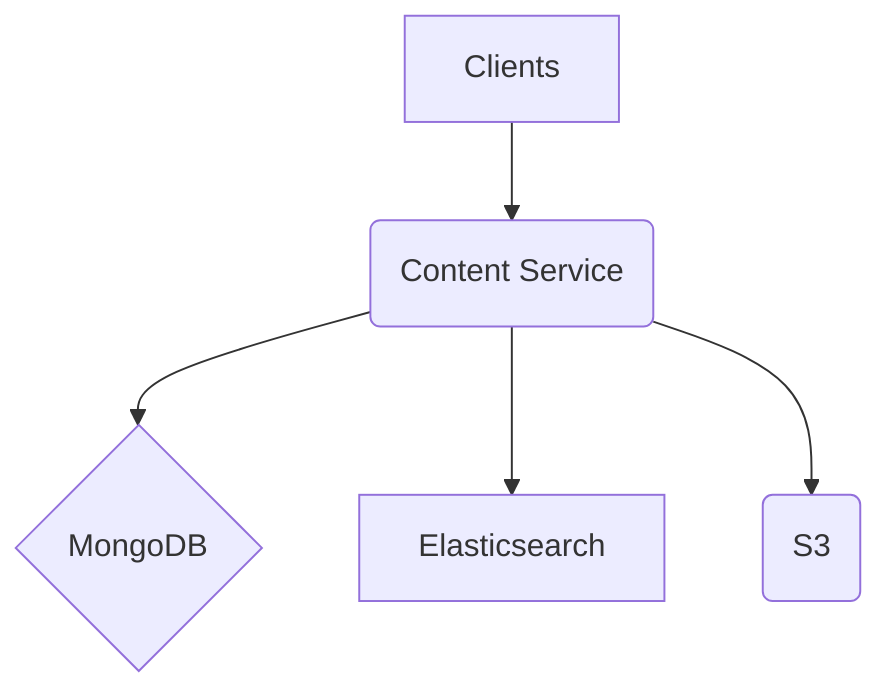

# **Service PRD: Content Service**

## 1. 🎯 The Challenge: Problem Statement & Mission

### **Problem Statement**
> The Suuupra platform needs to manage a vast and diverse library of educational and media content. This content must be easily searchable, discoverable, and delivered to users in a reliable and performant manner. The challenge is to build a scalable and flexible content management system that can handle large file uploads, complex metadata, and powerful search and discovery features.

### **Mission**
> To build a world-class content management system that empowers creators to share their knowledge and learners to discover it, providing a seamless and engaging content experience.

---

## 2. 🧠 The Gauntlet: Core Requirements & Edge Cases

### **Core Functional Requirements (FRs)**

| FR-ID | Feature | Description | Status |
|---|---|---|---|
| FR-1  | **Content Management** | The system can create, read, update, and delete content and its metadata. | ✅ **COMPLETE** |
| FR-2  | **Large File Uploads** | The system can handle large file uploads with resumability and progress tracking. | ✅ **COMPLETE** |
| FR-3  | **Search & Discovery** | The system provides powerful search and discovery features, including full-text search and filtering. | 🚧 **IN PROGRESS** |
| FR-4  | **Content Approval & Versioning** | The system supports a content approval workflow and versioning of content. | 🚧 **IN PROGRESS** |

### **Non-Functional Requirements (NFRs)**

| NFR-ID | Requirement | Target | Justification & Key Challenges | Status |
|---|---|---|---|---|
| NFR-1 | **Scalability** | 1M+ content items | The system must be able to handle a large and growing library of content. Challenge: Designing a scalable architecture with MongoDB and Elasticsearch. | ✅ **PARTIALLY ACHIEVED** |
| NFR-2 | **Performance** | <200ms search latency | Search and discovery must be fast and responsive. Challenge: Optimizing Elasticsearch queries and indexing. | 🚧 **IN PROGRESS** |
| NFR-3 | **Reliability** | 99.99% content availability | Content must be highly available to users. Challenge: Implementing a resilient storage and delivery system with S3 and a CDN. | ✅ **PARTIALLY ACHIEVED** |

### **Edge Cases & Failure Scenarios**

*   **Upload Failure:** What happens if a large file upload fails midway? (e.g., the system should allow the user to resume the upload from where it left off).
*   **Search Index Inconsistency:** How do we handle cases where the search index is out of sync with the database? (e.g., implement a reconciliation process to re-index the data).
*   **Invalid Content:** How do we handle cases where a user uploads invalid or malicious content? (e.g., implement a content validation and moderation process).

---

## 3. 🗺️ The Blueprint: Architecture & Design

### **3.1. System Architecture Diagram**



### **3.2. Tech Stack Deep Dive**

| Component | Technology | Version | Justification & Key Considerations |
|---|---|---|---|
| **Language/Framework** | `Node.js`, `Express` | `18.x`, `4.x` | Great for I/O-bound services that deal with file uploads and database interactions. |
| **Database** | `MongoDB` | `6.x` | Flexible, document-based model for storing diverse content metadata. |
| **Search** | `Elasticsearch` | `8.x` | Powerful, scalable search engine for advanced search features. |
| **Storage** | `AWS S3` | - | Scalable and durable object store for media files. |

### **3.3. Database Schema**

```javascript
// Content Schema
const ContentSchema = new mongoose.Schema({
  title: { type: String, required: true, index: 'text' },
  description: { type: String, index: 'text' },
  contentType: { type: String, enum: ['video', 'article', 'quiz', 'document', 'course', 'lesson'], required: true },
  // ... other fields
});

// Category Schema with hierarchical structure
const CategorySchema = new mongoose.Schema({
  name: { type: String, required: true, unique: true },
  parent: { type: mongoose.Schema.Types.ObjectId, ref: 'Category' }
});
```

### **Elasticsearch Index Mapping**

```json
{
  "mappings": {
    "properties": {
      "title": { "type": "text" },
      "description": { "type": "text" },
      "tags": { "type": "keyword" },
      "category": { "type": "keyword" },
      "embedding": { "type": "dense_vector", "dims": 768 }
    }
  }
}
```

---

## 4. 🚀 The Quest: Implementation Plan & Milestones

### **Phase 1: Foundation & File Uploads (Week 1)**

*   **Objective:** Set up the service and implement the core file upload functionality.
*   **Key Results:**
    *   [x] Users can upload large files to the system.
    *   [x] Upload progress is tracked and displayed in real-time.
*   **Tasks:**
    *   [x] **Project Setup**: Initialize the Node.js/Express project and set up the development environment.
    *   [x] **MongoDB Schema Design**: Design the MongoDB schemas for content, categories, and tags.
    *   [x] **S3 Multipart Upload**: Implement a resumable, chunked file upload system.
    *   [x] **Upload Progress Tracking**: Use WebSockets to provide real-time upload progress.

### **Phase 2: Content Management & Search Indexing (Week 2)**

*   **Objective:** Build the core content management features and integrate with Elasticsearch.
*   **Key Results:**
    *   Users can manage their content through the API.
    *   Content is indexed in Elasticsearch and is searchable.
*   **Tasks:**
    *   [ ] **CRUD Operations**: Implement API endpoints for content management.
    *   [ ] **Elasticsearch Integration**: Set up an Elasticsearch index and a pipeline to keep it in sync with MongoDB.
    *   [ ] **Custom Inverted Index**: Implement a simple inverted index from scratch as a learning exercise.

### **Phase 3: Content Approval & Versioning (Week 3)**

*   **Objective:** Implement a workflow for content approval and versioning.
*   **Key Results:**
    *   The system supports content versioning.
    *   The system supports a content approval workflow.
*   **Tasks:**
    *   [ ] **Content Versioning**: Implement a system for versioning content.
    *   [ ] **Approval Workflow**: Design and implement a content approval workflow.

### **Phase 4: Recommendations & Optimization (Week 4)**

*   **Objective:** Add content recommendation features and optimize the service for performance.
*   **Key Results:**
    *   The system can recommend similar content to users.
    *   The service is optimized for performance.
*   **Tasks:**
    *   [ ] **Content Similarity**: Implement algorithms to calculate content similarity.
    *   [ ] **Performance Optimization**: Optimize search queries, add caching, and load test the file upload system.

---

## 5. 🧪 Testing & Quality Strategy

| Test Type | Tools | Coverage & Scenarios |
|---|---|---|
| **Unit Tests** | `Jest`, `Mocha` | >90% coverage of all services and utilities. |
| **Integration Tests** | `Supertest` | Test the entire content lifecycle, from upload to search. |
| **Load Tests** | `k6` | Simulate a high volume of uploads and searches to test the scalability of the system. |

---

## 6. 🔭 The Observatory: Monitoring & Alerting

### **Key Performance Indicators (KPIs)**
*   **Technical Metrics:** `Upload Time`, `Search Latency`, `Indexing Lag`.
*   **Business Metrics:** `Content Views`, `Search CTR`, `Content Creation Rate`.

### **Dashboards & Alerts**
*   **Grafana Dashboard:** A real-time overview of all KPIs, with drill-downs per content type and category.
*   **Alerting Rules (Prometheus):**
    *   `HighUploadFailureRate`: Trigger if the upload failure rate exceeds 5%.
    *   `HighSearchLatency`: Trigger if p99 search latency exceeds 200ms.
    *   `HighIndexingLag`: Trigger if the indexing lag exceeds 5 minutes.

---

## 7. 📚 Learning & Knowledge Base

*   **Key Concepts:** `NoSQL Data Modeling`, `Search Engineering`, `Large File Uploads`, `Content Management Systems`.
*   **Resources:**
    *   [Elasticsearch Documentation](https://www.elastic.co/guide/index.html)
    *   [MongoDB Documentation](https://docs.mongodb.com/)
    *   [AWS S3 Multipart Upload](https://docs.aws.amazon.com/AmazonS3/latest/userguide/mpuoverview.html)

---