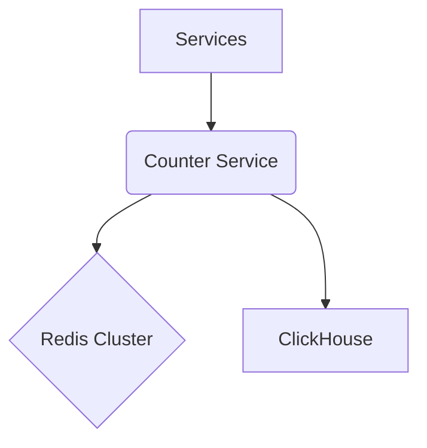

# **Service PRD: Counter Service**

## 1. 🎯 The Challenge: Problem Statement & Mission

### **Problem Statement**
> The Suuupra platform needs to track a massive number of engagement statistics, such as views, likes, and shares, in real-time. A traditional database-backed counter will not be able to handle the high throughput and low latency requirements of such a system. The challenge is to build a highly scalable and performant counter service that can handle millions of increments per second with near-instantaneous updates.

### **Mission**
> To build a high-performance, distributed counter service that provides accurate, real-time engagement statistics for the entire Suuupra platform.

---

## 2. 🧠 The Gauntlet: Core Requirements & Edge Cases

### **Core Functional Requirements (FRs)**

| FR-ID | Feature | Description |
|---|---|---|
| FR-1  | **Real-time Counters** | The system can increment and retrieve counter values in real-time. |
| FR-2  | **Distributed Counters** | The system can distribute counters across multiple machines to handle high throughput. |
| FR-3  | **Probabilistic Counters** | The system can use probabilistic data structures to efficiently count unique items. |
| FR-4  | **Data Persistence** | The system can periodically persist counter data to a long-term storage for analysis. |

### **Non-Functional Requirements (NFRs)**

| NFR-ID | Requirement | Target | Justification & Key Challenges |
|---|---|---|---|
| NFR-1 | **Latency** | <10ms for increments | The system must be able to handle a high volume of increments with low latency. Challenge: Designing a highly concurrent and performant Go service. |
| NFR-2 | **Scalability** | 1M+ increments/sec | The system must be able to scale horizontally to handle the massive number of increments. Challenge: Implementing a sharding strategy for the counters. |
| NFR-3 | **Accuracy** | 100% for simple counters | The system must provide accurate counts for simple counters. Challenge: Ensuring data consistency in a distributed environment. |

### **Edge Cases & Failure Scenarios**

*   **Redis Failure:** What happens if a Redis node goes down? (e.g., the system should failover to a replica and replay any lost increments from a write-ahead log).
*   **Network Partition:** How do we handle network partitions between the service and the Redis cluster? (e.g., the service should buffer increments locally and send them to Redis once the partition is resolved).
*   **Hot Keys:** How do we handle cases where a small number of counters receive a disproportionate amount of traffic? (e.g., use techniques like sharding and replication to distribute the load).

---

## 3. 🗺️ The Blueprint: Architecture & Design

### **3.1. System Architecture Diagram**



### **3.2. Tech Stack Deep Dive**

| Component | Technology | Version | Justification & Key Considerations |
|---|---|---|---|
| **Language/Framework** | `Go` | `1.21` | High performance and concurrency for a high-throughput service. |
| **Database** | `Redis`, `ClickHouse` | `7+`, `23.x` | Redis for real-time counters and ClickHouse for long-term storage and analytics. |

### **3.3. Redis Schema**

```redis
# Simple counter for an item of type 'content' with id '123'
INCR counter:content:123

# CRDT G-Counter for the same item, with 3 replicas
HINCRBY crdt_counter:content:123 replica_1 1
HINCRBY crdt_counter:content:123 replica_2 1

# HyperLogLog for unique views of the same item
PFADD hll:content_views:123 user_id_1 user_id_2

# Buffer for flushing to ClickHouse (Sorted Set)
ZADD counter_buffer:views 1672531200 "content_id_1,user_id_1"
```

---

## 4. 🚀 The Quest: Implementation Plan & Milestones

### **Phase 1: Core Counter Infrastructure (Week 1)**

*   **Objective:** Set up the basic infrastructure and a simple counter.
*   **Key Results:**
    *   The service can increment and retrieve counter values.
    *   The service is deployed and running.
*   **Tasks:**
    *   [ ] **Project Setup**: Initialize a Go project and set up a Redis Cluster.
    *   [ ] **Basic Counter**: Implement a basic counter using the Redis `INCR` command.
    *   [ ] **Batching**: Implement a batching mechanism to group multiple increment operations.

### **Phase 2: Distributed & Probabilistic Counters (Week 2)**

*   **Objective:** Implement more advanced counter types.
*   **Key Results:**
    *   The service supports distributed and probabilistic counters.
*   **Tasks:**
    *   [ ] **CRDT G-Counter**: Implement a G-Counter for eventually consistent distributed counters.
    *   [ ] **HyperLogLog for Unique Counts**: Use HyperLogLog for probabilistic counting of unique items.

### **Phase 3: Persistence & Optimization (Week 3)**

*   **Objective:** Persist counter data for long-term analysis and optimize the service for performance.
*   **Key Results:**
    *   Counter data is periodically persisted to ClickHouse.
    *   The service is optimized for performance.
*   **Tasks:**
    *   [ ] **Data Persistence**: Create a background Go routine to flush counter data from Redis to ClickHouse.
    *   [ ] **Sharding**: Implement a sharding strategy to distribute counters across the Redis cluster.
    *   [ ] **Reservoir Sampling**: Use Reservoir Sampling to get a statistically representative sample of items.

---

## 5. 🧪 Testing & Quality Strategy

| Test Type | Tools | Coverage & Scenarios |
|---|---|---|
| **Unit Tests** | `Go testing` | >90% coverage of all counter implementations and utilities. |
| **Integration Tests** | `Testcontainers` | Test the interaction between the service, Redis, and ClickHouse. |
| **Load Tests** | `k6` | Simulate a high volume of increments to test the performance and scalability of the service. |

---

## 6. 🔭 The Observatory: Monitoring & Alerting

### **Key Performance Indicators (KPIs)**
*   **Technical Metrics:** `Increment Latency`, `Redis Memory Usage`, `ClickHouse Ingestion Rate`.
*   **Business Metrics:** `Total Views`, `Total Likes`, `Unique Viewers`.

### **Dashboards & Alerts**
*   **Grafana Dashboard:** A real-time overview of all KPIs, with drill-downs per counter type.
*   **Alerting Rules (Prometheus):**
    *   `HighIncrementLatency`: Trigger if the p99 increment latency exceeds 10ms.
    *   `HighRedisMemoryUsage`: Trigger if Redis memory usage exceeds a certain threshold.
    *   `ClickHouseIngestionLag`: Trigger if the ClickHouse ingestion lag exceeds 5 minutes.

---

## 7. 📚 Learning & Knowledge Base

*   **Key Concepts:** `High-Performance Go`, `Distributed Counters`, `Probabilistic Data Structures`, `CRDTs`.
*   **Resources:**
    *   [Redis Documentation](https://redis.io/documentation)
    *   [A deep dive into CRDTs](https://www.youtube.com/watch?v=B5NULJ2Lh1s)

---