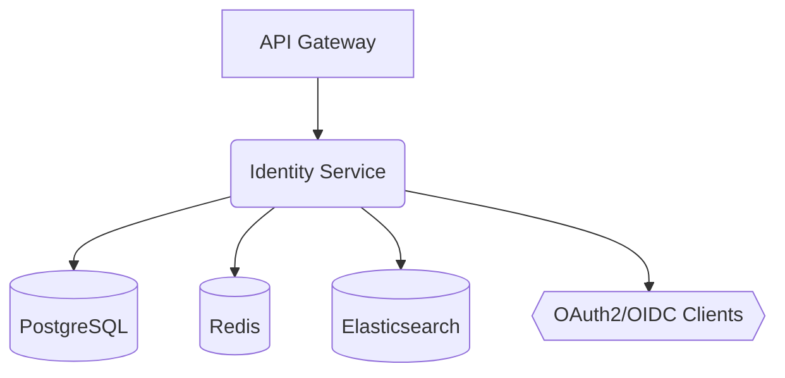

# Identity Service PRD

## 1) Problem Statement and Mission

### Problem Statement

> The platform requires a centralized, secure, and scalable service to manage user identities and control access to resources. A fragmented or insecure identity system increases risk and harms user experience. We will build a comprehensive Identity and Access Management (IAM) service that can scale to very large user bases, support modern authentication protocols, and provide fine‑grained authorization.

### Mission

> Deliver a robust identity and access management capability that secures the platform, enables seamless sign‑in/sign‑up, and provides administrators with granular role- and permission-based control.

---

## 2) Scope, Requirements, and Edge Cases

### Core Functional Requirements (FR)

| FR-ID | Feature | Description |
|---|---|---|
| FR-1 | User Management | Manage full user lifecycle: registration, verification, profile, deactivation, deletion. |
| FR-2 | Authentication | Password-based auth initially; add MFA (TOTP) and recovery codes. |
| FR-3 | Authorization | Role- and permission-based access control (RBAC, with option to extend to ABAC). |
| FR-4 | OAuth2/OIDC Provider | Provide OAuth2 Authorization Server with OIDC discovery. |
| FR-5 | Session & Devices | Manage sessions, device tracking, and token revocation/blacklist. |

### Non-Functional Requirements (NFR)

| NFR-ID | Requirement | Target | Notes |
|---|---|---|---|
| NFR-1 | Security | OWASP ASVS L3 | Strong crypto, secure defaults, defense-in-depth. |
| NFR-2 | Scalability | 1B+ users | Partitionable schema, read scalability, caching. |
| NFR-3 | Performance | <200ms P95 auth response | Optimize DB access and crypto; cache hot reads. |
| NFR-4 | Availability | 99.95%+ | HA Postgres, Redis, stateless app nodes. |
| NFR-5 | Observability | Full traces/metrics/logs | Actuator, Prometheus, OTel tracing. |

### Edge Cases & Failure Scenarios

- Password breach: proactive notification, force password reset, invalidate sessions, check against HIBP/password denylist.
- MFA device loss: secure recovery via backup codes and out‑of‑band verification; revoke old MFA secret.
- Concurrent sessions: ability to list and revoke sessions; policy for maximum concurrent sessions.
- Brute force: account lockout with exponential backoff; IP/device throttling.
- Token theft: short-lived access tokens, refresh rotation, token introspection/revocation.

---

## 3) Architecture and Design

### System Architecture (high level)



### Tech Stack

| Component | Technology | Version | Notes |
|---|---|---|---|
| Language/Framework | Java, Spring Boot | 17+, 3.x | Primary service framework. |
| Datastores | PostgreSQL, Redis, Elasticsearch | 15, 7+, 8.x | Tx data, cache/session/ratelimit, search. |
| Security | Spring Security, Spring Authorization Server | 6.x, latest | Password auth, OAuth2/OIDC. |
| Build/Packaging | Maven | 3.9+ | With Flyway, Jib/Dockerfile. |
| Observability | Actuator, Micrometer, OpenTelemetry | latest | Prometheus/Grafana integration. |

### Database Schema (initial)

```sql
-- Users table with comprehensive fields
CREATE TABLE users (
    id UUID PRIMARY KEY DEFAULT gen_random_uuid(),
    email VARCHAR(255) UNIQUE NOT NULL,
    password_hash VARCHAR(255) NOT NULL,
    status VARCHAR(20) NOT NULL DEFAULT 'ACTIVE',
    email_verified BOOLEAN DEFAULT FALSE,
    phone_number VARCHAR(20),
    phone_verified BOOLEAN DEFAULT FALSE,
    
    -- Password policy fields
    password_changed_at TIMESTAMP DEFAULT CURRENT_TIMESTAMP,
    failed_login_attempts INTEGER DEFAULT 0,
    last_failed_login_at TIMESTAMP,
    locked_until TIMESTAMP,
    
    -- Audit fields
    created_at TIMESTAMP DEFAULT CURRENT_TIMESTAMP,
    updated_at TIMESTAMP DEFAULT CURRENT_TIMESTAMP,
    created_by UUID,
    updated_by UUID,
    version INTEGER DEFAULT 1
);

-- Hierarchical role system
CREATE TABLE roles (
    id UUID PRIMARY KEY DEFAULT gen_random_uuid(),
    name VARCHAR(100) UNIQUE NOT NULL,
    description TEXT,
    is_system BOOLEAN DEFAULT FALSE,
    created_at TIMESTAMP DEFAULT CURRENT_TIMESTAMP,
    updated_at TIMESTAMP DEFAULT CURRENT_TIMESTAMP
);

-- Granular permissions
CREATE TABLE permissions (
    id UUID PRIMARY KEY DEFAULT gen_random_uuid(),
    name VARCHAR(255) UNIQUE NOT NULL,
    resource VARCHAR(100) NOT NULL,
    action VARCHAR(100) NOT NULL,
    type VARCHAR(10) DEFAULT 'ALLOW',
    description TEXT,
    created_at TIMESTAMP DEFAULT CURRENT_TIMESTAMP
);
```

Additional tables (not shown): `user_roles`, `role_permissions`, `sessions`, `mfa_secrets`, `recovery_codes`.

---

## 4) Implementation Plan and Milestones

### Phase 1: User Management and Password Authentication (Weeks 1–2)

- Objective: Core user management and password auth.
- Key results: register/login; lockout; JWT issuance; basic profile; Flyway DDL.
- Tasks:
  - [x] Registration, email uniqueness, password policy, Argon2id hashing (+ HIBP k‑anonymity check).
  - [x] Login with lockout/backoff; failed attempt tracking (Redis).
  - [x] Access tokens (ES256) + refresh tokens (Redis) with rotation.
  - [x] Flyway migrations: users/roles/permissions/sessions/mfa/tenancy/audit.
  - [x] Basic audit logging (append‑only, hash chaining).

### Phase 2: OAuth2 and OpenID Connect (Weeks 2–3)

- Objective: Stand up Authorization Server with OIDC discovery.
- Tasks:
  - [x] Spring Authorization Server configured; OIDC discovery and JWKS live.
  - [x] Config‑driven clients (public PKCE + confidential); ES256 keypair wired.
  - [x] Token customizer adds `roles`; gateway docs updated for OIDC.
  - [~] Migrate issuance to SAS (legacy endpoints marked deprecated via `X-Auth-Deprecated`).
  - [ ] Add userinfo, RFC 7009 revocation, RFC 7662 introspection endpoints.

### Phase 3: RBAC and Permission System (Weeks 3–4)

- Objective: Fine‑grained authorization.
- Tasks:
  - [x] Role/permission model, seed roles/permissions; admin RBAC CRUD APIs.
  - [x] Permission evaluation via custom `PermissionEvaluator`; method security enabled; Caffeine cache + targeted eviction.
  - [x] Session mgmt: list/revoke sessions; device UA/IP capture; access token denylist.
  - [~] Tenant‑scoped roles with context; ABAC/OPA hook planned.

### Phase 4: Federation and Advanced Features (Week 4)

- Objective: External identity federation and risk controls.
- Tasks:
  - [ ] SAML 2.0 IdP; metadata and assertion attributes.
  - [ ] Social login (OAuth2 client) providers.
  - [ ] Risk-based rules, adaptive MFA, anomaly detection.

### Phase 5: MFA (TOTP)

- Objective: MFA baseline with TOTP + recovery.
- Tasks:
  - [x] TOTP enrollment (otpauth URI) and verification; `users.mfa_enabled`.
  - [ ] Backup codes (hashed, one‑time) + recovery flow; admin reset.
  - [ ] Encrypt MFA secrets at rest; QR provisioning images; drift window.
  - [ ] Step‑up auth on sensitive actions (policy‑based).

### Phase 6: Observability & Hardening

- Objective: Production‑grade observability and runtime security.
- Tasks:
  - [x] Metrics for cache, auth; security headers (HSTS, CSP, XSS protection).
  - [ ] OTLP tracing, dashboards (Grafana), alerts (SLO burns, 401/403 spikes, JWKS failures).
  - [ ] Bot/velocity defense; PoP/DPoP or mTLS for high‑risk flows.
  - [ ] JWKS cache TTL/backoff tuning; key rotation with KMS/HSM custody.

### Phase 7: Infra & Delivery (IaC/CI/CD)

- Objective: HA infra, secrets, and secure supply chain.
- Tasks:
  - [x] CI workflow (build/test; placeholders for SAST/DAST).
  - [ ] Terraform: VPC, EKS, RDS (HA), ElastiCache, KMS/Vault; GitOps CD; multi‑AZ; DR plan.
  - [ ] Supply chain: SBOM, image signing (cosign), provenance; renovate.

---

## 5) Testing and Quality Strategy

| Test Type | Tools | Coverage and Scenarios |
|---|---|---|
| Unit | JUnit, Mockito | Business logic, validators, encoders, mappers. |
| Integration | Testcontainers (Postgres/Redis) | Registration, login, lockout, token lifecycle. |
| Contract/API | springdoc-openapi, Dredd/Postman | Endpoint contracts and error models. |
| Load | k6 | Login and token introspection under load; p95/99 latency and error rates. |
| Security | OWASP ZAP, dependency scanning | Common vulns, headers, CSRF, SSRF, etc. |

---

## 6) Observability and Alerting

### KPIs

- Technical: authentication latency, token validation latency, error rate, lockout rate.
- Business: registrations, active users, failed logins, MFA adoption.

### Dashboards and Alerts

- Grafana dashboards with drill‑downs per authentication method.
- Prometheus alerts:
  - HighAuthLatency: p99 auth latency > 200ms.
  - HighFailedLoginRate: threshold-based spike detection.
  - MfaBypassAttempt: anomalous flows and risk signals.

---

## 7) API Surface (MVP)

- POST `/api/v1/auth/register` — create user, return minimal profile.
- POST `/api/v1/auth/login` — issue JWT access (and optional refresh) tokens.
- POST `/api/v1/auth/token/refresh` — rotate refresh, issue new access token.
- POST `/api/v1/auth/token/introspect` — token validity and claims.
- POST `/api/v1/auth/logout` — revoke tokens/sessions.
- GET `/api/v1/users/me` — current user profile.
- Admin (later): CRUD roles/permissions, assign roles to users.

Error model: RFC 7807 problem+json with `type`, `title`, `status`, `detail`, `instance`.

Auth: Bearer tokens on protected routes; CORS configured for gateway.

## 8) Security Controls (baseline)

- Password hashing: Argon2id (preferred) or BCrypt with strong cost; pepper via KMS/Env.
- Lockout policy: exponential backoff after N failed logins; IP/device throttling.
- MFA: TOTP with enrollment, verification, recovery codes; device binding signals.
- Tokens: short‑lived access, refresh rotation, JTI and revocation list in Redis.
- Secrets: externalized via env/secret manager; no secrets in repo.
- Headers: secure defaults (HSTS, CSP where UI terminates, no sniff, same‑site cookies if used).

## 9) Spring Boot Project Structure

```text
services/identity/
  pom.xml
  Dockerfile
  README.md
  src/
    main/
      java/com/suuupra/identity/
        IdentityApplication.java
        config/
          SecurityConfig.java
          PersistenceConfig.java
          RedisConfig.java
          OpenApiConfig.java
        auth/
          controller/AuthController.java
          service/AuthService.java
          dto/
            LoginRequest.java
            RegisterRequest.java
            AuthResponse.java
          jwt/JwtService.java
        user/
          controller/UserController.java
          service/UserService.java
          entity/
            User.java
            Role.java
            Permission.java
          repository/
            UserRepository.java
            RoleRepository.java
            PermissionRepository.java
        rbac/
          RbacPermissionEvaluator.java
        mfa/
          TotpService.java
          entity/MfaSecret.java
          repository/MfaSecretRepository.java
        common/
          exception/
            ApiExceptionHandler.java
          mapper/
          util/
      resources/
        application.yml
        db/migration/
          V1__init.sql
          V2__indexes.sql
        static/
        templates/
    test/
      java/com/suuupra/identity/
        AuthControllerIT.java
        UserServiceTest.java
```

Minimal `application.yml` keys for local development:

```yaml
server:
  port: 8081

spring:
  datasource:
    url: jdbc:postgresql://localhost:5432/identity
    username: identity
    password: identity
  jpa:
    hibernate:
      ddl-auto: validate
    properties:
      hibernate:
        format_sql: true
  flyway:
    enabled: true
  redis:
    host: localhost
    port: 6379

management:
  endpoints:
    web:
      exposure:
        include: health,info,metrics,prometheus
```

## 10) Environments and Configuration

- Local: Dockerized Postgres/Redis; Testcontainers for integration tests.
- Staging/Prod: managed Postgres, Redis cluster; secrets via secret manager; autoscaling app nodes.
- Configuration via environment variables; immutable builds, config‑as‑code.

## 11) Dependencies (Maven)

- spring-boot-starter-web, spring-boot-starter-security, spring-boot-starter-validation
- spring-boot-starter-data-jpa, postgresql, spring-data-redis, flyway-core
- spring-authorization-server, micrometer/actuator, springdoc-openapi‑starter‑webmvc‑ui

## 12) Risks and Mitigations

- Credential stuffing: throttle, lockout, password denylist.
- Token leakage: short TTL, rotation, revocation, audience scoping.
- Data growth: partitioning strategy, archival of stale accounts/sessions.
- Compliance: PII minimization, data retention policies, audit trails.

## 13) References and Knowledge Base

- Key concepts: OAuth2, OpenID Connect, RBAC, ABAC, SAML, cryptography.
- Resources:
  - [OAuth 2.0 and OpenID Connect](https://www.oauth.com/)
  - [NIST Digital Identity Guidelines](https://pages.nist.gov/800-63-3/)
  - Low-level design: see `docs/design/identity/LLD-IdentityService.md`

---
