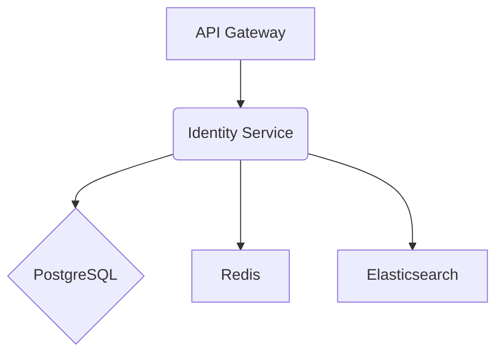

# **Service PRD: Identity Service**

## 1. 🎯 The Challenge: Problem Statement & Mission

### **Problem Statement**

> The Suuupra platform requires a centralized, secure, and scalable system to manage user identities and control access to its resources. A fragmented or insecure identity system would expose the platform to significant security risks and provide a poor user experience. The challenge is to build a comprehensive Identity and Access Management (IAM) service that can handle millions of users, support modern authentication protocols, and provide fine-grained access control.

### **Mission**

> To build a fortress of identity and access management that secures the Suuupra platform, empowers users with seamless and secure access, and provides administrators with granular control over permissions.

---

## 2. 🧠 The Gauntlet: Core Requirements & Edge Cases

### **Core Functional Requirements (FRs)**

| FR-ID | Feature | Description |
|---|---|---|
| FR-1  | **User Management** | The system can manage the entire user lifecycle, from registration to deletion. |
| FR-2  | **Authentication** | The system can authenticate users using various methods, including passwords and MFA. |
| FR-3  | **Authorization** | The system can authorize user access to resources based on their roles and permissions. |
| FR-4  | **OAuth2/OIDC Server** | The system can act as an OAuth2/OIDC provider for third-party applications. |
| FR-5  | **Session Management** | The system can manage user sessions and track active devices. |

### **Non-Functional Requirements (NFRs)**

| NFR-ID | Requirement | Target | Justification & Key Challenges |
|---|---|---|---|
| NFR-1 | **Security** | OWASP ASVS Level 3 | The identity service is a critical security component and must be highly secure. Challenge: Implementing a secure and robust authentication and authorization system. |
| NFR-2 | **Scalability** | 1B+ users | The system must be able to handle a large and growing number of users. Challenge: Designing a scalable architecture with PostgreSQL and Elasticsearch. |
| NFR-3 | **Performance** | <200ms auth response | Authentication must be fast and responsive. Challenge: Optimizing database queries and cryptographic operations. |

### **Edge Cases & Failure Scenarios**

- **Password Breach:** What happens if a user's password is leaked in a data breach? (e.g., the system should proactively notify the user and require a password reset).
- **MFA Device Loss:** What happens if a user loses their MFA device? (e.g., the system should provide a secure recovery mechanism, such as backup codes).
- **Concurrent Sessions:** How do we handle concurrent sessions for a single user? (e.g., the system should allow the user to view and manage their active sessions).

---

## 3. 🗺️ The Blueprint: Architecture & Design

### **3.1. System Architecture Diagram**



### **3.2. Tech Stack Deep Dive**

| Component | Technology | Version | Justification & Key Considerations |
|---|---|---|---|
| **Language/Framework** | `Java`, `Spring Boot` | `17+`, `3.x` | A mature and robust ecosystem for building enterprise-grade applications. |
| **Database** | `PostgreSQL`, `Redis`, `Elasticsearch` | `15`, `7+`, `8.x` | PostgreSQL for transactional data, Redis for caching and sessions, and Elasticsearch for user search. |
| **Authentication** | `Spring Security`, `Spring OAuth2` | `6.x`, `2.x` | Industry-standard libraries for authentication and authorization. |

### **3.3. Database Schema**

```sql
-- Users table with comprehensive fields
CREATE TABLE users (
    id UUID PRIMARY KEY DEFAULT gen_random_uuid(),
    email VARCHAR(255) UNIQUE NOT NULL,
    password_hash VARCHAR(255) NOT NULL,
    status VARCHAR(20) NOT NULL DEFAULT 'ACTIVE',
    email_verified BOOLEAN DEFAULT FALSE,
    phone_number VARCHAR(20),
    phone_verified BOOLEAN DEFAULT FALSE,
    
    -- Password policy fields
    password_changed_at TIMESTAMP DEFAULT CURRENT_TIMESTAMP,
    failed_login_attempts INTEGER DEFAULT 0,
    last_failed_login_at TIMESTAMP,
    locked_until TIMESTAMP,
    
    -- Audit fields
    created_at TIMESTAMP DEFAULT CURRENT_TIMESTAMP,
    updated_at TIMESTAMP DEFAULT CURRENT_TIMESTAMP,
    created_by UUID,
    updated_by UUID,
    version INTEGER DEFAULT 1
);

-- Hierarchical role system
CREATE TABLE roles (
    id UUID PRIMARY KEY DEFAULT gen_random_uuid(),
    name VARCHAR(100) UNIQUE NOT NULL,
    description TEXT,
    is_system BOOLEAN DEFAULT FALSE,
    created_at TIMESTAMP DEFAULT CURRENT_TIMESTAMP,
    updated_at TIMESTAMP DEFAULT CURRENT_TIMESTAMP
);

-- Granular permissions
CREATE TABLE permissions (
    id UUID PRIMARY KEY DEFAULT gen_random_uuid(),
    name VARCHAR(255) UNIQUE NOT NULL,
    resource VARCHAR(100) NOT NULL,
    action VARCHAR(100) NOT NULL,
    type VARCHAR(10) DEFAULT 'ALLOW',
    description TEXT,
    created_at TIMESTAMP DEFAULT CURRENT_TIMESTAMP
);
```

---

## 4. 🚀 The Quest: Implementation Plan & Milestones

### **Phase 1: User Management & Authentication (Weeks 1-2)**

- **Objective:** Implement the core user management and authentication features.
- **Key Results:**
  - Users can register, log in, and manage their profiles.
  - The system supports password and MFA authentication.
- **Tasks:**
  - [ ] **User Registration & Profile Management**: Implement user registration and profile management.
  - [ ] **Password Management & Security**: Implement secure password management.
  - [ ] **Multi-Factor Authentication**: Implement TOTP-based MFA.

### **Phase 2: OAuth2 & OpenID Connect (Weeks 2-3)**

- **Objective:** Implement the OAuth2 and OpenID Connect server.
- **Key Results:**
  - The service can act as an OAuth2/OIDC provider.
- **Tasks:**
  - [ ] **OAuth2 Authorization Server**: Set up the Spring Authorization Server.
  - [ ] **OpenID Connect Implementation**: Implement OpenID Connect on top of OAuth2.
  - [ ] **Advanced OAuth2 Features**: Implement advanced OAuth2 features like token exchange.

### **Phase 3: RBAC & Permission System (Weeks 3-4)**

- **Objective:** Implement the RBAC and permission system.
- **Key Results:**
  - The system can control access to resources based on roles and permissions.
- **Tasks:**
  - [ ] **Role-Based Access Control Engine**: Implement the RBAC engine.
  - [ ] **Attribute-Based Access Control (ABAC)**: Implement an ABAC policy engine.
  - [ ] **Session Management & Device Tracking**: Implement session and device management.

### **Phase 4: Federation & Advanced Features (Week 4)**

- **Objective:** Implement federation and advanced security features.
- **Key Results:**
  - The system supports SAML 2.0 and social login.
- **Tasks:**
  - [ ] **SAML 2.0 Implementation**: Implement SAML 2.0 IdP.
  - [ ] **Social Login Integration**: Integrate with social login providers.
  - [ ] **Advanced Security Features**: Implement risk-based authentication and behavioral biometrics.

---

## 5. 🧪 Testing & Quality Strategy

| Test Type | Tools | Coverage & Scenarios |
|---|---|---|
| **Unit Tests** | `JUnit`, `Mockito` | >95% coverage of all services and components. |
| **Integration Tests** | `Testcontainers` | Test the entire authentication and authorization flow. |
| **Load Tests** | `k6` | Simulate a high volume of authentication requests to test the performance and scalability of the service. |
| **Security Tests** | `OWASP ZAP` | Automated scanning for common vulnerabilities. |

---

## 6. 🔭 The Observatory: Monitoring & Alerting

### **Key Performance Indicators (KPIs)**

- **Technical Metrics:** `Authentication Latency`, `Token Validation Latency`, `Error Rate`.
- **Business Metrics:** `User Registrations`, `Active Users`, `Failed Logins`.

### **Dashboards & Alerts**

- **Grafana Dashboard:** A real-time overview of all KPIs, with drill-downs per authentication method.
- **Alerting Rules (Prometheus):**
  - `HighAuthLatency`: Trigger if p99 authentication latency exceeds 200ms.
  - `HighFailedLoginRate`: Trigger if the failed login rate exceeds a certain threshold.
  - `MfaBypassAttempt`: Trigger if there is a suspected MFA bypass attempt.

---

## 7. 📚 Learning & Knowledge Base

- **Key Concepts:** `OAuth2`, `OpenID Connect`, `RBAC`, `ABAC`, `SAML`, `Cryptography`.
- **Resources:**
  - [OAuth 2.0 and OpenID Connect](https://www.oauth.com/)
  - [NIST Digital Identity Guidelines](https://pages.nist.gov/800-63-3/)

---
