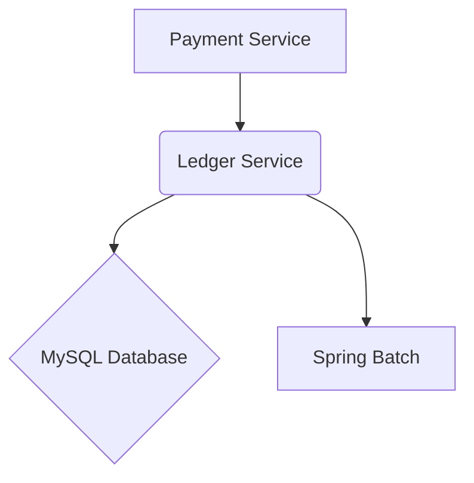

# **Service PRD: Ledger Service**

## 1. 🎯 The Challenge: Problem Statement & Mission

### **Problem Statement**
> The Suuupra platform needs a highly reliable and auditable system to track all financial transactions. A simple database table is not sufficient to ensure data integrity and provide a complete audit trail. The challenge is to build an enterprise-grade, double-entry accounting ledger that is secure, scalable, and compliant with financial regulations.

### **Mission**
> To build a fortress of financial data integrity that provides a complete and immutable record of all transactions on the Suuupra platform.

---

## 2. 🧠 The Gauntlet: Core Requirements & Edge Cases

### **Core Functional Requirements (FRs)**

| FR-ID | Feature | Description |
|---|---|---|
| FR-1  | **Double-Entry Accounting** | All transactions are recorded using the double-entry bookkeeping method. |
| FR-2  | **ACID Transactions** | All database transactions are ACID compliant. |
| FR-3  | **Automated Reconciliation** | The system can automatically reconcile internal records with bank statements. |
| FR-4  | **Cryptographic Hash Chains** | All transactions are linked in a cryptographic hash chain to ensure data integrity. |
| FR-5  | **Financial Reporting** | The system can generate financial reports, such as a trial balance. |

### **Non-Functional Requirements (NFRs)**

| NFR-ID | Requirement | Target | Justification & Key Challenges |
|---|---|---|---|
| NFR-1 | **Data Integrity** | 100% | The system must ensure the integrity of all financial data. Challenge: Implementing a robust hash chain and reconciliation process. |
| NFR-2 | **Scalability** | 10M+ transactions/day | The system must be able to handle a high volume of transactions. Challenge: Designing a scalable architecture with Spring Batch. |
| NFR-3 | **Performance** | <100ms transaction processing | Transaction processing must be fast and efficient. Challenge: Optimizing database queries and batch processing jobs. |

### **Edge Cases & Failure Scenarios**

*   **Reconciliation Failure:** What happens if the automated reconciliation process fails? (e.g., the system should create an exception report and alert the finance team).
*   **Hash Chain Break:** What happens if the hash chain is broken? (e.g., the system should trigger a critical alert and halt all new transactions until the issue is resolved).
*   **Concurrent Updates:** How do we handle concurrent updates to the same account balance? (e.g., use optimistic or pessimistic locking to prevent race conditions).

---

## 3. 🗺️ The Blueprint: Architecture & Design

### **3.1. System Architecture Diagram**



### **3.2. Tech Stack Deep Dive**

| Component | Technology | Version | Justification & Key Considerations |
|---|---|---|---|
| **Language/Framework** | `Java`, `Spring Boot` | `17+`, `3.x` | A mature and robust ecosystem for building enterprise-grade applications. |
| **Database** | `MySQL` | `8.x` | A reliable and widely used relational database with support for ACID transactions. |
| **Batch Processing** | `Spring Batch` | `5.x` | A powerful framework for building robust batch processing applications. |

### **3.3. Database Schema**

```sql
-- Chart of Accounts
CREATE TABLE chart_of_accounts (
    id VARCHAR(36) PRIMARY KEY,
    account_code VARCHAR(20) UNIQUE NOT NULL,
    account_name VARCHAR(100) NOT NULL,
    account_type ENUM('ASSET', 'LIABILITY', 'EQUITY', 'REVENUE', 'EXPENSE') NOT NULL,
    parent_account_id VARCHAR(36),
    is_active BOOLEAN DEFAULT TRUE,
    description TEXT,
    created_at TIMESTAMP DEFAULT CURRENT_TIMESTAMP,
    updated_at TIMESTAMP DEFAULT CURRENT_TIMESTAMP ON UPDATE CURRENT_TIMESTAMP,
    FOREIGN KEY (parent_account_id) REFERENCES chart_of_accounts(id)
);

-- Transactions Table
CREATE TABLE transactions (
    id VARCHAR(36) PRIMARY KEY,
    transaction_number VARCHAR(50) UNIQUE NOT NULL,
    reference_id VARCHAR(100),
    transaction_type VARCHAR(50) NOT NULL,
    description TEXT NOT NULL,
    total_amount DECIMAL(19,4) NOT NULL,
    currency VARCHAR(3) DEFAULT 'INR',
    transaction_date DATE NOT NULL,
    posting_date DATE NOT NULL,
    status ENUM('PENDING', 'POSTED', 'REVERSED', 'CANCELLED') DEFAULT 'PENDING',
    source_system VARCHAR(50) NOT NULL,
    created_by VARCHAR(36) NOT NULL,
    hash_value VARCHAR(64) NOT NULL,
    previous_hash VARCHAR(64),
    created_at TIMESTAMP DEFAULT CURRENT_TIMESTAMP,
    posted_at TIMESTAMP NULL
);

-- Journal Entries Table
CREATE TABLE journal_entries (
    id VARCHAR(36) PRIMARY KEY,
    transaction_id VARCHAR(36) NOT NULL,
    account_id VARCHAR(36) NOT NULL,
    debit_amount DECIMAL(19,4) DEFAULT 0.0000,
    credit_amount DECIMAL(19,4) DEFAULT 0.0000,
    balance_after DECIMAL(19,4) NOT NULL,
    description TEXT,
    entry_sequence INT NOT NULL,
    hash_value VARCHAR(64) NOT NULL,
    created_at TIMESTAMP DEFAULT CURRENT_TIMESTAMP,
    FOREIGN KEY (transaction_id) REFERENCES transactions(id),
    FOREIGN KEY (account_id) REFERENCES chart_of_accounts(id)
);
```

---

## 4. 🚀 The Quest: Implementation Plan & Milestones

### **Phase 1: Foundation & Double-Entry Service (Weeks 9-10)**

*   **Objective:** Implement the core double-entry accounting service.
*   **Key Results:**
    *   The service can create and post valid double-entry transactions.
    *   Account balances are updated correctly.
*   **Tasks:**
    *   [ ] **Spring Boot Foundation & Database Schema**: Set up the project and database schema.
    *   [ ] **Double-Entry Service Implementation**: Implement the core ledger service.

### **Phase 2: Cryptographic Hash Chain & Reconciliation (Weeks 10-11)**

*   **Objective:** Implement the cryptographic hash chain and automated reconciliation engine.
*   **Key Results:**
    *   All transactions are linked in a cryptographic hash chain.
    *   The system can automatically reconcile internal records with bank statements.
*   **Tasks:**
    *   [ ] **Merkle Tree & Hash Chain**: Implement the hash service and integrity verification.
    *   [ ] **Automated Reconciliation Engine**: Implement the bank statement reconciliation service.

### **Phase 3: Settlement Processing & Reporting (Weeks 11-12)**

*   **Objective:** Implement the settlement processing and financial reporting engine.
*   **Key Results:**
    *   The system can process daily settlements using Spring Batch.
    *   The system can generate financial reports, such as a trial balance.
*   **Tasks:**
    *   [ ] **Spring Batch Settlement Processing**: Implement the settlement batch job.
    *   [ ] **Financial Reporting Engine**: Implement the financial reporting service.

---

## 5. 🧪 Testing & Quality Strategy

| Test Type | Tools | Coverage & Scenarios |
|---|---|---|
| **Unit Tests** | `JUnit`, `Mockito` | >95% coverage of all services and components. |
| **Integration Tests** | `Testcontainers` | Test the entire transaction lifecycle, from creation to reconciliation. |
| **Load Tests** | `JMeter` | Simulate a high volume of transactions to test the performance and scalability of the service. |

---

## 6. 🔭 The Observatory: Monitoring & Alerting

### **Key Performance Indicators (KPIs)**
*   **Technical Metrics:** `Transaction Processing Time`, `Batch Job Execution Time`, `Reconciliation Rate`.
*   **Business Metrics:** `Total Transaction Volume`, `Total Transaction Value`, `Number of Reconciliation Exceptions`.

### **Dashboards & Alerts**
*   **Grafana Dashboard:** A real-time overview of all KPIs, with drill-downs per transaction type and account.
*   **Alerting Rules (Prometheus):**
    *   `HighTransactionFailureRate`: Trigger if the transaction failure rate exceeds 0.01%.
    *   `BatchJobFailure`: Trigger if a Spring Batch job fails.
    *   `ReconciliationMismatch`: Trigger if the number of reconciliation exceptions exceeds a certain threshold.

---

## 7. 📚 Learning & Knowledge Base

*   **Key Concepts:** `Double-Entry Bookkeeping`, `ACID Transactions`, `Spring Batch`, `Cryptographic Hash Chains`.
*   **Resources:**
    *   [Spring Batch Documentation](https://docs.spring.io/spring-batch/docs/current/reference/html/)
    *   [Double-Entry Bookkeeping for Developers](https://www.moderntreasury.com/journal/double-entry-bookkeeping-for-developers)

---