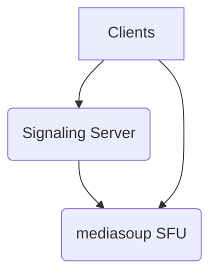

# **Service PRD: Live Classes Service**

**📊 Document Status**: `PRODUCTION READY ✅`  
**🔄 Version**: `2.0`  
**📅 Last Updated**: `2025-01-27`

## 1. 🎯 The Challenge: Problem Statement & Mission

### **Problem Statement**
> The Suuupra platform needs to provide a highly interactive and engaging live learning experience for its users. A simple one-way video stream is not sufficient to facilitate effective learning. The challenge is to build a real-time, interactive streaming platform that can support multi-participant video/audio, screen sharing, and collaborative features like a shared whiteboard, all while maintaining low latency and high quality.

### **Mission**
> To build a world-class live learning platform that provides an immersive and interactive educational experience, connecting teachers and learners in real-time.

---

## 2. 🧠 The Gauntlet: Core Requirements & Edge Cases

### **Core Functional Requirements (FRs)**

| FR-ID | Feature | Description |
|---|---|---|
| FR-1  | **Real-time Communication** | The system supports multi-participant video/audio streaming, screen sharing, and chat. |
| FR-2  | **Collaborative Features** | The system provides a shared whiteboard and other collaborative tools. |
| FR-3  | **Recording** | The system can record live sessions for later playback. |
| FR-4  | **Participant Controls** | The system provides controls for managing participants, such as mute/unmute and video on/off. |

### **Non-Functional Requirements (NFRs)**

| NFR-ID | Requirement | Target | Justification & Key Challenges |
|---|---|---|---|
| NFR-1 | **Latency** | <300ms | Low latency is critical for a real-time interactive experience. Challenge: Optimizing the WebRTC SFU and network infrastructure. |
| NFR-2 | **Scalability** | 1000+ concurrent users/room | The system must be able to handle large live classes. Challenge: Designing a scalable architecture with load-balanced mediasoup workers. |
| NFR-3 | **Reliability** | 99.9% connection success | Users must be able to reliably connect to and participate in live classes. Challenge: Implementing a resilient and fault-tolerant system. |

### **Edge Cases & Failure Scenarios**

*   **Network Congestion:** How does the system handle poor network conditions for participants? (e.g., implement adaptive bitrate streaming to adjust video quality based on network conditions).
*   **Signaling Server Failure:** What happens if the signaling server fails? (e.g., implement a redundant signaling server setup with failover).
*   **Media Server Failure:** What happens if a mediasoup worker fails? (e.g., implement a mechanism to migrate participants to a new worker).

---

## 3. 🗺️ The Blueprint: Architecture & Design

### **3.1. System Architecture Diagram**

### **3.2. Tech Stack Deep Dive**

| Component | Technology | Version | Justification & Key Considerations |
|---|---|---|---|
| **Language/Framework** | `Node.js` | `18.x` | A good choice for a real-time signaling server with its event-driven architecture. |
| **WebRTC SFU** | `mediasoup` | `3.x` | A powerful and flexible SFU for building real-time communication applications. |
| **Real-time Communication** | `Socket.IO` | `4.x` | A library for real-time, bidirectional communication between clients and servers. |

### **3.3. Data Structures & Algorithms**

*   **Priority Queue:** For ordering chat messages and other real-time events.
*   **Consistent Hashing:** For distributing participants across mediasoup workers.

---

## 4. 🚀 The Quest: Implementation Plan & Milestones

### **Phase 1: Core WebRTC Infrastructure (Weeks 13-14)**

*   **Objective:** Set up the core WebRTC infrastructure.
*   **Key Results:**
    *   Participants can join a room and stream video/audio to each other.
*   **Tasks:**
    *   [ ] **Setup mediasoup server infrastructure**.
    *   [ ] **Implement SFU (Selective Forwarding Unit) core**.
    *   [ ] **WebRTC peer connection management**.
    *   [ ] **Room management system**.
    *   [ ] **Basic signaling server with Socket.IO**.

### **Phase 2: Real-time Communication Features (Weeks 14-15)**

*   **Objective:** Implement real-time communication features.
*   **Key Results:**
    *   Participants can use screen sharing, chat, and a shared whiteboard.
*   **Tasks:**
    *   [ ] **Multi-participant video/audio streaming**.
    *   [ ] **Screen sharing capabilities**.
    *   [ ] **Chat system with message persistence**.
    *   [ ] **Whiteboard collaborative features**.
    *   [ ] **Participant controls (mute/unmute, video on/off)**.

### **Phase 3: Recording & Advanced Features (Weeks 15-17)**

*   **Objective:** Implement the recording pipeline and advanced features.
*   **Key Results:**
    *   Live sessions can be recorded and stored.
    *   The system supports breakout rooms and other advanced features.
*   **Tasks:**
    *   [ ] **Recording Pipeline**: Implement a multi-quality stream recording pipeline.
    *   [ ] **Advanced Features**: Implement breakout rooms, hand raising, and file sharing.

### **Phase 4: Performance, Scaling & Optimization (Weeks 17-18)**

*   **Objective:** Optimize the service for performance and scalability.
*   **Key Results:**
    *   The service can handle 1000+ concurrent users per room.
    *   The service is ready for production deployment.
*   **Tasks:**
    *   [ ] **Load balancing for mediasoup workers**.
    *   [ ] **Connection quality monitoring**.
    *   [ ] **Adaptive bitrate for poor networks**.
    *   [ ] **Load testing and optimization**.

---

## 5. 🧪 Testing & Quality Strategy

| Test Type | Tools | Coverage & Scenarios |
|---|---|---|
| **Unit Tests** | `Jest` | >90% coverage of all signaling logic and room management code. |
| **Integration Tests** | `Puppeteer` | Test the entire WebRTC connection and media streaming flow. |
| **Load Tests** | `k6` | Simulate a large number of concurrent users to test the scalability of the SFU. |

---

## 6. 🔭 The Observatory: Monitoring & Alerting

### **Key Performance Indicators (KPIs)**
*   **Technical Metrics:** `WebRTC Connection Time`, `Media Latency`, `Packet Loss`, `Jitter`.
*   **Business Metrics:** `Participant Engagement`, `Session Duration`, `Feature Usage`.

### **Dashboards & Alerts**
*   **Grafana Dashboard:** A real-time overview of all KPIs, with drill-downs per room and participant.
*   **Alerting Rules (Prometheus):**
    *   `HighConnectionFailureRate`: Trigger if the WebRTC connection failure rate exceeds 5%.
    *   `HighMediaLatency`: Trigger if the media latency exceeds 500ms.
    *   `HighPacketLoss`: Trigger if the packet loss rate exceeds 10%.

---

## 7. 📚 Learning & Knowledge Base

*   **Key Concepts:** `WebRTC`, `SFU`, `Signaling`, `Media Codecs`, `Real-time Systems`.
*   **Resources:**
    *   [WebRTC Documentation](https://webrtc.org/documentation/)
    *   [mediasoup Documentation](https://mediasoup.org/documentation/)

---