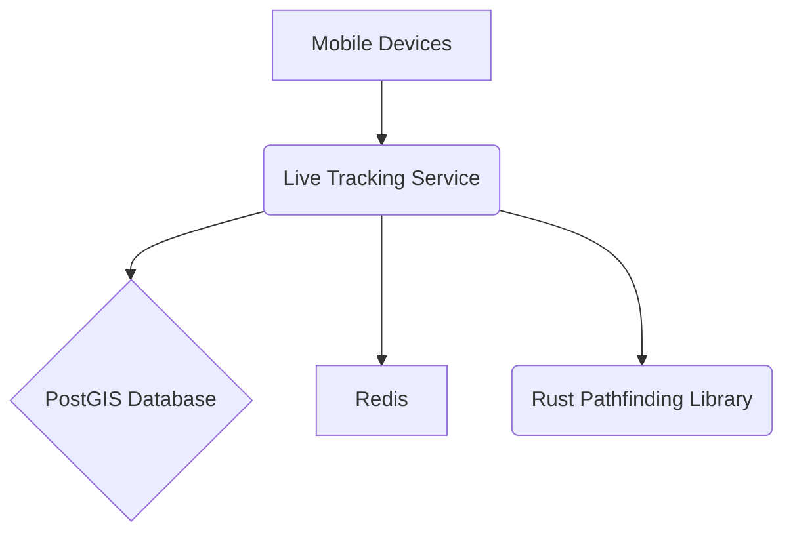

# **Service PRD: Live Tracking Service**

## 1. 🎯 The Challenge: Problem Statement & Mission

### **Problem Statement**
> The Suuupra platform needs to provide real-time tracking of its mobile entities, such as delivery drivers and buses. This requires a high-performance system that can ingest a massive volume of GPS data, process it in real-time, and provide accurate location updates and ETA calculations. The challenge is to build a system that is not only scalable and reliable but also provides advanced features like geofencing and route optimization.

### **Mission**
> To build a world-class live tracking system that provides real-time visibility into the location and movement of all mobile entities on the Suuupra platform, enabling us to optimize our operations and provide a better experience for our users.

---

## 2. 🧠 The Gauntlet: Core Requirements & Edge Cases

### **Core Functional Requirements (FRs)**

| FR-ID | Feature | Description |
|---|---|---|
| FR-1  | **Real-time Tracking** | The system can ingest and process real-time GPS data from mobile devices. |
| FR-2  | **Geofencing** | The system can create, manage, and trigger events based on geofences. |
| FR-3  | **Route Optimization** | The system can calculate the optimal route between two points. |
| FR-4  | **ETA Calculation** | The system can calculate the estimated time of arrival (ETA) for a given route. |
| FR-5  | **k-NN Search** | The system can find the k-nearest neighbors to a given point. |

### **Non-Functional Requirements (NFRs)**

| NFR-ID | Requirement | Target | Justification & Key Challenges |
|---|---|---|---|
| NFR-1 | **Latency** | <100ms for location updates | Real-time tracking requires low-latency location updates. Challenge: Optimizing the data ingestion and processing pipeline. |
| NFR-2 | **Scalability** | 1M+ tracked entities | The system must be able to handle a large and growing number of tracked entities. Challenge: Designing a scalable architecture with Go and Rust. |
| NFR-3 | **Accuracy** | <10m for location | The system must provide accurate location data. Challenge: Handling GPS inaccuracies and signal loss. |

### **Edge Cases & Failure Scenarios**

*   **GPS Signal Loss:** How does the system handle cases where a device loses its GPS signal? (e.g., use a combination of cellular and Wi-Fi triangulation to estimate the location).
*   **Map Data Inaccuracy:** What happens if the map data is inaccurate? (e.g., provide a mechanism for users to report map errors).
*   **Route Recalculation:** How does the system handle cases where a driver deviates from the optimal route? (e.g., automatically recalculate the route and update the ETA).

---

## 3. 🗺️ The Blueprint: Architecture & Design

### **3.1. System Architecture Diagram**



### **3.2. Tech Stack Deep Dive**

| Component | Technology | Version | Justification & Key Considerations |
|---|---|---|---|
| **Language/Framework** | `Go`, `Rust` | `1.21`, `1.72` | Go for the main service and Rust for the CPU-intensive pathfinding library. |
| **Database** | `PostGIS`, `Redis` | `15`, `7+` | PostGIS for geospatial queries and Redis for caching last known locations. |

### **3.3. Database Schema**

```sql
-- Enable PostGIS extension
CREATE EXTENSION postgis;

-- Table for tracked entities
CREATE TABLE tracked_entities (
    id UUID PRIMARY KEY,
    type VARCHAR(50) NOT NULL -- e.g., 'delivery_driver', 'bus'
);

-- Table for location history
CREATE TABLE location_history (
    id BIGSERIAL PRIMARY KEY,
    entity_id UUID NOT NULL REFERENCES tracked_entities(id),
    coordinates GEOGRAPHY(POINT, 4326) NOT NULL,
    timestamp TIMESTAMPTZ DEFAULT NOW()
);

-- Spatial index for efficient location queries
CREATE INDEX location_history_coordinates_idx ON location_history USING GIST (coordinates);

-- Table for geofences
CREATE TABLE geofences (
    id UUID PRIMARY KEY,
    name VARCHAR(255) NOT NULL,
    area GEOGRAPHY(POLYGON, 4326) NOT NULL
);

-- Spatial index for efficient geofence queries
CREATE INDEX geofences_area_idx ON geofences USING GIST (area);
```

---

## 4. 🚀 The Quest: Implementation Plan & Milestones

### **Phase 1: Foundation & GPS Ingestion (Week 1)**

*   **Objective:** Set up the core infrastructure and the data ingestion pipeline.
*   **Key Results:**
    *   The service can ingest and store real-time GPS data.
*   **Tasks:**
    *   [ ] **Project Setup**: Initialize the Go and Rust projects.
    *   [ ] **GPS Data Ingestion**: Create a WebSocket or UDP endpoint to receive GPS data.

### **Phase 2: Real-time Tracking & Geofencing (Week 2)**

*   **Objective:** Build the core real-time tracking and geofencing features.
*   **Key Results:**
    *   The service can provide real-time location updates and trigger geofence events.
*   **Tasks:**
    *   [ ] **Real-time Tracking API**: Implement an API to get the real-time location of a tracked entity.
    *   [ ] **Geofencing**: Implement an API to create, manage, and trigger geofences.

### **Phase 3: Routing & ETA Calculation (Week 3)**

*   **Objective:** Implement route optimization and ETA calculation.
*   **Key Results:**
    *   The service can calculate the optimal route and ETA between two points.
*   **Tasks:**
    *   [ ] **Route Optimization (Rust)**: Implement the A* pathfinding algorithm in Rust.
    *   [ ] **ETA Calculation (Go)**: Create an API to calculate the ETA for a given route.

### **Phase 4: Geospatial Indexing & k-NN (Week 4)**

*   **Objective:** Implement efficient geospatial search.
*   **Key Results:**
    *   The service can perform k-NN and Geohash-based searches.
*   **Tasks:**
    *   [ ] **k-NN Search**: Implement a k-NN search to find the closest entities to a given point.
    *   [ ] **Geohashing**: Implement Geohashing for low-latency nearby searches.

### **Phase 5: Finalization (Week 5)**

*   **Objective:** Integrate all components, test thoroughly, and prepare for deployment.
*   **Key Results:**
    *   The service is fully integrated, tested, and ready for deployment.
*   **Tasks:**
    *   [ ] **Integration & Testing**: Integrate the Go service with the Rust library and write comprehensive tests.
    *   [ ] **Deployment**: Dockerize the service and prepare it for deployment.

---

## 5. 🧪 Testing & Quality Strategy

| Test Type | Tools | Coverage & Scenarios |
|---|---|---|
| **Unit Tests** | `Go testing`, `Cargo test` | >90% coverage of all Go and Rust code. |
| **Integration Tests** | `Testcontainers` | Test the interaction between the Go service, Rust library, PostGIS, and Redis. |
| **Load Tests** | `k6` | Simulate a high volume of GPS updates and API requests to test the performance and scalability of the service. |

---

## 6. 🔭 The Observatory: Monitoring & Alerting

### **Key Performance Indicators (KPIs)**
*   **Technical Metrics:** `Location Update Latency`, `ETA Accuracy`, `Route Calculation Time`.
*   **Business Metrics:** `Number of Tracked Entities`, `Geofence Events per Hour`.

### **Dashboards & Alerts**
*   **Grafana Dashboard:** A real-time overview of all KPIs, with drill-downs per tracked entity and geofence.
*   **Alerting Rules (Prometheus):**
    *   `HighLocationUpdateLatency`: Trigger if the p99 location update latency exceeds 100ms.
    *   `HighEtaErrorRate`: Trigger if the ETA error rate exceeds 10%.
    *   `RouteCalculationTimeout`: Trigger if the route calculation time exceeds 5 seconds.

---

## 7. 📚 Learning & Knowledge Base

*   **Key Concepts:** `Geospatial Systems`, `Polyglot Programming`, `Pathfinding Algorithms`, `Spatial Indexing`.
*   **Resources:**
    *   [PostGIS Documentation](https://postgis.net/docs/)
    *   [A* Search Algorithm](https://en.wikipedia.org/wiki/A*_search_algorithm)

---