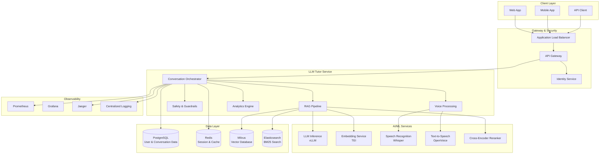

# LLM Tutor Service

A production-ready AI-powered educational tutoring service with RAG (Retrieval-Augmented Generation), voice capabilities, and comprehensive safety features.

## 🌟 Features

- **🤖 Advanced AI Tutoring**: GPT-based conversational AI with educational focus
- **📚 RAG Pipeline**: Hybrid retrieval with vector + BM25 search and reranking
- **🎙️ Voice Interface**: Speech-to-text and text-to-speech capabilities
- **🔒 Safety & Security**: Multi-layered content filtering and safety guardrails
- **📊 Analytics**: Learning progress tracking and personalized recommendations
- **🎯 Personalization**: Adaptive difficulty and learning style matching
- **🔍 Observability**: Comprehensive metrics, tracing, and logging
- **🚀 Production Ready**: Kubernetes deployment with auto-scaling

## 🏗️ Architecture



## 🚀 Quick Start

### Prerequisites

- Python 3.11+
- Docker & Docker Compose
- Kubernetes cluster (for production)
- PostgreSQL, Redis, Milvus, Elasticsearch

### Development Setup

1. **Clone the repository**
   ```bash
   git clone <repository-url>
   cd services/llm-tutor
   ```

2. **Create virtual environment**
   ```bash
   python -m venv venv
   source venv/bin/activate  # On Windows: venv\Scripts\activate
   pip install -r requirements.txt
   ```

3. **Setup environment variables**
   ```bash
   cp .env.example .env
   # Edit .env with your configuration
   ```

4. **Start infrastructure services**
   ```bash
   docker-compose up -d postgres redis milvus elasticsearch
   ```

5. **Run database migrations**
   ```bash
   ./scripts/migrate.sh upgrade
   ```

6. **Start the application**
   ```bash
   uvicorn src.main:app --host 0.0.0.0 --port 8092 --reload
   ```

The service will be available at `http://localhost:8092`

### API Documentation

- **Swagger UI**: `http://localhost:8092/docs`
- **ReDoc**: `http://localhost:8092/redoc`
- **Health Check**: `http://localhost:8092/health`

## 🐳 Docker Deployment

### Build the image
```bash
./scripts/build.sh
```

### Run with Docker Compose
```bash
docker-compose up -d
```

This starts the complete stack including:
- LLM Tutor service
- PostgreSQL database
- Redis cache
- Milvus vector database
- Elasticsearch
- Prometheus & Grafana monitoring

## ☸️ Kubernetes Deployment

### Prerequisites
- Kubernetes cluster (EKS, GKE, AKS, or local)
- kubectl configured
- Helm 3.x

### Deploy to Kubernetes
```bash
# Set environment variables
export ENVIRONMENT=development
export NAMESPACE=llm-tutor
export REGISTRY=your-registry.com
export TAG=latest

# Deploy
./scripts/deploy.sh
```

### Infrastructure with Terraform

For production AWS deployment:

```bash
cd infrastructure/terraform

# Initialize Terraform
terraform init

# Plan deployment
terraform plan -var-file="terraform.tfvars"

# Apply infrastructure
terraform apply -var-file="terraform.tfvars"
```

## 🧪 Testing

### Run all tests
```bash
./scripts/test.sh
```

### Run specific test types
```bash
./scripts/test.sh unit        # Unit tests only
./scripts/test.sh integration # Integration tests
./scripts/test.sh performance # Performance tests
./scripts/test.sh security    # Security tests
./scripts/test.sh e2e         # End-to-end tests
```

### Test Coverage
The project maintains >80% test coverage across:
- Unit tests for individual components
- Integration tests for service interactions
- Performance benchmarks
- Security vulnerability scanning
- End-to-end user journey tests

## 📊 Monitoring & Observability

### Metrics (Prometheus)
- Request/response metrics
- LLM inference performance
- RAG pipeline quality
- Voice processing metrics
- User engagement analytics

### Tracing (Jaeger)
- Distributed request tracing
- LLM inference timing
- RAG pipeline stages
- Voice processing pipeline

### Dashboards (Grafana)
- **Performance Dashboard**: Latency, throughput, error rates
- **RAG Quality Dashboard**: Relevance scores, hit rates
- **Cost Optimization**: Token usage, GPU utilization
- **User Analytics**: Engagement, learning progress
- **Safety Monitoring**: Content filtering, violations

Access monitoring:
- Grafana: `http://localhost:3000` (admin/admin)
- Prometheus: `http://localhost:9090`
- Jaeger: `http://localhost:16686`

## 🔒 Security Features

### Authentication & Authorization
- JWT-based authentication
- Role-based access control (RBAC)
- Session management with Redis
- Rate limiting per user tier

### Content Safety
- Input/output content filtering
- Prompt injection detection
- Jailbreak attempt prevention
- Age-appropriate content filtering
- PII detection and anonymization

### Infrastructure Security
- Container vulnerability scanning
- Dependency security monitoring
- Network security groups
- Encrypted data at rest and in transit
- Security audit logging

## 🎯 API Endpoints

### Core Endpoints
- `POST /api/v1/conversations/` - Start new conversation
- `POST /api/v1/conversations/{id}/messages` - Send text message
- `POST /api/v1/conversations/{id}/messages/voice` - Send voice message
- `GET /api/v1/conversations/{id}/messages` - Get conversation history

### Voice Processing
- `POST /api/v1/voice/transcribe` - Transcribe audio to text
- `POST /api/v1/voice/synthesize` - Convert text to speech
- `GET /api/v1/voice/voices` - List available voices

### User Management
- `GET /api/v1/users/profile` - Get user profile
- `PUT /api/v1/users/profile` - Update user profile
- `GET /api/v1/users/progress` - Get learning progress
- `GET /api/v1/users/stats` - Get user statistics

### Analytics
- `GET /api/v1/analytics/dashboard` - Analytics dashboard
- `GET /api/v1/analytics/progress-trend` - Learning progress trends
- `GET /api/v1/analytics/recommendations` - Personalized recommendations

### Admin (Admin role required)
- `GET /api/v1/admin/stats` - System statistics
- `GET /api/v1/admin/users` - List users
- `GET /api/v1/admin/conversations` - List conversations
- `GET /api/v1/admin/feedback` - User feedback

## 🔧 Configuration

### Environment Variables

| Variable | Description | Default |
|----------|-------------|---------|
| `ENVIRONMENT` | Environment (development/staging/production) | development |
| `DATABASE_URL` | PostgreSQL connection URL | postgresql+asyncpg://... |
| `REDIS_URL` | Redis connection URL | redis://localhost:6379/0 |
| `MILVUS_HOST` | Milvus vector database host | localhost |
| `ELASTICSEARCH_URL` | Elasticsearch URL | http://localhost:9200 |
| `LLM_MODEL_NAME` | LLM model name | microsoft/DialoGPT-large |
| `EMBEDDING_MODEL_NAME` | Embedding model name | sentence-transformers/all-MiniLM-L6-v2 |
| `ENABLE_VOICE_INTERFACE` | Enable voice features | true |
| `ENABLE_CONTENT_FILTER` | Enable safety filtering | true |
| `JWT_SECRET_KEY` | JWT signing secret | dev-secret-key |

See `.env.example` for complete configuration options.

### Model Configuration

The service supports various AI models:

**LLM Models:**
- GPT-based models via OpenAI API
- Open-source models via Hugging Face
- Custom fine-tuned models

**Embedding Models:**
- sentence-transformers models
- OpenAI embeddings
- Custom embedding models

**Voice Models:**
- Whisper for speech recognition
- OpenVoice/Coqui for text-to-speech

## 📈 Performance

### Benchmarks
- **p95 Latency**: <2s for text responses
- **p95 Latency**: <5s for voice responses
- **Throughput**: 100+ concurrent users
- **Accuracy**: >90% grounded responses
- **Safety**: <0.1% harmful content pass-through

### Scaling
- Horizontal pod autoscaling based on CPU/memory
- GPU node autoscaling for ML workloads
- Database connection pooling
- Redis caching for session data
- CDN for static assets

## 🤝 Contributing

1. Fork the repository
2. Create a feature branch (`git checkout -b feature/amazing-feature`)
3. Make your changes
4. Run tests (`./scripts/test.sh`)
5. Commit your changes (`git commit -m 'Add amazing feature'`)
6. Push to the branch (`git push origin feature/amazing-feature`)
7. Open a Pull Request

### Development Guidelines
- Follow PEP 8 style guide
- Write comprehensive tests
- Update documentation
- Ensure security best practices
- Add appropriate logging and metrics

## 📄 License

This project is licensed under the MIT License - see the [LICENSE](LICENSE) file for details.

## 🆘 Support

- **Documentation**: [docs/](docs/)
- **Issues**: GitHub Issues
- **Discussions**: GitHub Discussions
- **Security**: security@yourcompany.com

## 🗺️ Roadmap

### Phase 1 (Current) ✅
- Core conversational AI
- RAG pipeline
- Voice interface
- Safety guardrails
- Basic analytics

### Phase 2 (Next)
- Advanced personalization
- Multi-language support
- Mobile SDK
- Advanced analytics
- A/B testing framework

### Phase 3 (Future)
- Real-time collaboration
- Video processing
- Advanced AI tutors
- Marketplace integration
- White-label solutions

---

**Built with ❤️ by the Suuupra team**
