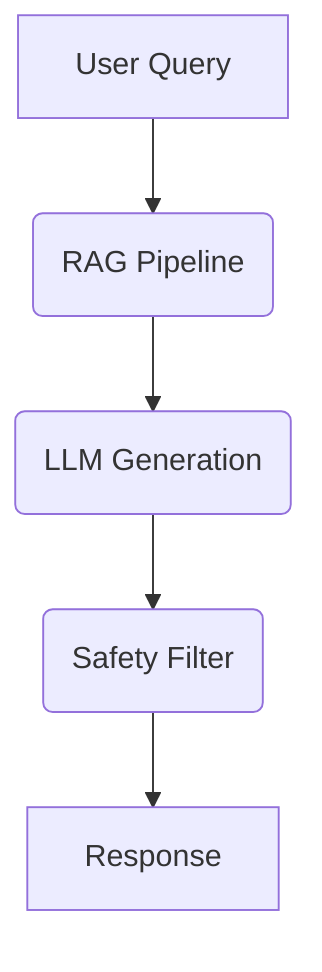

# **Service PRD: LLM Tutor Service**

## 1. 🎯 The Challenge: Problem Statement & Mission

### **Problem Statement**
> Traditional online learning often lacks the personalized guidance and immediate feedback that a human tutor can provide. The challenge is to build an AI-powered tutoring system that can understand a student's needs, provide personalized learning paths, and offer real-time assistance, all while ensuring the content is safe, accurate, and age-appropriate.

### **Mission**
> To build a revolutionary AI tutoring system that provides a personalized, engaging, and effective learning experience for every student on the Suuupra platform.

---

## 2. 🧠 The Gauntlet: Core Requirements & Edge Cases

### **Core Functional Requirements (FRs)**

| FR-ID | Feature | Description |
|---|---|---|
| FR-1  | **Conversational AI** | The system can engage in natural, multi-turn conversations with students. |
| FR-2  | **RAG & Knowledge Base** | The system can retrieve and use information from a vast knowledge base to answer student questions. |
| FR-3  | **Personalized Learning** | The system can adapt to each student's learning style and pace. |
| FR-4  | **Safety & Moderation** | The system can filter out harmful or inappropriate content. |
| FR-5  | **Adaptive Assessment** | The system can assess a student's knowledge and identify areas for improvement. |

### **Non-Functional Requirements (NFRs)**

| NFR-ID | Requirement | Target | Justification & Key Challenges |
|---|---|---|---|
| NFR-1 | **Response Latency** | <2s for 95th percentile | The system must provide real-time responses to keep students engaged. Challenge: Optimizing LLM inference and RAG retrieval. |
| NFR-2 | **Accuracy** | >90% for factual content | The system must provide accurate and reliable information. Challenge: Ensuring the quality of the knowledge base and the accuracy of the LLM's responses. |
| NFR-3 | **Safety** | <0.1% harmful content | The system must be safe for students of all ages. Challenge: Implementing robust safety filters and content moderation. |

### **Edge Cases & Failure Scenarios**

*   **Hallucinations:** How do we handle cases where the LLM generates factually incorrect or nonsensical information? (e.g., use RAG to ground the LLM in factual knowledge and implement a fact-checking mechanism).
*   **Harmful Content:** How do we prevent the LLM from generating harmful or inappropriate content? (e.g., use a multi-layered safety filter and content moderation system).
*   **Student Disengagement:** What happens if a student becomes disengaged or frustrated? (e.g., the system should detect signs of disengagement and adapt its teaching strategy accordingly).

---

## 3. 🗺️ The Blueprint: Architecture & Design

### **3.1. System Architecture Diagram**

### **3.2. Tech Stack Deep Dive**

| Component | Technology | Version | Justification & Key Considerations |
|---|---|---|---|
| **LLM Serving** | `vLLM` | - | A high-throughput and memory-efficient inference and serving engine for LLMs. |
| **Backend** | `Python`, `FastAPI` | `3.11`, `0.104` | High-performance, async framework ideal for ML-powered services. |
| **Vector Database** | `ChromaDB` or `Pinecone` | - | For efficient storage and retrieval of vector embeddings. |
| **Memory Store** | `Redis` | `7+` | For caching and session management. |

### **3.3. Key Components**

*   **RAG Pipeline:** Responsible for retrieving relevant context from the knowledge base to ground the LLM.
*   **Memory Systems:** Responsible for managing the conversation history and personalizing the learning experience.
*   **Safety Filters:** Responsible for filtering out harmful or inappropriate content.

---

## 4. 🚀 The Quest: Implementation Plan & Milestones

### **Phase 1: LLM Foundation & RAG (Weeks 19-20)**

*   **Objective:** Set up the core LLM infrastructure and implement the RAG pipeline.
*   **Key Results:**
    *   The system can answer student questions using information from the knowledge base.
*   **Tasks:**
    *   [ ] **LLM Foundation & vLLM Setup**: Set up the LLM serving infrastructure.
    *   [ ] **RAG Implementation & Knowledge Base**: Build the RAG pipeline and knowledge base.

### **Phase 2: Conversational AI & Safety (Weeks 21-22)**

*   **Objective:** Implement the conversational AI and safety features.
*   **Key Results:**
    *   The system can engage in natural, multi-turn conversations.
    *   The system is safe for students of all ages.
*   **Tasks:**
    *   [ ] **Conversational AI & Memory Management**: Implement the conversation management system.
    *   [ ] **Safety Filters & Content Moderation**: Implement the safety filters and content moderation system.

### **Phase 3: Advanced Tutoring & Analytics (Weeks 23-24)**

*   **Objective:** Implement advanced tutoring features and learning analytics.
*   **Key Results:**
    *   The system can provide adaptive assessment and personalized learning paths.
    *   The system can track student progress and provide insights to teachers and parents.
*   **Tasks:**
    *   [ ] **Advanced Tutoring Features**: Implement adaptive assessment and multi-modal interaction.
    *   [ ] **Analytics & Production Optimization**: Implement learning analytics and optimize the service for production.

---

## 5. 🧪 Testing & Quality Strategy

| Test Type | Tools | Coverage & Scenarios |
|---|---|---|
| **Unit Tests** | `pytest` | >90% coverage of all services and components. |
| **Integration Tests** | `Testcontainers` | Test the entire RAG pipeline and conversational flow. |
| **E2E Tests** | `Cypress` | Test the user-facing tutoring experience. |
| **Safety Testing** | `Red Teaming` | Proactively test the system for safety vulnerabilities. |

---

## 6. 🔭 The Observatory: Monitoring & Alerting

### **Key Performance Indicators (KPIs)**
*   **Technical Metrics:** `Response Latency`, `LLM Inference Time`, `RAG Retrieval Time`.
*   **Business Metrics:** `Student Engagement`, `Learning Outcomes`, `Student Satisfaction`.

### **Dashboards & Alerts**
*   **Grafana Dashboard:** A real-time overview of all KPIs, with drill-downs per subject and topic.
*   **Alerting Rules (Prometheus):**
    *   `HighResponseLatency`: Trigger if the p99 response latency exceeds 2 seconds.
    *   `HighHallucinationRate`: Trigger if the hallucination rate exceeds a certain threshold.
    *   `SafetyFilterFailure`: Trigger if the safety filter fails to block harmful content.

---

## 7. 📚 Learning & Knowledge Base

*   **Key Concepts:** `Large Language Models`, `RAG`, `Conversational AI`, `AI Safety`, `Educational Technology`.
*   **Resources:**
    *   [vLLM Documentation](https://docs.vllm.ai/en/latest/)
    *   [Retrieval-Augmented Generation for Knowledge-Intensive NLP Tasks](https://arxiv.org/abs/2005.11401)

---