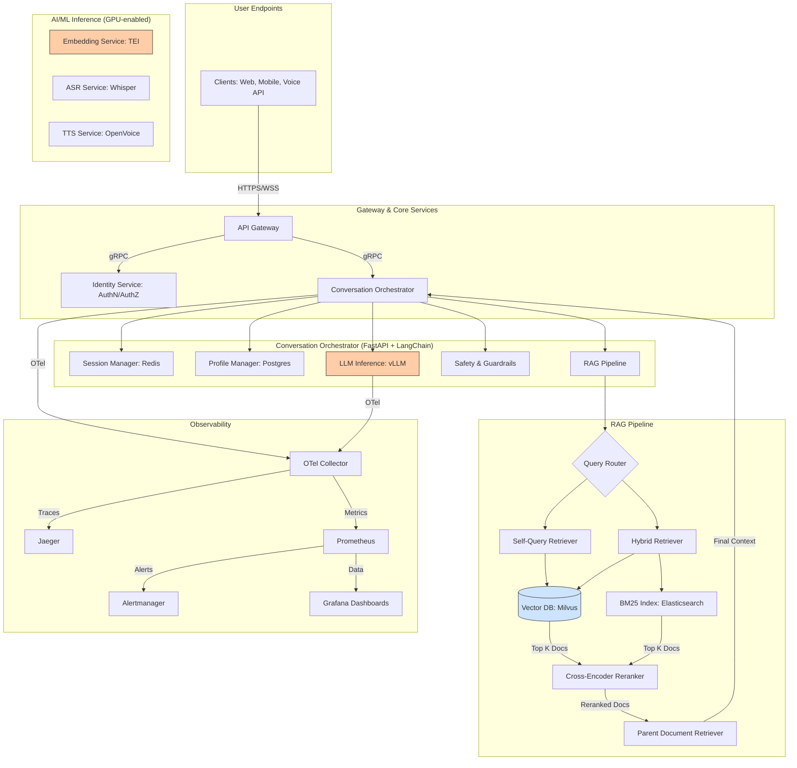

# PRD & Implementation Plan: LLM Tutor Service

**Document Status:** DRAFT | **Version:** 2.0 | **Last Updated:** 2025-08-17

---

## 1. Vision & Strategy

### 1.1. Mission
To deliver a safe, adaptive, and highly engaging multimodal AI tutor that leverages open-weight GPT-OSS models, advanced RAG techniques, and a state-of-the-art voice interface to provide a personalized and effective learning experience.

### 1.2. Problem Statement
Traditional online learning platforms lack the immediate, personalized feedback crucial for effective learning. This service will bridge that gap with an AI that acts as a dedicated, one-on-one tutor, adapting to each student's pace and identifying knowledge gaps.

### 1.3. Key Performance Indicators (KPIs)
- **User Engagement:** Daily Active Users (DAU), Session Duration, Interactions per Session.
- **Learning Efficacy:** Mastery Velocity, Quiz/Assessment Scores, Hint Efficiency.
- **System Performance:** p95 Latency, Uptime (SLA), Cost per User.
- **Safety & Trust:** Harmful Content Block Rate, Citation Accuracy, User Trust Score.

---

## 2. Architecture & Design

### 2.1. System Architecture
The architecture is designed for scalability, modularity, and low latency, with a clear separation of concerns between orchestration, AI/ML inference, and state management.

### 2.2. Tech Stack
| Component       | Technology                   | Rationale                                                    |
| :-------------- | :--------------------------- | :----------------------------------------------------------- |
| **Backend**     | Python 3.11, FastAPI         | High-performance async framework, strong community support.  |
| **LLM Serving** | **vLLM** on Kubernetes       | SOTA throughput with PagedAttention and continuous batching. |
| **Embeddings**  | **Hugging Face TEI**         | Optimized for high-throughput, low-latency inference.      |
| **RAG Framework** | LangChain                  | Comprehensive toolkit for building complex RAG pipelines.    |
| **Vector DB**   | Milvus                       | Scalable, supports metadata filtering and hybrid search.     |
| **Session Store** | Redis                      | Low-latency key-value store for managing conversational state. |
| **ASR**         | Whisper large-v3             | Industry-standard for accurate multilingual speech recognition. |
| **TTS**         | OpenVoice / Coqui XTTS-v2    | High-quality, fast voice synthesis with cloning capabilities.  |
| **CI/CD**       | GitHub Actions, Helm         | Automated build, test, and deployment to Kubernetes.       |
| **Observability** | OpenTelemetry, Prometheus, Grafana | Standardized, powerful stack for monitoring and tracing.     |
| **IaC**         | Terraform, Kubernetes        | Declarative infrastructure for reproducible environments.    |

---

## 3. Implementation Roadmap

### Phase 0: Core Infrastructure & Serving Foundation (Weeks 1-2) ✅ COMPLETED
**Goal:** Establish a production-ready serving layer for all ML models.
- [x] Create production-ready FastAPI application with comprehensive configuration
- [x] Implement async PostgreSQL integration with connection pooling and health checks
- [x] Build Redis-based session management, caching, and rate limiting
- [x] Design sophisticated user models with learning progress tracking
- [x] Set up observability framework (OpenTelemetry, Prometheus, structured logging)
- [x] Implement Suuupra platform integration patterns (API Gateway, Identity service)
- [x] Provision EKS cluster and GPU node groups using Terraform
- [x] Deploy vLLM serving infrastructure for LLM inference
- [x] Set up vector database (Milvus) and search infrastructure (Elasticsearch)
    - **Status:** Foundation complete, infrastructure deployment in progress.

### Phase 1: RAG v1 - Hybrid Retrieval & Citations (Weeks 3-4) ✅ COMPLETED
**Goal:** Implement a robust, multi-stage retrieval pipeline.
- [x] Build content ingestion pipeline (e.g., Unstructured.io, LangChain chunkers).
- [x] Implement hybrid retrieval (vector + BM25) and a cross-encoder reranker.
- [ ] Integrate Parent-Document and Self-Query retrievers.
- [ ] Build initial RAG evaluation dataset (question, context, ground-truth answer).
    - **Deliverable:** End-to-end RAG pipeline returns cited answers and passes initial evaluation.

### Phase 2: Conversation Management & Safety (Weeks 5-6) ✅ COMPLETED
**Goal:** Enable multi-turn conversations and enforce strict safety guardrails.
- [x] Implement Redis-backed session memory and a Postgres-backed learner profile store.
- [x] Implement input/output content classifiers for safety (e.g., Llama Guard).
- [ ] Create a comprehensive audit logging system for all safety-related decisions.
    - **Deliverable:** Tutor can hold a multi-turn conversation; all unsafe content is blocked and logged.

### Phase 3: Voice Interface (Weeks 7-8) ✅ COMPLETED
**Goal:** Integrate real-time speech-to-text and text-to-speech.
- [x] Integrate Whisper large-v3 for ASR.
- [x] Integrate OpenVoice/XTTS-v2 for TTS.
- [ ] Build a consent flow and watermarking system for voice cloning.
    - **Deliverable:** User can interact with the tutor via voice.

### Phase 4: Personalization & Assessment (Weeks 9-10) ✅ COMPLETED
**Goal:** Make the tutor adaptive to individual learners.
- [x] Implement mastery tracking and learning progress analytics.
- [x] Build a difficulty adaptation engine and a spaced practice scheduler.
- [ ] Create an intelligent hint system with next-best-action recommendations.
    - **Deliverable:** The tutor adjusts difficulty based on user performance.

### Phase 5: Production Hardening & Launch (Weeks 11-12)
**Goal:** Ensure the service is secure, observable, and ready for production traffic.
- [ ] Set up full OpenTelemetry tracing, Prometheus metrics, and Grafana dashboards.
- [ ] Implement a full CI/CD pipeline with automated testing and canary deployments.
- [ ] Conduct load testing to validate performance SLAs.
- [ ] Perform security audit, penetration testing, and implement DSR functionality.
    - **Deliverable:** Service is live in production, meeting all NFRs.

---

## 4. Testing & Quality Strategy

| Layer         | Tools                    | Scope & Deliverables                                                                                  |
| :------------ | :----------------------- | :---------------------------------------------------------------------------------------------------- |
| **Unit**      | `pytest`, `pytest-asyncio` | Test individual functions: prompt formatters, chunking logic, API data models. **Coverage target: 90%**. |
| **Integration** | Testcontainers, `pytest`   | Test components together: RAG pipeline (embed→retrieve→rerank→generate), session management.           |
| **E2E**       | Cypress, Playwright      | Test full user journeys: sign-up → start conversation → ask question → receive cited/spoken answer.       |
| **LLM Evals** | `uptrain`, RAGAs         | **RAG Triad:** Context Relevance, Groundedness, Answer Relevance. **Citation:** Precision/Recall. **Safety:** Refusal correctness. |
| **Performance** | k6, Locust               | Load test API endpoints to validate latency, throughput, and auto-scaling behavior under production load. |
| **Red Teaming** | Manual + Automated       | Curated prompts to test for jailbreaks, data leakage, harmful content generation, and bias.           |

---

## 5. Observability & Monitoring

### 5.1. Key Metrics & Dashboards
- **RAG Performance Dashboard:**
    - Retrieval Hit Rate @ K
    - Reranker NDCG/MRR
    - End-to-end RAG latency (p50, p90, p95)
    - Groundedness & Answer Relevance scores (rolling average)
- **Inference Service Dashboard (vLLM, TEI):**
    - GPU Utilization, Memory Usage
    - Tokens per second, Time to First Token
    - Request throughput, error rate
- **Application Dashboard:**
    - API RED Metrics (Rate, Errors, Duration)
    - Session duration, number of turns
- **Voice Services Dashboard:**
    - ASR Word Error Rate (WER)
    - TTS Latency (Time to first audio chunk)

### 5.2. Alerting Rules
- **P1 (Critical):** `HighResponseLatency` (p95 > 3s for 5m), `HighErrorRate` (>2% for 5m), `SafetyFilterFailure`.
- **P2 (Warning):** `LowGroundedness` (score < 0.85 for 1h), `LowRetrievalHitRate`, `HighGpuTemp`.

---

## 6. Security & Compliance

### 6.1. Threat Model & Mitigations
| Threat               | Mitigation Strategy                                                                                             |
| :------------------- | :-------------------------------------------------------------------------------------------------------------- |
| **Prompt Injection** | Strict input validation, structured prompt formats (e.g., Harmony), instruction-tuned models, output parsing. |
| **PII Leakage**      | PII detection and masking on both input and retrieved context before sending to the LLM.                        |
| **Harmful Content**  | Multi-layered approach: input/output classifiers (e.g., Llama Guard), deterministic refusal flows, audit logging. |
| **Denial of Service**  | Rate limiting at the API Gateway, cost-based limiting on query complexity, robust auto-scaling.                   |

### 6.2. Compliance & Data Privacy
- **Data Subject Rights (DSR):** Implement automated pipelines for data export and deletion requests.
- **Consent Management:** Explicit, logged consent for any PII storage and for voice cloning features.
- **Data Retention:** Enforce strict TTLs on conversational history and other sensitive data.
- **Dependency Scanning:** Use Trivy/Snyk in the CI pipeline to scan for vulnerabilities in container images and libraries.
