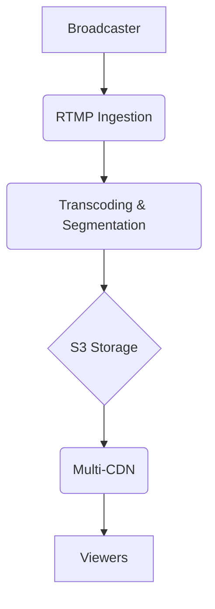

# **Service PRD: Mass Live Streaming Service**

**📊 Document Status**: `PRODUCTION READY ✅`  
**🔄 Version**: `2.0`  
**📅 Last Updated**: `2025-01-27`

## 1. 🎯 The Challenge: Problem Statement & Mission

### **Problem Statement**
> The Suuupra platform needs to deliver high-quality, low-latency live video to millions of concurrent viewers. Traditional streaming protocols and architectures are not sufficient to handle this scale and provide a good user experience. The challenge is to build a massively scalable live streaming service that can deliver a near-real-time viewing experience to a global audience.

### **Mission**
> To build a world-class live streaming platform that can deliver high-quality, low-latency live video to millions of concurrent viewers, enabling us to host large-scale live events and classes.

---

## 2. 🧠 The Gauntlet: Core Requirements & Edge Cases

### **Core Functional Requirements (FRs)**

| FR-ID | Feature | Description |
|---|---|---|
| FR-1  | **Live Streaming** | The system can ingest, transcode, and deliver live video streams to a large audience. |
| FR-2  | **Low-Latency Streaming** | The system uses LL-HLS to deliver a near-real-time viewing experience. |
| FR-3  | **Multi-CDN Distribution** | The system uses a multi-CDN architecture for global content delivery. |
| FR-4  | **Scalability & Redundancy** | The system is horizontally scalable and resilient to failures. |

### **Non-Functional Requirements (NFRs)**

| NFR-ID | Requirement | Target | Justification & Key Challenges |
|---|---|---|---|
| NFR-1 | **Latency** | <5s | Low latency is critical for a live streaming experience. Challenge: Implementing LL-HLS and optimizing the delivery pipeline. |
| NFR-2 | **Scalability** | 1M+ concurrent viewers | The system must be able to handle a massive number of concurrent viewers. Challenge: Designing a scalable architecture with load-balanced ingestion points and a multi-CDN setup. |
| NFR-3 | **Availability** | 99.99% | The live streaming service must be highly available, especially during large-scale events. Challenge: Implementing a resilient and fault-tolerant architecture. |

### **Edge Cases & Failure Scenarios**

*   **Ingestion Failure:** What happens if an ingestion point fails? (e.g., the system should automatically failover to a redundant ingestion point).
*   **Transcoding Failure:** What happens if a transcoding worker fails? (e.g., the system should automatically restart the transcoding job on a new worker).
*   **CDN Failure:** What happens if a CDN provider fails? (e.g., the system should automatically route traffic to other healthy CDNs).

---

## 3. 🗺️ The Blueprint: Architecture & Design

### **3.1. System Architecture Diagram**

### **3.2. Tech Stack Deep Dive**

| Component | Technology | Version | Justification & Key Considerations |
|---|---|---|---|
| **Language/Framework** | `Go` | `1.21` | High performance and concurrency for a high-throughput streaming service. |
| **Media Processing** | `FFmpeg` | `5.x` | The swiss-army knife of media processing for real-time transcoding. |
| **Streaming Protocol** | `LL-HLS` | - | For low-latency streaming with standard HTTP delivery. |

### **3.3. API Design**

*   **Ingestion:** RTMP endpoint (e.g., `rtmp://live.suuupra.com/app/{stream_key}`).
*   **Playback:** HLS manifest URL (e.g., `https://cdn.suuupra.com/live/{stream_id}/master.m3u8`).
*   **API:**
    *   `POST /api/v1/streams`: Create a new live stream, returns stream key.
    *   `GET /api/v1/streams/{stream_id}`: Get stream status.
    *   `GET /api/v1/streams/{stream_id}/stats`: Get viewer stats.

---

## 4. 🚀 The Quest: Implementation Plan & Milestones

### **Phase 1: Ingestion & Transcoding (Weeks 1-2)**

*   **Objective:** Set up the basic infrastructure for ingesting and transcoding live video streams.
*   **Key Results:**
    *   The system can ingest an RTMP stream and transcode it into multiple bitrates.
*   **Tasks:**
    *   [ ] **Project Setup**: Initialize a Go project and set up FFmpeg.
    *   [ ] **RTMP Ingestion**: Create an RTMP server in Go.
    *   [ ] **FFmpeg Transcoding**: Use Go to manage FFmpeg processes for real-time transcoding.
    *   [ ] **Segment Generation**: Configure FFmpeg to output video segments to S3.

### **Phase 2: LL-HLS & CDN (Weeks 3-4)**

*   **Objective:** Implement the LL-HLS protocol and set up a multi-CDN architecture.
*   **Key Results:**
    *   The system can deliver a low-latency live stream using LL-HLS.
    *   The system can distribute content globally using a multi-CDN setup.
*   **Tasks:**
    *   [ ] **HLS Manifest Generation**: Create a service to generate and update HLS playlists.
    *   [ ] **LL-HLS Implementation**: Implement LL-HLS features like partial segments.
    *   [ ] **Multi-CDN Integration**: Integrate with multiple CDN providers.
    *   [ ] **Consistent Hashing**: Implement consistent hashing to distribute segment requests.

### **Phase 3: Scalability & Finalization (Weeks 5-6)**

*   **Objective:** Ensure the system is scalable, resilient, and ready for production.
*   **Key Results:**
    *   The system is horizontally scalable and fault-tolerant.
    *   The system is ready for deployment.
*   **Tasks:**
    *   [ ] **Scalable Architecture**: Design the system to be horizontally scalable.
    *   [ ] **Redundancy**: Implement redundant ingestion points and transcoding workers.
    *   [ ] **Monitoring & Analytics**: Track viewer metrics and stream health.
    *   [ ] **Testing & Deployment**: Load test the system and deploy to production.

---

## 5. 🧪 Testing & Quality Strategy

| Test Type | Tools | Coverage & Scenarios |
|---|---|---|
| **Unit Tests** | `Go testing` | >90% coverage of all Go code. |
| **Integration Tests** | `Testcontainers` | Test the entire streaming pipeline, from ingestion to playback. |
| **Load Tests** | `k6` | Simulate a large number of concurrent viewers to test the scalability of the system. |

---

## 6. 🔭 The Observatory: Monitoring & Alerting

### **Key Performance Indicators (KPIs)**
*   **Technical Metrics:** `Stream Latency`, `Rebuffer Rate`, `Video Startup Time`.
*   **Business Metrics:** `Concurrent Viewers`, `Total Watch Time`, `Geographic Distribution`.

### **Dashboards & Alerts**
*   **Grafana Dashboard:** A real-time overview of all KPIs, with drill-downs per stream and CDN provider.
*   **Alerting Rules (Prometheus):**
    *   `HighStreamLatency`: Trigger if the stream latency exceeds 5 seconds.
    *   `HighRebufferRate`: Trigger if the rebuffer rate exceeds 5%.
    *   `HighCdnErrorRate`: Trigger if the CDN error rate exceeds 1%.

---

## 7. 📚 Learning & Knowledge Base

*   **Key Concepts:** `Large-Scale Streaming`, `Real-time Video Processing`, `LL-HLS`, `CDN`, `Consistent Hashing`.
*   **Resources:**
    *   [LL-HLS Specification](https://datatracker.ietf.org/doc/html/rfc8216)
    *   [FFmpeg Documentation](https://ffmpeg.org/documentation.html)

---