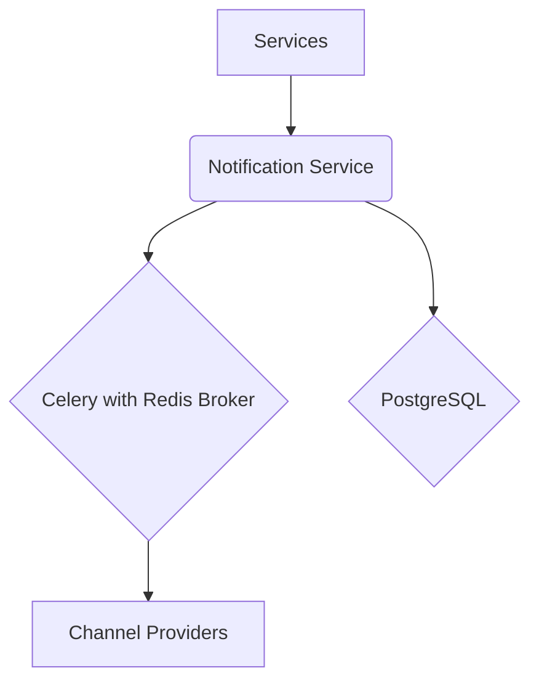

# **Service PRD: Notifications Service**

## 1. 🎯 The Challenge: Problem Statement & Mission

### **Problem Statement**
> The Suuupra platform needs to communicate with its users in a timely, reliable, and personalized manner across multiple channels. A simple, unmanaged notification system will lead to a poor user experience, with missed notifications, spam, and a lack of personalization. The challenge is to build a centralized, multi-channel notification service that can handle millions of notifications per day, with guaranteed delivery, priority queuing, and a powerful template engine.

### **Mission**
> To build a world-class notification service that enables the Suuupra platform to communicate with its users in a timely, reliable, and personalized manner, fostering user engagement and trust.

---

## 2. 🧠 The Gauntlet: Core Requirements & Edge Cases

### **Core Functional Requirements (FRs)**

| FR-ID | Feature | Description |
|---|---|---|
| FR-1  | **Multi-channel Delivery** | The system can send notifications via push, email, SMS, and WebSocket. |
| FR-2  | **Priority Queues** | The system can prioritize notifications based on their importance. |
| FR-3  | **Template Engine** | The system can use templates to generate personalized and multi-language notifications. |
| FR-4  | **Delivery Guarantees** | The system provides at-least-once delivery guarantees with retry mechanisms. |
| FR-5  | **User Preferences** | The system allows users to manage their notification preferences. |

### **Non-Functional Requirements (NFRs)**

| NFR-ID | Requirement | Target | Justification & Key Challenges |
|---|---|---|---|
| NFR-1 | **Scalability** | 1M+ notifications/day | The system must be able to handle a high volume of notifications. Challenge: Designing a scalable architecture with Celery and Redis. |
| NFR-2 | **Reliability** | 99.9% delivery success | Notifications must be delivered reliably. Challenge: Implementing a robust delivery engine with retries and dead letter queues. |
| NFR-3 | **Performance** | <50ms template rendering | Template rendering must be fast to avoid delays in notification delivery. Challenge: Optimizing the template engine and caching. |

### **Edge Cases & Failure Scenarios**

*   **Provider Failure:** What happens if a channel provider (e.g., FCM, SES) is down? (e.g., the system should retry with exponential backoff and, if necessary, failover to another provider or channel).
*   **Invalid Recipient:** How do we handle cases where a recipient's address (e.g., email, phone number) is invalid? (e.g., the system should mark the recipient as invalid and stop sending notifications to them).
*   **Throttling:** How do we handle rate limiting from channel providers? (e.g., the system should respect the provider's rate limits and backoff when necessary).

---

## 3. 🗺️ The Blueprint: Architecture & Design

### **3.1. System Architecture Diagram**



### **3.2. Tech Stack Deep Dive**

| Component | Technology | Version | Justification & Key Considerations |
|---|---|---|---|
| **Language/Framework** | `Python`, `Django` | `3.11+`, `4.2` | A mature and robust ecosystem for building web services and managing complex business logic. |
| **Async Tasks** | `Celery` | `5.x` | A powerful and flexible framework for running asynchronous tasks. |
| **Message Queue** | `Redis` | `7+` | A high-performance, in-memory data store for message queuing and caching. |
| **Database** | `PostgreSQL` | `15` | A reliable relational database for storing notification data and user preferences. |

### **3.3. Database Schema**

```sql
-- Notification templates with multi-channel support
CREATE TABLE notification_templates (
    id UUID PRIMARY KEY DEFAULT gen_random_uuid(),
    name VARCHAR(100) UNIQUE NOT NULL,
    path VARCHAR(200) UNIQUE NOT NULL,
    push_template TEXT,
    email_subject_template VARCHAR(200),
    email_body_template TEXT,
    sms_template VARCHAR(160),
    websocket_template TEXT,
    supported_channels TEXT[] DEFAULT '{}',
    required_variables JSONB DEFAULT '[]',
    is_active BOOLEAN DEFAULT TRUE,
    created_at TIMESTAMP DEFAULT CURRENT_TIMESTAMP,
    updated_at TIMESTAMP DEFAULT CURRENT_TIMESTAMP
);

-- Notification messages
CREATE TABLE notification_messages (
    id UUID PRIMARY KEY DEFAULT gen_random_uuid(),
    user_id UUID NOT NULL,
    template_id UUID REFERENCES notification_templates(id),
    channel VARCHAR(20) NOT NULL,
    priority INTEGER DEFAULT 3,
    title VARCHAR(200) NOT NULL,
    body TEXT NOT NULL,
    data JSONB DEFAULT '{}',
    scheduled_at TIMESTAMP NOT NULL,
    sent_at TIMESTAMP,
    delivered_at TIMESTAMP,
    read_at TIMESTAMP,
    status VARCHAR(20) DEFAULT 'pending',
    created_at TIMESTAMP DEFAULT CURRENT_TIMESTAMP
);
```

---

## 4. 🚀 The Quest: Implementation Plan & Milestones

### **Phase 1: Core Infrastructure & Message Queue (Week 1)**

*   **Objective:** Set up the core infrastructure and message queue.
*   **Key Results:**
    *   The service can queue and process notifications.
*   **Tasks:**
    *   [ ] **Django Setup & Message Queue Foundation**: Initialize the project and set up Celery with Redis.
    *   [ ] **Template Engine & Personalization**: Implement the Jinja2 template engine.
    *   [ ] **Channel Providers Implementation**: Implement providers for FCM, SES, and Twilio.

### **Phase 2: Delivery Engine & User Preferences (Week 2)**

*   **Objective:** Implement the delivery engine and user preferences system.
*   **Key Results:**
    *   The service can deliver notifications with retries and fallbacks.
    *   Users can manage their notification preferences.
*   **Tasks:**
    *   [ ] **Delivery Engine with Retry Logic**: Implement the delivery engine with exponential backoff.
    *   [ ] **User Preferences & Consent Management**: Build the user preferences system.
    *   [ ] **WebSocket Real-time Notifications**: Implement real-time notifications with Django Channels.

### **Phase 3: Analytics, Batching & Advanced Features (Week 3)**

*   **Objective:** Implement analytics, batching, and advanced features.
*   **Key Results:**
    *   The service can track notification engagement and run A/B tests.
    *   The service can send batch notifications and campaigns.
*   **Tasks:**
    *   [ ] **Analytics & A/B Testing**: Implement notification analytics and A/B testing.
    *   [ ] **Batch Processing & Campaigns**: Build a system for sending batch notifications.
    *   [ ] **Compliance & Advanced Features**: Implement audit logging and GDPR compliance.

---

## 5. 🧪 Testing & Quality Strategy

| Test Type | Tools | Coverage & Scenarios |
|---|---|---|
| **Unit Tests** | `pytest` | >90% coverage of all services, tasks, and utilities. |
| **Integration Tests** | `Testcontainers` | Test the entire notification pipeline, from queuing to delivery. |
| **Load Tests** | `k6` | Simulate a high volume of notifications to test the scalability of the system. |

---

## 6. 🔭 The Observatory: Monitoring & Alerting

### **Key Performance Indicators (KPIs)**
*   **Technical Metrics:** `Notification Latency`, `Delivery Rate`, `Error Rate`.
*   **Business Metrics:** `Open Rate`, `Click Rate`, `Unsubscribe Rate`.

### **Dashboards & Alerts**
*   **Grafana Dashboard:** A real-time overview of all KPIs, with drill-downs per channel and template.
*   **Alerting Rules (Prometheus):**
    *   `HighNotificationFailureRate`: Trigger if the notification failure rate exceeds 1%.
    *   `HighCeleryQueueLength`: Trigger if the Celery queue length exceeds a certain threshold.
    *   `ProviderApiError`: Trigger if a channel provider API is returning a high rate of errors.

---

## 7. 📚 Learning & Knowledge Base

*   **Key Concepts:** `Message Queues`, `Priority Systems`, `Template Engines`, `Delivery Guarantees`, `Distributed Systems`.
*   **Resources:**
    *   [Celery Documentation](https://docs.celeryq.dev/en/stable/)
    *   [Django Channels Documentation](https://channels.readthedocs.io/en/latest/)

---