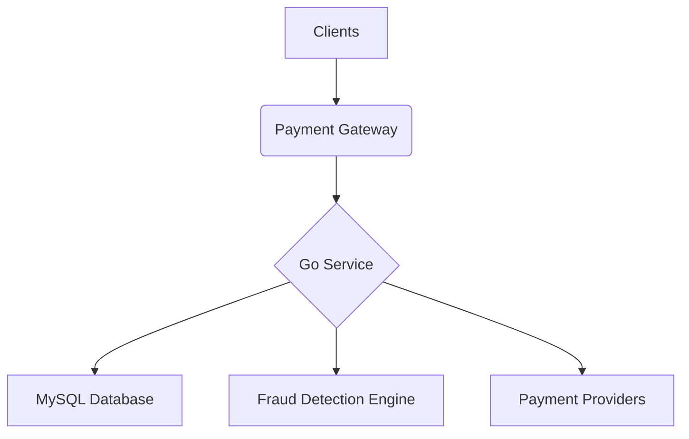

# **Service PRD: Payment Gateway Service**

## 1. 🎯 The Challenge: Problem Statement & Mission

### **Problem Statement**
> The Suuupra platform needs a highly reliable, secure, and scalable payment gateway to process a massive volume of transactions. Building a payment gateway from scratch is a complex undertaking that involves integrating with multiple payment providers, handling sensitive financial data, and protecting against fraud. The challenge is to build a payment gateway that can provide a seamless and secure payment experience for users, while meeting the stringent requirements of the financial industry.

### **Mission**
> To build a world-class payment gateway that enables seamless and secure payments on the Suuupra platform, providing a frictionless experience for users and a reliable revenue stream for the business.

---

## 2. 🧠 The Gauntlet: Core Requirements & Edge Cases

### **Core Functional Requirements (FRs)**

| FR-ID | Feature | Description |
|---|---|---|
| FR-1  | **Payment Processing** | The system can process payments via UPI, cards, and wallets. |
| FR-2  | **Fraud Detection** | The system can detect and prevent fraudulent transactions in real-time. |
| FR-3  | **Reconciliation** | The system can reconcile internal records with payment provider statements. |
| FR-4  | **Tokenization** | The system can tokenize and securely store card information. |
| FR-5  | **Webhooks** | The system can send webhooks to notify other services of payment events. |

### **Non-Functional Requirements (NFRs)**

| NFR-ID | Requirement | Target | Justification & Key Challenges |
|---|---|---|
| NFR-1 | **Success Rate** | 99.99% | A high success rate is critical for user trust and revenue. Challenge: Implementing a robust and resilient payment processing pipeline. |
| NFR-2 | **Latency** | <500ms p99 | A fast payment experience is essential for a good user experience. Challenge: Optimizing the payment processing pipeline and integrating with multiple payment providers. |
| NFR-3 | **Security** | PCI DSS Level 1 | The system must be compliant with the highest level of payment card industry security standards. Challenge: Implementing a secure and compliant architecture. |

### **Edge Cases & Failure Scenarios**

*   **Payment Provider Downtime:** What happens if a payment provider is down? (e.g., the system should automatically failover to another provider).
*   **Transaction Timeouts:** How do we handle transaction timeouts? (e.g., the system should automatically reverse the transaction and notify the user).
*   **Fraud False Positives:** How do we handle cases where a legitimate transaction is flagged as fraudulent? (e.g., provide a manual review process for flagged transactions).

---

## 3. 🗺️ The Blueprint: Architecture & Design

### **3.1. System Architecture Diagram**



### **3.2. Tech Stack Deep Dive**

| Component | Technology | Version | Justification & Key Considerations |
|---|---|---|---|
| **Language/Framework** | `Go`, `Gin` | `1.21`, `1.9` | High performance and concurrency for a high-throughput payment gateway. |
| **Database** | `MySQL` | `8.x` | A reliable and widely used relational database with support for ACID transactions. |
| **Fraud Detection** | `Python`, `XGBoost` | `3.11`, `1.7` | A powerful combination for building and deploying machine learning models. |

### **3.3. Database Schema**

```sql
-- payments table with audit fields
CREATE TABLE payments (
    id VARCHAR(36) PRIMARY KEY,
    user_id VARCHAR(36) NOT NULL,
    merchant_id VARCHAR(36) NOT NULL,
    amount DECIMAL(15,2) NOT NULL,
    currency VARCHAR(3) DEFAULT 'INR',
    payment_method ENUM('UPI', 'CARD', 'WALLET') NOT NULL,
    status ENUM('PENDING', 'SUCCESS', 'FAILED', 'EXPIRED') NOT NULL,
    external_txn_id VARCHAR(100) UNIQUE,
    description TEXT,
    metadata JSON,
    created_at TIMESTAMP DEFAULT CURRENT_TIMESTAMP,
    updated_at TIMESTAMP DEFAULT CURRENT_TIMESTAMP ON UPDATE CURRENT_TIMESTAMP
);

-- upi_transactions table
CREATE TABLE upi_transactions (
    id VARCHAR(36) PRIMARY KEY,
    payment_id VARCHAR(36) NOT NULL,
    payer_vpa VARCHAR(100) NOT NULL,
    payee_vpa VARCHAR(100) NOT NULL,
    npci_txn_id VARCHAR(50) UNIQUE,
    bank_ref_id VARCHAR(50),
    rrn VARCHAR(12),
    approval_code VARCHAR(20),
    response_code VARCHAR(10),
    status_message TEXT,
    created_at TIMESTAMP DEFAULT CURRENT_TIMESTAMP,
    FOREIGN KEY (payment_id) REFERENCES payments(id)
);
```

---

## 4. 🚀 The Quest: Implementation Plan & Milestones

### **Phase 1: Foundation & UPI Integration (Weeks 9-10)**

*   **Objective:** Implement the core payment gateway service with UPI integration.
*   **Key Results:**
    *   The service can process UPI payments.
*   **Tasks:**
    *   [ ] **Foundation & Database Schema**: Set up the project and database schema.
    *   [ ] **UPI Service Implementation**: Implement the UPI payment flow.

### **Phase 2: Card Payments & Fraud Detection (Weeks 10-11)**

*   **Objective:** Implement card payment processing and the fraud detection engine.
*   **Key Results:**
    *   The service can process card payments.
    *   The service can detect and prevent fraudulent transactions.
*   **Tasks:**
    *   [ ] **Card Payment Processing**: Implement the card payment flow.
    *   [ ] **ML-Based Fraud Detection**: Implement the fraud detection engine.

### **Phase 3: Security, Compliance & Optimization (Weeks 11-12)**

*   **Objective:** Harden the service for security and compliance, and optimize for performance.
*   **Key Results:**
    *   The service is PCI DSS compliant.
    *   The service is optimized for performance.
*   **Tasks:**
    *   [ ] **Security & Compliance**: Implement webhook security, data encryption, and audit logging.
    *   [ ] **Performance & Monitoring**: Implement performance optimizations and monitoring.

---

## 5. 🧪 Testing & Quality Strategy

| Test Type | Tools | Coverage & Scenarios |
|---|---|---|
| **Unit Tests** | `Go testing` | >90% coverage of all services and components. |
| **Integration Tests** | `Testcontainers` | Test the entire payment processing pipeline, from payment initiation to reconciliation. |
| **Load Tests** | `k6` | Simulate a high volume of transactions to test the performance and scalability of the service. |
| **Security Tests** | `OWASP ZAP` | Automated scanning for common vulnerabilities and manual penetration testing for critical flows. |

---

## 6. 🔭 The Observatory: Monitoring & Alerting

### **Key Performance Indicators (KPIs)**
*   **Technical Metrics:** `Transaction Latency`, `Success Rate`, `Fraud Detection Accuracy`.
*   **Business Metrics:** `Transaction Volume`, `Transaction Value`, `Chargeback Rate`.

### **Dashboards & Alerts**
*   **Grafana Dashboard:** A real-time overview of all KPIs, with drill-downs per payment method and merchant.
*   **Alerting Rules (Prometheus):**
    *   `HighTransactionFailureRate`: Trigger if the transaction failure rate exceeds 0.01%.
    *   `HighFraudRate`: Trigger if the fraud rate exceeds 0.1%.
    *   `PaymentProviderError`: Trigger if a payment provider is returning a high rate of errors.

---

## 7. 📚 Learning & Knowledge Base

*   **Key Concepts:** `Payment Gateway Architecture`, `PCI DSS`, `Fraud Detection`, `Double-Entry Ledger`.
*   **Resources:**
    *   [PCI DSS Documentation](https://www.pcisecuritystandards.org/document_library)
    *   [OWASP Top 10](https://owasp.org/www-project-top-ten/)

---