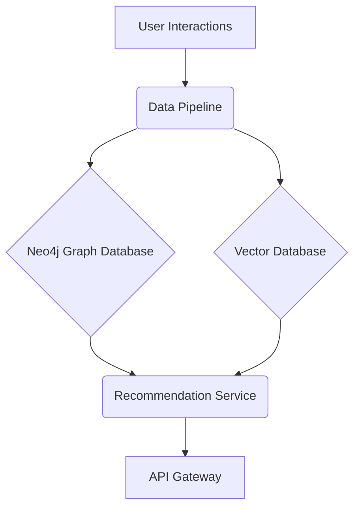

# **Service PRD: Recommendation Engine**

## 1. 🎯 The Challenge: Problem Statement & Mission

### **Problem Statement**
> The Suuupra platform has a vast and growing library of content, but users struggle to discover content that is relevant to their interests and learning goals. A generic, one-size-fits-all approach to content discovery will lead to a poor user experience and low engagement. The challenge is to build a sophisticated recommendation engine that can provide personalized and relevant content recommendations to each user, based on their unique preferences and behavior.

### **Mission**
> To build a world-class recommendation engine that empowers users to discover the most relevant and engaging content on the Suuupra platform, fostering a love of learning and driving user engagement.

---

## 2. 🧠 The Gauntlet: Core Requirements & Edge Cases

### **Core Functional Requirements (FRs)**

| FR-ID | Feature | Description |
|---|---|---|
| FR-1  | **Personalized Recommendations** | The system can provide personalized content recommendations to each user. |
| FR-2  | **Collaborative Filtering** | The system can recommend content based on the behavior of similar users. |
| FR-3  | **Content-Based Filtering** | The system can recommend content based on its similarity to content that a user has previously interacted with. |
| FR-4  | **Real-time Personalization** | The system can update recommendations in real-time based on a user's most recent interactions. |

### **Non-Functional Requirements (NFRs)**

| NFR-ID | Requirement | Target | Justification & Key Challenges |
|---|---|---|---|
| NFR-1 | **Relevance** | High | Recommendations must be relevant to the user's interests. Challenge: Designing and tuning the recommendation algorithms. |
| NFR-2 | **Scalability** | 1M+ users, 100K+ items | The system must be able to handle a large and growing number of users and content items. Challenge: Designing a scalable architecture with Neo4j and Faiss. |
| NFR-3 | **Performance** | <100ms for recommendations | Recommendations must be generated quickly to provide a good user experience. Challenge: Optimizing the recommendation algorithms and infrastructure. |

### **Edge Cases & Failure Scenarios**

*   **Cold Start:** How do we provide recommendations to new users who have no interaction history? (e.g., use content-based filtering and popular items to provide initial recommendations).
*   **Data Sparsity:** How do we handle cases where we have very little data for a user or item? (e.g., use a hybrid approach that combines collaborative and content-based filtering).
*   **Popularity Bias:** How do we prevent the recommendation engine from only recommending popular items? (e.g., use techniques like diversification and exploration to expose users to a wider range of content).

---

## 3. 🗺️ The Blueprint: Architecture & Design

### **3.1. System Architecture Diagram**



### **3.2. Tech Stack Deep Dive**

| Component | Technology | Version | Justification & Key Considerations |
|---|---|---|---|
| **Language/Framework** | `Python`, `FastAPI` | `3.11`, `0.104` | A high-performance, async framework ideal for ML-powered services. |
| **Graph Database** | `Neo4j` | `5.x` | A powerful graph database for modeling complex relationships between users and content. |
| **Vector Search** | `Faiss` | - | A library for efficient similarity search and clustering of dense vectors. |
| **ML Libraries** | `scikit-learn`, `PyTorch` | - | For implementing collaborative filtering and other ML algorithms. |

### **3.3. Data Pipeline Architecture**

```
Raw Interactions → Feature Engineering → Model Training → Inference → Recommendations
                ↓                    ↓                  ↓
            Graph Updates         Vector Updates    Cache Updates
```

---

## 4. 🚀 The Quest: Implementation Plan & Milestones

### **Phase 1: Foundation & Data Infrastructure (Week 19)**

*   **Objective:** Set up the core infrastructure and data pipeline.
*   **Key Results:**
    *   User interaction data is ingested and stored in the graph and vector databases.
*   **Tasks:**
    *   [ ] **Database Setup & Schema Design**: Configure Neo4j and design the graph schema.
    *   [ ] **FastAPI Service Foundation**: Set up the FastAPI application.
    *   [ ] **Data Pipeline Setup**: Create the ETL pipeline for user interaction data.

### **Phase 2: Collaborative Filtering & Graph-Based Recommendations (Weeks 20-21)**

*   **Objective:** Implement collaborative filtering and graph-based recommendation algorithms.
*   **Key Results:**
    *   The system can provide recommendations based on user-user and item-item similarity.
*   **Tasks:**
    *   [ ] **Collaborative Filtering Implementation**: Implement matrix factorization algorithms.
    *   [ ] **Graph-Based Recommendations**: Implement graph-based collaborative filtering.

### **Phase 3: Vector Similarity & Real-time Personalization (Weeks 22-23)**

*   **Objective:** Implement vector similarity search and real-time personalization.
*   **Key Results:**
    *   The system can provide content-based recommendations using vector similarity.
    *   Recommendations are updated in real-time based on user interactions.
*   **Tasks:**
    *   [ ] **Vector Similarity & ANN Search**: Implement vector similarity search with Faiss.
    *   [ ] **Real-Time Personalization**: Implement real-time feature engineering and context-aware recommendations.

### **Phase 4: Advanced Features & Production (Week 24)**

*   **Objective:** Implement advanced features and prepare the service for production.
*   **Key Results:**
    *   The system uses multi-armed bandits for exploration-exploitation.
    *   The service is ready for production deployment.
*   **Tasks:**
    *   [ ] **Production-Ready Features**: Implement multi-armed bandits and advanced ML techniques.
    *   [ ] **Monitoring & Observability**: Create dashboards and alerts for monitoring the service.

---

## 5. 🧪 Testing & Quality Strategy

| Test Type | Tools | Coverage & Scenarios |
|---|---|---|
| **Unit Tests** | `pytest` | >90% coverage of all recommendation algorithms and services. |
| **Integration Tests** | `Testcontainers` | Test the entire recommendation pipeline, from data ingestion to recommendation generation. |
| **A/B Tests** | `Internal Framework` | Run A/B tests to compare the performance of different recommendation algorithms. |

---

## 6. 🔭 The Observatory: Monitoring & Alerting

### **Key Performance Indicators (KPIs)**
*   **Technical Metrics:** `Recommendation Latency`, `Model Training Time`, `Cache Hit Rate`.
*   **Business Metrics:** `Click-Through Rate (CTR)`, `Conversion Rate`, `User Engagement`.

### **Dashboards & Alerts**
*   **Grafana Dashboard:** A real-time overview of all KPIs, with drill-downs per recommendation algorithm and content type.
*   **Alerting Rules (Prometheus):**
    *   `HighRecommendationLatency`: Trigger if the p99 recommendation latency exceeds 100ms.
    *   `LowCtr`: Trigger if the CTR for a recommendation algorithm drops below a certain threshold.
    *   `ModelDrift`: Trigger if the performance of a recommendation model degrades over time.

---

## 7. 📚 Learning & Knowledge Base

*   **Key Concepts:** `Collaborative Filtering`, `Matrix Factorization`, `Graph Algorithms`, `Vector Spaces`, `Online Learning`.
*   **Resources:**
    *   [Recommender Systems Handbook](https://www.amazon.com/Recommender-Systems-Handbook-Francesco-Ricci/dp/1489976375)
    *   [Neo4j Graph Data Science Library](https://neo4j.com/docs/graph-data-science/current/)

---